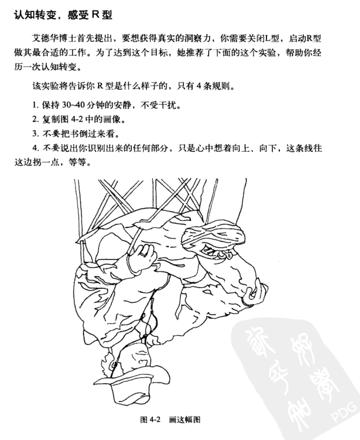
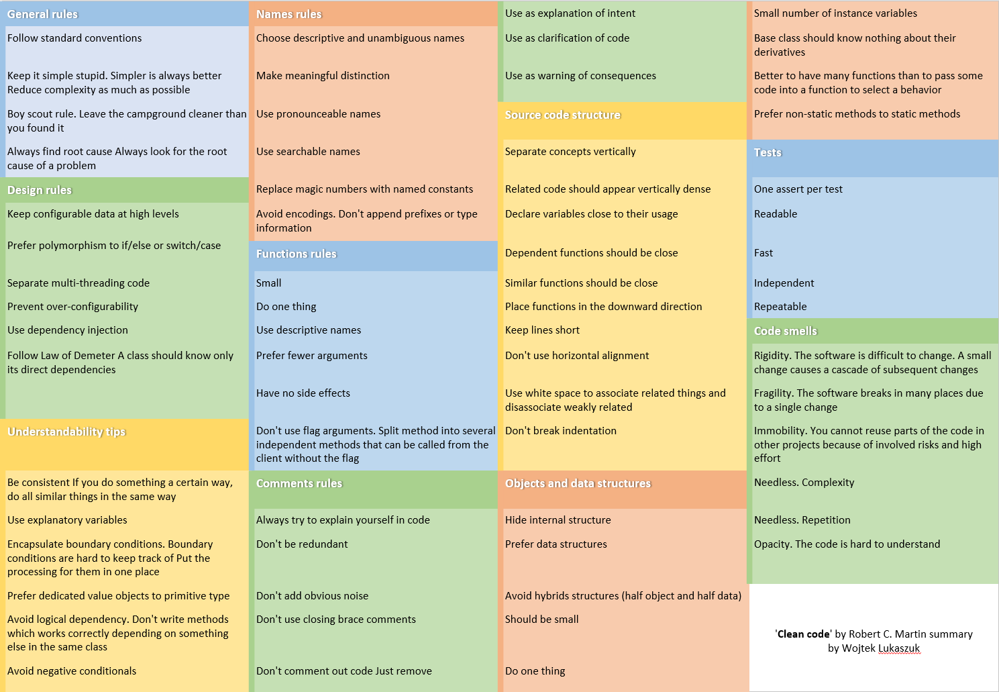

[TOC]


# 程序员的思维修炼

+ 你的工作环境需要提供丰富的感官机会，否则它真的会损坏大脑。
+ 设计并不是创造美，美来自于选择、共鸣、同化和爱。
+ 人应该努力学习洞察和培养自己内心深处的灵光一现，这远远胜于外面流光溢彩的整个世界。然而，人总会下意识地抛弃自己特有的想法，仅仅因为那是他自己的想法。拉尔夫.瓦尔多.爱默生
+ 增强感观体验以促进大脑的使用。创造条件让大脑转移到其他的信息处理模式上，意识的细微转变，帮助你更好地观察发现。
+ 绘画即是观察。
+ 激活R型并停止L型：听音乐，绘画，静思，慢跑，针线活，攀岩
  
+ 美国作家安妮拉莫特在"Bird by Bird: Some Instructions on Writing and Life"：
  完美主义是压迫者的声音，是人们的敌人。它会束缚你的想法，毁掉你的生命，同事它也会妨碍你创建较差的草稿初案。我认为完美主义基于一种强迫性的想法：如果你足够细致，每件事情都做得很好，那你就不会失败。但事实是，无论怎么做你都有可能会失败，可是很多人即使不太仔细也会做得比你好，而且其间也会拥有更多欢乐。


# [代码简洁之道](https://gist.github.com/wojteklu/73c6914cc446146b8b533c0988cf8d29)



Code is clean if it can be understood easily – by everyone on the team. Clean code can be read and enhanced by a developer other than its original author. With understandability comes readability, changeability, extensibility and maintainability.

## General rules

1. Follow standard conventions.
2. Keep it simple stupid. Simpler is always better. Reduce complexity as much as possible.
3. Boy scout rule. Leave the campground cleaner than you found it.
4. Always find root cause. Always look for the root cause of a problem.

## Design rules

1. Keep configurable data at high levels.
2. Prefer polymorphism to if/else or switch/case.
3. Separate multi-threading code.
4. Prevent over-configurability.
5. Use dependency injection.
6. Follow Law of Demeter. A class should know only its direct dependencies.

## Understandability tips
1. Be consistent. If you do something a certain way, do all similar things in the same way.
2. Use explanatory variables.
3. Encapsulate boundary conditions. Boundary conditions are hard to keep track of. Put the processing for them in one place.
4. Prefer dedicated value objects to primitive type.
5. Avoid logical dependency. Don't write methods which works correctly depending on something else in the same class.
6. Avoid negative conditionals.

## Names rules
1. Choose descriptive and unambiguous names.

   使用描述性无歧义的名称

2. Make meaningful distinction.

   做有意义的区分

3. Use pronounceable names.

   使用读得出来的名称

4. Use searchable names.

   使用可搜索的名称

5. Replace magic numbers with named constants.

   将魔术数字替换为命名常量，例如: 7 –> week_days

6. Avoid encodings. Don't append prefixes or type information.

   避免使用编码，不添加前缀或者类型信息

别害怕长名称。长而具有描述性的名称，要比短而令人费解的名称好。长而具有描述性的名称，要比描述性的长注释好。别害怕花时间取名字，

## Functions rules
1. Small.

2. Do one thing.

3. Use descriptive names.

4. Prefer fewer arguments.

   参数要少，避免使用3个以上的参数。参数少更易于测试。

5. Have no side effects.

6. Don't use flag arguments. Split method into several independent methods that can be called from the client without the flag.

   比如`int flag`不同的数值做不同的事情

7. 使用异常替代返回错误码，应分隔指令和询问

   ```cpp
   try
   {}
   catch (Exception e)
   {}
   ```

## Comments rules

别给糟糕的代码加注释 －－ 重新写吧。唯一真正好的注释就是想办法不去写注释。

1. Always try to explain yourself in code.
2. Don't be redundant.
3. Don't add obvious noise.
4. Don't use closing brace comments.
5. Don't comment out code. Just remove.
6. Use as explanation of intent.
7. Use as clarification of code.
8. Use as warning of consequences.

## Source code structure

1. Separate concepts vertically.
2. Related code should appear vertically dense.
3. Declare variables close to their usage.
4. Dependent functions should be close.
5. Similar functions should be close.
6. Place functions in the downward direction.
7. Keep lines short.
8. Don't use horizontal alignment.
9. Use white space to associate related things and disassociate weakly related.
10. Don't break indentation.

## Objects and data structures
1. Hide internal structure.
2. Prefer data structures.
3. Avoid hybrids structures (half object and half data).
4. Should be small.
5. Do one thing.
6. Small number of instance variables.
7. Base class should know nothing about their derivatives.
8. Better to have many functions than to pass some code into a function to select a behavior.
9. Prefer non-static methods to static methods.

## Tests
1. One assert per test.
2. Readable.
3. Fast.
4. Independent.
5. Repeatable.

## Code smells
1. Rigidity. The software is difficult to change. A small change causes a cascade of subsequent changes.
2. Fragility. The software breaks in many places due to a single change.
3. Immobility. You cannot reuse parts of the code in other projects because of involved risks and high effort.
4. Needless Complexity.
5. Needless Repetition.
6. Opacity. The code is hard to understand.