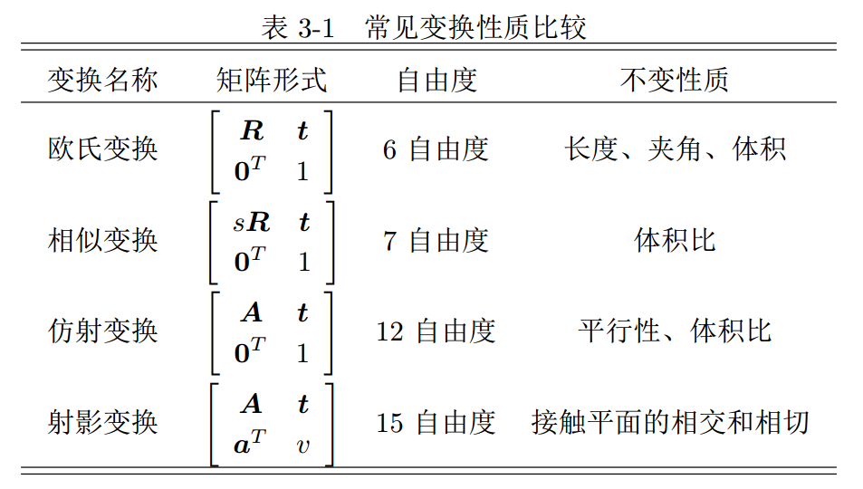
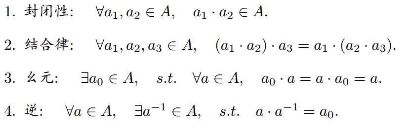
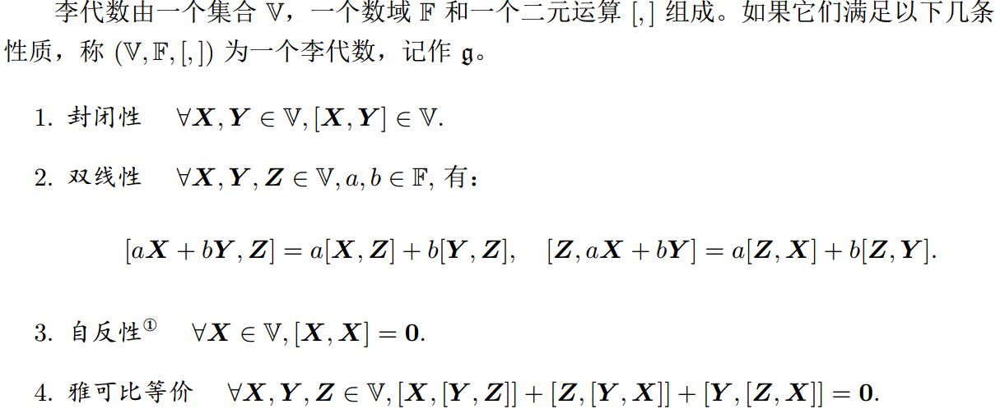
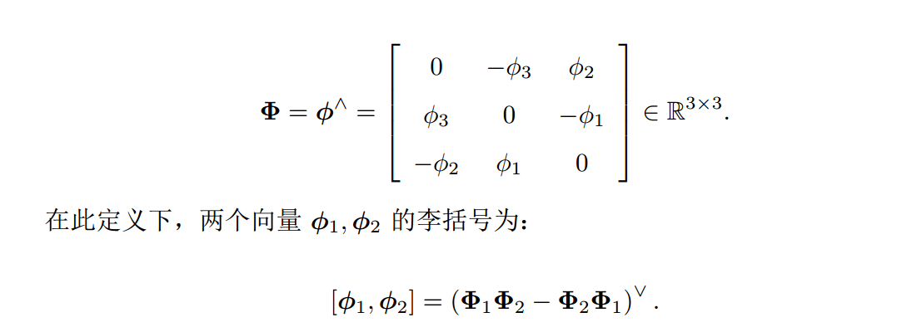
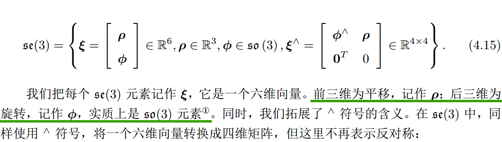
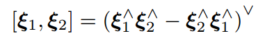
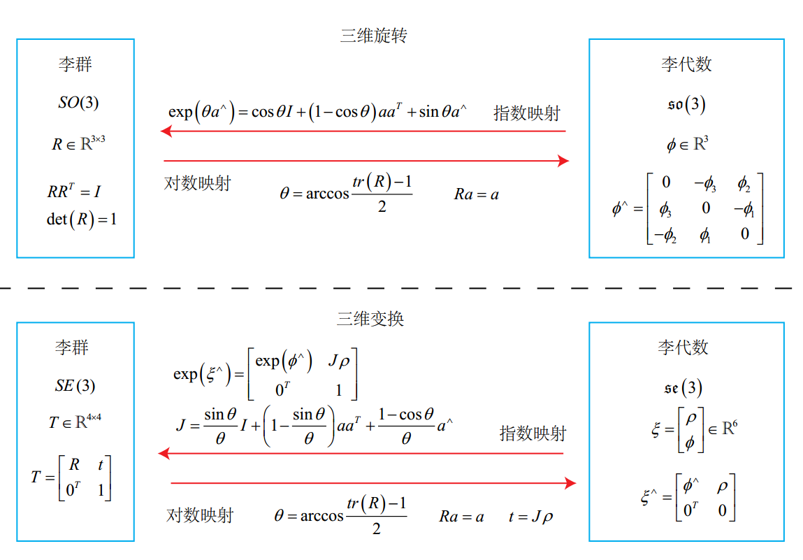
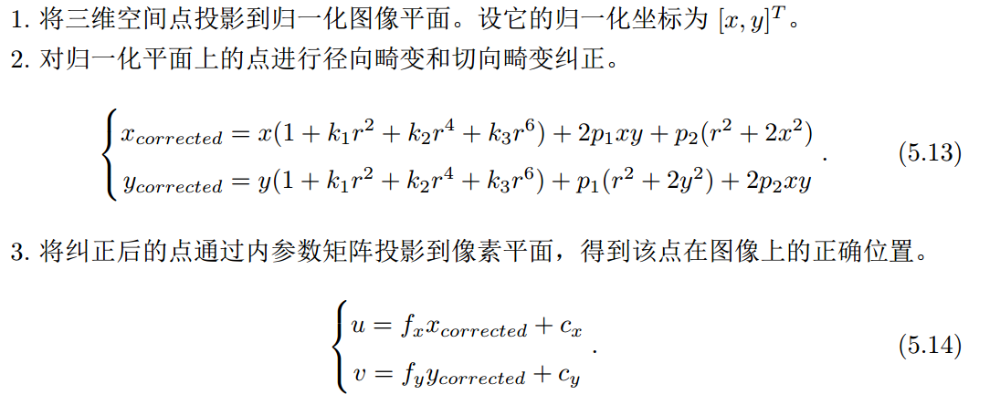
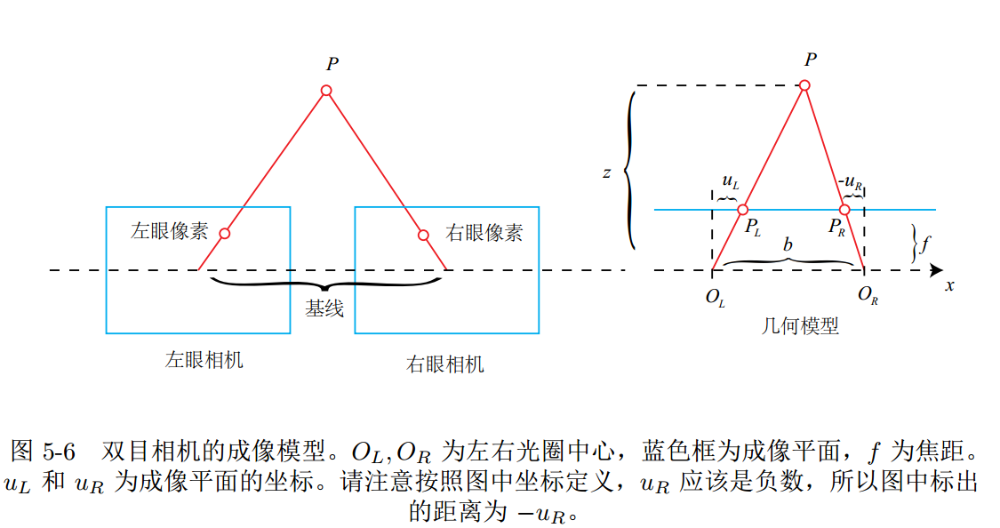
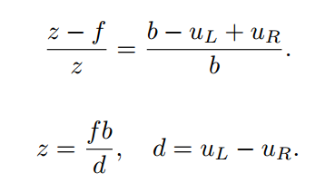

# 视觉slam十四讲

## 第3讲 三维空间刚体运动

### 相似、仿射、摄影变换

+ 相似变换比欧氏变换多了一个自由度，它允许物体进行均匀的缩放,旋转部分多了一个缩放因子 s，表示我们在对向量旋转之后，可以在 x,y,z 三个坐标上进行均匀的缩放。
+ 与欧氏变换不同的是，仿射变换只要求 A 是一个可逆矩阵，而不必是正交矩阵。仿射变换也叫正交投影。经过仿射变换之后，立方体就不再是方的了，但是各个面仍然是平行四边形。
+ 射影变换是最一般的变换,真实世界到相机照片的变换可以看成一个射影变换,一个原本方形的地板砖，在照片当中是什么样子：首先，它不再是方形的。由于近大远小的关系，它甚至不是平行四边形，而是一个不规则的四边形。

## 第4讲　李群与李代数

### 李群

+ 群
  群（ Group）是一种集合加上一种运算的代数结构。我们把集合记作 A，运算记作 ·，那么群可以记作 G = (A; ·)。群要求这个运算满足以下几个条件：
  

+ 李群
  李群是指具有连续（光滑）性质的群。像整数群 Z 那样离散的群没有连续性质，所以不是李群。

### 李代数
每个李群都有与之对应的李代数。李代数描述了李群的局部性质：

三维向量 R3 上定义的叉积 × 是一种李括号

+ 李代数so(3)
   SO(3) 对应的李代数是定义在R3上的向量，我们记作 ϕ。根据前面的推导，每个 ϕ 都可以生成一个反对称矩阵：
   
+ 李代数se(3)
  SE(3)，它也有对应的李代数 se(3):
  
  李代数 se(3) 亦有类似于 so(3) 的李括号：
  
  

## 第5将　相机与图像

### 畸变

通过五个畸变系数找到这个点在像素平面上的正确位置:

### 双目相机模型

d 为左右图的横坐标之差，称为视差，视差与距离成反比：视差越大，距离越近。
由于视差最小为一个像素，于是双目的深度存在一个理论上的最大值，由 fb 确定。当基线越长时，双目最大能测到的距离就会变远；反之，小型双目器件则只能测量很近的距离。
当我们想计算每个像素的深度时，其计算量与精度都将成为问题，而且只有在图像纹理变化丰富的地方才能计算视差。由于计算量的原因，双目深度估计仍需要使用 GPU 或 FPGA 来计算。

## 第6将　非线性优化

## 第7将　视觉里程计１

特征点由关键点（ Key-point）和描述子（ Descriptor）两部分组成。关键点是指该特征点在图像里的位置，有些特征点还具有朝向、大小等信息。描述子通常是一个向量，按照某种人为设计的方式，描述了该关键点周围像素的信息。描述子是按照“外观相似的特征应该有相似的描述子”的原则设计的。因此，只要两个特征点的描述子在向量空间上的距离相近，就可以认为它们是同样的特征点。
[【机器视觉】2. 特征点检测：Harris, SIFT, SURF, ORB - 知乎](https://zhuanlan.zhihu.com/p/36382429)