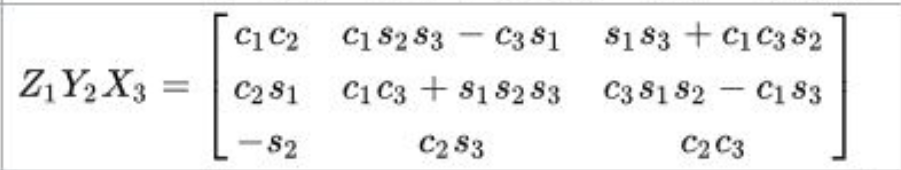

[TOC]

# Questions

1. Ubuntu14.04安装ros indigo和annconda使得catkin_make时，Python版本出错
    解决方法：pip install catkin_pkg


2. cuda 8.0安装出现/tmp 容量太小
    sudo umount -l /tmp


3. [cuda 8.0配置](http://www.linuxidc.com/Linux/2017-01/139300.htm)
    在zshrc中加入path
```sh
export PATH=/usr/local/cuda-8.0/bin:$PATH
export LD_LIBRARY_PATH=/usr/local/cuda-8.0/lib64:$LD_LIBRARY_PATH
```

4. [caffe编译](https://github.com/sermanet/OverFeat/issues/10)
```sh
caffe Makefile.config BLAS := open
sudo apt-get install libopenblas-base
sudo apt-get install libopenblas-dev
export LD_LIBRARY_PATH=/usr/lib/openblas-base/
```


5. [显卡Nvidia GTX950驱动安装](http://www.mamicode.com/info-detail-1434964.html)
    (1)屏蔽开源驱动 nouveau:
    sudo gedit /etc/modprobe.d/blacklist.conf
    添加如下内容：
    blacklist vga16fb 
    blacklist nouveau 
    blacklist rivafb 
    blacklist nvidiafb 
    blacklist rivatv 
    （这里有一行空格）
    (2)删除旧NVIDIA驱动
    sudo apt-get --purge remove nvidia-\\*
    sudo apt-get --purge remove xserver-xorg-video-nouveau
    (3)重启安装
    sudo service lightdm stop
    sudo apt-get install nvidia-375--dpkg-shlibdeps-params=--ignore-missing-info
6. [nouveau kernel driver is currently in use](https://askubuntu.com/questions/841876/how-to-disable-nouveau-kernel-driver)

```sh
sudo vim /etc/modprobe.d/blacklist.conf
blacklist nouveau
options nouveau modeset=0 #没有设置
sudo update-initramfs -u
sudo reboot
```

6. Cannot create Cublas handle. Cublas won't be available. Cannot create Curand generator. Curand won't be available. Check failed: error == cudaSuccess (30 vs. 0)  unknown error
    cuda每次新开机出现上述问题
```sh
cd /usr/local/cuda-8.0/samples/bin/x86_64/linux/release
sudo ./deviceQuery 
```
彻底解决：
CUDA runtime error (30) might show if your program is unable to create or open the /dev/nvidia-uvm device file. This is usually fixed by installing package nvidia-modprobe:
`sudo apt-get install nvidia-modprobe`


7. catkin build生成install文件夹
    在CMakeLists.txt中添加：
```
install(TARGETS ${PROJECT_NAME} module_manager
 LIBRARY DESTINATION ${CATKIN_PACKAGE_LIB_DESTINATION}
 )
catkin config --install
catkin build
```


8. catkin build生成install文件后，source devel/setup.zsh后然后无法find the package，无法找到对应的launch
    https://github.com/catkin/catkin_tools/issues/427
    https://catkin-tools.readthedocs.io/en/latest/verbs/catkin_config.html
    devel中缺少etc文件夹，设置catkin config --merge-devel
```sh
catkin config --merge-devel
catkin build
source devel/setup.zsh
```

9. void findContours(InputOutputArray image, OutputArrayOfArrays contours, OutputArray hierarchy, int mode, int method, Point offset=Point())
    https://docs.opencv.org/2.4/modules/imgproc/doc/structural_analysis_and_shape_descriptors.html?highlight=findcontours#void 
    最后一个是parent的索引值


9. 服务器重新安装系统后，本地无法连接remote server, git push出错，ssh-remote-host-identification-has-changed
    @@@@@@@@@@@@@@@@@@@@@@@@@@@@@@@@@@@@@@@@@@@@@@@@@@@@@@@@@@@
    @    WARNING: REMOTE HOST IDENTIFICATION HAS CHANGED!     @
    @@@@@@@@@@@@@@@@@@@@@@@@@@@@@@@@@@@@@@@@@@@@@@@@@@@@@@@@@@@
    IT IS POSSIBLE THAT SOMEONE IS DOING SOMETHING NASTY!
    Someone could be eavesdropping on you right now (man-in-the-middle attack)!
    It is also possible that a host key has just been changed.
    https://stackoverflow.com/questions/20840012/ssh-remote-host-identification-has-changed
    `ssh-keygen -R 192.168.1.20`


10. 声明的指针一定要初始化
    声明指向对象的指针，一定要初始化(new)


11. ros生成deb
    debian/rules:50: recipe for target 'override_dh_shlibdeps' failed
    make[1]: *** [override_dh_shlibdeps] Error 2
    make[1]: Leaving directory '/home/stiperception/xshen/test_ws/src/drivable_area'
    debian/rules:22: recipe for target 'binary' failed
    rules
    make: *** [binary] Error 2
    https://github.com/SpiderLabs/ModSecurity-nginx/issues/16
    修改rules文件中的
    直接在最有一句末尾添加 `--dpkg-shlibdeps-params=--ignore-missing-info`
    override_dh_shlibdeps
```
# In case we're installing to a non-standard location, look for a setup.sh
# in the install tree that was dropped by catkin, and source it.  It will
# set things like CMAKE_PREFIX_PATH, PKG_CONFIG_PATH, and PYTHONPATH.
if [ -f "/opt/ros/kinetic/setup.sh" ]; then . "/opt/ros/kinetic/setup.sh"; fi && \:
dh_shlibdeps -l$(CURDIR)/debian/ros-indigo-drivable-area//opt/ros/indigo/lib/ --dpkg-shlibdeps-params=--ignore-missing-info
```
直接替换掉debian/rules文件


12. Ubuntu 14.04 and indigo 环境下使用pcl 1.8.1无法找到对应函数
    CMakeLists.txt中使用find_package(PCL 1.8 REQUIRED)，并且在find_package()中不能包含ros的pcl依赖，比如：pcl_ros
    这样cmake会自动加载ros(indigo)默认安装的pcl库(pcl 1.7)，这样就找不到对应的1.8.1了。


13. cv::Mat 直接进行bytes copy
```cpp
cv::Mat image_dest, image_src;
memcpy(image_dest.data, image_src.data, sizeof(unsigned char)* width*height)
```

14. camera_info_url 加载标定文件.yaml
```
<param name="camera_info_url" value="file://$(find usb_cam)/scripts/camera0.yaml" />
```

15. 设置ubuntu为主引导
    https://jingyan.baidu.com/article/2d5afd69c9ebb185a3e28e52.html
    https://unix.stackexchange.com/questions/174206/warning-file-system-ext2-doesnt-support-embedding-but-my-system-isnt-emb
    将win7引导ubuntu修改为ubuntu引导win7
    sudo fdisk -l  #查看硬盘分区
    sudo grub-install /dev/sdb #安装linux引导，此处是用于引导的ubuntu安装的硬盘，不是分区:/dev/sdb2
    sudo update-grub
+ 如果安装了linux后直接进入win,看不见启动项
+ [Ubuntu 16.04 引导修复（boot repair） - laocaibcc229的博客 - CSDN博客](https://blog.csdn.net/laocaibcc229/article/details/79274412)
```sh
sudo add-apt-repository ppa:yannubuntu/boot-repair && sudo apt-get update
sudo apt-get install -y boot-repair && boot-repair  
```


16. U盘修复Ubuntu下
    用gparted将u盘格式化为fat32
    umout /dev/sdc1
    sudo fsck -C -a /dev/sdc1


16. shell脚本第一行
```sh
#!/usr/bin/env bash   # 使用环境变量中的bash，让系统自己去调用
```

17.  imu驱动[xsens_driver](http://wiki.ros.org/action/fullsearch/xsens_driver?action=fullsearch&context=180&value=linkto%3A%22xsens_driver%22)找不到设备，但是imu已经插在usb
     `sudo chmod 777 /dev/ttyUSB0 # 给其足够的权限`


18. ros kinetic opencv
    compile error:*** No rule to make target 'opencv_calib3d-NOTFOUND', needed by '../bin/BagFromImages-master'. Stop.
    https://github.com/raulmur/BagFromImages/issues/4
    https://github.com/ros-gbp/opencv3-release/pull/15
    对于ros kinetic自带的opencv cmake build类型必须设为release
    set(CMAKE_BUILD_TYPE "Release")


19. makeShared
    `pcl::PointCloud<PointT> cloud`作为参数传给`pcl::PointCloud<PointT>::Ptr cloud_ptr`时，用`&cloud`传入时出错，使用cloud.makeShared()


20. [Linux UDP max size of receive buffer](https://stackoverflow.com/questions/16460261/linux-udp-max-size-of-receive-buffer)
    [Increase OS UDP Buffers to Improve Performance – Cameron Sparr – Medium](https://medium.com/@CameronSparr/increase-os-udp-buffers-to-improve-performance-51d167bb1360)
    对于５个pointgrey相机1920x1200，10fps，packet_size = 6000, packet_delay = 100，设置为当下buffer size时，仍然有部分掉帧．
```
net.core.rmem_max=125829120 # 120M
net.core.rmem_default=125829120
```
增大1.5倍后，没有掉帧：
```
net.core.rmem_max=188743680 # 180M
net.core.rmem_default=188743680 # 一定要设置该值
```
最大的buffer size = 2^32-1

Check the current UDP/IP receive buffer default and limit by typing the following commands:

```sh
sudo sysctl net.core.rmem_max
sudo sysctl net.core.rmem_default
```
+ 查看电脑网口名称
  `ethernet="$(ls /sys/class/net | grep en\*)"`

+ [Ubuntu安装sogou输入法后出现两个图标和输入框](https://blog.csdn.net/lym152898/article/details/79329778)
```sh
sudo vim /etc/rc.local
# 在exit 0之前添加如下代码
/bin/ps -ef | grep fcitx-qimpanel | grep -v grep | awk '{print $2}' | xargs kill -9

# 方法二 
sudo apt-get remove fcitx-ui-qimpanel
[Ubuntu 安装完搜狗输入法出现两个图标 - 简书](https://www.jianshu.com/p/86904a757a87)
```

21. 由转换矩阵得到欧拉角和平移向量
    (1) pcl的函数此种方法默认返回zyx的旋转顺序

    
```cpp
void pcl::getTranslationAndEulerAngles (const Eigen::Affine3f& t, 
                                      float& x, float& y, float& z, 
                                      float& roll, float& pitch, float& yaw)
   {
     x = t(0,3);
     y = t(1,3);
     z = t(2,3);
     roll  = atan2f(t(2,1), t(2,2)); // [-pi, pi]
     pitch = asinf(-t(2,0)); // [-pi/2, pi/2]
     yaw   = atan2f(t(1,0), t(0,0));  // [-pi, pi]
   }
```
  (2) Eigen的矩阵成员函数eulerAngles()返回zyx的旋转顺序
```cpp
Eigen::Vector3d angle = rotation.eulerAngles(0, 1, 2); // [0, pi], [-pi, pi], [-pi, pi]
Eigen::Quaterniond ag = Eigen::AngleAxisd(angle(0),  Eigen::Vector3d::UnitX())
                             *  Eigen::AngleAxisd(angle(1),  Eigen::Vector3d::UnitY())
                             *  Eigen::AngleAxisd(angle(2), Eigen::Vector3d::UnitZ());
Eigen::Matrix4d rotation = ag.matrix();
```


22. [pcl+cuda时vtk的definitions终止nvcc](https://github.com/PointCloudLibrary/pcl/issues/776)

    https://www.jianshu.com/p/1dc40d2b78c8

    在CmakeLists.txt中添加如下内容:

    ```cmake
    get_directory_property(dir_defs DIRECTORY ${CMAKE_SOURCE_DIR} COMPILE_DEFINITIONS)
    set(vtk_flags)
    foreach(it ${dir_defs})
        if(it MATCHES "vtk*")
        list(APPEND vtk_flags ${it})
        endif()
    endforeach()
    
    foreach(d ${vtk_flags})
        remove_definitions(-D${d})
    endforeach()
    ```


## Coding

### [opencv的Mat类型向Eigen中的Matrix类型转换](https://blog.csdn.net/yangliuqing19/article/details/60874290)

首先包含头文件（顺序不能错！！！先包含eigen相关库，再包含opencv库！）

\#include <Eigen/Core>

\#include <opencv2/core/eigen.hpp>

###   cv::FileStorage不能读unsigned int, 应该写int


