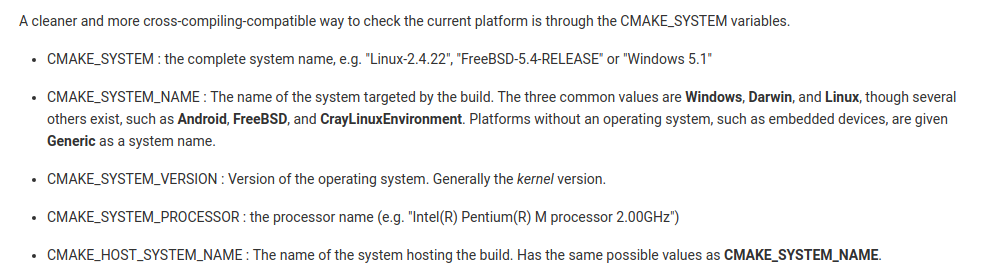

[TOC]

# CMake

## [Faq](https://gitlab.kitware.com/cmake/community/wikis/FAQ#how-do-i-use-a-different-compiler)
0. [update to lasted version](https://askubuntu.com/questions/829310/how-to-upgrade-cmake-in-ubuntu)
   Check your current version with cmake --version
   Uninstall it with sudo apt remove cmake
   Visit https://cmake.org/download/ and download the latest binaries
   In my case cmake-3.6.2-Linux-x86_64.sh is sufficient
   chmod +x /path/to/cmake-3.6.2-Linux-x86_64.sh (use your own file location here, but chmod makes the script executable)
   sudo /path/to/cmake-3.6.2-Linux-x86_64.sh (you'll need to press y twice)
   The script installs to /opt/cmake-3.6.2-Linux-x86_64 so in order to get the cmake command, make a symbolic link:
   sudo ln -s /opt/cmake-3.6.2-Linux-x86_64/bin/* /usr/local/bin
   Test your results with cmake --version

1. When run in -P script mode, CMake sets the variables CMAKE_BINARY_DIR, CMAKE_SOURCE_DIR, CMAKE_CURRENT_BINARY_DIR and CMAKE_CURRENT_SOURCE_DIR to the current working directory.
    `CMAKE_BINARY_DIR`: the path to the top level of the build tree
    This is the full path to the top level of the current CMake build tree. For an in-source build, this would be the same as `CMAKE_SOURCE_DIR`.
    `CMAKE_SOURCE_DIR`: the path to top level of the source tree
    This is the full path to the top level of the current CMake source tree. For an in-source build, this would be the same as `CMAKE_BINARY_DIR`.
    `CMAKE_CURRENT_BINARY_DIR`: the path to the binary currently being processed
    This the full path to the build directory that is currently being processed by cmake. Each directory added by `add_subdirectory()` will create a binary directory in the build tree, and as it is being processed this variable will be set. For in-source builds this is the current source directory being processed.
    `CMAKE_CURRENT_SOURCE_DIR`: the path to the source directory currently being processed
    This the full path to the source directory that is currently being processed by cmake.


2. cmake调用shell命令给参数赋值
```cmake
execute_process(COMMAND env
                COMMAND grep ^HOME=
                COMMAND cut -c 6-
                OUTPUT_VARIABLE EXE_INSTALL_DIR)
message(WARNING "install dir = " ${EXE_INSTALL_DIR})
```
execute_process打开子进程，每条command的输出为next command的输入


3. [add_custom_command](https://cmake.org/cmake/help/v3.0/command/add_custom_command.html)
```cmake
add_custom_command(TARGET target
                   PRE_BUILD | PRE_LINK | POST_BUILD
                   COMMAND command1 [ARGS] [args1...]
                   [COMMAND command2 [ARGS] [args2...] ...]
                   [WORKING_DIRECTORY dir]
                   [COMMENT comment] [VERBATIM])
PRE_BUILD - run before all other dependencies
PRE_LINK - run after other dependencies
POST_BUILD - run after the target has been built                 
```

4. [install](https://cmake.org/cmake/help/v3.1/command/install.html)
+ targets
```cmake
install(TARGETS targets... [EXPORT <export-name>]
        [[ARCHIVE|LIBRARY|RUNTIME|FRAMEWORK|BUNDLE|           PRIVATE_HEADER|PUBLIC_HEADER|RESOURCE]
         [DESTINATION <dir>]
         [INCLUDES DESTINATION [<dir> ...]]
         [PERMISSIONS permissions...]
         [CONFIGURATIONS [Debug|Release|...]]
         [COMPONENT <component>]
         [OPTIONAL] [NAMELINK_ONLY|NAMELINK_SKIP]
        ] [...])
```
Executables are treated as RUNTIME targets, except that those marked with the MACOSX_BUNDLE property are treated as BUNDLE targets on OS X. Static libraries are always treated as ARCHIVE targets. Module libraries are always treated as LIBRARY targets. For non-DLL platforms shared libraries are treated as LIBRARY targets, except that those marked with the FRAMEWORK property are treated as FRAMEWORK targets on OS X. For DLL platforms the DLL part of a shared library is treated as a RUNTIME target and the corresponding import library is treated as an ARCHIVE target.

+ files
```cmake
install(<FILES|PROGRAMS> files... DESTINATION <dir>         [PERMISSIONS permissions...]
        [CONFIGURATIONS [Debug|Release|...]]
        [COMPONENT <component>]
        [RENAME <name>] [OPTIONAL])
set(LIB_INSTALL_DIR "lib")
set(pc_file ${CMAKE_CURRENT_BINARY_DIR}/lib${LIB_NAME}.so)
install(FILES ${pc_file} DESTINATION ${LIB_INSTALL_DIR} COMPONENT ${PROJECT_NAME}_${SUBSYS_NAME})
```
将对应的文件安装到相应的位置，若包含文件夹，最好用directory，若是可执行文件，用programs:
```cmake
add_executable(
${PROJECT_NAME}
${UI_SRC}
)
set(EXE_INSTALL_DIR "bin")
set (exe_files ${CMAKE_CURRENT_BINARY_DIR}/${PROJECT_NAME})
install(PROGRAMS ${exe_files} DESTINATION ${EXE_INSTALL_DIR})
```

+ directory
```cmake
install(DIRECTORY dirs... DESTINATION <dir>         [FILE_PERMISSIONS permissions...]
        [DIRECTORY_PERMISSIONS permissions...]
        [USE_SOURCE_PERMISSIONS] [OPTIONAL] [MESSAGE_NEVER]
        [CONFIGURATIONS [Debug|Release|...]]
        [COMPONENT <component>] [FILES_MATCHING]
        [[PATTERN <pattern> | REGEX <regex>]
         [EXCLUDE] [PERMISSIONS permissions...]] [...])
```
直接将路径中的内容安装到指定位置：
```cmake
set(INCLUDE_INSTALL_DIR "include")
install(DIRECTORY "include/${PROJECT_NAME}/${SUBSYS_NAME}/" DESTINATION ${INCLUDE_INSTALL_DIR}/${PROJECT_NAME}/${SUBSYS_NAME}
    COMPONENT ${PROJECT_NAME}_${SUBSYS_NAME})
```
`dirs: include/robosense/detection` 安装会包含detection文件夹本身
`dirs: include/robosense/detection/` 不包含detection文件夹本身，只安装该文件夹下的内容

+ export
```cmake
install(EXPORT <export-name> DESTINATION <dir>         [NAMESPACE <namespace>] [FILE <name>.cmake]
        [PERMISSIONS permissions...]
        [CONFIGURATIONS [Debug|Release|...]]
        [EXPORT_LINK_INTERFACE_LIBRARIES]
        [COMPONENT <component>])
```
The EXPORT form generates and installs a CMake file containing code to import targets from the installation tree into another project. 


5. [file](https://cmake.org/cmake/help/v3.0/command/file.html)
    `file(GLOB variable [RELATIVE path] [globbing expressions]...)`
    GLOB will generate a list of all files that match the globbing expressions and store it into the variable.
    *.cxx      - match all files with extension cxx
    *.vt?      - match all files with extension vta,...,vtz
    f[3-5].txt - match files f3.txt, f4.txt, f5.txt
```cmake
file(GLOB LIB_SRC
    "*.cpp"
) # 当前文件夹中所以的.cpp
file(GLOB LIB_HEADER
    "*.h"
) 
```
`file(GLOB_RECURSE variable [RELATIVE path] [FOLLOW_SYMLINKS] [globbing expressions]...)`
```cmake
file(STRINGS filename variable [LIMIT_COUNT num]
     [LIMIT_INPUT numBytes] [LIMIT_OUTPUT numBytes]
     [LENGTH_MINIMUM numBytes] [LENGTH_MAXIMUM numBytes]
     [NEWLINE_CONSUME] [REGEX regex]
     [NO_HEX_CONVERSION])
```


6. [set](https://cmake.org/cmake/help/v3.3/command/set.html)
+ set normal variable
  `set(<variable> <value>... [PARENT_SCOPE])`
```cmake
if (NOT CMAKE_BUILD_TYPE)
  set(CMAKE_BUILD_TYPE "Release")
endif ()
string(TOLOWER "${CMAKE_BUILD_TYPE}" cmake_build_type_tolower)
if (    NOT cmake_build_type_tolower STREQUAL "debug"
    AND NOT cmake_build_type_tolower STREQUAL "release"
    AND NOT cmake_build_type_tolower STREQUAL "relwithdebinfo")
   message(FATAL_ERROR "Unknown build type \"${CMAKE_BUILD_TYPE}\". Allowed values are Debug, Release, RelWithDebInfo (case-insensitive).")
endif ()
```
当child scope中的变量声明为[PARENT_SCOPE](https://stackoverflow.com/questions/10031953/how-to-set-the-global-variable-in-a-function-for-cmake?rq=1)时， parent scope可以访问该变量，即设为全局变量。
[cmake variable scope, add_subdirectory - Stack Overflow](https://stackoverflow.com/questions/6891447/cmake-variable-scope-add-subdirectory/6891527)
As mentioned in the documentation of the set command, each directory added with add_subdirectory or each function declared with function creates a new scope.
The new child scope inherits all variable definitions from its parent scope. Variable assignments in the new child scope with the set command will only be visible in the child scope unless the PARENT_SCOPE option is used.
To make the SOURCEFILES assignment visible in the root folder of your project, try:
`set (SOURCEFILES main.cpp foo.cpp PARENT_SCOPE)` 

+ set cache entry
  `set(<variable> <value>... CACHE <type> <docstring> [FORCE])`
  Set the given cache `<variable>` (cache entry). Since cache entries are meant to provide user-settable values this does not overwrite existing cache entries by default. Use the FORCE option to overwrite existing entries.
  `set(PCL_VERSION "1.8.1-dev" CACHE STRING "PCL version")`
  The `<type>` must be specified as one of:
  `BOOL`
  Boolean ON/OFF value. cmake-gui(1) offers a checkbox.
  `FILEPATH`
  Path to a file on disk. cmake-gui(1) offers a file dialog.
  `PATH`
  Path to a directory on disk. cmake-gui(1) offers a file dialog.
  `STRING`
  A line of text. cmake-gui(1) offers a text field or a drop-down selection if the STRINGS cache entry property is set.
  `INTERNAL`
  A line of text. cmake-gui(1) does not show internal entries. They may be used to store variables persistently across runs. Use of this type implies FORCE.

+ set environment variable
  `set(ENV{<variable>} <value>...)`


7. [string](https://cmake.org/cmake/help/v3.3/command/string.html?highlight=string)
    `string(REGEX MATCH <regular_expression> <output variable> <input> [<input>...])`
    匹配一次 
    `string(REGEX MATCHALL <regular_expression>        <output variable> <input> [<input>...])`
    匹配多次，结果保存为一个list
    `string(REGEX REPLACE <regular_expression>        <replace_expression> <output variable> <input> [<input>...])`
    匹配替换多次，替换后的结果输出
    `string(REPLACE <match_string> <replace_string> <output variable>        <input> [<input>...])`
    拼接string
    `string(CONCAT <output variable> [<input>...])`


8. option
    `option(<option_variable> "help string describing option" [initial value])`
    Provide an option for the user to select as ON or OFF. If no initial value is provided, OFF is used.
    If `USE_BAR` is true and `USE_ZOT` is false, this provides an option called `USE_FOO` that defaults to ON. Otherwise, it sets `USE_FOO` to OFF. If the status of `USE_BAR` or `USE_ZOT` ever changes, any value for the `USE_FOO` option is saved so that when the option is re-enabled it retains its old value.


9. [option vs set](https://stackoverflow.com/questions/11237287/advantages-of-using-cmake-option-command-rather-than-set)
    A variable defined in an option command appears as a boolean choice in the CMake GUI or when running CMake interactively using cmake -i. This is not the case for a variable defined using set unless CACHE is used and the type is not INTERNAL.
    Also, the CMakeDependentOption module allows for specifying dependencies between options.


10. find_package
```cmake
find_package(<package> [version] [EXACT] [QUIET] [MODULE]
             [REQUIRED] [[COMPONENTS] [components...]]
             [OPTIONAL_COMPONENTS components...]
             [NO_POLICY_SCOPE])
```
the REQUIRED option stops processing with an error message if the package cannot be found.
这些变量可以使用：
```
<NAME>_FOUND - Set to true if the library is found, otherwise false
<NAME>_INCLUDE_DIRS or <NAME>_INCLUDES - The include paths exported by the package
<NAME>_LIBRARIES or <NAME>_LIBS - The libraries exported by the package
<NAME>_DEFINITIONS - ?
```
`find_package(catkin REQUIRED COMPONENTS nodelet)`
由于Caffe安装时没有安装到系统目录，因此无法自动找到CaffeConfig.cmake，我在CMakeLists.txt最前面添加了一句话之后就可以了
Config mode attempts to locate a configuration file provided by the package to be found. A cache entry called `<package>_DIR` is created to hold the directory containing the file.
set(Caffe_DIR /home/wjg/projects/caffe/build)   #添加CaffeConfig.cmake的搜索路径
find_package(Caffe REQUIRED)
然后就可以使用Caffe_INCLUDE_LIBS, Caffe_LIBRARIES


11. 获取其他工程的变量，以及工程之间的依赖，多个project时控制cmake编译顺序
    https://stackoverflow.com/questions/16398937/cmake-and-finding-other-projects-and-their-dependencies
    https://stackoverflow.com/questions/32781485/how-to-control-subdirectory-compiling-order-of-cmake

+ The top level CMakeLists.txt
```cmake
cmake_minimum_required(VERSION 2.8.10)
# You can tweak some common (for all subprojects) stuff here. For example:
set(CMAKE_DISABLE_IN_SOURCE_BUILD ON)
set(CMAKE_DISABLE_SOURCE_CHANGES  ON)
if ("${CMAKE_SOURCE_DIR}" STREQUAL "${CMAKE_BINARY_DIR}")
  message(SEND_ERROR "In-source builds are not allowed.")
endif ()
set(CMAKE_VERBOSE_MAKEFILE ON)
set(CMAKE_COLOR_MAKEFILE   ON)
# Remove 'lib' prefix for shared libraries on Windows
if (WIN32)
  set(CMAKE_SHARED_LIBRARY_PREFIX "")
endif ()
# When done tweaking common stuff, configure the components (subprojects).
# NOTE: The order matters! The most independent ones should go first.
add_subdirectory(components/B) # B is a static library (depends on Boost)
add_subdirectory(components/C) # C is a shared library (depends on B and external XXX)
add_subdirectory(components/A) # A is a shared library (depends on C and B)
add_subdirectory(components/Executable) # Executable (depends on A and C)
```

+ CMakeLists.txt in components/B:
```cmake
cmake_minimum_required(VERSION 2.8.10)
project(B C CXX)
find_package(Boost
             1.50.0
             REQUIRED)
file(GLOB CPP_FILES source/*.cpp)
include_directories(${Boost_INCLUDE_DIRS})
add_library(${PROJECT_NAME} STATIC ${CPP_FILES})
# Required on Unix OS family to be able to be linked into shared libraries.
set_target_properties(${PROJECT_NAME}
                      PROPERTIES POSITION_INDEPENDENT_CODE ON)
target_link_libraries(${PROJECT_NAME})
# Expose B's public includes (including Boost transitively) to other
# subprojects through cache variable.
set(${PROJECT_NAME}_INCLUDE_DIRS ${PROJECT_SOURCE_DIR}/include
                                 ${Boost_INCLUDE_DIRS}
    CACHE INTERNAL "${PROJECT_NAME}: Include Directories" FORCE) 
CMakeLists.txt in components/C:
cmake_minimum_required(VERSION 2.8.10)
project(C C CXX)
find_package(XXX REQUIRED)
file(GLOB CPP_FILES source/*.cpp)
add_definitions(${XXX_DEFINITIONS})
# NOTE: Boost's includes are transitively added through B_INCLUDE_DIRS.
include_directories(${B_INCLUDE_DIRS}
                    ${XXX_INCLUDE_DIRS})
add_library(${PROJECT_NAME} SHARED ${CPP_FILES})
target_link_libraries(${PROJECT_NAME} B
                                      ${XXX_LIBRARIES})
# Expose C's definitions (in this case only the ones of XXX transitively)
# to other subprojects through cache variable.
set(${PROJECT_NAME}_DEFINITIONS ${XXX_DEFINITIONS}
    CACHE INTERNAL "${PROJECT_NAME}: Definitions" FORCE)
# Expose C's public includes (including the ones of C's dependencies transitively)
# to other subprojects through cache variable.
set(${PROJECT_NAME}_INCLUDE_DIRS ${PROJECT_SOURCE_DIR}/include
                                 ${B_INCLUDE_DIRS}
                                 ${XXX_INCLUDE_DIRS}
    CACHE INTERNAL "${PROJECT_NAME}: Include Directories" FORCE) 
```

+ CMakeLists.txt in components/A:
```cmake
cmake_minimum_required(VERSION 2.8.10)
project(A C CXX)
file(GLOB CPP_FILES source/*.cpp)
# XXX's definitions are transitively added through C_DEFINITIONS.
add_definitions(${C_DEFINITIONS})
# NOTE: B's and Boost's includes are transitively added through C_INCLUDE_DIRS.
include_directories(${C_INCLUDE_DIRS})
add_library(${PROJECT_NAME} SHARED ${CPP_FILES})
# You could need `${XXX_LIBRARIES}` here too, in case if the dependency 
# of A on C is not purely transitive in terms of XXX, but A explicitly requires
# some additional symbols from XXX. However, in this example, I assumed that 
# this is not the case, therefore A is only linked against B and C.
target_link_libraries(${PROJECT_NAME} B
                                      C)
# Expose A's definitions (in this case only the ones of C transitively)
# to other subprojects through cache variable.
set(${PROJECT_NAME}_DEFINITIONS ${C_DEFINITIONS}
    CACHE INTERNAL "${PROJECT_NAME}: Definitions" FORCE)
# Expose A's public includes (including the ones of A's dependencies
# transitively) to other subprojects through cache variable.
set(${PROJECT_NAME}_INCLUDE_DIRS ${PROJECT_SOURCE_DIR}/include
                                 ${C_INCLUDE_DIRS}
    CACHE INTERNAL "${PROJECT_NAME}: Include Directories" FORCE) 
```

+ CMakeLists.txt in components/Executable:
```cmake
cmake_minimum_required(VERSION 2.8.10)
project(Executable C CXX)
file(GLOB CPP_FILES source/*.cpp)
add_definitions(${A_DEFINITIONS})
include_directories(${A_INCLUDE_DIRS})
add_executable(${PROJECT_NAME} ${CPP_FILES})
target_link_libraries(${PROJECT_NAME} A C)
```
To make it clear, here is the corresponding source tree structure:
Root of the project
```
├───components
│   ├───Executable
│   │   ├───resource
│   │   │   └───icons
│   │   ├───source
|   |   └───CMakeLists.txt
│   ├───A
│   │   ├───include
│   │   │   └───A
│   │   ├───source
|   |   └───CMakeLists.txt
│   ├───B
│   │   ├───include
│   │   │   └───B
│   │   ├───source
|   |   └───CMakeLists.txt
│   └───C
│       ├───include
│       │   └───C
│       ├───source
|       └───CMakeLists.txt
└───CMakeLists.txt
```

12. [add external libraries to cmakelists](https://stackoverflow.com/questions/24570916/add-external-libraries-to-cmakelist-txt-c)
    You can use INCLUDE_DIRECTORIES for header location and LINK_DIRECTORIES + TARGET_LINK_LIBRARIES for libraries:
    `INCLUDE_DIRECTORIES(your/header/dir)`
    `LINK_DIRECTORIES(your/library/dir)`
```cmake
rosbuild_add_executable(kinectueye src/kinect_ueye.cpp)
TARGET_LINK_LIBRARIES(kinectueye lib1 lib2 lib2 ...)
```
note that lib1 is expanded to liblib1.so (on Linux), so use ln to create appropriate links in case you do not have them


13. [configure_file复制文件](https://stackoverflow.com/questions/34799916/cmake-copy-file-from-source-directory-to-binary-directory)
    `configure_file(<input> <output> [COPYONLY] [ESCAPE_QUOTES] [@ONLY] [NEWLINE_STYLE [UNIX|DOS|WIN32|LF|CRLF] ])`
```cmake
configure_file(${CMAKE_CURRENT_SOURCE_DIR}/${NAME}/include/${PROJECT_NAME} ${CMAKE_CURRENT_SOURCE_DIR}/test/include/${PROJECT_NAME} COPYONLY)
```


14. [自定义命令复制](https://cmake.org/cmake/help/v3.3/command/add_custom_target.html?highlight=add_custom_command)

    https://stackoverflow.com/questions/4346281/path-to-target-output-file
```cmake
get_target_property(LIB_LOCATION ${LIB_TARGET} LOCATION)
if (sdk_test_flag)
    add_custom_target(${SUBSYS_NAME}) // 建立任意target确保每次都执行COMMAND
    add_custom_command(TARGET ${SUBSYS_NAME} POST_BUILD
    COMMAND ${CMAKE_COMMAND} -E copy ${LIB_LOCATION} ${CMAKE_SOURCE_DIR}/${TEST_PROJECT}/lib
    COMMAND ${CMAKE_COMMAND} -E copy_directory ${CMAKE_CURRENT_SOURCE_DIR}/include/${PROJECT_NAME}
    ${CMAKE_SOURCE_DIR}/${TEST_PROJECT}/include/${PROJECT_NAME}
    )
endif (sdk_test_flag)


# 推荐使用 复制target file
add_custom_command(TARGET mylibrary POST_BUILD
    COMMAND ${CMAKE_COMMAND} -E copy $<TARGET_FILE:mylibrary> ${targetfile}
)

set(LIB_DESTINATION ${CMAKE_CURRENT_SOURCE_DIR}/../rs_lidar2cam_calib/lib/)
set(INC_DESTINATION ${CMAKE_CURRENT_SOURCE_DIR}/../rs_lidar2cam_calib/include/)
# $<TARGET_FILE:${LIB_NAME}>冒号与$之间没有空格
add_custom_command(TARGET ${LIB_NAME} POST_BUILD
                   COMMAND ${CMAKE_COMMAND} -E copy 
                           $<TARGET_FILE:${LIB_NAME}>
                           ${LIB_DESTINATION}
                   COMMAND ${CMAKE_COMMAND} -E copy 
                           ${CMAKE_CURRENT_SOURCE_DIR}/include/rs_lidar2cam_calib.h
                           ${INC_DESTINATION}
                           )

```
CMAKE_COMMAND: The full path to the cmake executable.
This is the full path to the CMake executable cmake which is useful from custom commands that want to use the cmake -E option for portable system commands. (e.g. /usr/local/bin/cmake)
COMMAND ${CMAKE_COMMAND} -E Linux_command


15. [file拷贝](https://cmake.org/cmake/help/v3.3/command/file.html#command:file)
```cmake
file(<COPY|INSTALL> <files>... DESTINATION <dir> [FILE_PERMISSIONS <permissions>...]
     [DIRECTORY_PERMISSIONS <permissions>...]
     [NO_SOURCE_PERMISSIONS] [USE_SOURCE_PERMISSIONS]
     [FILES_MATCHING]
     [[PATTERN <pattern> | REGEX <regex>]
     [EXCLUDE] [PERMISSIONS <permissions>...]] [...])
```
The COPY signature copies files, directories, and symlinks to a destination folder. Relative input paths are evaluated with respect to the current source directory, and a relative destination is evaluated with respect to the current build directory. Copying preserves input file timestamps, and optimizes out a file if it exists at the destination with the same timestamp. Copying preserves input permissions unless explicit permissions or NO_SOURCE_PERMISSIONS are given (default is USE_SOURCE_PERMISSIONS).


16. [list](https://cmake.org/cmake/help/v3.0/command/list.html)
```cmake
list(LENGTH <list> <output variable>) list(GET <list> <element index> [<element index> ...]
<output variable>) 
list(APPEND <list> [<element> ...]) 
list(FIND <list> <value> <output variable>) 
list(INSERT <list> <element_index> <element> [<element> ...]) 
list(REMOVE_ITEM <list> <value> [<value> ...]) 
list(REMOVE_AT <list> <index> [<index> ...]) 
list(REMOVE_DUPLICATES <list>) 
list(REVERSE <list>) 
list(SORT <list>)
```
Similar to the SET command, the LIST command creates new variable values in the current scope, even if the list itself is actually defined in a parent scope. To propagate the results of these operations upwards, use SET with PARENT_SCOPE, SET with CACHE INTERNAL, or some other means of value propagation.

NOTES: A list in cmake is a ; separated group of strings. To create a list the set command can be used. For example, set(var a b c d e) creates a list with a;b;c;d;e, and set(var “a b c d e”) creates a string or a list with one item in it. (Note macro arguments are not variables, and therefore cannot be used in LIST commands.)

宏参数为常量不能使用LIST的函数，list索引和python相同
新建一个list: set(a_list)空的list
When specifying index values, if `<element index>` is 0 or greater, it is indexed from the beginning of the list, with 0 representing the first list element. If `<element index>` is -1 or lesser, it is indexed from the end of the list, with -1 representing the last list element. Be careful when counting with negative indices: they do not start from 0. -0 is equivalent to 0, the first list element.


17. [add_compile_options和CMAKE_CXX_FLAGS的区别](https://blog.csdn.net/10km/article/details/51731959)
    add_compile_options(-std=c++11)
    set(CMAKE_BUILD_TYPE Release)#RelWithDebInfo
    set (CMAKE_CXX_FLAGS "-fPIC --std=c++11")
    set(CMAKE_CXX_FLAGS "${CMAKE_CXX_FLAGS} -std=c++11")

在cmake脚本中，设置编译选项可以通过add_compile_options命令，也可以通过set命令修改CMAKE_CXX_FLAGS或CMAKE_C_FLAGS。 
使用这两种方式在有的情况下效果是一样的，但请注意它们还是有区别的： 
add_compile_options命令添加的编译选项是针对所有编译器的(包括c和c++编译器)，而set命令设置CMAKE_C_FLAGS或CMAKE_CXX_FLAGS变量则是分别只针对c和c++编译器的。
#判断编译器类型,如果是gcc编译器,则在编译选项中加入c++11支持

```cmake
if(CMAKE_COMPILER_IS_GNUCXX)
    set(CMAKE_CXX_FLAGS "${CMAKE_CXX_FLAGS} -std=c++11")
    set(CMAKE_C_FLAGS "${CMAKE_C_FLAGS} -std=c++11")
    message(STATUS "optional:-std=c++11")    
endif(CMAKE_COMPILER_IS_GNUCXX)
```

18. [cmake获取系统信息](https://gitlab.kitware.com/cmake/community/wikis/doc/cmake/Checking-Platform)
    

19. [cmake useful variablse](https://gitlab.kitware.com/cmake/community/wikis/doc/cmake/Useful-Variables)


20. 根据内核架构编译不同的lib
```cmake
if (${CMAKE_SYSTEM_PROCESSOR} STREQUAL "x86_64")
  if("$ENV{ROS_DISTRO}" STREQUAL "kinetic")
    set(FILTER_LIB "robosense_filters_x86_64")
    message("FILTER_LIB: " ${FILTER_LIB} )
  else()
    message(FATAL_ERROR "ROS VERSION NOT SUPPORT" )
  endif()
elseif (${CMAKE_SYSTEM_PROCESSOR} STREQUAL "aarch64")
  if("$ENV{ROS_DISTRO}" STREQUAL "kinetic")
    set(FILTER_LIB "robosense_filters_tx2")
    message("FILTER_LIB: " ${FILTER_LIB} )
  else()
    message(FATAL_ERROR "ROS VERSION NOT SUPPORT" )
  endif()
else()
  message(FATAL_ERROR "ARCHITECTURE NOT SUPPORT" )
endif()
```
The output lib should be static lib, and the generated lib should not rename.
add the Ubuntu 16.04 and Ubuntu 14.04 detection

21. 引用静态库时需要注意链接顺序
    `target_link_libraries(drivable_area_demo_node robosense_drivable_area ${catkin_LIBRARIES})`，`librobosense_drivable_area.a`放在前面
    [An easy solution (especially for circular dependencies) can be to just put all your libraries in a list variable, then add that list twice (or more if necessary), like:](https://stackoverflow.com/questions/12204820/cmake-and-order-dependent-linking-of-shared-libraries)
    [Library order in static linking - Eli Bendersky's website](https://eli.thegreenplace.net/2013/07/09/library-order-in-static-linking)
```cmake
set(LINK_LIBS "liba libb libc")
target_link_libraries(app ${LINK_LIBS} ${LINK_LIBS})
```

22. 设置其他编译器
```
set(CMAKE_CXX_COMPILER /opt/pgi/linux86-64/2018/bin/pgc++)
set(CMAKE_C_COMPILER /opt/pgi/linux86-64/2018/bin/pgcc)
```

### fPIC

-fPIC 作用于编译阶段，在编译动态库时(.so文件)告诉编译器产生与位置无关代码(Position-Independent Code)，若未指定-fPIC选项编译.so文件，则在加载动态库时需进行重定向。

```sh
set(CMAKE_POSITION_INDEPENDENT_CODE ON)
add_compile_options(-fPIC)
```

另外，链接静态生成可执行程序时，静态库是不是用 "-shared -fPIC" 选项编译产生的没有影响。都能正常生成可执行程序。

综合以上情况，总结如下：

1、动态连接库中用到的object文件必须是用 "-shared -fPIC"选项编译产生的，否则连接时要么报错，要么被忽略。

2、静态库中的object文件最好也用"-shared -fPIC"选项编译，这样静态库就可以同时被连接到.so 或者可执行性文件中。

3、动态库只能连接用"-shared -fPIC"选项编译出来的静态库（和第1点是同一件事）

4、连接选项的顺序对连接器的行为有重要影响！

64位编译器下编译生成动态库时，出现以下错误：

/usr/lib64/gcc/x86_64-suse-linux/4.3/../../../../x86_64-suse-linux/bin/ld: ../../CI/script/server/lib/libz.a(adler32.o): relocation R_X86_64_32 against `.text' can not be used when making a shared object; recompile with -fPIC

原因：提示说需要-fPIC编译，然后在链接动态库的地方加上-fPIC的参数编译结果还是报错，需要把共享库所用到的所有静态库都采用-fPIC编译一遍，才可以成功的在64位环境下编译出动态库。

为何在32位的编译器下编译，就不会报错呢？

对于我们的32位环境来说, 编译时是否加上-fPIC, 都不会对链接产生影响, 只是一份代码的在内存中有几个副本的问题(而且对于静态库而言结果都是一样的).但在64位的环境下装载时重定位的方式存在一个问题就是在我们的64位环 境下用来进行位置偏移定位的cpu指令只支持32位的偏移, 但实际中位置的偏移是完全可能超过64位的,所以在这种情况下编译器要求用户必须采用fPIC的方式进行编译的程序才可以在共享库中使用。


### [动静态库链接](https://www.ibm.com/developerworks/cn/linux/l-cn-linklib/index.html)

Linux 下标准库链接的三种方式（全静态 , 半静态 (libgcc,libstdc++), 全动态）及其各自利弊。gcc默认链接动态库。

http://chenyufei.info/blog/2012-09-14/packaging-linux-applications/

https://blog.csdn.net/sevenjoin/article/details/78041377

#### Linux 下静态库（archive）的制作方式

使用`ar`命令提取创建修改，

t - 显示静态库的内容 
`r[ab][f][u]` - 更新或增加新文件到静态库中 
[s] - 创建文档索引 
ar -M [<mri-script] - 使用 ar 脚本处理 
其他详细说明请参阅 man 说明。

静态库有两种创建方式：

+ 将所有静态库中包含的对象文件提取出来然后重新打包成新的静态库文件

+ 用一种更加灵活的方式创建新的静态库文件：**ar 脚本**

  ```sh
  rm demo.a 
  rm ar.mac 
  echo CREATE demo.a > ar.mac 
  echo SAVE >> ar.mac 
  echo END >> ar.mac 
  ar -M < ar.mac
  ar -q demo.a CdtLog.o 
  echo OPEN demo.a > ar.mac 
  echo ADDLIB xml.a >> ar.mac 
  echo SAVE >> ar.mac 
  echo END >> ar.mac 
  ar -M < ar.mac 
  rm ar.mac
  ```

  在 Linux makefile 中使用 **ar 脚本**方式进行静态库的创建:

  ```cmake
  define BUILD_LIBRARY 
  $(if $(wildcard $@),@$(RM) $@) 
  $(if $(wildcard ar.mac),@$(RM) ar.mac) 
  $(if $(filter %.a, $^), 
  @echo CREATE $@ > ar.mac 
  @echo SAVE >> ar.mac 
  @echo END >> ar.mac 
  @$(AR) -M < ar.mac
  ) 
  $(if $(filter %.o,$^),@$(AR) -q $@ $(filter %.o, $^)) 
  $(if $(filter %.a, $^), 
  @echo OPEN $@ > ar.mac 
  $(foreach LIB, $(filter %.a, $^), 
  @echo ADDLIB $(LIB) >> ar.mac 
  ) 
  @echo SAVE >> ar.mac 
  @echo END >> ar.mac 
  @$(AR) -M < ar.mac 
  @$(RM) ar.mac 
  ) 
  endef 
   
  $(TargetDir)/$(TargetFileName):$(OBJS) 
     $(BUILD_LIBRARY)
  ```

GNU工具中ar是用来制作库文件.a的，但同时还提供了一个ranlib，从手册上看ranlib相当于ar -s, ar程序是单纯用来打包多个.o到.a（类似于tar做的事情），而不处理.o里的符号表。Linker程序则需 要.a文件提供一个完整的符号表，所以当时就写了单独的ranlib程序用来产生linker所需要的符号信息，也就是说那时，产生一个对linker合 格的的.a文件需要做ar和ranlib两步 。

#### [Linux 静态库链接顺序问题](https://www.cnblogs.com/aquester/p/10084070.html)

It makes a difference where in the command you write this option; the linker
searches and processes libraries and object files in the order they are specified.
Thus, ‘ foo.o -lz bar.o ’ searches library ‘ z ’ after file ‘ foo.o ’ but before
‘ bar.o ’ . If ‘ bar.o ’ refers to functions in ‘ z ’ , those functions may not be loaded.

为了解决这种库链接顺序问题，我们需要增加一些链接选项 :

```cmake
$(CXX) $(LINKFLAGS) $(OBJS) -Xlinker "-(" $(LIBS) -Xlinker "-)" -o $@
```

通过将所有需要被链接的静态库放入 -Xlinker "-(" 与 -Xlinker "-)" 之间，可以是 g++ 链接过程中， 自动循环链接所有静态库，从而解决了原本的链接顺序问题。

start-group和end-group是ld的选项，是链接选项，不是gcc/g++的编译选项，直接命令行或其它编译方式也可以使用:

```sh
g++ -g -o x x.cpp -Wl,--start-group libX2.a libX1.a libX3.a -Wl,--end-group
```

```sh
-Wl表示后面的参数传递给链接器，其中l是linker的意思。

链接时指定共享库的搜索路径（类似于设置LD_LIBRARY_PATH）：

-Wl,-rpath=/usr/local/abc:/data/abc

以上也可以分开写：

-Wl,-rpath=/usr/local/abc -Wl,-rpath=/data/abc

部分库链接它的静态库，部分库链接它的共享库：

-Wl,-static -lb -Wl,-call_shared -la -lz

指定链接器：

-Wl,-dynamic-linker /lib/ld-linux.so.2 -e _so_start

指定导出的符号：

-Wl,--export-dynamic,--version-script,exports.lds

exports.lds的格式可以为：

{

global:

foo;

};

指定共享库的soname：

-Wl,--export-dynamic,--version-script,exports.lds,-soname=libqhttpd.so

-rpath 增加共享库搜索路径

--retain-symbols-file表示不丢弃未定义的符号和需要重定位的符号

--export-dynamic 创建一个动态连接的可执行程序时, 把所有的符号加到动态符号表中
```


使用静态链接. 将所有可执行文件文件依赖的静态库, 系统库,全部静态链接到可执行文件中,可以解决软件发布问题：

+ 在gcc链接命令行中添加-static -static-libgcc -static-libstdc++
+ 将第三方依赖库打开静态链接开关, 将原来链接.so的库,全改为链接.a
+ gcc对链接库顺序很敏感, 链接库顺序需要按照从前至后为:  项目产生的静态库 > 第三方库静态库 > 系统静态库
+ 链接时, 若有未解决的symbol, 可以尝试在最后添加-lpthread及-lrt解决

不太建议使用静态链接库，对于一些复杂的程序，一方面会使可执行文件体积变得很大，另一方面在编译链接时会出现各种莫名的错误。

+ 在链接目录只放静态库，否则会优先链接动态库

+ 使用全路径

  ```sh
  g++ main.cpp build/libtest.a ‐o helloworld
  ```

+ -static强制将所有库都使用静态库

  ```sh
  set(CMAKE_CXX_FLAGS "-static ${CMAKE_CXX_FLAGS}")
  ```

  缺点：　所有的库，包括libc, libstdc++都要提供静态库版本，缺少一个都不行。

+ [指定库使用静态链接，另一部分使用动态链接](https://blog.csdn.net/sevenjoin/article/details/78041377)

+ https://blog.csdn.net/10km/article/details/83239949

  ```sh
  set(CMAKE_CXX_FLAGS "-Wl,-Bstatic -lf77blas -lcxsparse -llapack -Wl,-Bdynamic -lcv_bridge ${CMAKE_CXX_FLAGS}")
  ```

  没有测试通过。

  [如何让有些“-l”链接静态库，而另一些链接共享库](https://www.cnblogs.com/aquester/p/10084070.html)

  用“-Wl,-Bstatic”指定链接静态库，使用“-Wl,-Bdynamic”指定链接共享库，使用示例：

  ```cmake
  -Wl,-Bstatic -lmysqlclient_r -lssl -lcrypto -Wl,-Bdynamic -lrt -Wl,-Bdynamic -pthread -Wl,-Bstatic -lgtest
  ```

  "-Wl"表示是传递给链接器ld的参数，而不是编译器gcc/g++的参数。


#### ELF

ELF(Executable and Linkable Format)是一种对象文件的格式，用于定义不同类型的对象文件(Object files)中都放了什么东西、以及都以什么样的格式去放这些东西。ELF文件参与程序的连接(建立一个程序)和程序的执行(运行一个程序)，所以可以从不同的角度来看待elf格式的文件：

+ 如果用于编译和链接（可重定位文件(Relocatable File) .o），则编译器和链接器将把elf文件看作是节头表描述的节的集合,程序头表可选。

+ 如果用于加载执行（可执行文件(Executable File) .exe），则加载器则将把elf文件看作是程序头表描述的段的集合，一个段可能包含多个节，节头表可选。

+ 如果是共享文件(Shared Object File) .so，则两者都含有。


### [cmake_variables](https://cmake.org/cmake/help/latest/manual/cmake-variables.7.html#variables-that-control-the-build)


### -Wl,–whole-archive

```cmake
target_link_libraries(
${MODULE_NAME}
${${MODULE_NAME}_EXTRA_LDFLAGS}
"-Wl,--whole-archive" #告诉编译器，从这里开始，所有的库的内容都包含到so中
${LOCAL_MODULES} #可以是以源代码生成的静态库
${PREBUILT_MODULES} #可以是预先生成的静态库
"-Wl,--no-whole-archive" #告诉编译器，从这里开始，以后的库的内容不用都包含到so中
)
```


### [lib输出路径](https://stackoverflow.com/questions/3742090/custom-directory-for-cmake-library-output)

```cmake
set_target_properties(${lib_name} PROPERTIES
         LIBRARY_OUTPUT_DIRECTORY ${PROJECT_BINARY_DIR}/out/library)
```

If all the libraries are in one directory, I find it more convenient to set the `CMAKE_LIBRARY_OUTPUT_DIRECTORY` variable, which is used to initialize the `LIBRARY_OUTPUT_DIRECTORY` property when creating a target.

```cmake
set(CMAKE_LIBRARY_OUTPUT_DIRECTORY ${PROJECT_BINARY_DIR}/out/library)
```


### [cmake-format](https://dev.to/10xlearner/formatting-cmake-4dle)

```sh
find . \( -name '*.cmake' -o -name 'CMakeLists.txt' \) -exec cmake-format -i {} \;
```

