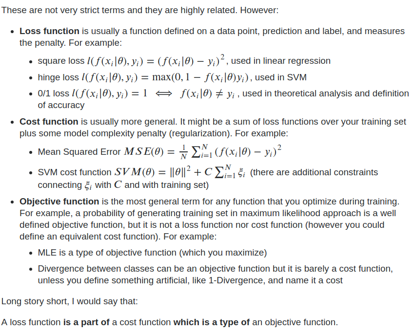

[TOC]

# [Ceres-Solver](https://github.com/ceres-solver/ceres-solver)

## 关于优化的常识

### [Cost Function & Loss Function](https://stats.stackexchange.com/questions/179026/objective-function-cost-function-loss-function-are-they-the-same-thing)

## [Bundle Adjustment](https://optsolution.github.io/archives/58892.html)

光束法平差，**其本质是一个优化模型，其目的是最小化重投影误差**。