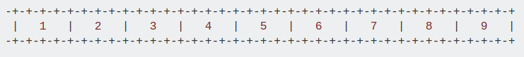
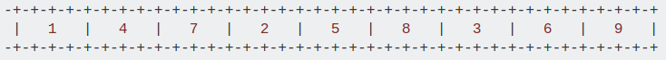

[TOC]


1. [Eigen::Affine3f and Eigen::Matrix4f](https://stackoverflow.com/questions/34177111/how-to-convert-eigenmatrix4f-to-eigenaffine3f)
```cpp
Eigen::Matrix4f matrix4f;
Eigen::Affine3f affine3f; // stores a matrixXf
affine3f.matrix() = matrix4f;
affine3f = matrix4f; // 先定义后赋值，定义的时候赋值，编译不通过Eigen::Affine3f affine3f = matrix4f;
matrix4f = affine3f.matrix();

```

2. 求2个向量之间的旋转欧拉角
```cpp
Eigen::Vector3f z_v(0, 0, 1);
auto euler = Eigen::Quaternion<float>::FromTwoVectors(plane_model.head<3>(), z_v).toRotationMatrix().eulerAngles(0, 1, 2);
```

3. Eigen使用STL容器时指定分配器
    由于Eigen自身分配空间方法与stl空间分配的问题，在执行push_back()操作时，有时会导致程序崩溃，这个bug比较隐蔽，在有的电脑上可能不会出现。Eigen库使用了SSE加速，需要按照128位进行对齐，这导致了Fixed-size vectorizable Eigen objects必须是16字节对齐。在使用stl容器时，需明确指定使用`Eigen::aligned_allocator`
    Using an aligned allocator
    STL containers take an optional template parameter, the allocator type. When using STL containers on fixed-size vectorizable Eigen types, you need tell the container to use an allocator that will always allocate memory at 16-byte-aligned locations. Fortunately, Eigen does provide such an allocator: Eigen::aligned_allocator.
    For example, instead of
    std::map<int, Eigen::Vector4f>
    you need to use
```cpp
std::map<int, Eigen::Vector4f, std::less<int>, 
         Eigen::aligned_allocator<std::pair<const int, Eigen::Vector4f> > >
```
Note that the third parameter "std::less<int>" is just the default value, but we have to include it because we want to specify the fourth parameter, which is the allocator type.

The case of std::vector
The situation with std::vector was even worse (explanation below) so we had to specialize it for the Eigen::aligned_allocator type. In practice you must use the Eigen::aligned_allocator (not another aligned allocator), and #include <Eigen/StdVector>.

Here is an example:
```cpp
#include<Eigen/StdVector>
std::vector<Eigen::Vector4f,Eigen::aligned_allocator<Eigen::Vector4f> >

```
<https://eigen.tuxfamily.org/dox/group__TopicStlContainers.html>


4. [Eiggen::Matrix and cv::Mat](https://stackoverflow.com/questions/14783329/opencv-cvmat-and-eigenmatrix)
    需要制定`Eigen::Matrix`的行还列存储
```cpp
#include <Eigen/Geometry>
#include <Eigen/Core> // Eigen 定义在opencv2/core/eigen.hpp之前，否则编译不通过，eigen没有定义

#include <opencv2/core/eigen.hpp>
 void eigen2cv(const Eigen::Matrix<_Tp, _rows, _cols, _options, _maxRows, _maxCols>& src, Mat& dst)
  void cv2eigen(const Mat& src, Eigen::Matrix<_Tp, _rows, _cols, _options, _maxRows, _maxCols>& dst)
```

5. [包含fixed-size vectorizable eigen types的结构内存对齐问题](https://eigen.tuxfamily.org/dox/group__TopicStructHavingEigenMembers.html)

 ```cpp
class Foo
{
  ...
  Eigen::Vector2d v;
  ...
public:
  EIGEN_MAKE_ALIGNED_OPERATOR_NEW
};
template<int n> class Foo
{
  typedef Eigen::Matrix<float,n,1> Vector;
  enum { NeedsToAlign = (sizeof(Vector)%16)==0 };
  ...
  Vector v;
  ...
public:
  EIGEN_MAKE_ALIGNED_OPERATOR_NEW_IF(NeedsToAlign)
};
...
Foo<4> *foo4 = new Foo<4>; // foo4 is guaranteed to be 128bit-aligned
Foo<3> *foo3 = new Foo<3>; // foo3 has only the system default alignment guarantee
 ```

6. [euler angle 与旋转矩阵之间的转换](https://eigen.tuxfamily.org/dox/group__Geometry__Module.html#ga17994d2e81b723295f5bc3b1f862ed3b)
    [Eigen的几何模块 - 张家一小伞 - CSDN博客](https://blog.csdn.net/jjjwwwjjjwww/article/details/68936090)
```cpp
  Eigen::Vector3d ea0(yaw,pitch,roll);
  Eigen::Matrix3d R = Eigen::AngleAxisd(ea0[0], Eigen::Vector3d::UnitZ())
        * Eigen::AngleAxisd(ea0[1], Eigen::Vector3d::UnitY())
        * Eigen::AngleAxisd(ea0[2], Eigen::Vector3d::UnitX());
  //RotationMatrix to Quaterniond
    Eigen::Quaterniond q; 
    q = R;    
    cout << q.x() << endl << endl;
    cout << q.y() << endl << endl;
    cout << q.z() << endl << endl;
    cout << q.w() << endl << endl;
    
    //Quaterniond to RotationMatrix
    Eigen::Matrix3d Rx = q.toRotationMatrix();
    cout << Rx << endl << endl;
    
    
    //RotationMatrix to EulerAngles
    Eigen::Vector3d ea1 = Rx.eulerAngles(0, 1, 2);     
    cout << ea1/PI*180 << endl << endl;

  
 #include <iostream>
#include <cmath>
using namespace std;

#include <Eigen/Core>
#include <Eigen/Geometry>

int main( )
{
    Eigen::Matrix3d rotation_matrix = Eigen::Matrix3d::Identity( );
	Eigen::AngleAxisd rotation_vector( M_PI / 2, Eigen::Vector3d( 0, 0, 1 ) );
	cout << "rotation_matrix = \n" << rotation_vector.matrix( ) << endl;  // 转换成矩阵
	rotation_matrix = rotation_vector.toRotationMatrix( );  // 直接赋值
	
	// 用AngleAxis进行坐标变换
	Eigen::Vector3d v( 1, 0, 0 );
	Eigen::Vector3d v_rotated = rotation_vector * v;
	cout << "( 1, 0, 0 ) after rotation = \n" << v_rotated << endl;
	
	// 用旋转矩阵进行坐标变换
	v_rotated = rotation_matrix * v;
	cout << "( 1, 0, 0 ) after rotation = \n" << v_rotated << endl;
	
	// 将旋转矩阵转换成欧拉角
	Eigen::Vector3d euler_angles = rotation_matrix.eulerAngles( 0, 1, 2 );  // z-y-x 顺序，即rpy
	cout << "roll pitch yaw = \n" << euler_angles << endl;
	
	// 用Eigen::Isometry表示欧氏变换矩阵
	Eigen::Isometry3d T = Eigen::Isometry3d::Identity( );  // 三维变换矩阵
	T.rotate( rotation_vector );  // 旋转部分赋值
	T.pretranslate( Eigen::Vector3d( 1, 0, 0 ) );  // 设置平移向量
	cout << "Transform matrix = \n" << T.matrix( ) << endl;
    
	// 用欧氏变换矩阵进行坐标变换，此处的乘法运算符是重载意义上的
	Eigen::Vector3d v_transformed = T * v;  // 相当于R*v + t
	cout << "v transformed = \n" << v_transformed << endl;
	
	// 相应地，仿射变换和摄影变换，使用Eigen::Affine3d和Eigen::Projective3d
	
	// 直接将旋转向量赋值给四元数，反之亦然
	Eigen::Quaterniond q = Eigen::Quaterniond( rotation_vector );
	cout << "quaternion = \n" << q.coeffs( ) << endl;  // Eigen的存储顺序为(x,y,z,w)，实部为w
	// 直接将旋转矩阵赋值给四元数
	q = Eigen::Quaterniond( rotation_matrix );	
	cout << "quaternion = \n" << q.coeffs( ) << endl;
	
	// 用四元数旋转一个向量，使用重载过的乘法运算符
	v_rotated = q * v;  // 相当于qvq^{-1}
	cout << "( 1, 0, 0 ) after rotation = \n" << v_rotated << endl;
		
	return 0;
}
```
[坐标系转换 之 欧拉角转旋转矩阵 [opencv / Eigen]版本对比 - billbliss的专栏 - CSDN博客](https://blog.csdn.net/billbliss/article/details/84680445)
  There are six possible ways you can describe rotation using Tait–Bryan angles — X-Y-Z, X-Z-Y, Y-Z-X, Y-X-Z, Z-X-Y, Z-Y-X. Now you are thinking, the choice is easy. Let’s just choose X-Y-Z. Right ? Wrong. **The industry standard is Z-Y-X because that corresponds to yaw, pitch and roll.**

7. Matrix float和double之间不能直接赋值，使用cast<>
    EigenMatrix3f tmp = R.cast<float>();


8. 齐次和非齐次之间的转换
    Eigen::VectorXf 的homogeneous()函数： 
    在向量的末尾添加一个 "1", 维数升1；
    Eigen::Vector3f  a;  Eigen::Vector4f  b=a.homogeneous();
    相对应的 hnormalized()函数：
      Eigen::Vector4f  b(10,20,30,10);  Eigen::Vector3f  a=b.hnormalized();   // a=[1,2,3]^T;


### [行列存储的区别](https://stackoverflow.com/questions/33862730/row-major-vs-column-major-confusion)

Thus, the difference between software that aligns column-major and software that uses row-major-layout **is not what** it calculates, but just **how**.

To put it more pecisely, the difference between those layouts with regard to the topcial single row's contraction with the column vector **is just** the means to determine

```c
Where is the next element of the current row?
```

+ For a row-major-layout it's the element just in the next bucket in memory
+ For a column-major-layout it's the element in the bucket M buckets away.

在计算机内存中都是一维存储的，对于矩阵:

$M = \begin{bmatrix}1&2&3\\4&5&6\\7&8&9 \end{bmatrix}$

+ Row-major order: In this order we put the first row in memory first, and then the second, and so on. Doing this, we would have in memory the following:

  

  访问$M_{i, j}$的方式为

  $M_{i,j} = i*nCol + j$, 比如$M_{0, 2} = 0 * 3 + 2 = 2$访问的是第3个元素。

+ Column-major ordering: In this order we put the first column in memory first, and then the second, and so or. Doing this we would have in memory the following:

  

SO, the short answer - row-major and column-major format describe how the two (or higher) dimensional arrays are mapped into a one dimensional array of memory.

```c
Row major: A(i,j) element is at A[j + i * n_columns];  <---- mixing these up will
Col major: A(i,j) element is at A[i + j * n_rows];     <---- make your code fubar
```


### [旋转矩阵与轴角转换](https://eigen.tuxfamily.org/dox/classEigen_1_1AngleAxis.html#acd9b10692d7d726b28670e4d3a282fe8)

https://www.aintk.xyz/post/2018-09-18-eigenusage3/

```cpp
#include <Eigen/Geometry>
 Eigen::AngleAxisf init_rotation (0.5*M_PI, Eigen::Vector3f::UnitY());

//代码 来自SLAM十四讲
#include <iostream>
#include <cmath>
using namespace std;

#include <Eigen/Core>
#include <Eigen/Geometry>

int main ( int argc, char** argv )
{
    // Eigen/Geometry 模块提供了各种旋转和平移的表示
    // 3D 旋转矩阵直接使用 Matrix3d 或 Matrix3f
    Eigen::Matrix3d rotation_matrix = Eigen::Matrix3d::Identity();
    // 旋转向量使用 AngleAxis, 它底层不直接是Matrix，但运算可以当作矩阵（因为重载了运算符）
    Eigen::AngleAxisd rotation_vector ( M_PI/4, Eigen::Vector3d ( 0,0,1 ) );     //沿 Z 轴旋转 45 度
    cout .precision(3);
    cout<<"rotation matrix =\n"<<rotation_vector.matrix() <<endl;                //用matrix()转换成矩阵
    // 也可以直接赋值
    rotation_matrix = rotation_vector.toRotationMatrix();
    // 用 AngleAxis 可以进行坐标变换
    Eigen::Vector3d v ( 1,0,0 );
    Eigen::Vector3d v_rotated = rotation_vector * v;
    cout<<"(1,0,0) after rotation = "<<v_rotated.transpose()<<endl;
    // 或者用旋转矩阵
    v_rotated = rotation_matrix * v;
    cout<<"(1,0,0) after rotation = "<<v_rotated.transpose()<<endl;

    // 欧拉角: 可以将旋转矩阵直接转换成欧拉角
    Eigen::Vector3d euler_angles = rotation_matrix.eulerAngles ( 2,1,0 ); // ZYX顺序，即roll pitch yaw顺序
    cout<<"yaw pitch roll = "<<euler_angles.transpose()<<endl;

    // 欧氏变换矩阵使用 Eigen::Isometry
    Eigen::Isometry3d T=Eigen::Isometry3d::Identity();                // 虽然称为3d，实质上是4＊4的矩阵
    T.rotate ( rotation_vector );                                     // 按照rotation_vector进行旋转
    T.pretranslate ( Eigen::Vector3d ( 1,3,4 ) );                     // 把平移向量设成(1,3,4)
    cout << "Transform matrix = \n" << T.matrix() <<endl;

    // 用变换矩阵进行坐标变换
    Eigen::Vector3d v_transformed = T*v;                              // 相当于R*v+t
    cout<<"v tranformed = "<<v_transformed.transpose()<<endl;

    // 对于仿射和射影变换，使用 Eigen::Affine3d 和 Eigen::Projective3d 即可，略

    // 四元数
    // 可以直接把AngleAxis赋值给四元数，反之亦然
    Eigen::Quaterniond q = Eigen::Quaterniond ( rotation_vector );
    cout<<"quaternion = \n"<<q.coeffs() <<endl;   // 请注意coeffs的顺序是(x,y,z,w),w为实部，前三者为虚部
    // 也可以把旋转矩阵赋给它
    q = Eigen::Quaterniond ( rotation_matrix );
    cout<<"quaternion = \n"<<q.coeffs() <<endl;
    // 使用四元数旋转一个向量，使用重载的乘法即可
    v_rotated = q*v; // 注意数学上是qvq^{-1}
    cout<<"(1,0,0) after rotation = "<<v_rotated.transpose()<<endl;

    return 0;
}
```


和ceres中的 轴角关系ceres::AngleAxisRotatePoint(angle_axis, p_l, p_c);

```cpp
// eigen to ceres
Eigen::AngleAxisd init_angle_axis(init_trans_.block<3, 3>(0, 0));
double angle_axis_ceres[3] = { 0 };
  double translation_ceres[3] = { 0 };
  for (std::size_t i = 0; i < 3; ++i)
  {
    angle_axis_ceres[i] = init_angle_axis.angle() * init_angle_axis.axis()(i);
    translation_ceres[i] = init_trans_(i, 3);
  }

// ceres to eigen
Eigen::Vector3d angle_axis_v(angle_axis_ceres[0], angle_axis_ceres[1], angle_axis_ceres[2]);
  Eigen::AngleAxisd angle_axis = Eigen::AngleAxisd(angle_axis_v.norm(), angle_axis_v / angle_axis_v.norm());
  Eigen::Matrix3d rotation = angle_axis.toRotationMatrix();
```


