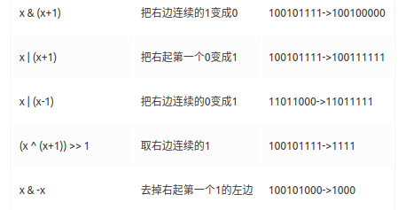
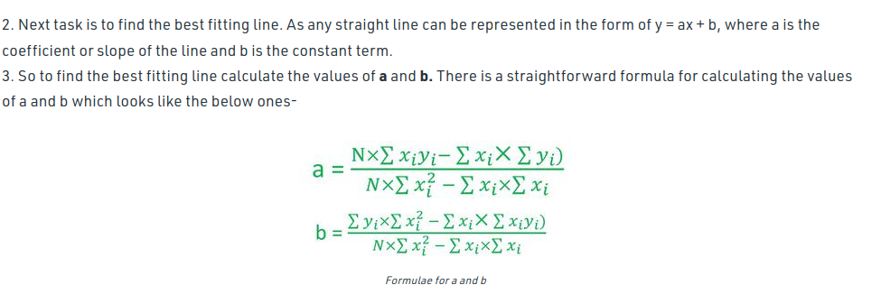

[TOC]

### 版权说明

```cpp
/**
 *****************************************************************************
 * COPYRIGHT STATEMENT
 * Copyright (c) 2017, Robosense Co.,Ltd. - www.robosense.ai
 * All Rights Reserved.
 *
 * You can not use, copy or spread without official authorization.
 *****************************************************************************
 *
 * Author: JackyChen <jack@gmail.com>
 * Version: 1.3.0
 * Date: 2017.8
 *
 * DESCRIPTION
 *
 * Robosense tracker module, for fast multi-objects tracking.
 *
 */
```


### Transform number to string
```cpp
template<typename T>
std::string num2str(T num, int precision)
{
	std::stringstream ss;
	ss.setf(std::ios::fixed, std::ios::floatfield);
	ss.precision(precision);
	std::string st;
	ss << num;
	ss >> st;
	return st;
}
```

### Sleep for awhile
```cpp
#include <chrono>
#include <thread>

int main()
{
  // c++11
  using namespace std::this_thread; // sleep_for, sleep_until
  using namespace std::chrono; // nanoseconds, system_clock, seconds

  sleep_for(nanoseconds(10));
  sleep_until(system_clock::now() + seconds(1));
  // boost
  #include <boost/thread/thread.hpp>
  boost::this_thread::sleep_for(boost::chrono::seconds(2));
}
```

```cpp
#include <ctime>
void wait(int seconds)
{
  clock_t endwait;
  endwait = clock () + seconds * CLOCKS_PER_SEC ;
  while (clock() < endwait) {}
}
```

### 判断一个string是不是纯数字组成
```cpp
bool is_number(const std::string& s)
{
  std::string::const_iterator it = s.begin();
  while (it != s.end() && std::isdigit(*it)) ++it;
  return !s.empty() && it == s.end();
}
```

### Read txt line by line
[online](https://stackoverflow.com/questions/9139300/stringstream-to-vectorint?lq=1)   
[split a string into a vector](https://codereview.stackexchange.com/questions/159628/c-split-string-into-a-vector)    
Elements are separated by blank space.
```cpp
#include<sstream>

// split a string into a vector
template<typename T>
std::vector<T> Split(const std::string &subject)
{
  std::istringstream ss{subject};
  using StrIt = std::istream_iterator<T>;
  std::vector<T> container{StrIt{ss}, StrIt{}};
  return container;
}

template<typename T>   
bool readTxtLineByLine(const std::string &txt_path, std::vector<T> &out_v)
{
  std::ifstream in_file;
  in_file.open(txt_path, std::ifstream::in);
  if (!in_file.is_open())
  {
    PCL_ERROR("Open label text file unsuccessfully!\n");
    return false;
  }
  std::string line;
  while (getline(in_file, line))
  {
      std::istringstream ss(line);
      T tmp;
      while (ss >> tmp)
      {
          out_v.emplace_back(tmp);
      }

  }
  in_file.close();
  return true;
}
```
### Read matrix from txt
```cpp
std::ifstream infile("../data/rts.txt");

  for(int i=0; i<4; i++)
  {
    for(int j=0; j<4; j++)
    {
      infile >> transform1(i,j);
    }
  }
  for(int i=0; i<4; i++)
  {
    for(int j=0; j<4; j++)
    {
      infile >> transform2(i,j);
    }
  }
  infile.close();
/* rts.txt
1 0 0 -0.14
0 1 0 -0.23
0 0 1 -0.22
0 0 0 1


1 0 0 0.257
0 1 0 -0.23
0 0 1 -0.22
0 0 0 1
*/
```

### 将姿态角和平移向量转换为转换矩阵  
其中pose[0] ~ pose[2]: x, y, z轴上的平移量； pose[3] ~ pose[5]: roll, pitch, yam
```cpp
void pose2TransformMatrix(const std::vector<float> &pose, Eigen::Matrix4f &transform_matrix)
{
  Eigen::AngleAxisf current_rotation_x(pose[3], Eigen::Vector3f::UnitX());
  Eigen::AngleAxisf current_rotation_y(pose[4], Eigen::Vector3f::UnitY());
  Eigen::AngleAxisf current_rotation_z(pose[5], Eigen::Vector3f::UnitZ());
  Eigen::Translation3f current_translation(pose[0], pose[1], pose[2]);

  transform_matrix = (current_translation * current_rotation_z * current_rotation_y * current_rotation_x).matrix();
}

void pose2TransformMatrix(const Eigen::Matrix<float, 6, 1> &pose, Eigen::Matrix4f &transform_matrix)
{
  Eigen::AngleAxisf current_rotation_x(pose[3], Eigen::Vector3f::UnitX());
  Eigen::AngleAxisf current_rotation_y(pose[4], Eigen::Vector3f::UnitY());
  Eigen::AngleAxisf current_rotation_z(pose[5], Eigen::Vector3f::UnitZ());
  Eigen::Translation3f current_translation(pose[0], pose[1], pose[2]);

  transform_matrix = (current_translation * current_rotation_z * current_rotation_y * current_rotation_x).matrix();
}
```
### [计算两3D直线交点](https://math.stackexchange.com/questions/270767/find-intersection-of-two-3d-lines)
```cpp
void getIntersection(const cv::Vec6f &line1, const cv::Vec6f &line2, cv::Point3f &point)
{
  cv::Point3f v1(line1[0], line1[1], line1[2]);
  cv::Point3f p1(line1[3], line1[4], line1[5]);
  cv::Point3f v2(line2[0], line2[1], line2[2]);
  cv::Point3f p2(line2[3], line2[4], line2[5]);

  cv::Point3f vector_temp1 = (p1 - p2).cross(v2);
  cv::Point3f vector_temp2 = v2.cross(v1);
  double t1 = 0.0;
  if (std::abs(vector_temp2.x) > FLT_EPSILON)
  {
    t1 = vector_temp1.x / vector_temp2.x;
  }
  else if (std::abs(vector_temp2.y) > FLT_EPSILON)
  {
    t1 = vector_temp1.y / vector_temp2.y;
  }
  else if (std::abs(vector_temp2.z) > FLT_EPSILON)
  {
    t1 = vector_temp1.z / vector_temp2.z;
  }
  else
  {
    std::cout << " Error!" << std::endl;
  }
  point = p1 + t1 * v1;
}
// 也可以使用参数方程表示直线，然后求解
```

### [C++: Check if file exists](https://techoverflow.net/2013/01/11/c-check-if-file-exists/)
In C++ you want to check if a given file exists, but you can’t use stat() because your code needs to work cross-plaform. This solution is 100% portable (stat() isn’t, even if it it’s widely support), but note that it opens the file, so it might fail if it exists, but the user who is running the program isn’t allowed to access it.

```cpp
#include <fstream>
bool fexists(const char *filename)
{
  std::ifstream ifile(filename);
  return (bool)ifile;
}
```

If you have the filename as `std::string` rather than as cstring, you can use this snippet:
```cpp
#include <fstream>
bool fexists(const std::string &filename)
{
  std::ifstream ifile(filename.c_str());
  return (bool)ifile;
}
```

If you know for a fact that you have access to [stat()](http://pubs.opengroup.org/onlinepubs/009695399/functions/stat.html) I recommend using stat instead. See [this followup blog post](https://techoverflow.net/2013/08/21/how-to-check-if-file-exists-using-stat/?q=/blog/2013/08/21/how-to-check-if-file-exists-using-stat/) for an example on how to do this.

```cpp
#include <sys/stat.h>
/**
 * Check if a file exists
 * @return true if and only if the file exists, false else
 */
bool fileExists(const char* file)
{
  struct stat buf;
  return (stat(file, &buf) == 0);
}
```

If you want to use C++ `std::string` for the filename, you can use this equivalent instead:
```cpp
#include <sys/stat.h>
/**
 * Check if a file exists
 * @return true if and only if the file exists, false else
 */
bool fileExists(const std::string &file)
{
  struct stat buf;
  return (stat(file.c_str(), &buf) == 0);
}
```
+ [performance comparation](https://stackoverflow.com/questions/12774207/fastest-way-to-check-if-a-file-exist-using-standard-c-c11-c)
  ```cpp
  #include <sys/stat.h>
  #include <unistd.h>
  #include <string>
  inline bool exists_test0(const std::string& name)
  {
    ifstream f(name.c_str());
    return f.good();
  }
  inline bool exists_test1(const std::string& name)
  {
    if (FILE *file = fopen(name.c_str(), "r"))
    {
      fclose(file);
      return true;
    }
    else
    {
      return false;
    }   
  }
  inline bool exists_test2(const std::string& name)
  {
    return ( access( name.c_str(), F_OK ) != -1 );
  }
  inline bool exists_test3(const std::string& name)
  {
    struct stat buffer;   
    return (stat (name.c_str(), &buffer) == 0);
  }
  ```
  Results for total time to run the 100,000 calls averaged over 5 runs:
  ```
  Method exists_test0 (ifstream): **0.485s**
  Method exists_test1 (FILE fopen): **0.302s**
  Method exists_test2 (posix access()): **0.202s**
  Method exists_test3 (posix stat()): **0.134s**
  ```
  
  - The `stat()` function provided the best performance on my system (Linux, compiled with g++), with a standard `fopen` call being your best bet if you for some reason refuse to use POSIX functions.
  - The performance of [boost::filesystem::exists](http://www.cplusplus.com/forum/windows/194885/) function is very close to that of stat function and it is also portable. I would recommend this solution if boost libraries is accessible from your code.

  ```cpp
  #include <boost/filesystem.hpp>
  boost::filesystem::path p(fname);
  boost::filesystem::exists(p)
  
  bool isfileExist(const std::string& file_name)
  {
    if (boost::filesystem::exists(file_name) && boost::filesystem::is_regular_file(file_name))
    {
      return true;
    }
    return false;
  }
  ```

### 求一个数的整数次幂
```cpp
double PowerAbs(double base,unsigned int absExp)
{
  // return condition
  if (absExp == 0)
    return 1.0;
  if (absExp == 1)
    return base;

  // recursion
  double result = PowerAbs(base, absExp >> 1);
  result *= result;
  // odd or even
  if ((absExp & 1) == 1)
  {
    result *= base;
  }
  return result;
}

  double Power(double base,int exp)
{
  // 底数为0，指数为负数的情况
  if (std::abs(base - 0.0) < FLT_EPSILON && exp <= 0)
  {
    return 0.0;
  }

  unsigned int absExp = static_cast<unsigned int>(std::abs(exp));
  double result = PowerAbs(base, absExp);
  if (exp < 0)
  {
    result = 1.0 / result;
  }
  return result;
}
```

### 返回一个数的符号
```cpp
template <typename T> int sgn(T val) 
{
    return (T(0) < val) - (val < T(0));
}
```

###  [判断Big-Endian Little-Endian](https://blog.csdn.net/ce123_zhouwei/article/details/6971544)
 + Little-Endian就是低位字节排放在内存的低地址端，高位字节排放在内存的高地址端。强制转换数据不需要调整字节内容，1、2、3, 4字节的存储方式一样。
 + Big-Endian就是高位字节排放在内存的低地址端，低位字节排放在内存的高地址端。符号位的判定固定为第一个字节，容易判断正负。
 + 我们常用的X86结构是小端模式，而KEIL C51则为大端模式。很多的ARM，DSP都为小端模式。有些ARM处理器还可以由硬件来选择是大端模式还是小端模式。一般操作系统都是小端，而通讯协议是大端的.
```cpp

bool isBigEndian()
{
	int a = 0x1234;
	char b =  *(char *)&a;  //通过将int强制类型转换成char单字节，通过判断起始存储位置。即等于 取b等于a的低地址部分
	if( b == 0x12)
	{
		return true;
	}
	return false;
}
```
联合体union的存放顺序是所有成员都从低地址开始存放，利用该特性可以轻松地获得了CPU对内存采用Little-endian还是Big-endian模式读写：
```cpp
bool isBigEndian()
{
	union NUM
	{
		int a;
		char b;
	}num;
	num.a = 0x1234;
	if( num.b == 0x12 )
	{
		return true;
	}
	return false;
}
```
转换:
```cpp
#define BigtoLittle16(A)   (( ((uint16)(A) & 0xff00) >> 8)    | \
                                       (( (uint16)(A) & 0x00ff) << 8))

#define BigtoLittle32(A)   ((( (uint32)(A) & 0xff000000) >> 24) | \
                                       (( (uint32)(A) & 0x00ff0000) >> 8)   | \
                                       (( (uint32)(A) & 0x0000ff00) << 8)   | \
                                       (( (uint32)(A) & 0x000000ff) << 24))

```

### [yaml-cpp](https://github.com/jbeder/yaml-cpp/wiki/Tutorial)解析`YAML`文件
```cpp
catkin_package(
	  CATKIN_DEPENDS roscpp yaml-cpp
	)
  <depend>yaml-cpp</depend>
  #include <yaml-cpp/yaml.h>
  
  void SyncImagePointCloud::parseParameter()
{
  YAML::Node lconf = YAML::LoadFile(std::string &yaml_file_);
  topic_ = lconf["topic"].as<std::vector<std::string> >();
  out_dir_ = lconf["raw_data_out_dir"].as<std::vector<std::string> >();
  img_out_dir_sync_ = lconf["sync_camera_out_dir"].as<std::vector<std::string> >();
  camera_valid_flag_ = lconf["camera_valid_flag"].as<std::vector<bool> >();
}


topic:
  - /rslidar_points
  - /camera_front/image_color/compressed
  - /camera_right1/image_color/compressed
  - /camera_right2/image_color/compressed
  - /camera_left2/image_color/compressed
  - /camera_left1/image_color/compressed
  
  
void savePoseYaml(const std::string fname, const robosense::pose& p)
{
  std::ofstream fout(fname);
  YAML::Emitter out(fout);
  out << YAML::BeginMap;
  out << YAML::Key << "x";
  out << YAML::Value << p.x;
  out << YAML::Key << "y";
  out << YAML::Value << p.y;
  out << YAML::Key << "z";
  out << YAML::Value << p.z;

  out << YAML::Key << "roll";
  out << YAML::Value << p.roll;
  out << YAML::Key << "pitch";
  out << YAML::Value << p.pitch;
  out << YAML::Key << "yaw";
  out << YAML::Value << p.yaw;
  out << YAML::EndMap;
}
void readPoseYaml(const std::string fname, robosense::pose& p)
{
  YAML::Node doc = YAML::LoadFile(fname);
  if (doc == nullptr)
  {
    cout << "loading " << fname << " is error!" << endl;
  }
  p.x = doc["x"].as<double>();
  p.y = doc["y"].as<double>();
  p.z = doc["z"].as<double>();
  p.roll = doc["roll"].as<double>();
  p.pitch = doc["pitch"].as<double>();
  p.yaw = doc["yaw"].as<double>();
}
```

### [map](https://www.quora.com/What-is-the-best-C++-code-that-you-have-ever-written)
```cpp
#include <memory>
#include <map>
template<typename Key, typename Value>
class WeakCache
{
public:
    template<typename... Args>
    WeakCache(Args&&... args)
         : cache_(std::forward<Args>(args)...) {}
    std::shared_ptr<Value> operator[] (const Key& key) 
    {
        auto& value = cache_[key];
        auto ptr = value.lock();
        if(ptr)
            return ptr;
        value = ptr = std::make_shared<Value>(key);
        return ptr;
    }
private:
    std::map<Key, std::weak_ptr<Value>> cache_;
};
```
This acts as a cache of objects that will create the object when you request it, or if the object already exists (and hasn't been deleted), will return the existing object. Good for immutable objects coming from resources files. For example, in my usage I had an immutable Dictionary object which had a set of built in word list configurations, expressed as a Dictionary::Config enum. To create an dictionary, one could simply call Dictionary::Create(config), which looks like:
```cpp
shared_ptr<Dictionary> Dictionary::Create(Config config)
{
    return dictionaryCache[config];
}
```

### [全排列](http://www.waitingfy.com/archives/971#3stlnext_permutation)

+ 最普遍的是用递归实现，不过递归效率比较低
```cpp
#include "stdafx.h"
#include <iostream>
 
using namespace std;
template <class T>
inline void Swap(T& a, T& b)
{// 交换a和b
    T temp = a; a = b; b = temp;
}
 
template<class T>
void Perm(T list[], int k, int m)
{ //生成list [k：m ]的所有排列方式
int i;
if (k == m) 
{//输出一个排列方式
    for (i = 0; i <= m; i++)
        cout << list [i];
    cout << endl;
}
else // 每次交换产生一个新排列
for (i=k; i <= m; i++) 
{
    Swap (list[k], list[i]);
    Perm (list, k+1, m);
    Swap (list[k], list[i]);
  }
}
 
int _tmain(int argc, _TCHAR* argv[])
{
    int a[3] = {1, 2, 3};
    Perm(a,0,2);
    system("pause");
    return 0;
}
```
+ stl中的next_permutation
```cpp
// 可能的实现
template<class BidirIt>
bool next_permutation(BidirIt first, BidirIt last)
{
    if (first == last) return false;
    BidirIt i = last;
    if (first == --i) return false;
 
    while (true) {
        BidirIt i1, i2;
 
        i1 = i;
        if (*--i < *i1) {
            i2 = last;
            while (!(*i < *--i2))
                ;
            std::iter_swap(i, i2);
            std::reverse(i1, last);
            return true;
        }
        if (i == first) {
            std::reverse(first, last);
            return false;
        }
    }
}

#include <algorithm>
#include <string>
#include <iostream>
 
int main()
{
    std::string s = "aba";
    std::sort(s.begin(), s.end());
    do {
        std::cout << s << '\n';
    } while(std::next_permutation(s.begin(), s.end()));
}
```
+ 如何求下一个数比当前大
```cpp
bool nextPermutation(vector<int>& num)
{
    int beforeIndex = 0; //记录逆序值的索引
    int currentIndex;
    bool isAllReverse = true;
        //找到第一个逆序的索引
       for(currentIndex = num.size() - 1; currentIndex > 0; --currentIndex)
       {
        beforeIndex = currentIndex - 1;
        if(num[beforeIndex] < num[currentIndex])
        {
            isAllReverse = false;
            break;
        }
    }
        //如果找不到一个，说明这个数组本来就是逆序的
    if(isAllReverse)
    {
        sort(num.begin(), num.end());
        return false;
    }
  else
  {
                //再从后面找第一个比逆序值大的数
                int firstLargeIndex = 0;
        for(firstLargeIndex = num.size() - 1; firstLargeIndex > beforeIndex; --firstLargeIndex)
        {
            if(num[firstLargeIndex] > num[beforeIndex])
            {
                break;
            }
        }
                //交换他们
        swap(num[beforeIndex], num[firstLargeIndex]);
                //剩余的进行从小到大排序
        sort(num.begin() + beforeIndex + 1, num.end());
        return true;
    }
 
}
```
我们知道数字的权重从个位数开始增加，我们来看下154763的154763，4和6 。 从个位开始查找，6是第一个比4大的数，且4的位数比6大，如果交换这两个数，总的值就会变大。
我们的策略如下：
1.从个位开始往前查找，找到第一个逆序的值，154763中就是4。
3.再从个位开始往前查找，找到第一个比刚才逆序值大的数，这里就是6。
3.交换两个数最后会得到156743，我们发现156743并不是我们想要的数，因为156743比156347要大。
4.所以我们最后一步就是要对743进行排序，排成最小的347
5.有特殊情况，比如刚开始的数就是全逆序的，比如765431，那么下一个值是134567.

### 不用temp交换两个整数
```cpp
//不用temp交换两个整数
void swap(int& x , int& y)
{
    x ^= y;
    y ^= x;
    x ^= y;
}
```

### 按照一定精度写入文件

```cpp
#include <iomanip> // std::fixed << std::setprecision(6)
void writePCD2Txt(const pcl::PointCloud<pcl::PointXYZI>& pc, const std::string& file_name)
{
  std::ofstream out_txt_file(file_name, std::ofstream::trunc);
  for (auto point : pc.points)
  {
    out_txt_file << std::fixed << std::setprecision(6) << point.x << " " << point.y << " " << point.z << std::endl;
  }
  out_txt_file.close();
}
```


### [按照`00000,00001`命名](https://www.cnblogs.com/yuliyang/p/4575644.html)

```cpp
std::ostringstream ostr;
  ostr << "/" << pre_name << std::setfill('0') << std::setw(g_main_name_len) << g_frame_num << ".pcd";
  std::cout << ostr.str() << std::endl;
  //std::string pc_fn = g_path + "/" + std::to_string(g_frame_num) + ".pcd";
  pcl::io::savePCDFile(g_path + ostr.str(), cloud);
```

### [生成均匀分布随机数](https://en.cppreference.com/w/cpp/numeric/random/uniform_real_distribution)

```cpp
void generateUniformRandom(const float a, const float b, const unsigned int n, float* arr)
{
  std::random_device rd;   // obtain a seed for random number engine
  std::mt19937 gen(rd());  // Standard mersenne_twister_engine seeded with rd()
  std::uniform_real_distribution<float> dis(a, b);
  for (unsigned int i = 0; i < n; ++i)
  {
    *(arr + i) = dis(gen);
  }
}
```

### [位操作](https://stackoverflow.com/questions/47981/how-do-you-set-clear-and-toggle-a-single-bit)

https://zh.cppreference.com/w/cpp/utility/bitset

+ 求unsigned int二进制中１的个数

  ```cpp
  int BitCount4(unsigned int n) //４bits处理一次
  {
      unsigned int table[16] = 
      {
          0, 1, 1, 2, 
          1, 2, 2, 3, 
          1, 2, 2, 3, 
          2, 3, 3, 4
      } ;
  
      unsigned int count =0 ;
      while (n)
      {
          count += table[n &0xf] ;
          n >>=4 ;
      }
      return count ;
  }
  
  int BitCount2(unsigned int n)
  {
      unsigned int c =0 ;
      for (c =0; n; ++c)
      {
          n &= (n -1) ; // 清除最低位的1
      }
      return c ;
  }
  ```

+ [有用的位操作](https://juejin.im/post/5a14dc876fb9a044fa197f2e)

  x << 1 | 1  在最后加一个1  101101->1011011

  x & -2  把最后一位变成0  101101->101100

  x | (1 << (k-1))  把右数第k位变成1  101001->101101,k=3

  x & ~ (1 << (k-1))   把右数第k位变成0   101101->101001,k=3

  x ^(1 <<(k-1))   右数第k位取反  101001->101101,k=3

  x | ((1 << k)-1)  把末k位变成1  101001->101111,k=4

  x ^ (1 << k-1)  末k位取反   101001->100110,k=4

  

### lambda改写sort比较函数

```c++
std::sort(board_id_angle_v.begin(), board_id_angle_v.end(),
            [](const std::pair<unsigned int, float>& v1, const std::pair<unsigned int, float>& v2) {
              return v1.first < v2.first;
            });
```


### [记录log](https://www.codeproject.com/Questions/97485/how-to-write-log-file-in-C)

```cpp
#include <fstream>

void write_text_to_log_file( const std::string &text )
{
    std::ofstream log_file(
        "log_file.txt", std::ios_base::out | std::ios_base::app );
    log_file << text << std::end;
}
```

### num to str

```c++
template <class T>
std::string convertNumToStr(T num)
{
  std::ostringstream oss;
  oss << num;
  std::string str(oss.str());
  return str;
}

template <class T>
std::string convertNumToHexStr(T num)
{
  std::ostringstream oss;
  oss << "0x" << std::hex << num;
  std::string str(oss.str());
  return str;
}
```

### Array2D

```c++
template <typename T>
class Array2D
{
public:
  // constructor
  Array2D(unsigned wd,unsigned ht)
    : nWd(wd), nHt(ht), pAr(0)
  {
    if(wd > 0 && ht > 0)
      pAr = new T[wd * ht];
  }

  // destructor
  ~Array2D()
  {
    delete[] pAr;
  }

  // indexing (parenthesis operator)
  //  two of them (for const correctness)

  const T& operator () (unsigned x,unsigned y) const
  {  return pAr[ y*nWd + x ];   }

  T& operator () (unsigned x,unsigned y)
  {  return pAr[ y*nWd + x ];   }

  // get dims
  unsigned GetWd() const { return nWd; }
  unsigned GetHt() const { return nHt; }


  // private data members
private:
  unsigned nWd;
  unsigned nHt;
  T*       pAr;

  // to prevent unwanted copying:
  Array2D(const Array2D<T>&);
  Array2D& operator = (const Array2D<T>&);
};

```

### c++11实现make_unique

```cpp
template<typename T, typename... Ts>
std::unique_ptr<T> make_unique(Ts&&... params)
{
  return std::unique_ptr<T>(new T(std::forward<Ts>(params)...));
}
```

### ceres cmake配置

```cmake
find_package(Eigen3 REQUIRED)
# ceres
find_package(Ceres REQUIRED)
include_directories( ${EIGEN3_INCLUDE_DIRS} ${CERES_INCLDUE_DIRS})
  target_link_libraries(target ${CERES_LIBRARIES})
```

### [GNU GCC or G++检测系统类型](https://iq.opengenus.org/detect-operating-system-in-c/)

```c++
#include <stdio.h>

int main() 
{
	#if __APPLE__
	    // apple specific code
	#elif _WIN32
	    // windows specific code
	#elif __LINUX__
	    // linux specific code
	#elif BSD
	    // BSD specific code
	#else
	    // general code or warning
	#endif
	// general code
	return 0;
}
```

## [一次曲线拟合](https://www.bragitoff.com/2015/09/c-program-to-linear-fit-the-data-using-least-squares-method/)



### [convert big-little endian](https://stackoverflow.com/questions/105252/how-do-i-convert-between-big-endian-and-little-endian-values-in-c)

```cpp
template <typename T>
T swapEndian(T u)
{
  static_assert (CHAR_BIT == 8, "CHAR_BIT != 8");
  union
  {
    T u;
    unsigned char u8[sizeof(T)];
  } src, dst;
  src.u = u;
  for (std::size_t k = 0; k < sizeof(T); ++k)
    dst.u8[k] = src.u8[sizeof(T) - k - 1];
  return dst.u;
}
```

## std::regex实现string.split()

```cpp
#include <regex>
string format("192.168.0.100");
std::regex reg("[.]"); std::vector<std::string>v(std::sregex_token_iterator(format.begin(), format.end(), reg, -1),                      std::sregex_token_iterator());
```


### 得到排序后的index，原始序列位置不变

```c++
std::vector<size_t> sort_indexes(const std::vector<Eigen::Vector3d>& v, const std::size_t _index)
{

  // initialize original index locations
  std::vector<size_t> idx(v.size());
  std::iota(idx.begin(), idx.end(), 0);

  // sort indexes based on comparing values in v
  // using std::stable_sort instead of std::sort
  // to avoid unnecessary index re-orderings
  // when v contains elements of equal values
  std::stable_sort(idx.begin(), idx.end(),
                   [&v, _index](size_t i1, size_t i2) { return v[i1][_index] > v[i2][_index]; });

  return idx;
}
```

