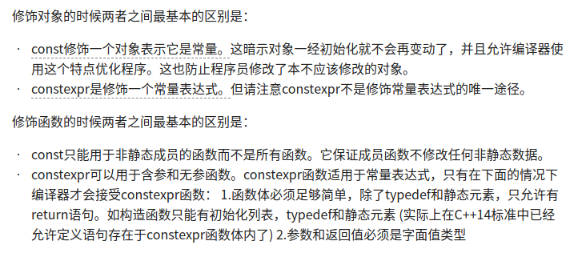
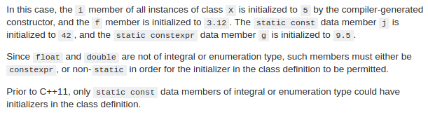

# Tips

1. 模板类实例化
    使用`template class`进行显示实例化
```cpp
template class ClassifyGrPro<pcl::PointXYZI>;
template class ClassifyGrPro<pcl::PointXYZINormal>;
```

2. [C++11中const和constexpr](https://zhuanlan.zhihu.com/p/20206577)
    C＋＋11中新增加了用于指示常量表达式的constexpr关键字,
    


3. c++11中constexpr包含了const含义,non-static data members, static constexpr data members, and static const data members of integral or enumeration type may be initialized in the class declaration.
  ```cpp
  struct X 
  {
      int i=5;
      const float f=3.12f;
      static const int j=42;
      static constexpr float g=9.5f;
  };
  ```


4. [lambda表达式](https://www.cnblogs.com/pzhfei/archive/2013/01/14/lambda_expression.html)
    [Lambda 表达式 (C++11 起) - cppreference.com](https://zh.cppreference.com/w/cpp/language/lambda)
```
[capture](parameters)->return-type{body}
```
如果没有参数,空的圆括号()可以省略.返回值也可以省略,如果函数体只由一条return语句组成或返回类型为void的话.形如:
```
[capture](parameters){body}
```
```cpp
[](int x, int y) { return x + y; } // 隐式返回类型
[](int& x) { ++x; }   // 没有return语句 -> lambda 函数的返回类型是'void'
[]() { ++global_x; }  // 没有参数,仅访问某个全局变量
[]{ ++global_x; }     // 与上一个相同,省略了()
```
Lambda函数可以引用在它之外声明的变量. 这些变量的集合叫做一个闭包. 闭包被定义在Lambda表达式声明中的方括号[]内. 这个机制允许这些变量被按值或按引用捕获:
```cpp
[]        //未定义变量.试图在Lambda内使用任何外部变量都是错误的.
[x, &y]   //x 按值捕获, y 按引用捕获.
[&]       //用到的任何外部变量都隐式按引用捕获
[=]       //用到的任何外部变量都隐式按值捕获
[&, x]    //x显式地按值捕获. 其它变量按引用捕获
[=, &z]   //z按引用捕获. 其它变量按值捕获
```
对this的捕获比较特殊, 它只能按值捕获. this只有当包含它的最靠近它的函数不是静态成员函数时才能被捕获.对protect和priviate成员来说, 这个lambda函数与创建它的成员函数有相同的访问控制. 如果this被捕获了,不管是显式还隐式的,那么它的类的作用域对Lambda函数就是可见的. 访问this的成员不必使用this->语法,可以直接访问.
一个没有指定任何捕获的lambda函数,可以显式转换成一个具有相同声明形式函数指针.所以,像下面这样做是合法的:

```cpp
auto a_lambda_func = [](int x) { /*...*/ };
void(*func_ptr)(int) = a_lambda_func;
func_ptr(4); //calls the lambda.
```


