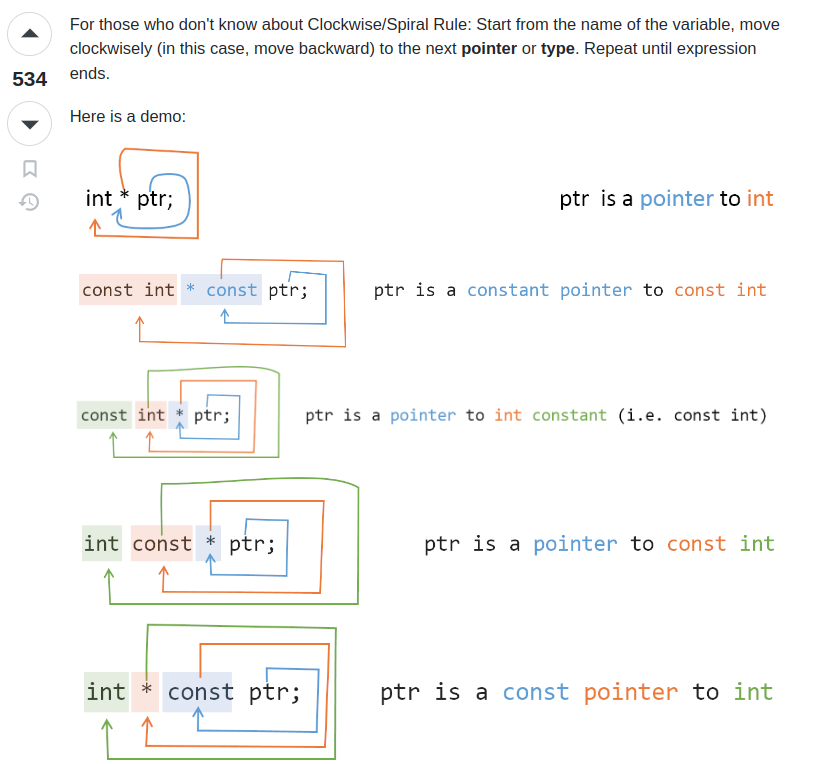
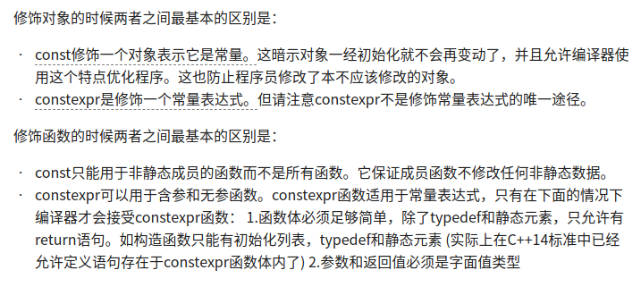
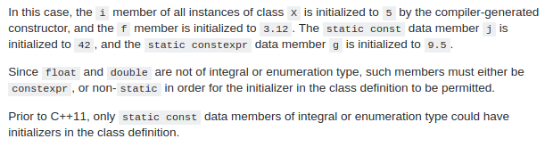
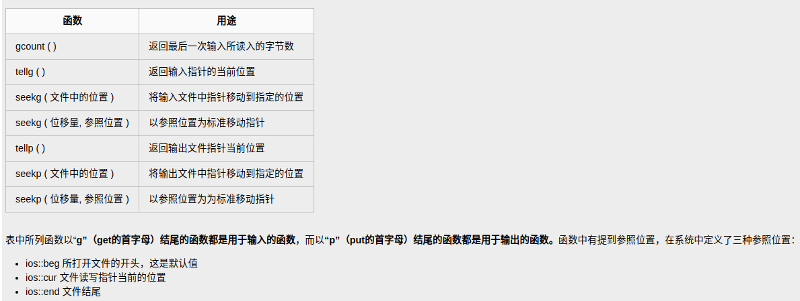
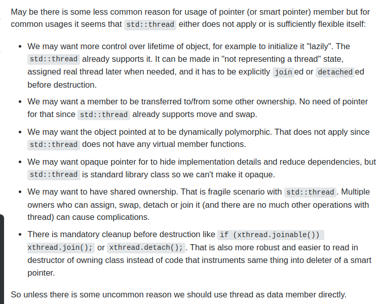

[TOC]

# Tips

### [模板类实例化](https://zhuanlan.zhihu.com/p/77241939)

C++ 的函数模板本质上函数的重载，泛型只是简化了程序员的工作，让这些重载通过编译器来完成。

隐式实例化可能影响效率,所以需要提高效率的显式实例化，显式实例化在编译期间就会生成实例（增加了编译时间）。在**函数模板定义后**，我们可以通过显式实例化的方式告诉编译器生成指定实参的函数。显式实例化声明会阻止隐式实例化。如果我们在显式实例化时，只指定部分模板实参，则指定顺序必须自左至右依次指定，不能越过前参模板形参，直接指定后面的。

函数模板可以做为类的成员函数。

需要注意的是：*函数模板不能用作虚函数*。这是因为 C++编译器在解析类的时候就要确定虚函数表(vtable)的大小，如果允许一个虚函数是函数模板，那么就需要在解析这个类之前扫描所有的代码，找出这个模板成员函数的调用或显式实例化操作，然后才能确定虚函数表的大小，而显然这是不可行的。

函数模板之间、普通函数和模板函数之间可以重载。编译器会根据调用时提供的函数参数，调用能够处理这一类型的最佳匹配版本。在匹配度上，一般按照如下顺序考虑：

+ 最符合函数名和参数类型的普通函数
+ 特殊模板(具有非类型形参的模板，即对T有类型限制)
+ 普通模板(对T没有任何限制)
+ 通过类型转换进行参数模板匹配的重载函数

使用`template class`进行显示实例化

```cpp
template class ClassifyGrPro<pcl::PointXYZI>;
template class ClassifyGrPro<pcl::PointXYZINormal>;
```

**函数模板特化 specialization**

函数模板特化的本质是实例化一个模板，而非重载它。因此，特化不影响编译器函数匹配。

函数模板及其特化版本应该声明在同一个头文件中。所有同名模板的声明应该放在前面，然后是这些模板的特化版本。

程序运行结果和使用函数模板特化相同。但是，使用普通函数重载和使用模板特化还是有不同之处，主要表现在如下两个方面：

（1）如果使用普通重载函数，那么不管是否发生实际的函数调用，都会在目标文件中生成该函数的二进制代码。而如果使用模板的特化版本，除非发生函数调用，否则不会在目标文件中包含特化模板函数的二进制代码。这符合函数模板的“惰性实例化”准则。

（2）如果使用普通重载函数，那么在分离编译模式下，应该在各个源文件中包含重载函数的申明，否则在某些源文件中就会使用模板函数，而不是重载函数。

#### [形参包](https://zh.cppreference.com/w/cpp/language/parameter_pack)

在主类模板中，模板形参包必须是模板形参列表的最后一个形参。在函数模板中，模板参数包可以在列表中稍早出现，只要其后的所有形参均可从函数实参推导或拥有默认实参即可：

```cpp
template<typename... Ts, typename U> struct Invalid; // 错误：Ts.. 不在结尾
 
template<typename ...Ts, typename U, typename=void>
void valid(U, Ts...);     // OK：能推导 U
// void valid(Ts..., U);  // 不能使用：Ts... 在此位置是非推导语境
 
valid(1.0, 1, 2, 3);      // OK：推导 U 为 double，Ts 为 {int,int,int}
```

SFINAE是英文Substitution failure is not an error的缩写，意思是匹配失败不是错误。这句话什么意思呢？当调用模板函数时编译器会根据传入参数推导最合适的模板函数，在这个推导过程中如果某一个或者某几个模板函数推导出来是编译无法通过的，只要有一个可以正确推导出来，那么那几个推导得到的可能产生编译错误的模板函数并不会引发编译错误。

```cpp
struct Test {
    typedef int foo;
};

template <typename T> 
void f(typename T::foo) {} // Definition #1

template <typename T> 
void f(T) {}               // Definition #2

int main() {
    f<Test>(10); // Call #1.
    f<int>(10);  // Call #2. Without error (even though there is no int::foo) thanks to SFINAE.
}
```


### [类模板中静态成员初始化](https://zhuanlan.zhihu.com/p/101898043)

类模板里的静态成员初始化的时候，最前面要加`template<>`

ia 和 da 对象是不同的模板类，因为类型参数是不一致，所以也就是不同的模板类。

```c++
template <class T>
class A
{
private:
    static int count; // 静态成员
public:
    A() { count ++; }
    ~A() { count -- ; };
    A( A & ) { count ++ ; }

    static void PrintCount() { cout << count << endl; } // 静态函数
};

template<> int A<int>::count = 0;    // 初始化
template<> int A<double>::count = 0; // 初始化

int main()
{
    A<int> ia;  
    A<double> da; // da和ia不是相同模板类
    ia.PrintCount(); // 1
    da.PrintCount(); // 1
    return 0;
}
```


### [C++11中const和constexpr](https://zhuanlan.zhihu.com/p/20206577)



[按照顺时针(从变量名开始)来分割](https://c-faq.com/decl/spiral.anderson.html): `char* str[10];`。

C＋＋11中新增加了用于指示常量表达式的constexpr关键字,


c++11中constexpr包含了const含义,non-static data members, static constexpr data members, and static const data members of integral or enumeration type may be initialized in the class declaration.

  ```cpp
  struct X 
  {
      int i=5;
      const float f=3.12f;
      static const int j=42;
      static constexpr float g=9.5f;
  };
  ```


### [lambda表达式](https://www.cnblogs.com/pzhfei/archive/2013/01/14/lambda_expression.html)
[Lambda 表达式 (C++11 起) - cppreference.com](https://zh.cppreference.com/w/cpp/language/lambda)

```
[capture](parameters)->return-type{body}
```
如果没有参数,空的圆括号()可以省略.返回值也可以省略,如果函数体只由一条return语句组成或返回类型为void的话.形如:
```
[capture](parameters){body}
```
```cpp
[](int x, int y) { return x + y; } // 隐式返回类型
[](int& x) { ++x; }   // 没有return语句 -> lambda 函数的返回类型是'void'
[]() { ++global_x; }  // 没有参数,仅访问某个全局变量
[]{ ++global_x; }     // 与上一个相同,省略了()
```
Lambda函数可以引用在它之外声明的变量. 这些变量的集合叫做一个闭包. 闭包被定义在Lambda表达式声明中的方括号[]内. 这个机制允许这些变量被按值或按引用捕获:
```cpp
[]        //未定义变量.试图在Lambda内使用任何外部变量都是错误的.
[x, &y]   //x 按值捕获, y 按引用捕获.
[&]       //用到的任何外部变量都隐式按引用捕获
[=]       //用到的任何外部变量都隐式按值捕获
[&, x]    //x显式地按值捕获. 其它变量按引用捕获
[=, &z]   //z按引用捕获. 其它变量按值捕获
```
对this的捕获比较特殊, 它只能按值捕获. this只有当包含它的最靠近它的函数不是静态成员函数时才能被捕获.对protect和priviate成员来说, 这个lambda函数与创建它的成员函数有相同的访问控制. 如果this被捕获了,不管是显式还隐式的,那么它的类的作用域对Lambda函数就是可见的. 访问this的成员不必使用this->语法,可以直接访问.
一个没有指定任何捕获的lambda函数,可以显式转换成一个具有相同声明形式函数指针.所以,像下面这样做是合法的:

```cpp
auto a_lambda_func = [](int x) { /*...*/ };
void(*func_ptr)(int) = a_lambda_func;
func_ptr(4); //calls the lambda.
```

### [extern的使用](https://www.cnblogs.com/broglie/p/5524932.html)

**extern一般是使用在多文件之间需要共享某些代码**.

- 变量的生明和定义

  一个文件的代码可能需要另一个文件中中定义的变量,定义则负责创建与名字关联的实体，定义还申请存储空间。

  ```cpp
  extern int i;  //声明i
  int j;         //声明并定义i
  ```

  变量能且只能被定义一次，但是可以被声明多次。

+ 多文件共享const对象

  对于const变量不管是声明还是定义都添加extern关键字：

  ```cpp
  //file1.cpp定义并初始化和一个常量，该常量能被其他文件访问
  extern const int bufferSize = function();
  //file.h头文件
  extern const int bufferSize; //与file1.cpp中定义的是同一个
  ```

+ 模板的控制实例化

  当两个或者多个独立编译的源文件中使用了相同的模板并且提供了相同的模板参数时，每个文件中都会有该模板的一个实例。在多个文件中实例化相同的模板的额外开销可能非常严重，在C++11新标准中，我们可以通过显式实例化来避免这种开销。一个显式实例化具有如下形式：

  ```cpp
  extern template declaration; //实例化声明
  template declaration;        //实例化定义
  extern template class vec<string>;       //声明
  template int sum(const int, const int);  //定义
  ```

  当编译器遇到extern模板声明时，它不会在本文件中生成实例化代码，将一个实例化声明为extern就表示承诺在程序的其他位置有该实例化的一个非extern定义。

### [extern “C”的作用详解](https://www.cnblogs.com/carsonzhu/p/5272271.html)

   extern "C"的主要作用就是为了能够正确实现C++代码调用其他C语言代码。加上extern "C"后，会指示编译器这部分代码按C语言（而不是C++）的方式进行编译。由于C++支持函数重载，因此编译器编译函数的过程中会将函数的参数类型也加到编译后的代码中，而不仅仅是函数名；而C语言并不支持函数重载，因此编译C语言代码的函数时不会带上函数的参数类型，一般只包括函数名。

<https://stackoverflow.com/questions/152555/h-or-hpp-for-your-class-definitions>

```cpp
   #ifdef __cplusplus             //告诉编译器，这部分代码按C语言的格式进行编译，而不是C++的
   extern "C"{
   #endif
    
   /*…*/
    
   #ifdef __cplusplus
   }
   #endif
```

   被extern "C"限定的函数或变量是extern类型的, extern是C/C++语言中表明函数和全局变量的作用范围的关键字，该关键字告诉编译器，其申明的函数和变量可以在本模块或其他模块中使用。**extern对应的关键字是static，static表明变量或者函数只能在本模块中使用，因此，被static修饰的变量或者函数不可能被extern C修饰。**

### [文件读写](https://www.cnblogs.com/liaocheng/p/4371796.html)

头文件：#include <fstream>

fstream提供三种类，实现C++对文件的操作

ofstream：写操作，由ostream引申而来

ifstream：读操作，由istream引申而来 

fstream ：同时读写操作，由iostream引申而来 

文件的类型：文本文件 和 二进制文件

写操作：<<,put( ), write( ) 读操作： >> , get( ),getline( ), read( )

#### 文本文件的读写

##### 一次性读写若干个字符

+ 使用运算符<< 和 >>进行读写

  `<< `能实现以行为单位写入文件

  `>>` 不能一行为单位读入内存,总是以空格、Tab、回车结束，而是以单词为单位

+ 使用运算符<<(写)和getline()进行读写

   <<：以行为单位输入文件

   getline()：以行为单位 读入内存，能一次读入一行

   函数原型：istream &getline( char *buffer, streamsize num );

  功能：getline( )函数用于从文件读取num-1个字符到buffer(内存)中，直到下列情况发生时，读取结束:

  - num - 1个字符已经读入
  - 碰到一个换行标志
  - 碰到一个EOF

  `OpenFile.getline(str,20);` // 满足上面3个条件中的一个就返回

  也可使用`std::getline((std::istream&, std::string& str, char delim))`, `std::getline((std::istream&, std::string& str))`

  ```cpp
  bool readPose(const std::string& pose_file, std::vector<unsigned int>& frame_id, std::vector<std::vector<float> >& pose)
  {
    std::ifstream in_file;
    in_file.open(pose_file, std::ifstream::in);
    if (!in_file.is_open())
    {
      std::cout << "\033[0;33m can not open pose file: " << pose_file << "\033[0m" << std::endl;
      return false;
    }
    std::string line;
    while (std::getline(in_file, line))
    {
      if (line.length() == 0)
      {
        continue;  // ignore blank lines
      }
      std::istringstream ss(line);
      std::string str_tmp;
      ss >> str_tmp;
      frame_id.emplace_back(static_cast<unsigned int>(std::stoi(str_tmp)));
      std::vector<float> pose_tmp;
      for (std::size_t j = 0; j < 6; ++j)
      {
        ss >> str_tmp;
        pose_tmp.emplace_back(std::stof(str_tmp));
      }
      pose.emplace_back(pose_tmp);
    }
    in_file.close();
    return true;
  }
  ```

##### 一次读写一个字符

使用get( )和put( )函数

函数声明：istream& get(char &c);

函数功能：使用 get( )函数 把字符1输入到文件

#### 二进制文件的读写

##### 使用read()和write()进行读写

read( ):

功能：从文件中提取 n 个字节数据，写入buf指向的地方中

函数声明：istream &  read ( char * buf ,  int  n ) ;

write( ):

功能：把buf指向的内容取n个字节写入文件

函数声明：ostream & ostream :: write ( char * buf ,  int  n ) ;

该函数遇到空字符时并不停止，因而能够写入完整的类结构,第一个参数一个char型指针（指向内存数据的起始地址），与对象结合使用的时候，要在对象地址之前要char做强制类型转换。

gcount()函数经常和read函数配合使用，用来获得实际读取的字节数。

```cpp
//写文件：二进制存储1234  
　　int writeNum1 = 1;  
　　int writeNum2 = 2;  
　　int writeNum3 = 3;  
　　int writeNum4 = 4;  
    ofstream fout("test.txt", ios::out | ios::binary);  
    fout.write(reinterpret_cast<char *>(&writeNum1), sizeof(int));  
    fout.write(reinterpret_cast<char *>(&writeNum2), sizeof(int));  
    fout.write(reinterpret_cast<char *>(&writeNum3), sizeof(int));  
    fout.write(reinterpret_cast<char *>(&writeNum4), sizeof(int));  
    fout.close();  
ifstream fin("test.txt",ios::in | ios::binary);  

　　if (!fin.good())  

    {  
        cout<<"文件打开错误"<<endl;    
        exit(0);  
    }  
　　int readNum = 0; 
//第一次输出:从第一个数字输出，结果是1 2 3 4  
    fin.seekg(0,ios::beg);  
　　while (fin.peek() != EOF)  
    {  
        fin.read(reinterpret_cast<char*>(&readNum), sizeof(int));  
        cout<<readNum<<" ";  
    }  
```


##### 使用运算符get( ) 和 put( )读写一个字节

get( ) ：在文件中读取一个字节到内存

函数原型：ifstream &get(char ch)

put( ) ：在内存中写入一个字节到文件

函数原型：ofstream &put(char ch)

程序不再使用文件时，为什么要关闭文件:

+ 文件缓冲区是一块小的内存空间
+ 操作系统限制同时打开的文件数量

文件的默认打开方式为文本文件，要是想以二进制的方式处理，在打开时要用 ios::binary 显式声明。针对文本文件操作时，get函数和>>的区别：

+ 在读取数据时，get函数包括空白字符（遇空白字符不停止读取）

+ `>>`在默认情况下拒绝接受空白字符（遇到空白符停止读取）




### [typedef vs define vs using](https://softwareengineering.stackexchange.com/questions/130679/typedefs-and-defines)

A `typedef` is generally preferred unless there's some odd reason that you specifically need a macro. 推荐使用`typedef`，macro做文本替换，typedef给其一个别名。

```cpp
typedef char *char_ptr;
char_ptr a, b;
#define CHAR_PTR char*
CHAR_PTR c, d;
// a, b, and c are all pointers, but d is a char, because the last line expands to:
char *c;
char d;
```

[typydef vs using](https://www.educba.com/c-plus-plus-using-vs-typedef/):

 ‘typedef’  does not work with templates. When it comes to work on non-templates, both ‘using’ and ‘typedef’ perform mechanically the same. 

1. 对于函数指针，`using`更加简洁。
2. 包含模板的别名只能用`using`声明，并且不能出现在class内部
3. `using`更加简洁，适应后期更改
4. `typedef`允许在多个文件使用相同的变量声明相同的类型
5. `typedef`一行可同时声明多个不同类型的别名

```c++
// C++11
using counter = long;
// C++03 equivalent:
// typedef long counter;

// C++11
using func = void(*)(int);
// C++03 equivalent:
// typedef void (*func)(int);
// func can be assigned to a function pointer value
void actual_function(int arg) { /* some code */ }
func fptr = &actual_function;

template<typename T> using ptr = T*; // 模板别名不能在class内部声明
// the name 'ptr<T>' is now an alias for pointer to T
ptr<int> ptr_int;

typedef int X, *ptr, (*Func)(); // “typedef”允许程序员一次声明多个类型，这与“using”语句不同
```


### [#pragma once vs #ifndef](https://blog.csdn.net/WInScar/article/details/7016146)

https://stackoverflow.com/questions/1143936/pragma-once-vs-include-guards

在能够支持这两种方式的编译器上，二者并没有太大的区别，但是两者仍然还是有一些细微的区别。    

方式一：

​    \#ifndef __SOMEFILE_H__
​    \#define __SOMEFILE_H__
​    ... ... // 一些声明语句
​    \#endif

 #ifndef的方式依赖于宏名字不能冲突，这不光可以保证同一个文件不会被包含多次，也能保证内容完全相同的两个文件不会被不小心同时包含。当然，缺点就是如果不同头文件的宏名不小心“撞车”，可能就会导致头文件明明存在，编译器却硬说找不到声明的状况.

方式二：

​    \#pragma once
​    ... ... // 一些声明语句

#pragma once则由编译器提供保证：同一个文件不会被包含多次。注意这里所说的“同一个文件”是指物理上的一个文件，而不是指内容相同的两个文件。带来的好处是，你不必再费劲想个宏名了，当然也就不会出现宏名碰撞引发的奇怪问题。对应的缺点就是如果某个头文件有多份拷贝，本方法不能保证他们不被重复包含。当然，相比宏名碰撞引发的“找不到声明”的问题，重复包含更容易被发现并修正。

方式一 由语言支持所以移植性好，方式二 可以避免名字冲突。


### [write log](https://www.codeproject.com/Questions/97485/how-to-write-log-file-in-C)

```c++
#include <fstream>

void write_text_to_log_file( const std::string &text )
{
    std::ofstream log_file(
        "log_file.txt", std::ios_base::out | std::ios_base::app );
    log_file << text << std::end;
}
```

PS the important bits of logging for when you write your own are:

\- flush after every message - std::endl does that

\- close the file after every message - the fstream destructor does that


### [stl比较](https://www.jianshu.com/p/497843e403b4)

https://www.codercto.com/a/29816.html


### [左值右值std::move, std::forward](<https://www.toutiao.com/i6906371639865655816/?timestamp=1608081119&app=news_article&group_id=6906371639865655816&use_new_style=1&req_id=202012160911580101300361603332C29D>)

std::forward<T>(u)有两个参数：T与 u。 a. 当T为左值引用类型时，u将被转换为T类型的左值； b. 否则u将被转换为T类型右值。

std::move返回的是右值。**右值引用既可以是左值也可以是右值，如果有名称则为左值，否则是右值**。作为函数返回值的 && 是右值，直接声明出来的 && 是左值。

### [虚函数多重继承](<https://blog.csdn.net/haoel/article/details/1948051>)

<https://blog.csdn.net/lihao21/article/details/50688337>

### 虚函数表

<https://blog.csdn.net/haoel/article/details/1948051>

<https://cloud.tencent.com/developer/article/1599283>

vtables是class级别的，一个class的所有实例共用一个vtables.

**1. 每一个基类都会有自己的虚函数表，派生类的虚函数表的数量根据继承的基类的数量来定。**
**2. 派生类的虚函数表的顺序，和继承时的顺序相同。**
**3. 派生类自己的虚函数放在第一个虚函数表的后面，顺序也是和定义时顺序相同。**
**4. 对于派生类如果要覆盖父类中的虚函数，那么会在虚函数表中代替其位置。**

### [Pure Virtual Destructor](https://stackoverflow.com/questions/2089083/pure-virtual-function-with-implementation)

https://www.geeksforgeeks.org/pure-virtual-destructor-c/?ref=lbp

当destructor为纯虚时，需要提供函数体，因为Derived对象析构时会调用Base的析构函数。如果Derived没有显示提供析构函数，编译器会自动生成一个默认的析构函数，所以当Base destructor为纯虚函数时，只是将Base声明为抽象类，而不会影响Derived(Derived不是抽象类)：

```cpp
class Base {
public:
    virtual ~Base() = 0; // Pure virtual destructor
};
Base::~Base() // Explicit destructor call
{
    std::cout << "Pure virtual destructor is called";
}
```

**Why a pure virtual function requires a function body?**

The reason is that destructors (unlike other functions) are not actually ‘overridden’, rather they are always called in the reverse order of the class derivation. This means that a derived class destructor will be invoked first, then the base class destructor will be called. If the definition of the pure virtual destructor is not provided, then what function body will be called during object destruction? Therefore the compiler and linker enforce the existence of a function body for pure virtual destructors. 

c++允许`pure virtual function`提供默认实现，如果要调用，必须显示的调用:

```cpp
class A {
public:
    virtual void f() = 0;
};

void A::f() {
    cout<<"Test"<<endl;
}
class B : public A {

    virtual void f() {
        // class B doesn't have anything special to do for f()
        //  so we'll call A's

        // note that A's declaration of f() would have to be public 
        //  or protected to avoid a compile time problem

        A::f();
    }

};

```

抽象类无法创建对象，[**即使给纯虚函数提供了默认实现**](https://stackoverflow.com/questions/2089083/pure-virtual-function-with-implementation)，也[不能实例化抽象类](https://stackoverflow.com/questions/5131567/why-cant-we-create-an-instance-of-an-abstract-class)：

1. 纯虚函数没有实现
2. 与多态机制相悖，直接实例化抽象类，相应的纯虚函数没有实现，无法建立vtable
3. 抽象类存在的意义是提供统一接口，并不是为了直接使用，实例化抽象类毫无意义；如果需要实例化该类，就不应该声明为纯虚类。

不提供构造函数, 提供的话, 声明为 `protected`；即使提供纯虚函数的默认实现，也不行。
To be clear, you are misunderstanding what = 0; after a virtual function means.

**= 0 means derived classes shold provide an implementation, not that the base class can not provide an implementation.**

[如果Base类所有的virtual函数都提供了默认实现，并且想让Base类是abstract class，又不想Derived class必须override virtural函数，此时可将destructor声明为带有函数体的pure virtual](https://stackoverflow.com/questions/1219607/why-do-we-need-a-pure-virtual-destructor-in-c)。Note that since the compiler will generate an implicit destructor for derived classes, if the class's author does not do so, any derived classes will **not** be abstract. Therefore having the pure virtual destructor in the base class will not make any difference for the derived classes. It will only make the base class abstract.

### [构造析构函数中调用virtual函数](https://stackoverflow.com/questions/962132/calling-virtual-functions-inside-constructors)

Base constructor中调用virtural函数时，只构造了Base类的vpointer(指向vtable)，此时对虚拟方法的调用将最终调用该方法的基本版本或生成一个纯虚拟方法，以防它在该层次结构的该级别没有实现。

[When we call a virtual function in a constructor, the function is overridden only within a base class or a currently created class. Constructors in the derived classes have not yet been called. Therefore, the virtual functions implemented in them will not be called.](https://habr.com/en/company/pvs-studio/blog/591747/)

```cpp
#include <stdio.h>

class A
{
public:
    A() {
        intermediate_call();
    }

    void intermediate_call() {
        // Bad: virtual function call during object construction
        virtual_function();
    }

    virtual void virtual_function() {
        printf("A::virtual_function called\n");
    }

    virtual ~A() {
    }
};

class B : public A
{
public:
    // override virtual function in A
    void virtual_function()
    {
        printf("B::virtual_function called\n");
    }
};

int main(int argc, char **argv)
{
    // Call to virtual_function during construction doesn't
    // behave like normal virtual function call.
    // Print statement shows it invokes A::virtual_function,
    // even though we are constructing an instance of B, not A.
    B myObject;

    // This call behaves like a normal virtual function call.
    // Print statement shows it invokes B::virtual_function.
    myObject.virtual_function();
}
```

### [abstract class destructor be public and virtual](https://leimao.github.io/blog/CPP-Base-Class-Destructors/)


### [thread](https://stackoverflow.com/questions/44832054/storing-an-stdthread-in-c11-smart-pointer)



### 函数重载

**同一作用域内**形参不同的同名函数构成overload函数，不同作用域(派生类包含于基类作用域)，**名字查找优于类型检查**，即使Derived成员函数和Base成员函数的形参列表不同，Base的成员函数也会被隐藏掉：

```cpp
class Base
{
  public:
  void f(const int);
  // void f(int); // 顶层const形参不能形成重载,但是可以通过low-level const来形成重载：g(int&); g(const int&); g(int*); g(const int*)
};
class Derived: public Base
{
  public:
  void f();
};
int main(int argc, char** argv)
{
  Derived d;
  d.f(); // ok
  d.f(10); // error
  d.Base::f(10); // ok
}
```

### [A Guide to Undefined Behavior in C and C++](https://blog.regehr.org/archives/213)

## [unique_ptr, shared_ptr自定义deleter](https://stackoverflow.com/questions/19053351/how-do-i-use-a-custom-deleter-with-a-stdunique-ptr-member)

```c++
template <typename T>
using DeletedUniquePtr = std::unique_ptr<T, std::function<void(T*)>>;
DeletedUniquePtr<apriltag_family>family_ = DeletedUniquePtr<apriltag_family_t>(tagStandard41h12_create(), tagStandard41h12_destroy);

apriltag_family* tagStandard41h12_create();
void tagStandard41h12_destroy(apriltag_family*);
```


## [std::vector<bool>每个元素存储的不是bool变量](https://stackoverflow.com/questions/17794569/why-isnt-vectorbool-a-stl-container/17794965#17794965)

std::vector<bool> v(2, true); 为了空间优化，每个元素只有1 bit

不能直接将元素赋值给bool类型：

```c++
bool* flag = &v[0]; // can't compile
if (v[0] && a > 0) // 不能直接求&&
```


### [template class with virtual functions](https://rivermatrix.com/c-templates-with-virtual-functions/)

c++不允许模板类含有虚函数，C++ expressly forbids virtual template functions because the virtual tables that would have to be built are way too complex. 

难以建立vtable.

`但是Policy Based Design`可以实现该功能，策略模式。
