# Tips for Optimizing
Make the common case fast and the rare case correct.
### Code for corectness first, then optimize
先快速实现功能再优化，特别要优化高频率调用的函数。找到耗时最大的部分，针对其进行优化。
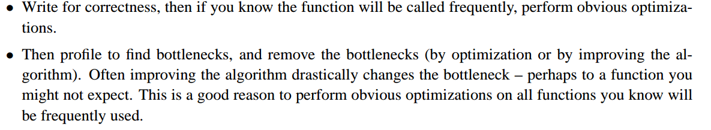

### spend at least twice as long optimizing code as they spend writing code

### Jumps/branches are expensive. Minimize their use whenever possible

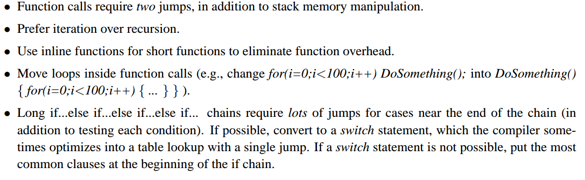
跳转和分支开销很大，尽量少使用：
(1) 函数调用2次跳转+堆栈保存
(2) 使用迭代替代递归调用
(3) 使用inline函数替代短小的函数
(4) 循环内调用函数  --> 函数内循环
(5) 多重if ... else, 对于末尾的case需要多次跳转，使用switch statement替代，或者最常出现的情况放在最上面

### Think about the order of array indices
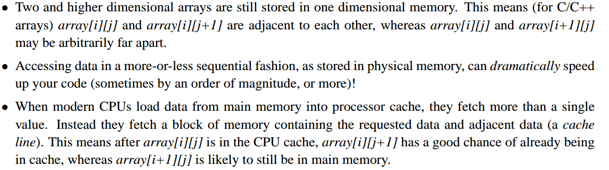
数组索引顺序：
安装数据物理存储方式来访问数据，可以提速一个数量级，甚至更快.

### Think about instruction-level-parallelism
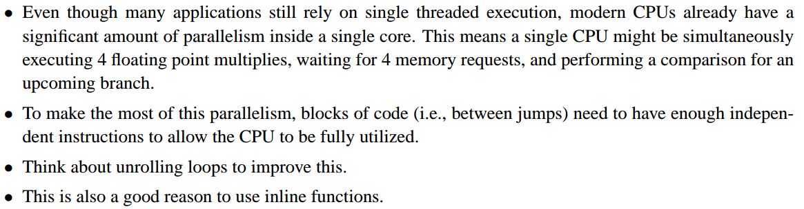
指令级别的并行：
(1) 将循环展开，二重循环，将第二重展开
(2) 使用inline function，自己展开
https://www.geeksforgeeks.org/inline-functions-cpp/
https://isocpp.org/wiki/faq/inline-functions
Remember, inlining is only a request to the compiler, not a command. Compiler can ignore the request for inlining. Compiler may not perform inlining in such circumstances like:
1) If a function contains a loop. (for, while, do-while)
2) If a function contains static variables.
3) If a function is recursive.
4) If a function return type is other than void, and the return statement doesn’t exist in function body.
5) If a function contains switch or goto statement.
inline 函数 类中声明函数不需要(inline), 类外使用inline定义即可。
Inline function and classes:
It is also possible to define the inline function inside the class. In fact, all the functions defined inside the class are implicitly inline. Thus, all the restrictions of inline functions are also applied here. If you need to explicitly declare inline function in the class then just declare the function inside the class and define it outside the class using inline keyword.
For example:

```cpp
class S 
{ public:   
 inline int square(int s) // redundant use of inline     
{         // this function is automatically inline         
   // function body     
} 
};
The above style is considered as a bad programming style. The best programming style is to just write the prototype of function inside the class and specify it as an inline in the function definition.
For example:
class S { public:     
         int square(int s); // declare the function 
        };   
inline int S::square(int s) // use inline prefix 
{   }
```
注意： inline函数的定义(函数体)必须在每个调用的文件中定义，所以一般不要用，除非只用一个文件调用时，比较方便。

### Avoid/reduce the number of local variables

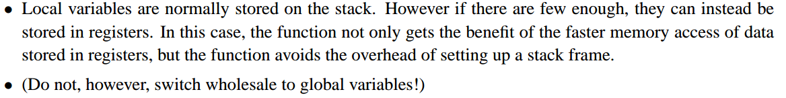
避免或者减少使用局部变量：
local variables一般保存在stack栈，如果足够少，它们将保持在寄存器registers上，这样函数既可以提高数据访问速度，也可以避免保存和恢复堆栈的额外开销。

### Try to avoid casting where possible

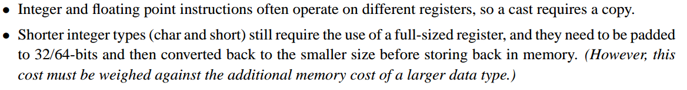
避免类型转换：
(1) int和float 整数和浮点指令通常在不同的寄存器上运行，每次类型转换都需要拷贝一次
(2) 短字节的int, 如char, short, 计算时需要也需要占用整个寄存器，而且需要填充相应的位长，计算后再截取存储到内存，相对于长字节类型变量占用的内存，这种消耗跟大，所以要用std::size_t，对于大块数据，仍然要使用最小的数据类型．

### Be very careful when declaring C++ object variables
Use initialization instead of assignment (Color c(black); is faster than Color c; c = black;).
声明对象变量时：初始化比赋值快,少调用一次赋值函数

### Make default class constructors as lightweight as possible
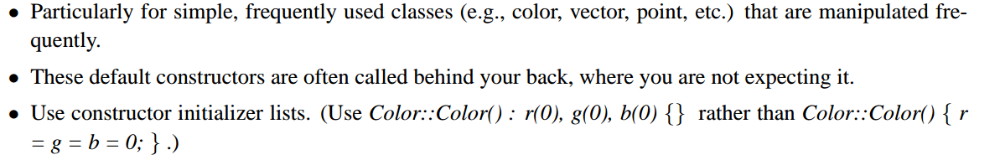
尽量使类的默认构造函数简单：特别是高频率使用的类，使用初始化列表
Use shift operations >> and << instead of integer multiplication and division, where possible.使用位操作，代替整数的乘除法。

### For most classes, use the operators += , -= , *= , and /= , instead of the operators + , - , * , and / .
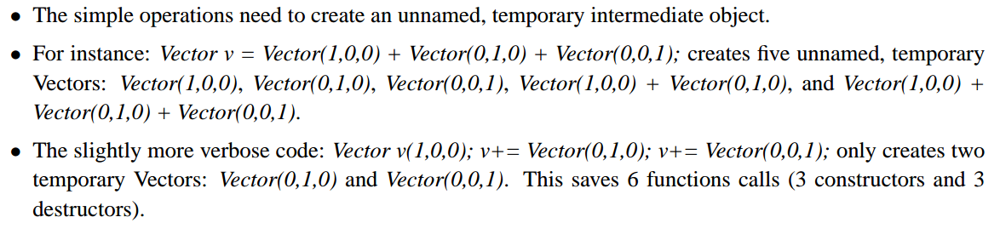

### For basic data types, use the operators + , - , * , and / instead of the operators += , -= , *= , and /= .
[三种+1汇编解析](https://softwareengineering.stackexchange.com/questions/134118/why-are-shortcuts-like-x-y-considered-good-practice)：
Things like "i=i+1", "i+=1" and "++i", although at an abstract level produce the same effect, correspond at low level to a different way of working of the processor.
In particular those three expressions, assuming the i variable resides in the memory address stored in a CPU register (let's name it D - think of it as a "pointer to int") and the ALU of the processor takes a parameter and return a result in an "accumulator" (let's call it A - think to it as an int).
With these constraints (very common in all microprocessors from that period), the translation will most likely be

```cpp
i = i+1;
MOV A,(D); //Move in A the content of the memory whose address is in D
ADD A, 1;  //The addition of an inlined constant
MOV (D) A; //Move the result back to i (this is the '=' of the expression)

i+=1;
ADD (D),1; //Add an inlined constant to a memory address stored value

++i;
INC (D); //Just "tick" a memory located counter
```

### For objects, use the prefix operator (++obj) instead of the postfix operator (obj++)
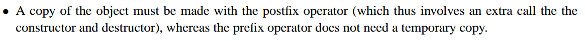

### Avoid dynamic memory allocation during computation
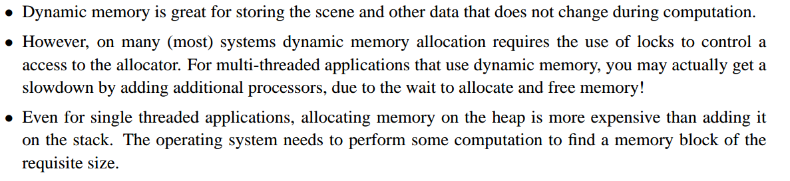

### Try to early loop termination and early function returns

### Simplify your equations on paper
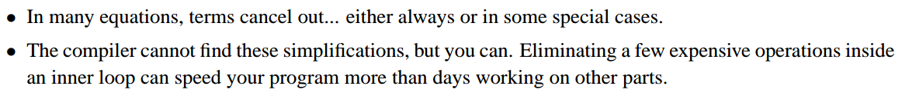


### The difference between math on integers, fixed points, 32-bit floats, and 64-bit doubles is not as big as you might think
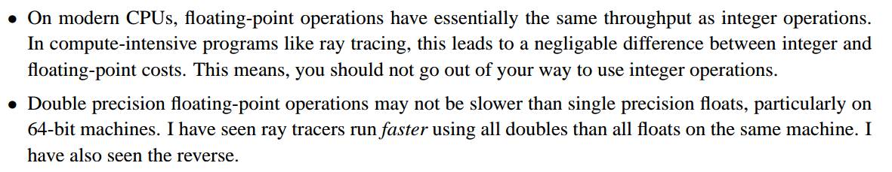

### Consider ways of rephrasing your math to eliminate expensive operations

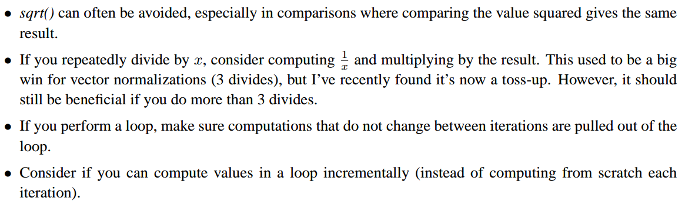


### 将循环展开,循环合并
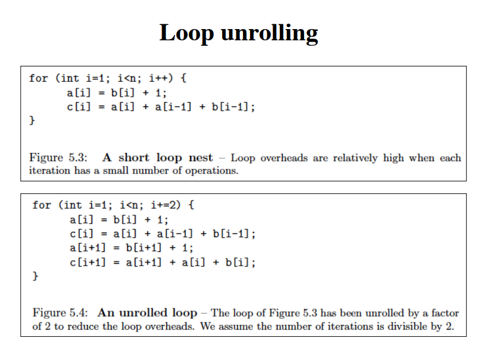

