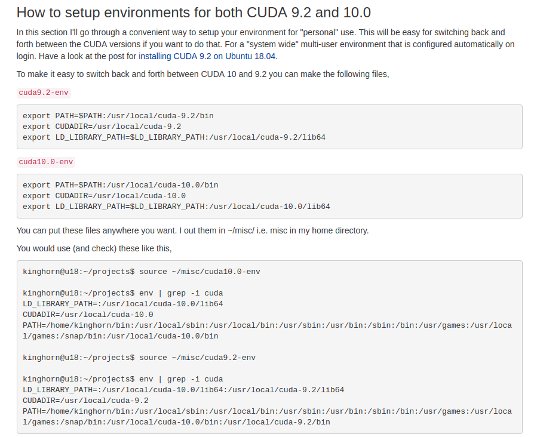

[TOC]

## Install and Uninstall


### [Install](https://www.pugetsystems.com/labs/hpc/How-To-Install-CUDA-10-together-with-9-2-on-Ubuntu-18-04-with-support-for-NVIDIA-20XX-Turing-GPUs-1236/)



### [install nvidia driver](https://gist.github.com/wangruohui/df039f0dc434d6486f5d4d098aa52d07#download-the-driver)
```sh
sudo apt-get purge nvidia-\*
# Recommended if .deb files from NVIDIA were installed
# Change 1404 to the exact system version or use tab autocompletion
# After executing this file, /etc/apt/sources.list.d should contain no files related to nvidia or cuda
sudo dpkg -P cuda-repo-ubuntu1604

#Create a file at /etc/modprobe.d/blacklist-nouveau.conf with the following contents:
blacklist nouveau
options nouveau modeset=0

sudo update-initramfs -u
sudo reboot
Ctl + Alt + F2
sudo service lightdm stop
chmod +x NVIDIA-Linux-x86_64-384.69.run
sudo ./NVIDIA-Linux-x86_64-384.69.run --dkms -s
```


### uninstall

#### [自动卸载](https://docs.nvidia.com/cuda/cuda-installation-guide-linux/index.html#runfile-uninstallation)

+ To uninstall the CUDA Toolkit, run the uninstallation script provided in the bin directory of the toolkit. By default, it is located in /usr/local/cuda-10.1/bin:

  ```sh
  sudo /usr/local/cuda-10.1/bin/cuda-uninstaller
  ```

+ To uninstall the NVIDIA Driver, run nvidia-uninstall:

  ```sh
  sudo /usr/bin/nvidia-uninstall
  ```

#### [手动卸载](https://docs.nvidia.com/cuda/cuda-installation-guide-linux/index.html#handle-uninstallation)

+ Use the following command to uninstall a Toolkit runfile installation:

  ```sh
  sudo /usr/local/cuda-X.Y/bin/uninstall_cuda_X.Y.pl
  ```

+ Use the following command to uninstall a Driver runfile installation:

  ```sh
  sudo /usr/bin/nvidia-uninstall
  ```

+ Use the following commands to uninstall a RPM/Deb installation:

  ```sh
  sudo apt-get --purge remove <package_name>          # Ubuntu
  ```


