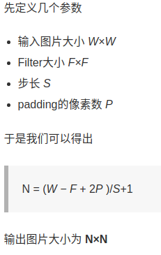
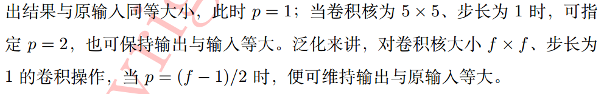
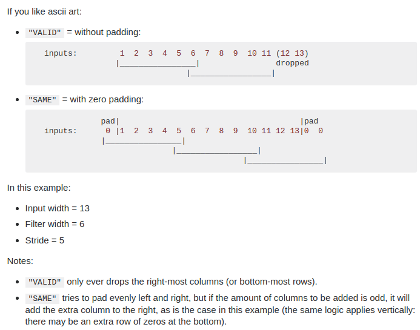

# Network

## Common Sence

+ 卷积后输出图片尺寸
  
  

+ [padding=valid, same](https://stackoverflow.com/questions/37674306/what-is-the-difference-between-same-and-valid-padding-in-tf-nn-max-pool-of-t)
  
  VALID: Filter window stays at valid position inside input map, so output size shrinks by `filter_size - 1`. No padding occurs.从输入map的有效位置开始filter,一般丢弃最右边的列或者最下面的行,不进行填充
  SAME: output size is the same as input size. This requires the filter window to slip outside input map, hence the need to pad.使得输出和输入的size相同，需要进行填充，左右对称填充，如果列数不够，那么就在右边填充一个。

## RNN

### [LSTM: long short term memory networkd](http://colah.github.io/posts/2015-08-Understanding-LSTMs/)

传统RNN不能够处理`long-term dependencies`,但是LSTM可以

+ [classification and regression](https://machinelearningmastery.com/classification-versus-regression-in-machine-learning/)

  Classification predictive modeling problems are different from regression predictive modeling problems.

  + Classification is the task of predicting a discrete class label.
  + Regression is the task of predicting a continuous quantity.

  There is some overlap between the algorithms for classification and regression; for example:

  + A classification algorithm may predict a continuous value, but the continuous value is in the form of a probability for a class label.
  + A regression algorithm may predict a discrete value, but the discrete value in the form of an integer quantity.

