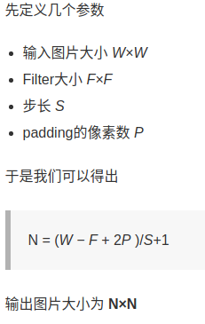
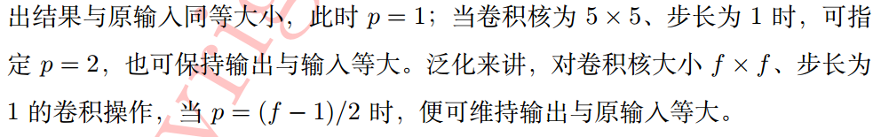

# Network

## Common Sence
+ 卷积后输出图片尺寸
  
  

+ [padding=valid, same](https://stackoverflow.com/questions/37674306/what-is-the-difference-between-same-and-valid-padding-in-tf-nn-max-pool-of-t)
  
  VALID: Filter window stays at valid position inside input map, so output size shrinks by `filter_size - 1`. No padding occurs.从输入map的有效位置开始filter,一般丢弃最右边的列或者最下面的行,不进行填充
  SAME: output size is the same as input size. This requires the filter window to slip outside input map, hence the need to pad.使得输出和输入的size相同，需要进行填充，左右对称填充，如果列数不够，那么就在右边填充一个。