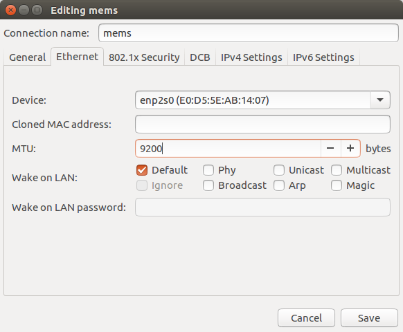
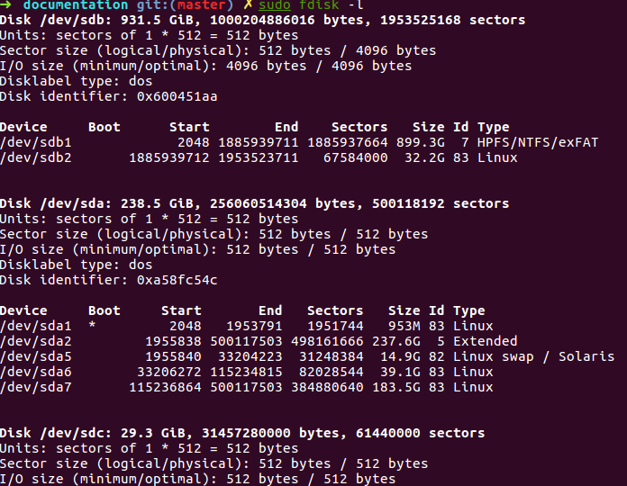

[TOC]

## [wps问题](https://my.oschina.net/renwofei423/blog/635798)

+ 字体修复
  解压该文件运行`./font.sh`
  [wps_symbol_fonts.tar.gz](img/a783cdb9.gz)

+ [无法输入中文](https://blog.csdn.net/wf19930209/article/details/78481589)
```sh
#! /bin/bash
#------------------------------------------------------------------------------
# Filename:    chineseInputForWPS.sh
# Usage:       ./chineseInputForWPS.sh
# Version:     1.0
# Date:        2017-31-05
# Author:      vincent
# Email:       N/A
# Description: N/A
# Notes:       N/A
#-------------------------------------------------------------------------------

declare XMODIFIERS='export XMODIFIERS="@im=fcitx"'
declare QT_IM_MODULE='export QT_IM_MODULE="fcitx"'
declare wpsPath="/usr/bin/wps"
declare wppPath="/usr/bin/wpp"
declare etPath="/usr/bin/et"

outputMsg()
{
    if [ $1 -ne 0 ]
    then
        echo "unsuccessful !!"
        exit
    fi
}
sudo sed -i "2i$XMODIFIERS" $wpsPath
outputMsg $?
sudo sed -i "2i$QT_IM_MODULE" $wpsPath
outputMsg $?

sudo sed -i "2i$XMODIFIERS" $wppPath
outputMsg $?
sudo sed -i "2i$QT_IM_MODULE" $wppPath
outputMsg $?

sudo sed -i "2i$XMODIFIERS" $etPath
outputMsg $?
sudo sed -i "2i$QT_IM_MODULE" $etPath
outputMsg $?

echo "Successful! You can do it!"

exit 0

```

## [将launcher放置在屏幕下方](https://www.howtogeek.com/251616/how-to-move-the-unity-desktops-launcher-to-the-bottom-of-your-screen-on-ubuntu-16.04/)

```
gsettings set com.canonical.Unity.Launcher launcher-position Bottom
```

## [硬盘自动挂载](https://www.jianshu.com/p/ec5579ef15a6)

[permissions - How do I use 'chmod' on an NTFS (or FAT32) partition? - Ask Ubuntu](https://askubuntu.com/questions/11840/how-do-i-use-chmod-on-an-ntfs-or-fat32-partition)
`<file system> <mount point>   <type>  <options>       <dump>  <pass>`

`UUID=5782ABAE11211E6E /media/robosense            ntfs    defaults              0       0
`
(1) 分区设备文件名或UUID
查看所有分区设备的UUID：
`ls -l /dev/disk/by-uuid/ `
(2) 挂载点
(3) 文件系统名称
(4) 挂载参数，挂载权限
(5) 指定分区是否被dump备份，0代表不备份，1代表每天备份，2代表不定期备份。
(6) 指定分区是否被fsck检测，0代表不检测，其他数字代 Bcast:10.10.10.255  Mask:255.255.255.0
​          inet6 addr: fe80::fba:2afe:acad:7d0d/64 Scope:Link
​          UP BROADCAST RUNNING MULTICAST  MTU:1500  Metric:1
​          RX packets:2041 errors:0 dropped:0 overruns:0 frame:0
​          TX packets:1025 errors:0 dropp表检测的优先级，比如1的优先级比2高。根目录所在的分区的优先级为1，其他分区的优先级为大于或等于2

+ [挂载远程共享盘](https://my.oschina.net/u/4376994/blog/4191549)

  ```sh
  sudo mount -t cifs -o username="xshen@robosense.cn",passwd="Andysen211" //192.168.1.27/calibration /home/robosense/share
  ```


## 设置mtu
[sudo ethtool -s em1 autoneg off speed 100 duplex full](https://www.garron.me/en/linux/ubuntu-network-speed-duplex-lan.html)
The MTU is specified in terms of bytes or octets of the largest protocol data unit that the layer can pass onwards. ... For example, with Ethernet, the maximum frame size is 1518 bytes, 18 bytes of which are overhead (header and FCS), resulting in an MTU of 1500 bytes.
(1) 使用命令设置，但是每次重启后需要重新设置

```sh
ifconfig ${Interface} mtu ${SIZE} up
ifconfig eth1 mtu 9000 up
```
[Note this will only work if supported by both the network nterface card and the network components such as switch.](https://www.cyberciti.biz/faq/centos-rhel-redhat-fedora-debian-linux-mtu-size/)
(2)将特定的ip链接的mtu值设为期望值，可永久有效
直接在`Edit Connections ...`中修改相应链接的mtu值，保存以后就可以不用再设置了。



一般电脑支持mtu值为9000,有些配置好一些的电脑能设置为9200
(3)[将设置写入系统文件dhclient.conf](https://stackoverflow.com/questions/26179699/how-to-change-mtu-setting-permanently)中，可永久有效，但是自动ip链接时会出现问题
将一下内容写入/etc/dhcp/dhclient.conf

```
default interface-mtu 9000;
supercede interface-mtu 9000;
```
(4)将对应网段的mtu设为期望值
[microHOWTO: Change the MTU of an network interface using DHCP](http://www.microhowto.info/howto/change_the_mtu_of_a_network_interface_using_dhcp.html)
我们lidar的网段为192.168.1.0
/etc/dhcp/dhclient.conf

```
subnet 192.168.1.0 netmask 255.255.255.0 {
  option broadcast-address 192.168.0.255;
  option interface-mtu 9000;
}
```

(4)[修改系统文件/etc/network/interfaces](<http://www.361way.com/linux-mtu-jumbo-frames/4055.html>)

```sh
# vi /etc/network/interfaces
#增加如下值
mtu 9000
#保存后，重启网络生效
# /etc/init.d/networking restart
```


## [网络参数](<https://www.huaweicloud.com/articles/b70d6b86bd26a487a9fb87f930949e26.html>)

<https://blog.51cto.com/nosmoking/1684114>

<https://segmentfault.com/a/1190000000473365>

设置网路参数

```sh
# two parameters: parameter name, parameter value
function setNetworkParameter() 
{
  if [ $# -ne 2 ]; then
    return 1
  fi
  if grep -o $1 /etc/sysctl.conf >/dev/null; then
    old_value=$(grep $1 /etc/sysctl.conf | awk '{ print $3 }')
    echo $old_value

    #if [ $old_value -lt $2 ]
    if [ $old_value -ne $2 ]; then
      sudo sed -i -e "/$1 = /s/$old_value/$2/" /etc/sysctl.conf
      echo "set $1 to $2 instead of $old_value"
    fi
  else
    sudo sh -c "echo '$1 = $2' >> /etc/sysctl.conf"
    echo "set $1 to $2"
  fi
  return 0
}

# set network buffer to 180M(188743680)
declare -a network_param_name=(net.core.rmem_default net.core.wmem_default net.core.rmem_max net.core.wmem_max net.ipv4.tcp_keepalive_time net.ipv4.tcp_keepalive_intvl net.ipv4.tcp_keepalive_probes)
declare -a network_param_value=(94371840 94371840 188743680 188743680 30 10 3)
for ((i = 0; i < ${#network_param_name[@]}; i++)); do
  setNetworkParameter ${network_param_name[i]} ${network_param_value[i]}
done
# mtu
if grep -o "mtu" /etc/network/interfaces >/dev/null; then
    old_value=$(grep "mtu" /etc/network/interfaces | awk '{ print $2 }')
    echo $old_value

    if [ $old_value -lt 9000 ]; then
      sudo sed -i -e "/mtu /s/$old_value/9000/" /etc/network/interfaces
      echo "set mtu to 9000 instead of $old_value"
    fi
  else
    sudo sh -c "echo 'mtu 9000' >> /etc/network/interfaces"
    echo "set mtu to 9000"
  fi
```


## 文件系统

### [改变ntfs文件系统中文件和路径的权限](https://askubuntu.com/questions/11840/how-do-i-use-chmod-on-an-ntfs-or-fat32-partition)

I have a script that I need to execute on an NTFS partition. The script's permission is set to 600.
I attempted to modify the permissions by running chmod 755 script.sh, which doesn't report a failure or anything - but it also doesn't change the permissions on the file。
The mode is determined by the partition's mount options (you cannot change it via chmod).其权限是挂载时确定的，不能使用`chmod`命令来修改。

+ [fat32, exFAT, NTFS](https://www.howtogeek.com/235596/whats-the-difference-between-fat32-exfat-and-ntfs/)

  - NT File System (NTFS)

    NTFS是较新的文件系统，也是windows的默认文件系统，其对文件大小和分区大小几乎没有限制，但是对mac os和linux系统支持较差，Use it for your Windows system drive and other internal drives that will just be used with Windows.

  - File Allocation Table 32 (FAT32)

    FAT32是windows较老的文件系统，一般的Flash drives为FAT32，Works with all versions of Windows, Mac, Linux, game consoles, and practically anything with a USB port.4 GB maximum file size, 8 TB maximum partition size.Use it on removable drives where you need maximum compatibility with the widest range of devices, assuming you don’t have any files 4 GB or larger in size.

  - Extended File Allocation Table (exFAT)

    2006年提出，像FAT32一样是一个轻量级的文件系统，没有NTFS过重的head,也没有FAT32的文件大小限制，While exFAT doesn’t quite match FAT32’s compatibility, it is more widely-compatible than NTFS. 

    Use it when you need bigger file size and partition limits than FAT32 offers and when you need more compatibility than NTFS offers. Assuming that every device you want to use the drive with supports exFAT, you should format your device with exFAT instead of FAT32.


## [uninstall `make install` software](https://stackoverflow.com/questions/1439950/whats-the-opposite-of-make-install-i-e-how-do-you-uninstall-a-library-in-li)

(1)如果比较幸运，软件作者提供了uninstall命令，那么：
```sh
sudo make uninstall
```
(2)如果有`install_manifest.txt`，该文件在`build`文件夹下，列出了安装到系统的文件清单，直接将这些文件删除即可。


## [boot is full删除boot中旧的kernel](https://askubuntu.com/questions/574013/safely-remove-old-files-in-boot)

  ```sh
  uname -a # list which kernel you are running
  sudo apt-get remove --purge linux-image-3.11.0-XX-generic 
  ```

  Where linux-image-XXX should accordingly be filled in with the kernel version you want to delete.

## [U盘设置为exFAT格式](https://appuals.com/how-to-format-a-drive-as-exfat-on-linux/)

  exFAT没有文件大小和扇区大小限制，而且适用于多操作系统。

  - ubuntu需要安装支持exFAT

    ```sh
    sudo apt-get install exfat-fuse exfat-utils
    ```

  - 找到对应的盘符

    ```sh
    sudo fdisk -l # 下面以/dev/sdc为例
    ```

    

  - 清空所有内容 `sudo wipefs -a /dev/sdc`

  - 开始进行格式设置 `sudo fdisk/dev/sdc`

    当不清楚输入什么命令时，可输入`m`查看命令提示

    - `n`表示添加一个新的partition;
    - 扇区类型选择默认(p primary)
    - Partition number, First sector, Last sector都回车选择默认
    - `t`修改文件系统类型，输入`7`HPSF/NTFS/exFAT
    - `w`保存并退出

  - 设置分区label

    ```sh
    sudo mkfs.exfat -n xshen /dev/sdc1
    ```

  - 查看是否设置成功

    ```sh
    sudo fsck.exfat /dev/sdc1
    ```


## 打开文件夹命名nautilus

[Glib error](https://askubuntu.com/questions/788182/nautilus-not-opening-up-showing-glib-error)

```sh
sudo killall nautilus && (nautilus &)
```


## [usrname  is not in the sudoers file解决方法](https://www.linuxidc.com/Linux/2010-12/30386.htm)

```sh
su -
chmod u+w /etc/sudoers
gedit /etc/sudoers
添加一行：
sti ALL=(ALL) ALL
chmod u-w /etc/sudoers
```


## [使用std::thread undefined reference to symbol 'pthread_create@@GLIBC_2.2.5'](https://github.com/facebook/Surround360/issues/3)

```cmake
SET(CMAKE_CXX_FLAGS "${CMAKE_CXX_FLAGS} -std=c++11 -pthread")
```


## pcap [tcpdump permissions problem](https://askubuntu.com/questions/530920/tcpdump-permissions-problem)

```sh
sudo groupadd pcap
sudo usermod -a -G pcap $USER
sudo chgrp pcap /usr/sbin/tcpdump
sudo chmod 750 /usr/sbin/tcpdump

sudo setcap cap_net_raw,cap_net_admin=eip xxxx #xxxx为可执行程序
```

https://unix.stackexchange.com/questions/189750/how-can-i-run-script-without-root-to-sniff-network-libpcap


## [延迟截屏 ](<https://www.kutu66.com/ubuntu/article_160532>)

```sh
gnome-screenshot -w --delay=5
```


## [用户获取ttyusb0权限](<https://askubuntu.com/questions/133235/how-do-i-allow-non-root-access-to-ttyusb0>)

The device is most likely attached to user group `dialout`. Just add your user to the dialout group so you have appropriate permissions on the device.

```sh
sudo usermod -a -G dialout $USER
```

You may need to logout and back in for the new group to take effect.

### [USB udev-rules](<https://linuxconfig.org/tutorial-on-how-to-write-basic-udev-rules-in-linux>)

<http://www.clearpathrobotics.com/assets/guides/kinetic/ros/Udev%20Rules.html>

```sh
rule_file="/home/robosense/Project/calibration_ws/lidar_camera/mems/install_shell/80-hahahha.rules"

echo "KERNEL==\"ttyUSB[0-9]*\", SUBSYSTEMS==\"usb\", ATTRS{idVendor}==\"0403\", ATTRS{idProduct}==\"6001\", MODE:=\"0666\", SYMLINK+="redlayUSB"" | sudo tee -a ${rule_file}

```


## [linux, window下乱码问题](<https://blog.csdn.net/edward_zcl/article/details/80180979>)

最简单的方法是使用vim打开。

`:set fileencoding=utf-8`