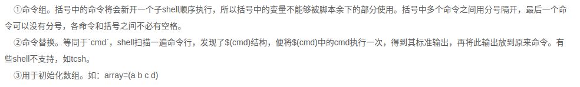
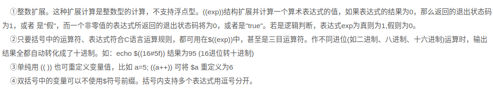
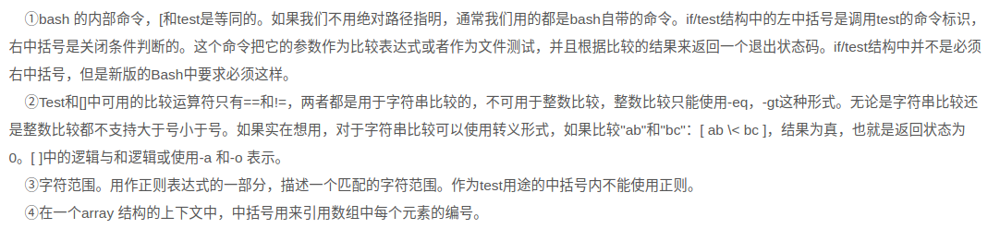
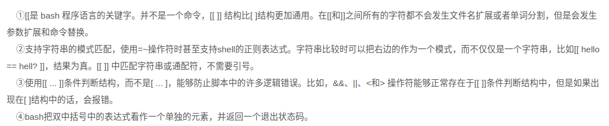
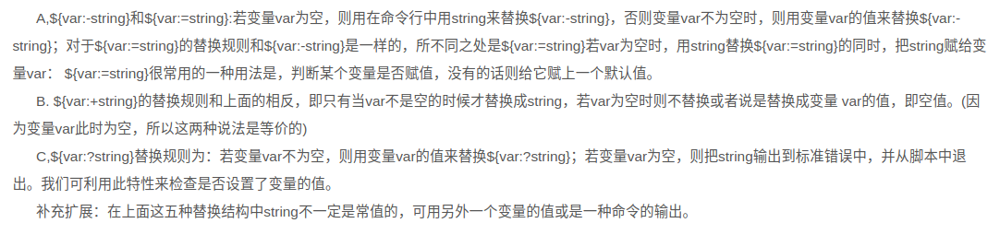
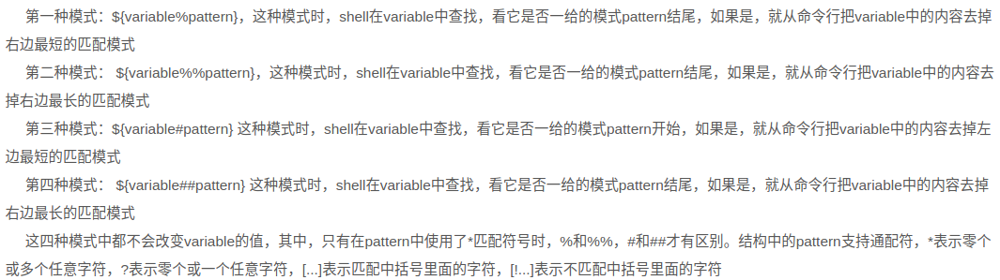
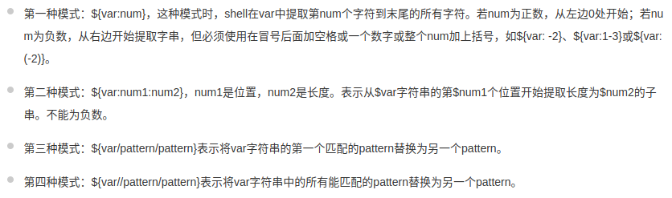
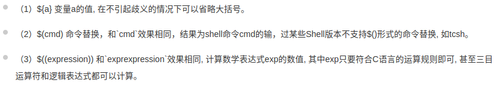
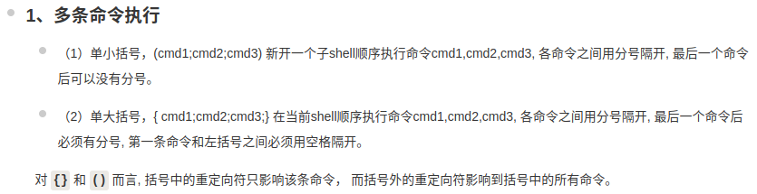
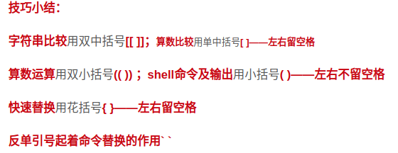

[TOC]


# Shell Command

### [`Shell特殊变量：Shell $0, $#, $*, $@, $?, $和命令行参数`](https://blog.csdn.net/u011341352/article/details/53215180)

变量     含义  
`$0 `     当前脚本的文件名  
`$n`      传递给脚本或函数的参数。n 是一个数字，表示第几个参数。例如，第一个参数是`$1`，第二个参数是`$2`。  
`$#`      传递给脚本或函数的参数个数。  
`$*`      传递给脚本或函数的所有参数。  
`$@ `     传递给脚本或函数的所有参数。被双引号(" ")包含时，与 \$* 稍有不同，下面将会讲到。  
`\$?`      上个命令的退出状态，或函数的返回值。一般情况下，大部分命令执行成功会返回 0，失败返回 1。  
`$$`      当前Shell进程ID。对于 Shell 脚本，就是这些脚本所在的进程ID。

### 软连接ln -s src_obj dst_obj

删除rm dst_obj

此处的src_obj的路径可以是绝对路径，如果是相对路径，是相对于dst_obj的地址


### 压缩

  ```sh
  tar -czvf ***.tar.gz    
  tar -cjvf ***.tar.bz2
  ```
### 解压

  ```sh
  tar -xzvf ***.tar.gz     
  tar -xjvf ***.tar.bz2
  ```
### [zip](https://blog.csdn.net/zs520ct/article/details/72935141)

unzip -d /temp test.zip

### apt-get

`sudo apt-get upgrade` 进行系统升级  
`sudo apt-get update` 更新本地软件信息库  
`sudo apt-cache search softname1 softname2 ...` 搜索软件包


### 终端命令

  * `ctrl+b`: 前移一个字符(backward)
  * `ctrl+f`: 后移一个字符(forward)
  * `alt+b`: 前移一个单词
  * `alt+f`: 后移一个单词
  * `ctrl+a`: 移到行首（a是首字母） 
  * `ctrl+e`: 移到行尾（end）
  * `ctrl+x`: 行首到当前光标替换
  * `alt+.`: 粘帖最后一次命令最后的参数（通常用于`mkdir long-long-dir`后, `cd`配合着`alt+.`）
  * `alt+d`: 删除当前光标到临近右边单词开始(delete)
  * `ctrl+w`: 删除当前光标到临近左边单词结束(word)
  * `ctrl+h`: 删除光标前一个字符（相当于backspace）
  * `ctrl+d`: 删除光标后一个字符（相当于delete）
  * `ctrl+u`: 删除光标左边所有
  * `ctrl+k`: 删除光标右边所有
  * `ctrl+l`: 清屏
  * `ctrl+shift+c`: 复制（相当于鼠标左键拖拽）
  * `ctrl+shift+v`: 粘贴（相当于鼠标中键）
  * `ctrl+n`: 下一条命令
  * `ctrl+p`: 上一条命令
  * `alt+n`: 下一条命令（例如输入`ls`, 然后按'alt+n', 就会找到历史记录下的`ls`命令）
  * `alt+p`: 上一条命令（跟`alt+n`相似）
  * `shift+PageUp`: 向上翻页
  * `shift+PageDown`: 向下翻页
  * `ctrl+r`: 进入历史查找命令记录， 输入关键字。 多次按返回下一个匹配项
  * `F2/Alt+Enter` 给文件重命名


### 查看ubuntu信息

+ 显卡: lspci | grep VGA
+ IP: ip addr show (eth1)
+ ubuntu版本: cat /etc/issue  
   sudo lsb_release -a
+ 查看系统位数： getconf LONG_BIT
+ 查看CPU架构：
+ cuda版本: ncvv -V
  cat /usr/local/cuda/version.txt
  查看cudnn版本
  cat /usr/local/cuda/include/cudnn.h | grep CUDNN_MAJOR -A 2
+ boost版本: dpkg -s libboost-dev | grep 'Version'
+ 查看网卡端口： ethtool enp3s0   
+ 查看nvidia驱动版本：　nvidia-smi
+ 查看磁盘空间
  df -hl 磁盘剩余空间
  df -h 查看每一个根路径的分区大小
  du -sh [目录名] 返回该目录的大小
  du -sm [文件名] 返回该文件大小M
+ [查看文件夹下文件及目录的数目](http://blog.sina.com.cn/s/blog_464f6dba01012vwv.html)
  统计某文件夹下文件的个数：ls -l |grep "^-"|wc -l
  统计某文件夹下目录的个数
  ls -l |grep "^ｄ"|wc -l
  统计文件夹下文件的个数，包括子文件夹里的
  ls -lR|grep "^-"|wc -l
  如统计/home/han目录(包含子目录)下的所有js文件则：
  ls -lR /home/han|grep js|wc -l 或 ls -l "/home/han"|grep "js"|wc -l
  统计文件夹下目录的个数，包括子文件夹里的
  ls -lR|grep "^d"|wc -l
  如果只查看文件夹
  ls -d  只能显示一个.
  find -type d    可以看到子文件夹
  ls -lF |grep /    或 ls -l |grep '^d'  只看当前目录下的文件夹，不包括往下的文件夹

+ How to find Linux kernel version
```sh
uname -r
uname -a
cat /proc/version
dmesg | grep Linux
```


### ｕ盘格式化和重命名

+ [格式化](http://blog.csdn.net/huanghuibo/article/details/6721191)
  - 查看所有硬盘设备信息   
  ```
  sudo fdisk -l
  ```

  - 卸载u盘
  ```
  sudo umount /dev/sdc
  ```

  - 格式化
  ```
  sudo mkfs.vfat /dev/sdc
  ```
  如果u盘做过镜像，那么u盘中会有一个隐藏分区，此时需要卸载和格式化２个分区
  ```
  sudo umount /dev/sdc
  sudo umount /dev/sdc4
  sudo mkfs.vfat /dev/sdc4
  sudo mkfs.vfat -I /dev/sdc 
  ```
+ [重命名](http://blog.sina.com.cn/s/blog_446cc66b01017xlq.html)
  - `sudo nano /etc/mtools.conf`，在该文件中添加`mtools_skip_check=1`
  - `sudo mlabel -i /dev/sdc ::xshen`
  - `sudo eject /dec/sdc`


### [判断文件或文件夹是否存在 ](https://www.cnblogs.com/emanlee/p/3583769.html)

+ mv    
  mv fromfile tofile

+ raname    
  rename [ -v ][ -n ] [ -f ] perlexpr [ files ]

+ 正则表达式

+ https://blog.51cto.com/racoguo/1288016

  ```sh
   -a ：文件存在
  
     -b ：文件存在并且是一块特殊文件
  
     -c ：文件存在并且是一个字符特殊文件.
  
     -d ：文件存在并且是一个目录
  
     -e ：文件存在（如 -a 一样）
  
     -f ：文件存在并且是一个普通文件
  
     -L ：文件存在并且是符号链接.
  
     -n ：字符串长度不为零.
  
     -s ：文件已存在，并且大小大于零.
  
     -w ：文件存在并且是由当前进程可写.
  
     -x ：文件存在并且是可执行的过程.
  
     -z ：字符串的长度是零
  ```


### 计算文件夹中的文件数

```sh
ls -lR| grep "^d" | wc -l
```


### 获得当前脚本的绝对路径
BASH_SOURCE[0] 等价于 BASH_SOURCE， 取得当前执行的shell文件所在的路径及文件名。
如/home/abc/test.sh 内容如下：

  ```sh
  #!/bin/sh
  echo "${BASH_SOURCE[0]}"
  echo "${BASH_SOURCE]}"
  echo "$( dirname "${BASH_SOURCE[0]}" )"
  DIR="$( cd "$( dirname "${BASH_SOURCE[0]}" )" && pwd )"
  echo $DIR
  ```
若当前目录在/home/,执行source ./abc/test.sh, 则输出：
./abc/test.sh
./abc/test.sh
./abc/
/home/abc
总之：
DIR="$( cd "$( dirname "${BASH_SOURCE[0]}" )" && pwd )" 得到shell脚本文件所在完整路径（绝对路径）及文件名（无论source,sh,.三种调用方式），且不改变shell的当前目录。


###[更新某个软件](https://askubuntu.com/questions/656545/how-to-update-an-individual-app-through-terminal)
`sudo apt-get dist-upgrade firefox` or `sudo apt-get upgrade firefox`


### convert命令将图片转换为gif
`convert -delay 80 -loop 0 vim_h1.png vim_h2.png vim_h3.png vim_h.gif`

### 获取使用sudo命令的用户名
`${SUDO_USER}`

+ 获取用户名
  `myvariable=$(whoami)`
  `myvariable=$USER`


### [判断命令是否正常](https://unix.stackexchange.com/questions/22726/how-to-conditionally-do-something-if-a-command-succeeded-or-failed)

```sh
if command ; then
    echo "Command succeeded"
else
    echo "Command failed"
fi
```
此处直接使用命令，无需用`[ ]`将命令包含


### [while](https://stackoverflow.com/questions/15534595/bash-scripting-multiple-conditions-in-while-loop)

```sh
# Single POSIX test command with -o operator (not recommended anymore).
# Quotes strongly recommended to guard against empty or undefined variables.
while [ "$stats" -gt 300 -o "$stats" -eq 0 ]

# Two POSIX test commands joined in a list with ||.
# Quotes strongly recommended to guard against empty or undefined variables.
while [ "$stats" -gt 300 ] || [ "$stats" -eq 0 ]

# Two bash conditional expressions joined in a list with ||.
while [[ $stats -gt 300 ]] || [[ $stats -eq 0 ]]

# A single bash conditional expression with the || operator.
while [[ $stats -gt 300 || $stats -eq 0 ]]

# Two bash arithmetic expressions joined in a list with ||.
# $ optional, as a string can only be interpreted as a variable
while (( stats > 300 )) || (( stats == 0 ))

# And finally, a single bash arithmetic expression with the || operator.
# $ optional, as a string can only be interpreted as a variable
while (( stats > 300 || stats == 0 ))
```


### [变量加减](https://askubuntu.com/questions/385528/how-to-increment-a-variable-in-bash)
使用算术运算`(( ))`,或者`let`,下面的运算同样适用于减法

https://blog.csdn.net/woshiwanxin102213/article/details/38262237

- 使用 expr 外部程式
- 使用 $(( ))
- 使用 $[ ]
- 使用let 命令

```sh
r=`expr 4 + 5` #  '4' '+' '5' 这三者之间要有空白
r=$(( 4 + 5 ))
r=$[ 4 + 5 ]
乘法：
let m=n*10
echo $m
除法：
let r=m/10
echo $r
求余数：
let r=m%7
echo $r
乘冪：
let r=m**2
echo $r

var=$((var+1))
((var=var+1))
((var+=1))
((var++))

let var=var+1
let var+=1
let var++

自增：
#!/bin/sh
a=1
a=$(($a+1))
a=$[$a+1]
a=`expr $a + 1`
let a++
let a+=1
((a++))
echo $a
```


### [exit and return](https://www.cnblogs.com/hyit/articles/5080245.html)
exit是用来退出整个程序并返回一个命令（命令是执行脚本命令或普通命令）的状态码的
return 结束函数并返回到主函数，也可以返回一个函数的状态码（默认为0）


### 在脚本中`sudo echo "net.core.rmem_default=188743680" >> /etc/sysctl.conf

` permission denied
[没有权限写入](https://stackoverflow.com/questions/84882/sudo-echo-something-etc-privilegedfile-doesnt-work-is-there-an-alterna)  
bash 拒绝这么做，说是权限不够.
这是因为重定向符号 “>” 也是 bash 的命令。sudo 只是让 echo 命令具有了 root 权限，
但是没有让 “>” 命令也具有root 权限，所以 bash 会认为这个命令没有写入信息的权限。
(1)利用管道和 tee 命令
echo "net.core.rmem_default=188743680" | sudo tee --append /etc/sysctl.conf > /dev/null
(2) 使用`zsh -c`
sudo zsh -c "echo 'net.core.rmem_default=188743680' >> /etc/sysctl.conf"


### [将命令的标准输出和错误输出重定向](https://my.oschina.net/lishixi/blog/693240)
可以将/dev/null看作"黑洞". 它非常等价于一个只写文件. 所有写入它的内容都会永远丢失. 而尝试从它那儿读取内容则什么也读不到.
shell中0代表标准输入 ；1代表标准输出；2代表标准错误输出
1>/dev/null 2>&1的含义 
`>` 代表重定向到哪里，例如：echo "123" > /home/123.txt 
& 表示等同于的意思，2>&1，表示2的输出重定向等同于1 
https://blog.csdn.net/jaryle/article/details/77867494 
分二步解析：
第一步 1>/dev/null 的意思就是禁止标准输出，系统默认就是1标准输出，所以可以这样写>/dev/null ；
第二步 2>&1 的意思就是把标准错误输出重定向到标准输出，由于禁止了标准输出，所以也就不会输出标准错误输出。

command > file 2>file语义:
把标准输出和标准错误都输出到file。
stdout和stderr都直接送往文件 a ，a文件会被打开两遍，由此导致stdout和stderr互相覆盖。
这样就出现了file文件通过管道访问了2次，存在io效率.command > file 2>file的效率要比/dev/null 2>&1的命令效率要低,所以在编写shell脚本的时候,较多的时候我们会用command > file 2>&1 这样的写法


### [shell中的括号](https://blog.csdn.net/tttyd/article/details/11742241)
[shell 中各种括号的作用()、(())、[]、[[]]、{} | 菜鸟教程](http://www.runoob.com/w3cnote/linux-shell-brackets-features.html)

- 小括号
  (1)单小括号()
  
  (2)双小括号(())
  
```sh
if ($i<5)
if [ $i -lt 5 ]
if [ $a -ne 1 -a $a != 2 ]
if [ $a -ne 1] && [ $a != 2 ]
if [[ $a != 1 && $a != 2 ]]23

 
for i in $(seq 0 4);do echo $i;done
for i in `seq 0 4`;do echo $i;done
for ((i=0;i<5;i++));do echo $i;done
for i in {0..4};do echo $i;done 
```
- 中括号
  (1)单中括号[]
  
  (2)双中括号`[[]]`
  
- 大括号
  (1)拓展　　
  对大括号内的文件名做拓展，大括号内不允许有空白，除非这个空白被引用或转义。第一种：对大括号中的以逗号分割的文件列表进行拓展。如 touch {a,b}.txt 结果为a.txt b.txt。第二种：对大括号中以点点（..）分割的顺序文件列表起拓展作用，如：touch {a..d}.txt 结果为a.txt b.txt c.txt d.txt
  (2)代码块
  又被称为内部组，这个结构事实上创建了一个匿名函数 。与小括号中的命令不同，大括号内的命令不会新开一个子shell运行，即脚本余下部分仍可使用括号内变量。括号内的命令间用分号隔开，最后一个也必须有分号。{}的第一个命令和左括号之间必须要有一个空格。
  (3)几种特殊的替换结构：${var:-string},${var:+string},${var:=string},${var:?string}
  
  (4)四种模式匹配替换结构:`${var%pattern},${var%%pattern},${var#pattern},${var##pattern}`
  `# 是去掉左边(在键盘上#在$之左边)`
  % 是去掉右边(在键盘上%在$之右边)
  下图中第四种模式表述错误，应该是"去掉左边最长的匹配模式"
  
  (5)字符提取和替换
```sh
  ${var:num}
  ${var:num1:num2}
  ${var/pattern/pattern}
  ${var//pattern/pattern}
```

```sh
  var=/home/centos
  echo ${var: 5} --> /centos
  echo ${var: -6} --> centos
  echo ${var: 1:4} --> home
```
(6)符号$后的括号





### [将所有文件夹权限改为755,文件权限改为644](https://stackoverflow.com/questions/3740152/how-do-i-change-permissions-for-a-folder-and-all-of-its-subfolders-and-files-in/11512211#11512211)
(1)To change all the directories to 755 (drwxr-xr-x):

`chmod 755 {} \;`对find每一个文件夹执行`chmod 755`；其中`{}`替代找到的路径，分号`\;`表示命令结束，否则语句会因为到了shell语句末尾而结束，而不是执行完所有的find.

```sh
find /home/robosense/test -type d -exec chmod 755 {} \;
```

(2)To change all the files to 644 (-rw-r--r--):

```sh
find /home/robosense/test -type f -exec chmod 644 {} \;
```


### [比较总结](https://cloudmail.iteye.com/blog/1441015)

1. 字符串判断
str1 = str2　　　　　　当两个串有相同内容、长度时为真
str1 != str2　　　　　 当串str1和str2不等时为真
-n str1　　　　　　　 当串的长度大于0时为真(串非空)
-z str1　　　　　　　 当串的长度为0时为真(空串)
str1　　　　　　　　   当串str1为非空时为真

  2. 数字的判断

```
int1 -eq int2　　　　两数相等为真
int1 -ne int2　　　　两数不等为真
int1 -gt int2　　　　int1大于int2为真
int1 -ge int2　　　　int1大于等于int2为真
int1 -lt int2　　　　int1小于int2为真
int1 -le int2　　　　int1小于等于int2为真
```

  3. 文件的判断

```
-r file　　　　　用户可读为真
-w file　　　　　用户可写为真
-x file　　　　　用户可执行为真
-f file　　　　　文件为正规文件为真
-d file　　　　　文件为目录为真
-c file　　　　　文件为字符特殊文件为真
-b file　　　　　文件为块特殊文件为真
-s file　　　　　文件大小非0时为真
-t file　　　　　当文件描述符(默认为1)指定的设备为终端时为真
```

  4. 复杂逻辑判断

```
-a 　 　　　　　 与
-o　　　　　　　 或
!　　　　　　　　非
```


### [Shell 脚本传参方法总结](https://www.jianshu.com/p/d3cd36c97abc)

```sh
#!/bin/bash
echo $0    # 当前脚本的文件名（间接运行时还包括绝对路径）。
echo $n    # 传递给脚本或函数的参数。n 是一个数字，表示第几个参数。例如，第一个参数是 $1 。
echo $#    # 传递给脚本或函数的参数个数。
echo $*    # 传递给脚本或函数的所有参数。
echo $@    # 传递给脚本或函数的所有参数。被双引号 (" ") 包含时，与 $* 不同，下面将会讲到。
echo $?    # 上个命令的退出状态，或函数的返回值。
echo $$    # 当前 Shell 进程 ID。对于 Shell 脚本，就是这些脚本所在的进程 ID。
echo $_    # 上一个命令的最后一个参数
echo $!    # 后台运行的最后一个进程的 ID 号
```


### [将命令结果赋给变量](http://book.51cto.com/art/201411/457601.htm)
(1)变量=`命令` 
(2)变量=$(命令) 


### [引号的用法](https://blog.csdn.net/miyatang/article/details/8077123)

(1)单引号和双引号

[shell 脚本中双引号、单引号、反引号的区别 - 驽马十驾 才定不舍 - CSDN博客](https://blog.csdn.net/iamlaosong/article/details/54728393)

首先，单引号和双引号，都是为了解决中间有空格的问题。因为空格在linux中时作为一个很典型的分隔符，比如string1=this is astring，这样执行就会报错。为了避免这个问题，因此就产生了单引号和双引号。他们的区别在于，单引号将剥夺其中的所有字符的特殊含义，而双引号中的'$'（参数替换）和'`'（命令替换）是例外。所以，两者基本上没有什么区别，除非在内容中遇到了参数替换符$和命令替换符`。

由单引号括起来的字符都作为普通字符出现。特殊字符用单引号括起来以后，也会失去原有意义，而只作为普通字符解释。
由双引号括起来的字符，除来说，就是用其后指定的变量的值来代替这个变量和$；对于“\”而言，是转义字符，它告诉shell不要对其后面的那个字符进行特殊处理，只当作普通字符即可。可以想见，在双引号中需要在前面加上“\”的只有四个字符$，\，’和”本身。而对”号，若其前面没有加“\”，则Shell会将它同前一个”号匹配。如例程中的"-$i day"，会随着循环，将$i转换成其代表的值。 
单引号将剥夺其中的所有字符的特殊含义，而双引号中的'$'（参数替换）和'`'（命令替换）是例外。所以，两者基本上没有什么区别，除非在内容中遇到了参数替换符$和命令替换符`。
(2)反引号

[shell 中三种引号的用法及区别 - Cloud-Future的博客 - CSDN博客](https://blog.csdn.net/gybshen/article/details/61916267)
这个字符所对应的键一般位于键盘的左上角，不要将其同单引号（’）混淆。反引号括起来的字符串被shell解释为命令行，在执行时，shell首先执行该命令行，并以它的标准输出结果取代整个反引号（包括两个反引号）部分。如例程中的`date -d '-1 day' +%Y%m%d`就是把这条命令的结果赋给变量OPDATE。
反引号还可以嵌套使用。但需注意，嵌套使用时内层的反引号必须用反斜杠（\）将其转义：

```sh
abc=`echo The number of users is \`who| wc -l\``
echo $abc
The number of users is 2
```
 **反引号是一个老的用法，$()才是新的用法**

+ [shell脚本中需要输入enter或者yes](https://stackoverflow.com/questions/6264596/simulating-enter-keypress-in-bash-script)
  (1)模拟输入Enter
  `echo | <yourfinecommandhere>`
  take advantage of the implicit newline that echo generates,　命令`echo`会产生新的一行，相当于输入`Enter`
  yes "" | someCommand
  Repeatedly output a line with all specified STRING(s), or 'y' until killed
  一直重复输出换行直到手动杀死，不太好
  (2)模拟输入yes (y)
  yes | cmd

### [以其他用户身份运行程序su, sudo, runuser](https://www.cnblogs.com/bodhitree/p/6018369.html)

(1) **su 命令临时切换用户身份**

( Switch user切换用户)，可让一个普通用户切换为超级用户或其他用户，并可临时拥有所切换用户的权限，切换时需输入欲切换用户的密码；也可以让超级用户切换为普通用户，临时以低权限身份处理事务，切换时无需输入欲切换用户的密码。用su命令切换用户后，可以用 exit 命令或快捷键[Ctrl+D]可返回原登录用户；

```sh
su [OPTION选项参数][用户] # su --help
```

+ -c, –command=COMMAND

  使用 -c 传递单个命令到 shell 中，执行命令后，就恢复原来的用户身份，退出所切换到的用户环境

  ```sh
  su - root
  su - root -c "ls -l /root"
  su - oracle -c "ulimit -aHS"
  su -s /bin/sh -c "/usr/local/nginx/sbin/nginx"
  ```

(2) **sudo 命令**

通过 sudo，我们能把某些超级权限有针对性的下放，并且不需要普通用户知道 root 密码，所以 sudo 相对于权限无限制性的 su 来说，还是比较安全的.sudo 执行命令的流程是当前用户切换到root（或其它指定切换到的用户），然后以root（或其它指定的切换到的用户）身份执行命令，执行完成后，直接退回到当前用户，而这些的前提是要通过sudo的配置文件/etc/sudoers来进行授权，默认 root 能够 sudo 是因为这个文件中有一行”root ALL=(ALL) ALL”。授权用户 主机=命令动作

(3) **runuser 命令**

runuser命令使用一个替代的用户或者组ID运行一个Shell。这个命令仅在root用户时有用。

```sh
runuser -l userNameHere -c '/path/to/command arg1 arg2'
runuser -l oracle -c 'ulimit -SHa'
runuser -s /bin/sh -c "/usr/local/nginx/sbin/nginx"
```


### [loops](https://www.shellscript.sh/loops.html)

#### [for](https://blog.csdn.net/taiyang1987912/article/details/38929069)

for循环有三种结构：一种是列表for循环，第二种是不带列表for循环。第三种是类C风格的for循环。

+ 类c风格的for循环

  ```sh
  #!/bin/bash
  for ((i = 0; i < 5; i++))
  do
    echo $i
  done
  ```

+ for通过命令行来传递脚本中for循环列表参数

  ```sh
  #!/bin/bash
  echo "number of arguments is $#"
  echo "What you input is: "
   
  for argument in "$@"
  do
      echo "$argument"
  done
  ```

+ for循环对字符串进行操作，例如通过for循环显示当前目录下所有的文件。

  ```sh
  #!/bin/bash
   
  for file in $( ls )
  #for file in *
  do
     echo "file: $file"
  done
  ```

+ 列表for循环

  ```sh
  #!/bin/bash
   
  for varible1 in {1..5} # {1:10:2}步长为2
  #for varible1 in 1 2 3 4 5
  do
       echo "Hello, Welcome $varible1 times "
  done
  ```


### 获得序列seq

seq - print a sequence of numbers

```sh
for i in `seq 1 100`
do
	echo $i
done
```


### 执行一个字符串命令

```sh
cmd="./build/utils_markermap/aruco_create_markermap  $rows:$cols $base_name.jpg $base_name.yaml -s $pxiel_num -ids $ids"
$cmd
# 或者 eval $cmd

# 字符串拼接
c=$a"xyz"$b
c=$a$b.txt
```


### [shell调用另一个脚本的3中方法](https://cloud.tencent.com/developer/article/1398438)

假如有脚本 first.sh：

```sh
#!/bin/bash
echo 'your are in first file'
echo 'second:' $second
```

如何在其它Shell脚本中调用first.sh呢？主要有三种方法：source、点号以及sh命令。

```sh
#!/bin/bash
#---------------
#@file:second.sh
#---------------
second=lvlv
echo 'your are in second file'
source first.sh
. first.sh # 点号与脚本文件之间记得要有空格。
sh first.sh
```

使用source命令和点号.是等价了，类似于C/C++中的#include预处理指令，都是将指定的脚本内容拷贝至当前的脚本中，由一个Shell进程来执行。使用sh命令来调用另外的脚本和前面两种方法有着本质的区别。使用sh命令则会开启新的Shell进程来执行指定的脚本，这样的话，父进程中的变量在子进程中就无法访问。

+ source
+ 点号.
+ sh命令

输出结果：

```sh
your are in second file
your are in first file
second: lvlv
your are in first file
second: lvlv
your are in first file
second:
```

+ export命令设置临时环境变量

  Shell中按照变量的作用域和生命周期，Shell变量可分为四大类：

  - 永久环境变量：需要修改配置文件，变量永久生效
  - 临时环境变量：使用export命令行声明即可，变量在shell脚本进程结束后仍然有效，但在关闭当前shell会话后失效
  - 全局变量：在脚本中定义，仅在当前Shell脚本中有效，其他Shell脚本进程不能访本，其作用域从定义的位置开始，到脚本结束或被显示删除的地方为止。注意，全局变量既可以在Shell函数内定义，也可以在shell函数外定义，因为shell函数内定义的变量默认为global，且作用域从“函数被调用时执行变量定义的地方”开始，到脚本结束或被显示删除的地方为止
  - 局部变量。在shell脚本中函数内显示使用local关键字定义的变量。其作用域局限于函数内。同名local变量会屏蔽global变量。

  使用export命令我们申明的是临时环境变量，在当前shell会话中，所有的shell实例都可以访问由export命令申明的临时环境变量。因为当前shell会话中的所有shell实例，都是当前shell会话的子进程，所以可以与父进程一同访问环境变量。

  通过export命令设置临时环境变量的方式，使得Shell子进程能够访问父进程中的变量:

  ```sh
  #!/bin/bash
  export second=lvlv
  echo 'your are in second file'
  sh first.sh
  ```


### [usb rules](<https://www.corvin.cn/474.html>)

<https://wiki.archlinux.org/title/Udev_(%E7%AE%80%E4%BD%93%E4%B8%AD%E6%96%87)>

<https://blog.csdn.net/tianyingang/article/details/103281275>

First, run lsusb, then plug in your USB peripheral and run lsusb again. Compare the two listings: the second listing should have at least one extra line that describes your peripheral.

Once you've identified the correct line, make a note of the ID xxxx:yyyy numbers on that line. These are the vendor ID and product ID for the device.

But first, some principles about udev rule files:

You can add any udev rule files you want to /etc/udev/rules.d: the only name requirement is that the filename should have a .rules suffix.

The files in /lib/udev/rules.d are reserved for the pre-packaged rules of your Linux distribution: any changes you make to any existing files in there will be overwritten when a new patch affecting the udev rules is installed to the system.

If you need to modify the existing rules, you should instead copy the rule file you wish to modify from /lib/udev/rules.d to /etc/udev/rules.d, keeping the original name of the file. Any files in /etc/udev/rules.d will override files with identical names in /lib/udev/rules.d. Once you've made the copy, you can modify the copy in /etc/udev/rules.d as you wish, secure in the knowledge that your changes won't be overwritten at some future point when some security updates are installed.

The rule files in both directories are read (after taking into account the overrides) in a simple alphanumeric order, and if there are conflicting rules, then the last one wins. There is a convention that the rule file name should be something like NN-descriptive-name.rules, where NN identifies the place of this file in the overall ordering of the rules.

Then to the actual task of writing the rule.

If the ID for your device in the lsusb listing was xxxx:yyyy, then the part of the udev rule that specifies the device would be:

SUBSYSTEM=="usb", ATTRS{idVendor}=="xxxx", ATTRS{idProduct}=="yyyy"
Note the doubled equals signs. The convention is similar to C, Java and certain other programming languages: a doubled equals sign means testing for equality, a single equals sign means setting something to a particular value.

In most modern versions of Linux, you can use TAG+="uaccess" at the end of your rule line to specify that a particular device should be accessible by whoever is currently logged in to the system locally.

If you need only some users to be able to access the device, create a group (sudo groupadd mydevice), add the users to the group (usermod -a -G mydevice username) and make the device accessible by that group only with GROUP="mydevice", MODE="0660" at the end of your rule line. Then people added to the group can e.g. use ssh to connect to the system remotely and still use the device; people that are not members of the group won't able to use the device at all.

Note: new group memberships will take effect at your next login, so if you add yourself to the new group, you'll need to logout and log back in before testing the device.

If you want to allow everyone on the system to access the device, you can just specify MODE="0666" at the end of your rule line. (You should think twice before doing this.)

Putting it all together

So, if you don't have a particular need to modify any existing rule file, you can just create your own, e.g. /etc/udev/rules.d/99-mydevice.rules.

sudo <your-favorite-text-editor> /etc/udev/rules.d/99-mydevice.rules
If you want to just allow the locally logged-in user to use the device, the contents of the file should be like this:

SUBSYSTEM=="usb", ATTRS{idVendor}=="xxxx", ATTRS{idProduct}=="yyyy", TAG+="uaccess"
After you've saved the rule file, run this command to make your new rule take effect immediately:

udevadm control --reload-rules
If you instead used the group-based solution, logout and log back in at this point.


### [tee接收password](<https://unix.stackexchange.com/questions/391796/pipe-password-to-sudo-and-other-data-to-sudoed-command>)

```sh
{ echo 'mypassword'; echo 'some text'; } | sudo -k -S tee -a /etc/test.txt &>/dev/null
```


### [识别并插入一行到文件中](https://www.baeldung.com/linux/read-specific-line-from-file)

https://www.baeldung.com/linux/insert-line-specific-line-number

https://www.runoob.com/linux/linux-comm-awk.html

```sh
line_num=$(awk '/{/{print NR}' ${rsyslog_config_file})
add_line_num=0
max_size="maxsize 100M"
for num in ${line_num}; do
        echo $num
        num=$((num + add_line_num + 1))
        echo $num
        max_size_str=$(awk -vnum=$num 'FNR==num{print; exit}' ${rsyslog_config_file} | awk '{print $1}') # -v定义变量
        echo $max_size_str
        if [[ $max_size_str != "maxsize" ]]; then
                #awk -vnum=$num 'FNR==num{print "        maxsize 100M"}1' ${rsyslog_config_file} # awk不能保存到原文件中
                sed -i ''"$num"' i '"$max_size"'' ${rsyslog_config_file} # 变量使用单引号+双引号
                add_line_num=$((add_line_num + 1))
        fi
done
```

