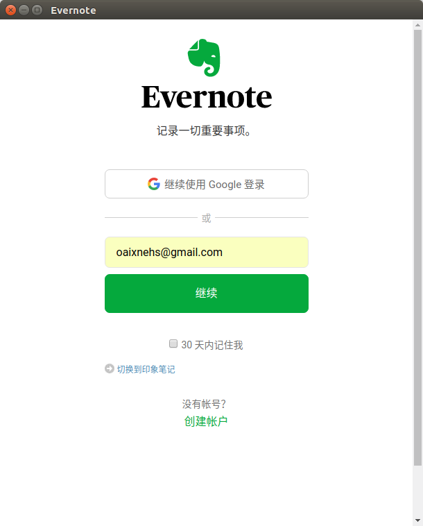
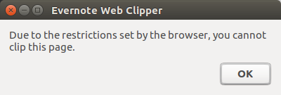

## Useful Software

### SimpleScreenRecorder 录屏软件
- [simpleScreenRecorder](http://www.maartenbaert.be/simplescreenrecorder/#download)
```sh
sudo add-apt-repository ppa:maarten-baert/simplescreenrecorder
sudo apt-get update
sudo apt-get install simplescreenrecorder
```

### update git
```sh
sudo add-apt-repository ppa:git-core/ppa  
sudo apt update  
sudo apt install git
```

### install latest nvidia dirver
```sh
sudo add-apt-repository ppa:graphics-drivers/ppa
sudo apt update
```

### 安装GIMP

```sh
sudo add-apt-repository ppa:otto-kesselgulasch/gimp
sudo apt-get update
sudo apt-get install gimp
# 卸载
sudo apt-get install ppa-purge
sudo ppa-purge ppa:otto-kesselgulasch/gimp
```

### [印象笔记chrome插件](https://jingyan.baidu.com/article/546ae18527e4811149f28c18.html)
切换到国内账户,必须保证google chrome的语言是简体中文,点击插件图标时,才有:





### [install or update calibre](https://calibre-ebook.com/download_linux)

`sudo -v && wget -nv -O- https://download.calibre-ebook.com/linux-installer.sh | sudo sh /dev/stdin`

### [oh-my-zsh](https://github.com/robbyrussell/oh-my-zsh)
```sh
sh -c "$(curl -fsSL https://raw.githubusercontent.com/robbyrussell/oh-my-zsh/master/tools/install.sh)"
git clone https://github.com/zsh-users/zsh-syntax-highlighting.git ${ZSH_CUSTOM:-~/.oh-my-zsh/custom}/plugins/zsh-syntax-highlighting

```
### tmux && terminal
+ Install

follow [here(tmux github)](https://github.com/tmux/tmux) (recommend)
```  
sudo apt-get install terminal
sudo apt-get install tmux
```
***
+ Run

according to my experience, in your zshrc or bashrc file, it is better to add this:  alias tmux="TERM=screen-256color tmux -2"

then, input `tmux`
***
+ Config
  [Everything you need to know about Tmux copy paste - Ubuntu · rushiagr](http://www.rushiagr.com/blog/2016/06/16/everything-you-need-to-know-about-tmux-copy-pasting-ubuntu/)
  edit or new your ~/.tmux.conf

add follow code:
```  
set -g prefix C-s
unbind C-b
bind-key k select-pane -U
bind-key j select-pane -D
bind-key h select-pane -L
bind-key l select-pane -R
unbind '"'
bind v splitw -h # vertical split (prefix v)
bind e splitw -v # horizontal split (prefix h)

```
在终端跳转到1000行：`:1000`
explain:
firstly, input `ctrl+s`
secondly, input `v` or `e` will spilt two pane vertical/horizontal, h/j/k/l will shift between right/down/up/left pane
i guess that you can understand what you do according to read the config code above.

Put the `config` of terminal in `/home/robosense/.config/terminator/config`


***

+ Test
  restart tmux

+ [添加到sh，当打开终端时，即可使用tmux](https://unix.stackexchange.com/questions/43601/how-can-i-set-my-default-shell-to-start-up-tmux)
```sh
if command -v tmux &> /dev/null && [ -n "$PS1" ] && [[ ! "$TERM" =~ screen ]] && [[ ! "$TERM" =~ tmux ]] && [ -z "$TMUX" ]; then
  exec tmux
fi
```

### systemback
```sh
# https://blog.csdn.net/sinat_33188616/article/details/56685553
sudo add-apt-repository ppa:nemh/systemback
sudo apt-get update
sudo apt-get install systemback
```
该软件只能将系统备份在Linux文件系统中，Linux file system type such as Ext2, Ext3, Ext4, BtrFS, GlusterFS plus many more.

### atom vscode extensions sync
`Settings Sync`
+ atom
```
github tokens:atom
1d8cd97e96598a097f51ff391e6233ac1369de62
"sync-settings":
    _lastBackupHash: "fd78847eb3a94c480f1c07fd79f902a385354d95"
    gistId: "5846811ef4f3c0b4da87a8edd2a56c6f"
    personalAccessToken: "1d8cd97e96598a097f51ff391e6233ac1369de62"
```
+ vscode
```
vscode:
d4a2b72c94ea5abb2d9f40e18f73b979d5ce749a
gist id: 29a45cd1615a7273c6e9d345a25f5df3
```

### Google extensions
+ [bookmark search](https://www.cnblogs.com/thebeauty/p/7189569.html)
  在chrome的地址栏中键入BM命令后，通过Bookmark Search插件输入相应的关键词后，快速地搜索chrome书签栏中存在的书签名称中包含该关键词的的书签列表，从而快速地帮助用户从众多的chrome书签中，快速地找到所需要的网址.
  Holmes


### [trash-cli](https://www.tecmint.com/trash-cli-manage-linux-trash-from-command-line/)
```sh
trash-put           #trash files and directories.
trash-empty         #empty the trashcan(s).
trash-list          #list trashed files.
trash-restore       #restore a trashed file.
trash-rm            #remove individual files from the trashcan.
# install
git clone https://github.com/andreafrancia/trash-cli.git
cd trash-cli
sudo python setup.py install
```