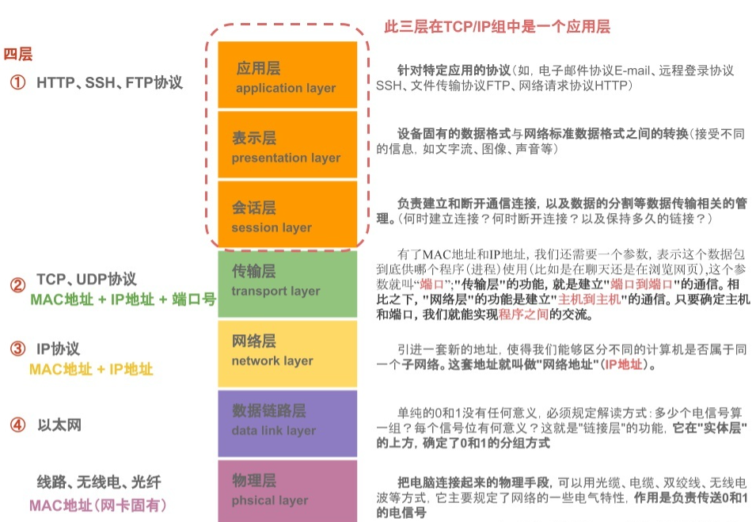

[toc]

# 网络知识

## 1 [网络协议](https://zhuanlan.zhihu.com/p/152590226)

七层、五层、四层协议概念及功能分析。

### 1.1 7层

7层是指OSI (Open System Interconnect, 开放式系统互联)七层协议模型，主要是：应用层（Application）、表示层（Presentation）、会话层（Session）、传输层（Transport）、网络层（Network）、数据链路层（Data Link）、物理层（Physical）。

OSI七层参考模型的各个层次的划分遵循下列原则：

1. 同一层中的各网络节点都有相同的层次结构，具有同样的功能。
2. 同一节点内相邻层之间通过接口(可以是逻辑接口)进行通信。
3. 七层结构中的每一层使用下一层提供的服务，并且向其上层提供服务。
4. 不同节点的同等层按照协议实现对等层之间的通信。


### 1.2 5层

5层只是OSI和TCP/IP的综合，是业界产生出来的非官方协议模型，但是很多具体的应用。实际应用还是TCP/IP的四层结构。为了方便可以把下两层称为网络接口层。五层体系结构包括：应用层、运输层、网络层、数据链路层和物理层。


### 1.3 4层

4层是指TCP/IP四层模型，主要包括：应用层、运输层、网际层和网络接口层。



## 2 [clear ARP cache](https://s905060.gitbooks.io/site-reliability-engineer-handbook/content/how_to_clear_the_arp_cache_on_linux.html)

### 2.1 删除ARP cache

```sh
sudo arp -d 192.168.1.10
```

### 2.2 配置权限

[配置当前用户拥有`sudo`权限](https://www.golinuxcloud.com/add-user-to-sudoers/)，使用`sudo`执行指令时，无需输入密码。命令需要为绝对路径，可用`which cmd`来进行查看使用的命令位置，命令授权格式为，：

```prolog
授权用户/组 主机  =[(切换到哪些用户或组)] [是否需要输入密码验证] 命令1,命令2,...
字段1      字段2  =[(字段3)] [字段4] 字段5
```

```sh
ALL ALL=(ALL) NOPASSWD: /usr/sbin/arp, /sbin/arp, !/sbin/chmod
```

"字段1"不以`%`号开头的表示"将要授权的用户", 比如例子中的`root`；以`%`号开头的表示"将要授权的组", 比如例子中的`%wheel`组 和 `%sudo`组。

[命令前面加上`!`号表示取消该命令](https://segmentfault.com/a/1190000007394449)。如果保存`/etc/sudoers`，`/etc/sudoers.d/custom`(`suod visudo --file=/etc/sudoers.d/custom`)[保存语法错误](https://askubuntu.com/questions/73864/how-to-modify-an-invalid-etc-sudoers-file):

```sh
$ sudo visudo
>>> /etc/sudoers: syntax error near line 28 <<<
sudo: parse error in /etc/sudoers near line 28
sudo: no valid sudoers sources found, quitting
```

无法使用`sudo visudo来编辑相应的文件`,可以按照一下方式打开有语法错误的配置文件，然后修改错误：

```sh
pkexec visudo -f /etc/sudoers.d/custom
pkexec visudo # open /etc/sudoers
```

通过脚本设置当前用户拥有`sudo`权限：

```sh
sudo apt-get install net-tools # arp command
sudoers_file="/etc/sudoers.d/custom"
if [ ! -f $sudoers_file ]; then
  sudo touch $sudoers_file
  sudo sh -c "echo 'ALL ALL=(ALL) NOPASSWD: /usr/sbin/arp, /sbin/arp' >> $sudoers_file"
fi
```

