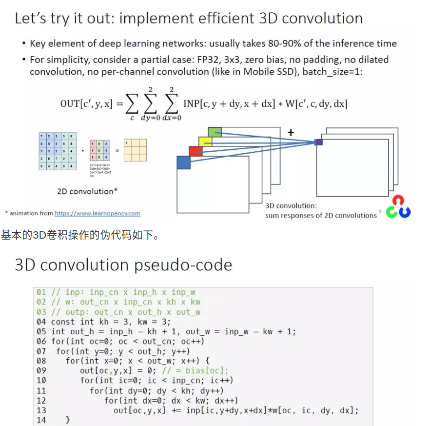
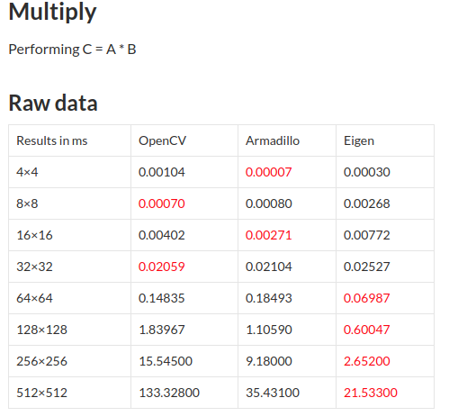

# Speed Up

## [代码级别加速](https://blog.csdn.net/guyuealian/article/details/78540206)

### opencv 3.0版本以上使用UMat替代Mat
OpenCV3中引入了一个新的图像容器对象UMat，它跟Mat有着多数相似的功能和相同的API函数，但是代表的意义却太不一样。要说到UMat对象的来龙去脉，必须首先从OpenCL来开始说，OpenCL是一个面向异构系统通用的并行编程标准，这个标准最早是苹果公司提出，后来变成了一个国际标准，目的是通过它开发通用的GPU计算软件，中国的华为是该标准的成员之一。说的直白点就是如果CPU或者GPU支持OpenCL标准，就可以通过OpenCL相关编程实现使用GPU计算。
+ UMat转换为Mat
  UMat to Mat: UMat::getMat(int access_flags)，支持的flag如下：
  ACCESS_READ
  ACCESS_WRITE
  ACCESS_RW
  ACCESS_MASK
  ACCESS_FAST 
  种方式的时候UMat对象将会被LOCK直到CPU使用获取Mat对象完成操作，销毁临时Mat对象之后，UMat才可以再被使用。
+ Mat转换为UMat
  通过Mat::getUMat()之后就获取一个UMat对象，同样在UMat对象操作期间，作为父对象Mat也会被LOCK直到子对象UMat销毁之后才可以继续使用。

### 查表法LUT
使用lut的方法法，远快于每个像素都计算的方法
```cpp
	void gammaCorrection(cv::Mat& dst, float fGamma)
	{
		cv::Mat lut(1, 256, CV_8U);
		uchar *p = lut.data;
		for (int i = 0; i < 256; i++)
		{
			p[i] = cv::saturate_cast<uchar>(pow((float)(i / 255.0), fGamma) * 255.0f);
		}
		cv::LUT(dst, lut, dst);
	}
```
### OpenMP

### 常用小技巧
[OpenCV学习笔记（三） 访问像素 - eric.xing - 博客园](https://www.cnblogs.com/ericxing/p/3576747.html)
+ 释放Mat图像内存
```cpp
cv::Mat image = cv::imread("test.jpg");
image.release();
```
+  Mat多通道合并与分割
```cpp
/*
	将多个mat合并为多通道mat
*/
cv::Mat mergeMultiChannels(cv::Mat A,cv::Mat B) {
	cv::Mat AB;
	vector<cv::Mat> ABchannels;
	ABchannels.push_back(A);
	ABchannels.push_back(B);
	cv::merge(ABchannels, AB);
	return AB;
}
 
/*
	将6通道的mat分割成2个三通道的mat
*/
void splitMultiChannels(cv::Mat mat,cv::Mat &A,cv::Mat &B) {
	vector<cv::Mat> channels;
	cv::split(mat, channels);//分割image1的通
	vector<cv::Mat> Avec, Bvec;
	Avec.push_back(channels[0]);
	Avec.push_back(channels[1]);
	Avec.push_back(channels[2]);
 
	Bvec.push_back(channels[3]);
	Bvec.push_back(channels[4]);
	Bvec.push_back(channels[5]);
 
	cv::merge(Avec, A);
	cv::merge(Bvec, B);
}
```

+ 释放vector
```cpp
//放在头文件
template < class T >
void ClearVector(vector< T >& vt)
{
	vector<T> vtTemp;
	vtTemp.swap(vt);
}


vector<void *> v;
// 每次new之后调用v.push_back()该指针，在程序退出或者根据需要，用以下代码进行内存的释放：
for (vector<void *>::iterator it = v.begin(); it != v.end(); it ++) 
    if (NULL != *it) 
    {
        delete *it; 
        *it = NULL;
    }
v.clear();
```
swap()是交换函数，使vector离开其自身的作用域，从而强制释放vector所占的内存空间，总而言之，释放vector内存最简单的方法是vector<Point>().swap(pointVec)

### [使用opencv实现3D卷积，并且优化](https://mp.weixin.qq.com/s?__biz=MzIxOTcyNDE2NA==&mid=2247483914&idx=1&sn=68fceefa37ec27a3506b61acffa041a8&chksm=97d7a2e1a0a02bf7e37561050d970bdc95434581480a4f3ab113316872305458d220d298bae4&mpshare=1&scene=1&srcid=&pass_ticket=X16K6FYgsAd1RTIEGQs030Z31xHk7rJhtSxNOivtCTqGaaxO8c8%2BE0U3ubh0R8BP#rd)



+ 使用6重循环实现,.at<float>访问元素

  ```cpp
  void vonv3x3_naive(const cv::Mat& inp, const cv::Mat& w, cv::Mat& out)
  {
    int kh = w.size[2], kw = w.size[3];
    int inp_cn = inp.size[0], inp_h = inp.size[1], inp_w = inp.size[2];
    int out_cn = w.size[0], out_h = inp_h - kh + 1, out_w = inp_w - kw + 1;
    int size[] = { out_cn, out_h, out_w };
    out.create(3, size, CV_32F);
    for (int oc = 0; oc < out_cn; ++oc)
    {
      for (int y = 0; y < out_h; ++y)
      {
        for (int x = 0; x < out_w; ++x)
        {
          out.at<float>(oc, y, x) = 0;
          for (int ic = 0; ic < inp_cn; ++ic)
          {
            for (int dy = 0; dy < kh; ++dy)
            {
              for (int dx = 0; dx < kw; ++dx)
              {
                int widx[] = { oc, ic, dy, dx };  // prepare 4D index to access w
                out.at<float>(oc, y, x) += inp.at<float>(ic, y + dy, x + dx) * w.at<float>(widx);
              }
            }
          }
        }
      }
    }
  }
  ```

  4 cores laptop耗时1400ms.

+ 用.ptr<float>()获取矩阵元素指针，将最里层两重循环展开

  ```cpp
  void vonv3x3_naive_ref(const cv::Mat& inp, const cv::Mat& w, cv::Mat& out)
  {
    int kh = w.size[2], kw = w.size[3];
    int inp_cn = inp.size[0], inp_h = inp.size[1], inp_w = inp.size[2];
    int out_cn = w.size[0], out_h = inp_h - kh + 1, out_w = inp_w - kw + 1;
    int size[] = { out_cn, out_h, out_w };
    out.create(3, size, CV_32F);
    for (int oc = 0; oc < out_cn; ++oc)
    {
      for (int y = 0; y < out_h; ++y)
      {
        int iidx[] = { 0, y, 0 }, widx[] = { oc, 0, 0, 0 }, oidx[] = { oc, y, 0 };
        const float* iptr0 = inp.ptr<float>(iidx);
        const float* wptr0 = w.ptr<float>(widx);
        float* optr = out.ptr<float>(oidx);
        for (int x = 0; x < out_w; ++x)
        {
          float sum = 0;
          const float* iptr = iptr0;
          const float* wptr = wptr0;
          for (int ic = 0; ic < inp_cn; ++ic, iptr += inp_h * inp_w, wptr += kh * kw)
          {
            sum += iptr[0] * wptr[0] + iptr[1] * wptr[1] + iptr[2] * wptr[2] + iptr[inp_w] * wptr[3] +
                   iptr[inp_w + 1] * wptr[4] + iptr[inp_w + 2] * wptr[5] + iptr[inp_w * 2] * wptr[6] +
                   iptr[inp_w * 2 + 1] * wptr[7] + iptr[inp_w * 2 + 2] * wptr[8];
          }
          optr[x] = sum;
        }
      }
    }
  }
  ```

  耗时170ms，提高了8倍。

+ 用parallel_for_并行

  ```cpp
  void conv3x3_ref_parallel(const cv::Mat& inp, const cv::Mat& w, cv::Mat& out)
  {
      // same initializetion as in conv3x3_naive
      parallel_for_(Range(0, out_cn), [&](const Range& r){
          for (int oc = r.start; ocn < r.end; ++oc)
      });
  }
  ```

  耗时53.1ms，快了3.2倍。

+ 将输入数组按行展开，改变读取内存方式

  新的函数con3x3_im2row_parallel将输入数组按行展开存储访问，循环的顺序由[通道；高；宽]变为[高；通道；宽]，但初始化与con3x3_ref一样。运行一下，耗时43.7毫秒，比conv3x3_ref_parallel快一点点。但是现在最里层的循环是简单的点乘，很容易向量化。

  ```cpp
  void vonv3x3_im2row_parallel(const cv::Mat& inp, const cv::Mat& w, cv::Mat& out)
  {
    int kh = w.size[2], kw = w.size[3];
    int inp_cn = inp.size[0], inp_h = inp.size[1], inp_w = inp.size[2];
    int out_cn = w.size[0], out_h = inp_h - kh + 1, out_w = inp_w - kw + 1;
    int size[] = { out_cn, out_h, out_w };
    out.create(3, size, CV_32F);
    cv::parallel_for_(cv::Range(0, out_h), [&](const cv::Range& r) {
      for (int y = r.start; y < r.end; ++y)
      {
        int iidx[] = { 0, y, 0 };
        const float* iptr0 = inp.ptr<float>(iidx);
        float inpbuf[out_w * inp_cn * kw * kh];  // buffer for a single output row
        float* bufptr = inpbuf;
        // unroll input data; prepare it for convolution
        for (int x = 0; x < out_w; x++)
        {
          for (int ic = 0; ic < inp_cn; ++ic, bufptr += kw * kh)
          {
            const float* iptr = iptr0 + x + ic * (inp_h * inp_w);
            bufptr[0] = iptr[0];
            bufptr[1] = iptr[1];
            bufptr[2] = iptr[2];
            bufptr[3] = iptr[inp_w];
            bufptr[4] = iptr[inp_w + 1];
            bufptr[5] = iptr[inp_w + 2];
            bufptr[6] = iptr[2 * inp_w];
            bufptr[7] = iptr[2 * inp_w + 1];
            bufptr[8] = iptr[2 * inp_w + 2];
          }
        }
  
        for (int oc = 0; oc < out_cn; ++oc)
        {
          int widx[] = { oc, 0, 0, 0 };
          const float* wptr = w.ptr<float>(widx);
          int oidx[] = { oc, y, 0 };
          float* optr = out.ptr<float>(oidx);
          const int convlen = inp_cn * kh * kw;
          bufptr = inpbuf;
          for (int x = 0; x < out_w; ++x, bufptr += convlen)
          {
            float sum = 0;
            for (int k = 0; k < convlen; ++k)
            {
              sum += bufptr[k] * wptr[k];  // simple dot product
            }
            optr[x] = sum;
          }
        }
      }
    });
  }
  ```

+ 点乘向量化

  耗时9.2毫秒，比未向量化速度快了5倍

  ```cpp
  void vonv3x3_im2row_parallel(const cv::Mat& inp, const cv::Mat& w, cv::Mat& out)
  {
    int kh = w.size[2], kw = w.size[3];
    int inp_cn = inp.size[0], inp_h = inp.size[1], inp_w = inp.size[2];
    int out_cn = w.size[0], out_h = inp_h - kh + 1, out_w = inp_w - kw + 1;
    int size[] = { out_cn, out_h, out_w };
    out.create(3, size, CV_32F);
    cv::parallel_for_(cv::Range(0, out_h), [&](const cv::Range& r) {
      for (int y = r.start; y < r.end; ++y)
      {
        int iidx[] = { 0, y, 0 };
        const float* iptr0 = inp.ptr<float>(iidx);
        float inpbuf[out_w * inp_cn * kw * kh];  // buffer for a single output row
        float* bufptr = inpbuf;
        // unroll input data; prepare it for convolution
        for (int x = 0; x < out_w; x++)
        {
          for (int ic = 0; ic < inp_cn; ++ic, bufptr += kw * kh)
          {
            const float* iptr = iptr0 + x + ic * (inp_h * inp_w);
            bufptr[0] = iptr[0];
            bufptr[1] = iptr[1];
            bufptr[2] = iptr[2];
            bufptr[3] = iptr[inp_w];
            bufptr[4] = iptr[inp_w + 1];
            bufptr[5] = iptr[inp_w + 2];
            bufptr[6] = iptr[2 * inp_w];
            bufptr[7] = iptr[2 * inp_w + 1];
            bufptr[8] = iptr[2 * inp_w + 2];
          }
        }
  
        for (int oc = 0; oc < out_cn; ++oc)
        {
          int widx[] = { oc, 0, 0, 0 };
          const float* wptr = w.ptr<float>(widx);
          int oidx[] = { oc, y, 0 };
          float* optr = out.ptr<float>(oidx);
          const int convlen = inp_cn * kh * kw;
          bufptr = inpbuf;
          for (int x = 0; x < out_w; ++x, bufptr += convlen)
          {
            int k = 0;
            cv::v_float32x4 vs = cv::v_setzero_f32();
            for (; k <= convlen - 4; k += 4)
            {
              vs = cv::v_fma(cv::v_load(bufptr + k), cv::v_load(wptr + k), vs);
            }
            float sum = cv::v_reduce_sum(vs);  // [vs_0, vs_1, vs_2, vs_3] is reduced to vs_0+vs_1+vs_2+vs_3
            for (; k < convlen; ++k)
            {
              sum += bufptr[k] * wptr[k];  // use scalar loop to process the "tail"
            }
            optr[x] = sum;
          }
        }
      }
    });
  }
  ```

+ 展开外层的循环，增加装载数据的重复利用，耗时4.7ms


### [Eigen OpenCV性能比较](https://zhuanlan.zhihu.com/p/34587739)

