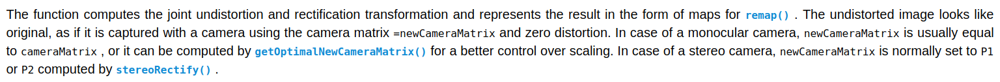

[TOC]

## Tips

### cv::Mat和Eigen::Matrix的转换

```cpp
#include <Eigen/Core>
#include <opencv2/core/eigen.hpp>
cv::Mat_<float> a = Mat_<float>::ones(2,2);
Eigen::Matrix<float,Dynamic,Dynamic> b;
cv::cv2eigen(a,b);
cv::eigen2cv(b,a);
// eigen 默认以column-major
```

### 新建一个Mat

(1) cv::Mat A = cv::Mat(int rows, int cols, int type);
​    cv::Mat A = cv::Mat(3, 3, CV_32FC2);
​    // cv::Size size(cols, rows);
​    cv::Mat A( cv::Size(cols, rows), CV_8UC1, cv::Scalar(0) );
​    使用cv::Mat(int rows, int cols, int type, const Scalar& s)和cv::Mat(Size size, int type, const Scalar& s)函数进行Mat初始化的时候，一定要注意Size行列存放顺序是(col, row)或者是(width, height),一维在前,二维在后；

(2) cv::Mat A = cv::Mat(int rows, int cols, int type, const Scalar& s);
​    cv::Mat A = cv::Mat(3, 3, CV_32FC3, cv::Scalar(0, 0, 255));
​    cv::Mat A = cv::Mat::zeros(rows, cols, CV_8UC3);
​    
(3) cv::Mat A = cv::Mat(int ndims, const int* sizes, int type) // 多维矩阵
​    int Sz[] = {100, 100, 100};
​    cv::Mat A = cv::Mat(3, Sz, CV_8U, cv::Scalar::all(0));

(4) cv::Mat A = cv::Mat(const Mat& m, const Range& rowRange, const Range& colRange)
​    cv::Mat A = cv::Mat(originalMatrix, cv::Range::all(), cv::Range(1, 3)); // 复制第1,2列，不包含第3列
​    As usual, the range start is inclusive and the range end is exclusive. 

(5)  // initial with other mat or data       myMat.copyTo(myMat2);         // initial with mat

(6) 通过指针构造Mat

Mat img(image_size,TYPE,img_ptr);

```cpp
uchar ptr[25]={0,1};
Mat mat(5,5,CV_8U,ptr);
mat = mat*255;
```

修改mat就修改了ptr指向内存的值,Mat的类型要与指针的类型一致，如，uchar指针对应CV_8U，double指针对应CV_64F，如果把double指针赋给一个CV_32F的Mat，那Mat的每个元素只占32位，即把double数一分为二，是错误的。

注意：
(1) 创建多通道Mat时，例如CV_8UC3，使用cv::Scalar(0, 0,0)或myMat.setTo(cv::Scalar(0))，其中后者通用于任意通道；
(2) 使用其他Mat拷贝初始化的时候，void Mat::copyTo(OutputArray m) const函数会首先调用m.create(this->size(), this->type())所以会对输入的m进行重新创建（包括size和type），然后进行数据拷贝。m.copyTo(m)也是允许的，没有任何问题。
(3) The assignment operator and the copy constructor only copies the header. 浅拷贝，引用计数机制。
(4) The underlying matrix of an image may be copied using the clone() and copyTo() functions.深拷贝

+ Mat赋值

  ```c++
  
  Mat a = (Mat_<float>(2,2)<<1,2,3,4);
  float b[4]={5,6,7,8};
  Mat c = Mat(2,2,CV_32F,b).clone();
  memcpy(a.data,b,sizeof(float)*4);
  memcpy(b,a.data,sizeof(float)*4);
  
  Mat src(1000,1000,CV_32F);  
  float* myptr = (float*)src.data;
  ```

  clone()函数要比copyTo函数慢3倍左右，Mat::data的默认类型为uchar*，但很多时候需要处理其它类型，如float、int，此时需要将data强制类型转换。https://blog.csdn.net/Kelvin_Yan/article/details/48315175

### Mat数据访问

```c++
Mat每个格子内的数据格式-----------Mat定义
Mat_<uchar>---------CV_8U
Mat<char>-----------CV_8S
Nat_<short>---------CV_16S
Mat_<ushort>--------CV_16U
Mat_<int>-----------CV_32S
Mat_<float>----------CV_32F
Mat_<double>--------CV_64F
 
img1.at<vec3b>(i,j)[0]= 3.2f;  // B 通道
img1.at<vec3b>(i,j)[1]= 3.2f;  // G 通道
img1.at<vec3b>(i,j)[2]= 3.2f;  // R 通道
```


(1) 指针数组的方式
```cpp
const int rows = image.rows; const int cols = image.cols; 
if (image.isContinuous())
{
    cols *= rows;
    rows = 1;
}
for ( int i = 0; i < rows; ++i)
{
  uchar* data = (uchar*)image.data + i*cols;
  for ( int j=0; j<cols; j++ )
  {
    *data++ = 0; // c++符号优先级
  }
} 
```

(2) ptr的方式
```cpp
/* .ptr with [] */ 
for ( int i=0; i<rows; i++ )
{
    uchar *data = image.ptr<uchar>( i );
    //auto data = image.ptr<cv::Vec3b>(i); // for CV_8UC3
    for ( int j=0; j<cols; j++ )
    {
        data[j] = 0;         
      /*
            if color one:
            data[j*3 + 0] = 0;
            data[j*3 + 1] = 0;
            data[j*3 + 2] = 0;         
            */
    }
}

for (int i = 0; i < rows; ++i)
{
  cv::Vec3b *data = dst.ptr<cv::Vec3b>(i);
  for (int j = 0; j < cols; ++j, ++data)
  {
    (*data)[0] = 0;
    (*data)[1] = 0;
    (*data)[2] = 0;
  }
} /* .ptr with pointer 该方法最快*/ 
for ( int i=0; i<rows; i++ )
{
  uchar *data = image.ptr<uchar>( i );
  for ( int j=0; j<cols*image; j++ )
  {
    *data++ = 0;     
  }
}
```

(3) at的方式
```cpp
for ( int i=0; i<rows; i++ )
{
    for ( int j=0; j<cols; j++ )
    {
         image.at<uchar>(i, j)= 0; // also can be: image.at<uchar>(cv::Point(j, i)) = 0;
         /*
             if color one:
             image.at<uchar>( i, j*3 + 0 ) = 0;
             image.at<uchar>( i, j*3 + 1 ) = 0;
             image.at<uchar>( i, j*3 + 2 ) = 0;
         */
    }
}
```

### [Mat_](https://blog.csdn.net/yhl_leo/article/details/47683127)
Mat_继承于Mat，相比于Mat没有增加任何数据段，但增加了一些更加便捷的功能，表达上也更加精简。
(1) 创建与初始化
```cpp
/* first method */ 
cv::Mat_<double> myMat_ = ( cv::Mat_<double>(3, 3) << 
    1.0, 2.0, 3.0,
    4.0, 5.0, 6.0,
    7.0, 8.0, 9.0);
cv::Mat_<double> myMat_ = cv::Mat_<double>::zeros(3, 3); // others: eyes, diag, ones
/* second method */
cv::Mat_<double> myMat_(3, 1, 0.0);  // -> cv::Mat image(3, 1, CV_64FC1, cv::Scalar(0.0)); 
// create a 100x100 color image and fill it with green(in RGB space) cv::Mat_<cv::Vec3b> image( 100, 100, cv::Vec3b(0, 255, 0) ); 
/* third method */ 
cv::Mat myMat( 100, 100, CV_64F1, cv::Scalar(0) );
cv::Mat_<double>& myMat_ = (cv::Mat_<double>&)myMat; 
```
注意：
1. 使用 `( cv::Mat_<double>(row, col)<< ...) )` 形式创建并初始化的时候，最外面的( )不能省略；
2. 使用第三种通过Mat指针或者引用的方式创建与初始化Mat_时，两者的数据类型一定要一致，不然程序虽然编译没问题，但运行就会BUG~

(2)数据访问
```cpp
/* 
    Note that Mat::at<_Tp>(int y, int x) and 
    Mat_<_Tp>::operator ()(int y, int x) do 
    absolutely the same and run at the same speed
*/ 
cv::Mat_<cv::Vec3b> myMat_(100, 100, cv::Scalar(0));
int nl = image.rows; 
int nc = image.cols * image.channels(); // 多通道
if (image.isContinuous()) 
{
  nc = nc * nl;
  nl = 1;
}
for (std::size_t i = 0; i < n1; ++i)
{
    for (std::size_t j = 0; j < nc;  ++j)
    {
        std::cout << image(i, j) << std::endl;
    }
}
/* second method */ 
int matCount = rows * cols; for ( int idx=0; idx < matCount; idx++ )
{
    std::cout << myMat_(idx) <<std::endl;
}
```

### convertTo && cvtColor
注意也不是所有格式的Mat型数据都能被使用保存为图片，目前OpenCV主要只支持单通道和3通道的图像，并且此时要求其深度为8bit和16bit无符号(即CV_16U)。所以其他一些数据类型是不支持的，比如说float型等。如果Mat类型数据的深度和通道数不满足上面的要求，则需要使用convertTo()函数和cvtColor()函数来进行转换。convertTo()函数负责转换数据类型不同的Mat，即可以将类似float型的Mat转换到imwrite()函数能够接受的类型。而cvtColor()函数是负责转换不同通道的Mat，因为该函数的第4个参数就可以设置目的Mat数据的通道数（只是我们一般没有用到它，一般情况下这个函数是用来进行色彩空间转换的）。另外也可以不用imwrite()函数来存图片数据，可以直接用通用的XML IO接口函数将数据存在XML或者YXML中。
(1)convertTo的用法
src.convertTo(dst, type, scale, shift)
改变数据类型，比如float -> uchar, 
The method converts source pixel values to the target data type. saturate_cast<> is applied at the end to avoid possible overflows:

```cpp
m(x,y)=saturate_cast<rType>(α(∗this)(x,y)+β)
```
(2) C++: void cvtColor(InputArray src, OutputArray dst, int code, int dstCn=0 )
彩色图片都是RGB类型，但是在进行图像处理时，需要用到灰度图、二值图、HSV、HSI等颜色制式，opencv提供了cvtColor()函数来实现这些功能
[OpenCV: Miscellaneous Image Transformations](https://docs.opencv.org/3.1.0/d7/d1b/group__imgproc__misc.html#gga4e0972be5de079fed4e3a10e24ef5ef0a353a4b8db9040165db4dacb5bcefb6ea)

Only 8-bit (or 16-bit in the case of PNG, JPEG 2000 and TIFF) single-channel or 3-channel (with ‘BGR’ channel order) images can be saved using this function. 

`cv::imwrite`只能保存8-bit(或者16-bit的png, JPEG 2000, TIFF)的单通道或者3通道的图片。也就是要想保存为16-bit的图片，其格式必须为png, JPEG 2000或者TIFF.16-bit的图片无法在普通看图软件中查看(为全黑色)，可以以下[读取方式来读取16-bit图片](https://blog.csdn.net/zhanpl/article/details/59109635，然后查看其像素值。

```cpp
cv::Mat img_tmp = cv::imread("/home/robosense/image_d_new.png", CV_LOAD_IMAGE_ANYCOLOR | CV_LOAD_IMAGE_ANYDEPTH);
```

The function `cv::imread` determines type of the image by the content, not by the file extension.


### [aruco marker](http://www.uco.es/investiga/grupos/ava/node/4)

https://www.uco.es/investiga/grupos/ava/node/26

Apart of the marker size and the number of markers in the dictionary, there is another important dictionary parameter, the inter-marker distance. The inter-marker distance is the minimum distance among its markers and it determines the error detection and correction capabilities of the dictionary.

In general, lower dictionary sizes and higher marker sizes increase the inter-marker distance and vice-versa. However, the detection of markers with higher sizes is more complex, due to the higher amount of bits that need to be extracted from the image.

For instance, if you need only 10 markers in your application, it is better to use a dictionary only composed by those 10 markers than using one dictionary composed by 1000 markers. The reason is that the dictionary composed by 10 markers will have a higher inter-marker distance and, thus, it will be more robust to errors.

As a consequence, the aruco module includes several ways to select your dictionary of markers, so that you can increase your system robustness:

+ Predefined dictionaries:

This is the easiest way to select a dictionary. The aruco module includes a set of predefined dictionaries of a variety of marker sizes and number of markers. For instance:

```cpp
cv::Ptr<cv::aruco::Dictionary> dictionary = cv::aruco::getPredefinedDictionary(cv::aruco::DICT_6X6_250);
```

DICT_6X6_250 is an example of predefined dictionary of markers with 6x6 bits and a total of 250 markers.

From all the provided dictionaries, it is recommended to choose the smaller one that fits to your application. For instance, if you need 200 markers of 6x6 bits, it is better to use DICT_6X6_250 than DICT_6X6_1000. The smaller the dictionary, the higher the inter-marker distance.

+ Automatic dictionary generation:

The dictionary can be generated automatically to adjust to the desired number of markers and bits, so that the inter-marker distance is optimized:

```cpp
cv::Ptr<cv::aruco::Dictionary> dictionary = cv::aruco::generateCustomDictionary(36, 5);
```

This will generate a customized dictionary composed by 36 markers of 5x5 bits. The process can take several seconds, depending on the parameters (it is slower for larger dictionaries and higher number of bits).

+ Manually dictionary generation:

Finally, the dictionary can be configured manually, so that any codification can be employed. To do that, the `Dictionary` object parameters need to be assigned manually. It must be noted that, unless you have a special reason to do this manually, it is preferable to use one of the previous alternatives.


## Problems

### undistortPoints和projectPoints

```cpp
cv::undistortPoints(corners[i], undistort_corners[i], cam_param_.camera_mat, cam_param_.dist_coeff, cv::noArray(), cam_param_.camera_mat);

// project axes points
    vector<Point3f> axesPoints;
    axesPoints.push_back(Point3f(0, 0, 0));
    axesPoints.push_back(Point3f(length, 0, 0));
    axesPoints.push_back(Point3f(0, length, 0));
    axesPoints.push_back(Point3f(0, 0, length));
    vector<Point2f> imagePoints;
    cv::projectPoints(axesPoints, rvec, tvec, cameraMatrix, distCoeffs, imagePoints);
```

`cv::undistortPoints`最后一个参数是相机矩阵，在畸变矫正过程中坐标被normalized，需要乘以`camera_matrix`到像素坐标系下。

对于`cv::rojectPoints`, By setting `rvec=tvec=(0,0,0)` or by setting `cameraMatrix` to a 3x3 identity matrix, or by passing zero distortion coefficients, you can get various useful partial cases of the function. This means that you can compute the distorted coordinates for a sparse set of points or apply a perspective transformation (and also compute the derivatives) in the ideal zero-distortion setup.设置disCoeffs = 0, 将3d点投影到矫正过后的图像。


### [undistort畸变矫正图像](https://www.w3cschool.cn/opencv/opencv-64352dtf.html)

initUndistortRectifyMap中的`newCameraMatrix`必须设置为原始的相机矩阵，不能够使用`cv::getOptimalNewCameraMatrix(cameraMatrix, distCoeffs, imageSize, 0)`从新计算，就需要用新的相机矩阵去投影三维点，否则不正确。对于单目相机一般就使用标定的相机矩阵，不重新计算。



```cpp
cv::undistort(input_image, marker_image_, mono_proc_ptr_->cam_param_.camera_mat,
  mono_proc_ptr_->cam_param_.dist_coeff);
等价于：
cv::initUndistortRectifyMap(mono_proc_ptr_->cam_param_.camera_mat, mono_proc_ptr_->cam_param_.dist_coeff, cv::Mat(),　mono_proc_ptr_->cam_param_.camera_mat, mono_proc_ptr_->cam_param_.image_size, CV_16SC2,　map1_, map2_);
cv::remap(input_image, marker_image_, map1_, map2_, CV_INTER_LINEAR);

```

