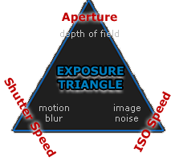

## [Exposure](https://www.cambridgeincolour.com/tutorials/camera-exposure.htm)
EXPOSURE TRIANGLE: APERTURE, ISO & SHUTTER SPEED, 光圈，ISO和快门速度（“曝光三角”）

Aperture: controls the area over which light can enter your camera
Shutter speed: controls the duration of the exposure
ISO speed: controls the sensitivity of your camera's sensor to a given amount of light
A camera's shutter determines when the camera sensor will be open or closed to incoming light from the camera lens. The shutter speed specifically refers to how long this light is permitted to enter the camera. "Shutter speed" and "exposure time" refer to the same concept, where a faster shutter speed means a shorter exposure time.