[TOC]


## [Exposure](https://www.cambridgeincolour.com/tutorials/camera-exposure.htm)

EXPOSURE TRIANGLE: APERTURE, ISO & SHUTTER SPEED, 光圈，ISO和快门速度（“曝光三角”）
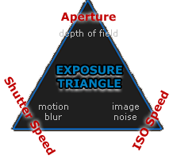
Aperture: controls the area over which light can enter your camera
Shutter speed: controls the duration of the exposure
ISO speed: controls the sensitivity of your camera's sensor to a given amount of light
A camera's shutter determines when the camera sensor will be open or closed to incoming light from the camera lens. The shutter speed specifically refers to how long this light is permitted to enter the camera. "Shutter speed" and "exposure time" refer to the same concept, where a faster shutter speed means a shorter exposure time.


## [camera intrinsic parameters](http://ksimek.github.io/2013/08/13/intrinsic/)

http://ksimek.github.io/2012/08/14/decompose/

https://dsp.stackexchange.com/questions/6055/how-does-resizing-an-image-affect-the-intrinsic-camera-matrix

https://komputervision.wordpress.com/2016/03/21/intrinsic-camera-parameters-for-resized-images-set-of-a-chessboard/

相机内参矩阵可以分解为一系列剪切(shear)，缩放(scaling)和平移(translation)变换，分别对应于轴偏斜，焦距和主点偏移:

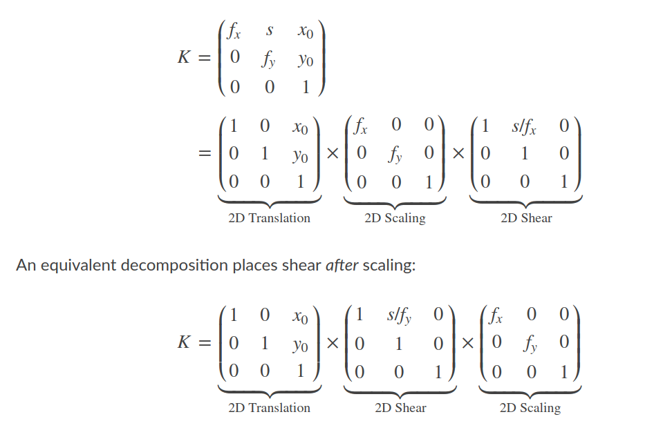

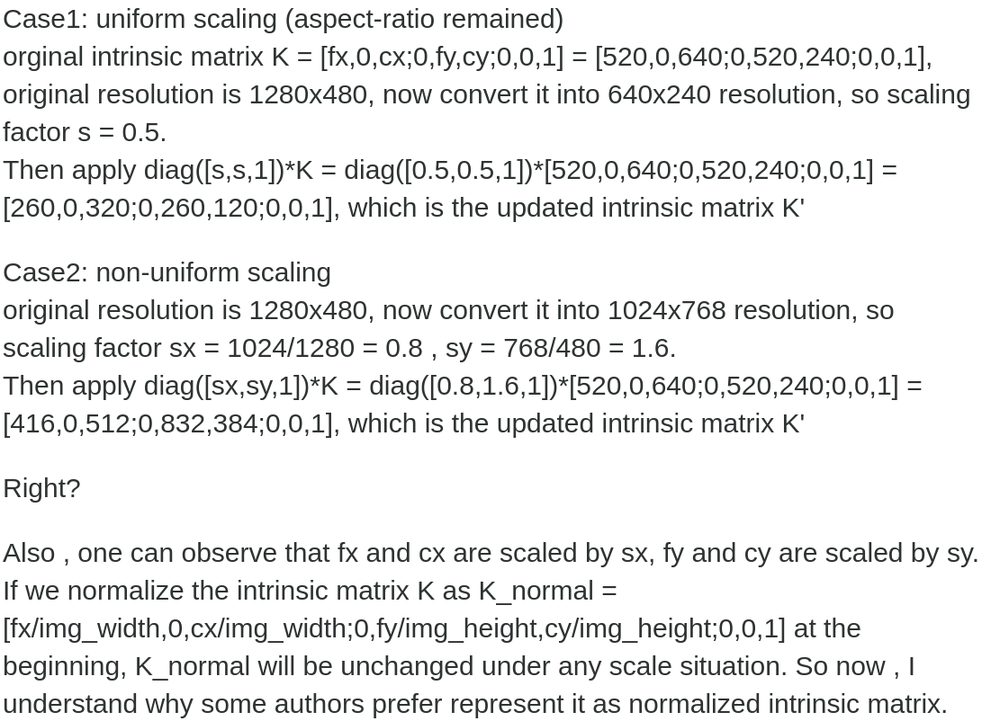

The easiest way to think about image scaling is as an extra linear transformation applied after camera projection, which you can achieve by left-multiplying the camera by diag([s,s,1]). The new camera will have all the parameters changed, including the axis skew if it is non-zero. The non-uniform scaling is the same, but the scaling constants in the x and y direction will differ, i.e. diag([sx, sy, 1]).

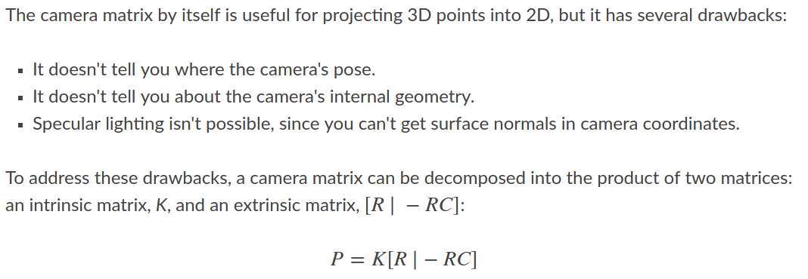

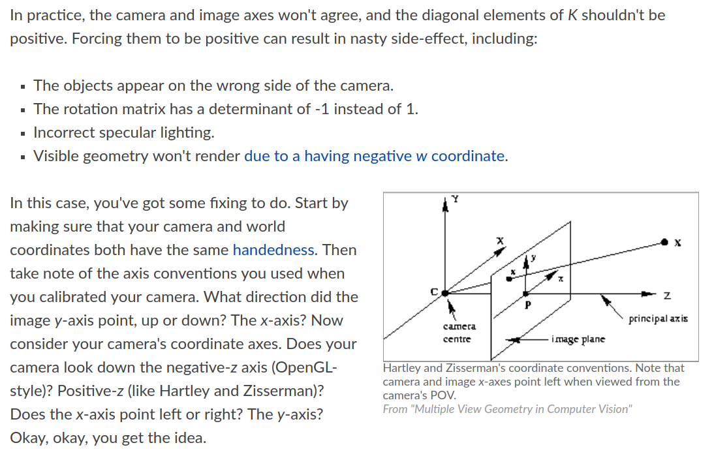

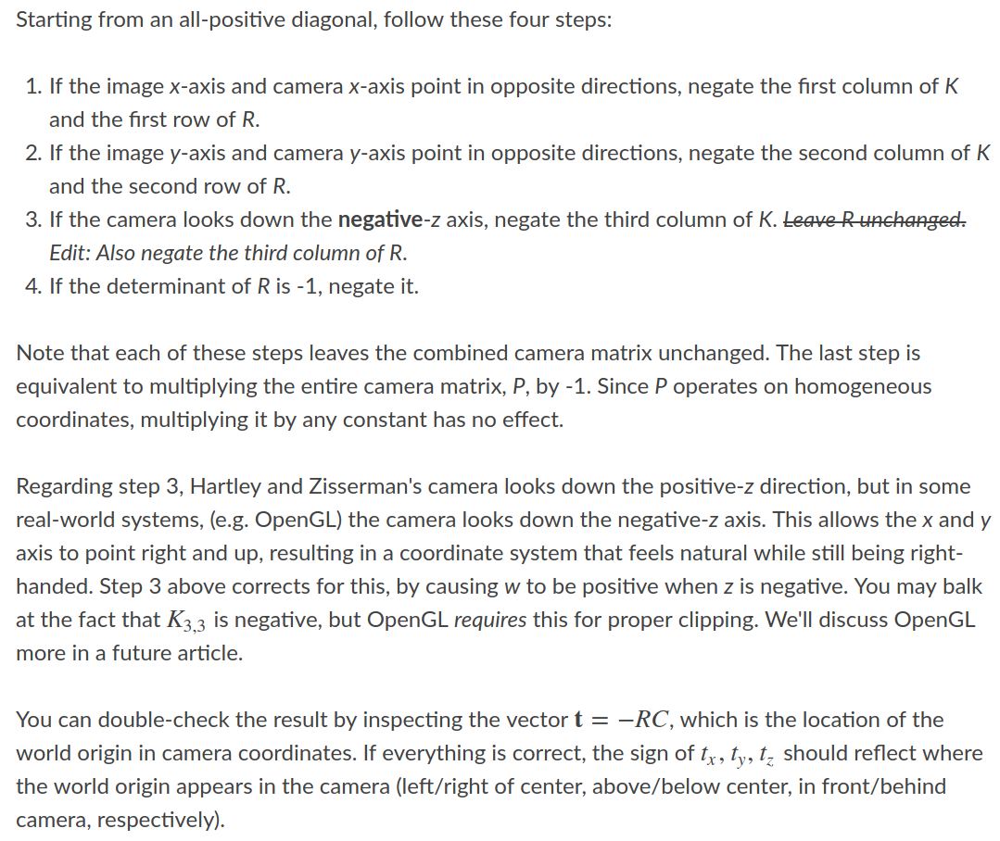


## [Color Filter Array](http://www.wangdali.net/cfa/)

色彩滤波阵列，英文名 **Color Filter Array** 或 **Color Filter Mosaic** ，简称 **CFA** 或 **CFM**，是像素传感器上方的一层马赛克覆层，用于采集图像的色彩信息。一般的光电传感器只能感应光的强度，不能区分光的波长（色彩），因此图像传感器需要通过色彩滤波（Color Filter）以获取像素点的色彩信息。

+ Bayer Filter

  发明于 **1976** 年的 **Bayer Filter** 是目前市场上用途最**广**的CFA，Bayer Filter CFA 配置中包括 **1** 个红光、**1** 个蓝光和 **2** 个绿光滤波器（**25% R**ed, **25% B**lue, **50% G**reen）。由于人眼天生对于绿色比较敏感，Bayer Filter 设计绿色光通透性要好于其它两种颜色。这种处理方式相比于等同处理RGB三种颜色，它所还原出来的图像，在人眼看来，噪点更低，细节更加清晰。

  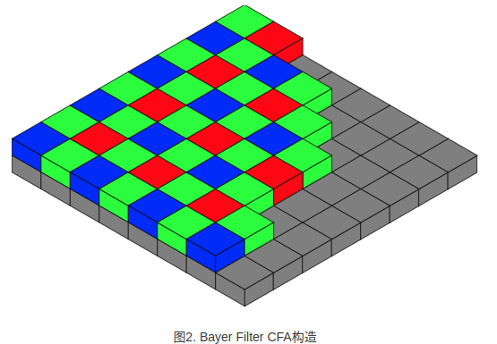

  Bayer Filter 实际上是采用的基本色彩单元是如图 **\*5*** 所示叠加式分布。在图像中心位置，这种叠加式分布的色彩单元分辨率与像素分辨率一致，精度高；但在图像边缘位置，由于滤波器缺失，精度略差。

  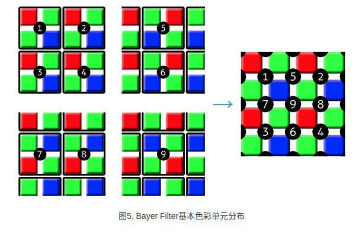


+ RCCC

  在常见的车载前视（Front Camera）应用中，CFA采用 Red-Monochrome（**RCCC** ）配置。这种配置中，CFA滤波器结构中包括 **3** 个空白（**Clear** -**C**）和 **1** 个红光滤波器。相比于 Bayer Filter 在处理过程中会丢弃 **2/3** 的光源，**RCCC** CFA 信号灵敏度更高，同时通过红色光的强度也足以判断汽车前灯（白色）和尾灯（红色）等情况。

  **RCCC** CFA的 **75%**部分为透传，其余 **25%** 为感受红光的滤波器。图 **10** 示意 RCCC 的色彩滤波器的排列。**RCCC**的优点是光灵敏度高，适用于弱光环境。由于 **RCCC** 只有红色光滤波器，因此主要用在对于红色标识敏感的场合，比如交通灯检测。[只适合检测红灯，没有绿色和蓝色分量](https://electronics.stackexchange.com/questions/301095/how-to-estimate-green-or-yellow-based-on-the-output-of-rccc-cmos-image-sensor)。

  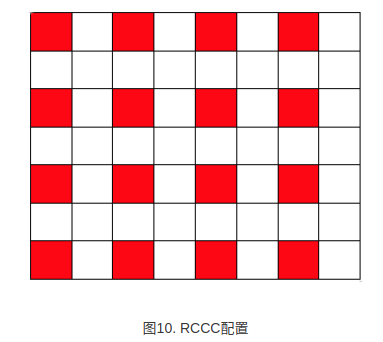

+ RCCB

  **RCCB** CFA的 **50%** 部分为透传，其余红光蓝光滤波器各占 **25%**。图 **11**示意RCCB的色彩滤波器的排列。**RCCB** 的弱光敏感性比 **RCCC**稍差（**Clear** 部分少嘛），但它分辨色彩的能力更好，采集的图像既可以用于机器分析，也可以用于人眼观察。

  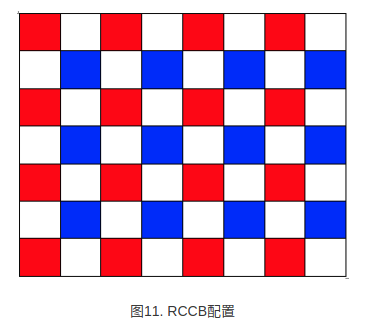

+ Mono

  **Monochrome**为**100%** 透传，它不能分辨色彩。**Mono** 配置的弱光灵敏度最高，仅用于对颜色无识别要求的场合，如驾驶员状态检测等。

  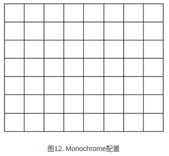


## [多相机系统](https://www.ximea.com/support/wiki/usb3/multiple_cameras_setup)

https://www.ximea.com/support/wiki/allprod/Knowledge_Base

### [USB3.0 vs ethernet](https://www.quora.com/Among-USB3-0-and-Ethernet-cable-which-is-faster)

https://www.online-tech-tips.com/computer-tips/usb-2-0-vs-usb-3-0-vs-esata-vs-thunderbolt-vs-firewire-vs-ethernet-speed/

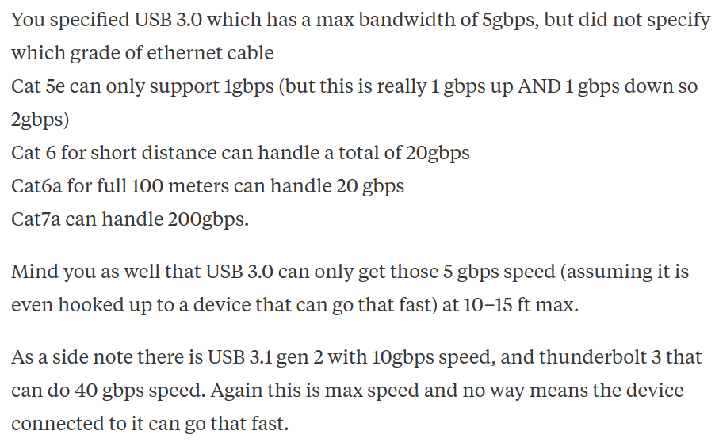

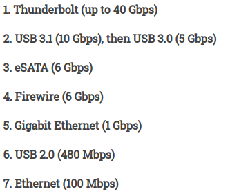

### [USB3.0](https://www.youtube.com/watch?v=svY2NOEBEQA)

https://www.ximea.com/support/wiki/usb3/High_Performance_Hardware

Peripheral Component Interconnect Express (PCIe)外围组件互连Express

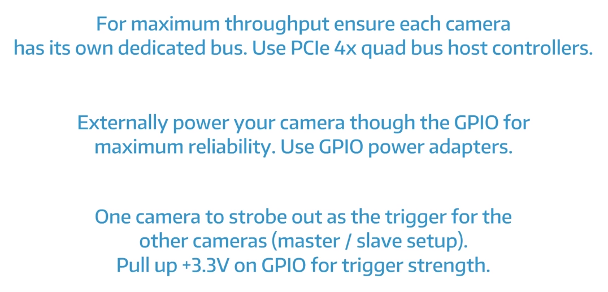

To achieve the maximum framerate use more controllers and less hubs.

#### Linux specific settings

Acquisition buffer size limit

https://importgeek.wordpress.com/2017/02/26/increase-usbfs-memory-limit-in-ubuntu/

+ Symptom

  When acquisition is started on more than 7 cameras simultaneously on Linux - acquisition start is not successfully on 8th camera.

+ Description

  Default the Linux (e.g. Ubuntu 14.04) uses small amount of memory allocated for usb buffers (e.g. 16MB). This amount is not enough when multiple cameras are connected.

+ Solution

  In order to increase number of transport buffers - user needs to change this number. This is especially needed when multiple cameras are connected.

  To set unlimited memory space to be allocated - user must use following command before camera is opened by application:

  ```sh
  ls /dev/video*
  sudo tee /sys/module/usbcore/parameters/usbfs_memory_mb >/dev/null <<<0
  # or
  sudo sh -c 'echo 1000 > /sys/module/usbcore/parameters/usbfs_memory_mb'
  ```

+ 查看是否更改成功

  ```sh
  cat /sys/module/usbcore/parameters/usbfs_memory_mb
  ```

#### 查看相机信息

```sh 
v4l2-ctl -d /dev/video0 --list-formats-ext
v4l2-ctl -d /dev/video0 --all
```


#### [关闭笔记本自带摄像头](http://xyly624.github.io/Ubuntu/ubuntu-camera.html)

+ 临时关闭

  ```sh
  # 禁用即卸载uvcideo驱动    
  sudo modprobe -rv uvcvideo
  # 启用即安装uvcvideo驱动
  sudo modprobe -v uvcvideo
  ```


+ 永久关闭

  ```sh
  # 编辑
  sudo vim /etc/modprobe.d/blacklist.conf
  # 添加如下内容
      blacklist uvcvideo
  
  ```


#### [绑定usb串口](https://www.jianshu.com/p/7e8789eb6991)

https://blog.csdn.net/tap880507/article/details/99546161

+ 查看设备信息

  ```sh
  udevadm info --name=/dev/ttyUSB0 --attribute-walk
  udevadm info --name=/dev/video0 --attribute-walk
  ```

+ 新增udev配置文件

  /etc/udev/rules.d目录下新建文件robomaster.rules

  ```sh
  #serialport to stm32
  KERNEL=="ttyUSB*",ATTRS{idVendor}=="1a86",ATTRS{idProduct}=="7523",MODE:="0666",SYMLINK+="xRMRobotSP"
  #usbcapture for infantry vision
  KERNEL=="video*",ATTRS{idVendor}=="05a3",ATTRS{idProduct}=="9230",SYMLINK+="xRMVideo"
  ```

+ 激活配置

  ```sh
  sudo udevadm trigger
  ```


### ethernet

网络参数配置不太合适，造成数据无法全部传输到pc端，如果已经按照上面的`参数配置`操作，配置好网络接收buffer和mtu值，仍然出现该错误，那么需要(1)使用千兆交换机，并且网口的速度没有损失，推荐使用工业级千兆交换机；(2)对带宽分配(packet size, packet delay)进行设置；(3)使用配置较好的电脑

https://www.flir.cn/support-center/iis/machine-vision/application-note/streaming-cameras-on-embedded-systems/

#### 设置receive buffer

```sh
#!/usr/bin/env bash

if [ $# -ne 1 ]; then 
  echo "please pass only one parameter: net name"
  exit 1
fi

ethernet=$(ls /sys/class/net | grep $*)
if [ "$(ls /sys/class/net | grep $*)"x != "$*"x ]; then 
  echo "The net name is not found. Please check on it."
  exit 1
fi

ethernet=$(ls /sys/class/net | grep $*)

declare -i mtu_value=9300
sudo ifconfig ${ethernet} mtu $mtu_value 2>/dev/null

while (( "$?" != "0" && mtu_value > 1 ))
do
  ((--mtu_value))
  sudo ifconfig ${ethernet} mtu $mtu_value 2>/dev/null
done

echo
echo "mtu value for ${ethernet} is $mtu_value."
echo

if sudo grep -n "net.core.rmem_default = 188743680" /etc/sysctl.conf && sudo grep -n "net.core.rmem_max = 188743680" /etc/sysctl.conf && sudo grep -n "net.ipv4.tcp_rmem = 10240 188743680 188743680" /etc/sysctl.conf; then
  echo "set network receive buff to 180M."
else
  sudo sh -c "echo 'net.core.rmem_default = 188743680' >> /etc/sysctl.conf"
  sudo sh -c "echo 'net.core.rmem_max = 188743680' >> /etc/sysctl.conf"
  sudo sh -c "echo 'net.ipv4.tcp_rmem = 10240 188743680 188743680' >> /etc/sysctl.conf"
  sudo sh -c "echo 'net.ipv4.tcp_wmem = 10240 188743680 188743680' >> /etc/sysctl.conf"
fi

#if sudo grep -n "mtu $mtu_value" /etc/network/interfaces; then
  #echo "set mtu $mtu_value"
#else 
  #echo "set mtu $mtu_value >> /etc/network/interfaces"
  #sudo echo "mtu $mtu_value" >> /etc/network/interfaces
  #sudo /etc/init.d/networking restart
#fi
sudo sysctl -p
ip link show ${ethernet}
```


#### 设置MTU

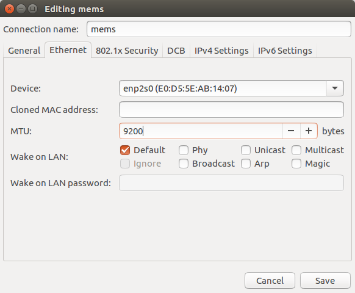

(1)工业级千兆交换机

相机传输的数据量非常大，单个相机的数据量为22MiB/s，必须使用千兆交换机进行数据传输，相应的网线为千兆网线。根据使用经验，一般交换机使用一段时间后，网口的速度有损失，这样有可能不能满足数据传输的要求。如果刚开始一切工作正常，突然某一天出现相机掉帧了(参数配置一直未变)，那肯定是交换机的速度有损失造成的掉帧，请更换新的交换机进行测试。

(2)带宽分配packet size和packet delay

http://intronetworks.cs.luc.edu/1/html/packets.html

https://en.wikipedia.org/wiki/Jumbo_frame

相机数据传输采用UDP协议，需要根据相机分别率和帧率来设置数据包大小(packet size)和数据包延时(packet delay)。

+ packet size

  数据包大小会影响所产生的中断数，从而影响CPU使用率，packet size越大，等量数据的包数越少，CPU利用率越高，传输的包头越少，提高了带宽的利用率；但是大的packet size需要占用更长的时间来传输，影响其他设备实时传输数据。

+ packet delay

  数据包延时类似于传输期间数据包之间的间隔(时间戳时钟周期，125,000,000 ticks/second)，该延时使主机可以在下一个数据包到达之前处理当前数据包，当packet delay增大使，减小了分配到相机的有效带宽，但是可以减小掉帧。多相机时，应增大packet delay.

找到一组合适的packet size，packet delay值，使得当前网络工作正常：

a. 适当增大packet size，查看掉帧是否好转；

b. 配合着packet size，适当增大packet delay，看情况是否好转。

(3)带宽计算

(Height x Width x Frame Rate x Bytes per Pixel)/1000000 = Bandwidth in MB

1920x1200x10x1/1000000 = 23.04 MB

千兆网的总容量为1000/8 = 125 MB

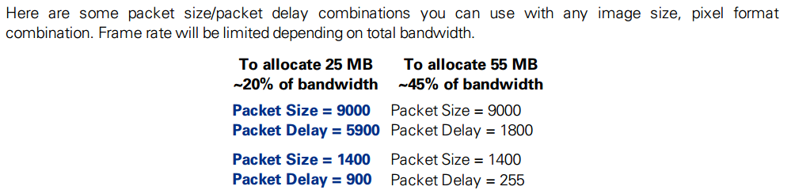


## [WDR vs HDR](http://www.camera-module.com/blog/wdr-wide-dynamic-range-vs-hdr-high-dynamic-range.html)

They are two different processing technologies. One is hardware, and the other is software. However, the purpose of WDR and HDR is the same which is to turn the dark and bright details to be clear under the high-contrasted light condition. The difference is that the implementation methods are different. To be more specific, **WDR makes efforts on hardware while HDR makes efforts on software**. 

[**WDR is short for Wide Dynamic Range**](http://www.camera-module.com/blog/What-is-Wide-Dynamic-Range.html). The WDR technology is applied for viewing the image smoothly under the condition of severe light contrast. Broadly speaking, it stands for the possible range of certain changing object or an area the minimum value and the maximum value spans that can be seen. WDR allows an imaging system to correct for the intense back light surrounding a subject and thus enhances the ability to distinguish features and shapes on the subject.

**HDR stands for High Dynamic Range**. HDR photography is a kind of post-processing technology. It can reach the shooting outcome that normal combination of aperture and shutter cannot do by compositing various photos of different exposure and conducting tone mapping. The advantage of HDR photography is that it can keep original details to maximum extent and demonstrate the original vibrant colors.

## [更多相机知识](http://www.camera-module.com/blog/66_2.html)

### [MJPEG vs H.264](http://www.camera-module.com/blog/66_2.html)

### [H.264 vs H.265](http://www.camera-module.com/blog/h265-h264-the-significant-advantages-of-h265.html)

+ H265 (HEVC, High Efficiency Video Coding)
+ H264 (AVC)

