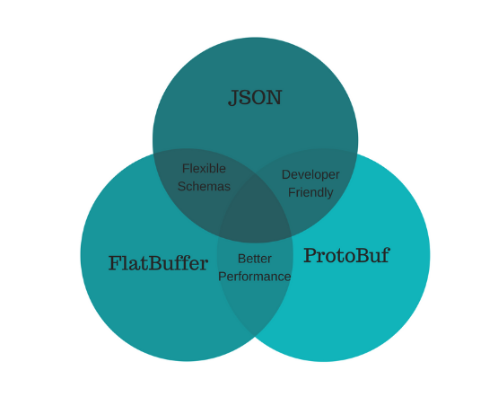

[TOC]

# 数据传输与存储

[JSON vs Protocol Buffers vs FlatBuffers](https://codeburst.io/json-vs-protocol-buffers-vs-flatbuffers-a4247f8bda6f)

## [protocol buffers](https://developers.google.com/protocol-buffers/)

快速serialization/deserialization，比较适合多系统的交互，不适合用来存储文档或者数据库，因为人类无法直接读取和编辑该格式的数据。

## [flat buffers](https://google.github.io/flatbuffers/)

比protocol buffers更快，主要区别在于FlatBuffers不需要解析/解包步骤即可访问数据，然后再与每个对象的内存分配结合在一起，即可访问数据。 该代码也要大一个数量级。 协议缓冲区既没有可选的文本导入/导出功能，也没有架构语言（如联合体）的功能。

