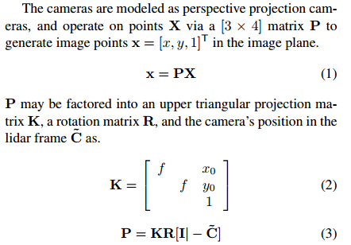
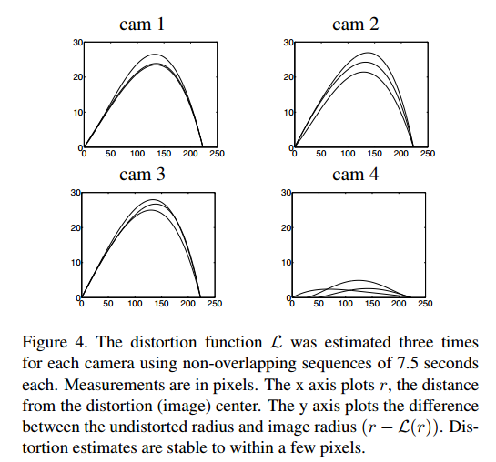
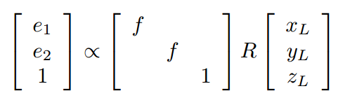
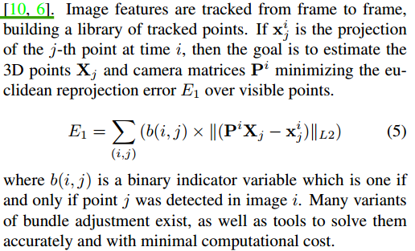
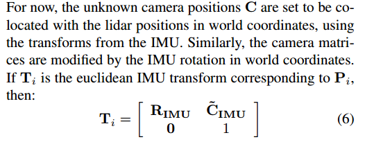
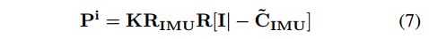
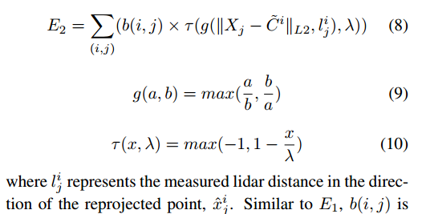

# Calibration

## Lidar and Camera

### [Fully Automatic Calibration of LIDAR and Video Streams From a Vehicle](https://dspace.mit.edu/openaccess-disseminate/1721.1/58909)
本文提出了一种基于自然场景完全自动标定方法，不需要人工介入以及标定板。适用于线性针孔模型，标定的参数有：旋转，平移，焦距，镜头径向畸变参数。不需要标定物，不需要相机内参，不需要人工介入。
此处描述的系统使用类似的技术来优化最终校准，匹配3D和2D轮廓，但利用时间同步性来减轻对直线的依赖。

#### 前提条件
+ 假设相机主点，畸变中心在图像的中心
+ 每个像素为方形，sx = sy，没有歪斜(skew)
+ 雷达相机视野有重合区域

#### 标定步骤
首先根据长的轮廓估计相机畸变系数，然后从IMU获取运动信息的相对线性序列，根据这些序列来确定图像帧的极点。假设目前相机和激光雷达位于同一位置，此关联将相机的参数限制为两个，围绕固定方向旋转并通过焦距缩放，通过最小化跟踪图像特征点的重投影和重建误差来估计这两个参数。最后，在雷达坐标系下，根据深度不连续性与图像轮廓的相关性求解相机投影矩阵，调优已经得到的参数，以及得到相机的位移量。

将雷达数据X[X, Y, Z, 1]使用IMU,t时刻的转换矩阵Tt,转换到世界坐标系下，

这样只需要求解7个参数：３个旋转变量，３个平移变量，１个相机焦距(pixel);另外估计相机的径向畸变。此过程中将用到归一化的图像坐标系(参考视觉slam14讲)。

##### 估计径向畸变系数
+ 使用canny提取图像边缘，去除较短的线以及曲率较大的线
+ 使用4阶多项式拟合剩余的曲线，且有L(0)=0,L(1)=1
+ 计算每个曲线方程与线性近似直接的误差
+ 以各条轮廓线的长度为权重，计算总误差El
+ 优化min(El)
  

##### 基于对极几何约束R
在图像中检测Harris角点，在较短的时间内，认为只有平移运动。

根据图像极点e以及运动方向(平移)D=[xL, yL, zL, 0]T将旋转空间R限制两个参数：焦距f,绕D的旋转量。上式中只有4个未知数(3个旋转参数,以及f)，其中只有2个是线性无关的。

##### 基于重建和重投影获得焦距f
此节，获取K和R的近似值。建立图像中特征点库，将3D点投影到图像坐标系下：

假设，相机和雷达处于同一位置，可以使用IMU的转换关系来估计

在不同f值下，遍历rotation的角度，使得重投影误差E1,重建误差E2最小。

先优化E1迅速找到一个较好的初始值，然后优化E2得到最终的相机矩阵。优化E1,E2可以求解旋转R和焦距f，此时就剩下平移向量。

##### 基于不连续性调优相机投影矩阵P
使用2D和3D轮廓之间的关联性，进一步优化相机投影矩阵。采用暴力搜索的方式，以更慢更精细的方式在参数空间搜索更优的值。

### Automatic Online Calibration of Cameras and Lasers
Jesse Levinson, Sebastian Thrun
Stanford Artificial Intelligence Laboratory
{fjessel,thrung}@stanford.edu