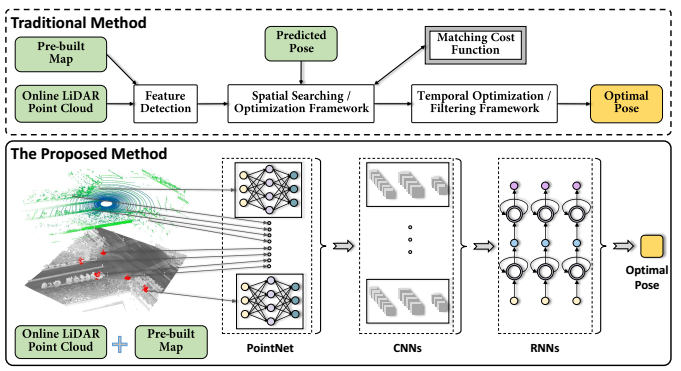
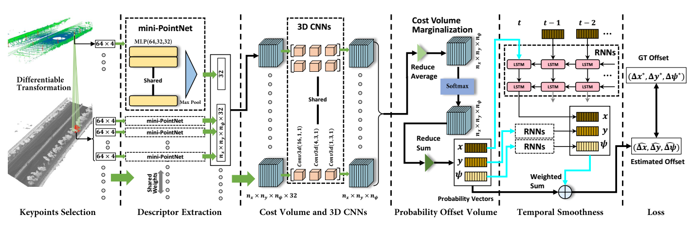
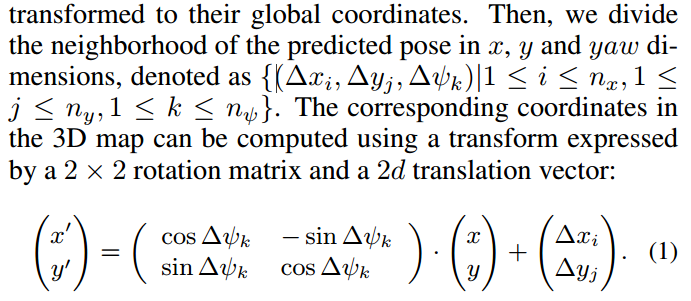
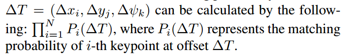
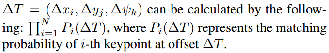
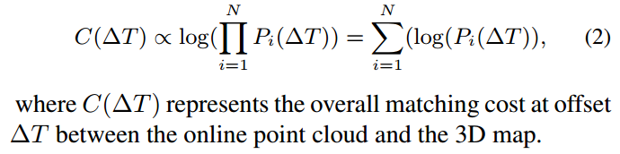
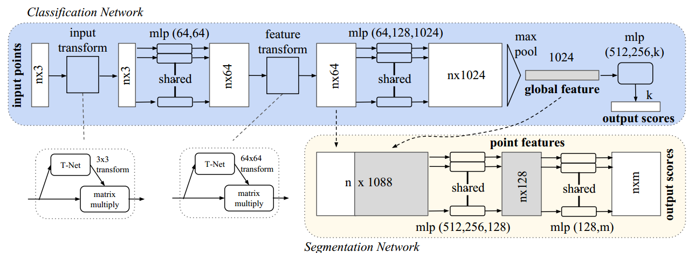

# slam

## L3-Net: Towards Learning based LiDAR Localization for Autonomous Driving
[CVPR 2019 | 百度无人车实现全球首个基于深度学习的激光点云自定位技术 | 论文频道 | 领研网](https://www.linkresearcher.com/theses/a0a02b52-e667-4917-a19f-c4fff1e9d2fc)
百度提出的基于深度学习的激光定位系统需要一个预先建立的激光点云定位地图、在线激光点云以及来惯性传感器的预测位姿作为输入。其中预建的激光点云定位地图是通过离线制图算法对多次采集的同一区域的点云数据进行融合，并使用点云识别算法剔除动态地物得到。在线点云是由自动驾驶车辆上安装的激光雷达设备在行驶过程中采集获得，而预测位姿则由上一帧定位结果加上惯性传感器或者车辆运动模型估计的增量运动来进行递推。总的来说，这个定位框架通过最小化在线点云和地图的匹配距离，优化预测位姿从而获得定位结果的。一般来说，无人车需要定位模块输出六个自由度位姿，包括三个坐标轴（x, y, z）方向上的平移（∆x,∆y,∆z）以及三个坐标轴上的旋转（俯仰角，翻滚角和航向角），但是由于惯性传感器通常可以提供相对准确的俯仰和翻滚角信息，而当（x,y）估计准确时，高程 z 通常可以从地图中获取。因此，在目前主流的自定位系统设计中一般只估计 2D 水平平移（∆x,∆y）和航向角，L3-Net 也采取了类似的设计。

传统方法与 L3-Net 技术流程对比，L3-Net 使用 PointNet 网络实现特征提取，使用 3D CNNs 网络进行特征匹配和优化，最终使用 RNNs 网络完成时序上的平滑。

### 创新点
+ 提出了行业内首个基于深度学习的自动驾驶自定位技术解决方案，可以准确的估计车辆的位置和姿态，取得了厘米级精度的定位效果。
+ 使用不同的网络结构拆解取代传统激光点云定位的技术流程并将其串联起来统一训练，使网络能够以端到端的方式完成在线激光点云定位任务。
+ 即将发布一组包含城市道路、园区道路、高速等复杂场景的全长 380km 的通用数据集用于同类算法测试，更进一步充实百度 Apollo 开放平台的开放内容。

### 搭载的传感器
+ Velodyne HDL-64E LiDAR
+ 高端导航系统，RTK(NovAtel ProPak6) + IMU(IMU-ISA-100C)
  使用后处理软件处理RTK数据后得到定位的ground truth。

### L3-Net网络结构

百度提出的基于学习的激光自定位网络架构 L3-Net。该网络通过两个阶段进行训练，第一阶段训练只包含了黑色箭头部分，包括关键点选择、特征提取以及基于 3D CNNs 的特征匹配；第二阶段训练包含了青色箭头的部分，这一阶段训练包含了用于时序平滑的 RNNs 网络。

对于每一帧在线点云，需要找到一系列的关键点，并以关键点为中心的收集局部点云块从中提取特征描述子。关键点的提取需要同时考虑局部和全局的几何结构关系。L3-Net 首先利用点云的密度找到了一些候选点。接着对每个候选点使用经典点云 3D 结构特征估计其线性和散乱性的概率，最终综合考虑候选点之间的距离及其结构特性选取出关键点。对于每个关键点，该方法收集了其局部范围内的点云信息，再通过 mini-PointNet 网络结构得到特征描述子。其中 PointNet 是 2017 年 CVPR 收录的直接作用于无序点云的深度学习网络结构，L3-Net 这里使用的 mini-PointNet 是其简化版本，由一个多层感知机（Multi-Layer Perceptron, MLP) 和一个 Max-Pooling 层组成，这也是直接作用于无序点云的网络结构应用于高精度激光点云定位/匹配任务的首次尝试。

在获得了关键点的特征描述子后，需要对 2D 水平位置（∆x,∆y）和航向角结果进行求解，这等价于求解预测位姿和真值在水平位置和航向角上的偏移量。针对这个问题，L3-Net 采用了搜索的方法，对预测位姿为中心的（∆x,∆y,∆yaw）三维状态空间进行离散化，取其中一定范围内的定位状态构成集合。对于在线点云中的一个关键点，通过计算集合中每种定位状态下在线点云与地图的匹配效果可以获得的 cost volume。接着使用 3D CNNs 对 cost volume 进行正则化操作，这样做是为了抑制其中的异常值，提升匹配效果。正则化后，L3-Net 将所有关键点的 cost volume 相加并通过 softmax 层得到（∆x,∆y,∆yaw）定位空间的 probability volume，进而估计出（∆x,∆y,∆yaw）的定位结果。

#### 关键点特征
对于每帧点云提取局部特征，即特征点，选取特征点，通过PointNet获得特征点描述子。
+ 特征点选取
  对于实时单帧点云基于点密度density,几何特征geometric,以及分布情况提取固定数目的特征点。
  - 遍历所有的点，根据点密度获得候选点
  - 根据3D tensor评估每个候选点的线性和散度
  - 根据线性和散度值对特征点进行排序
  - 选取尽量少的线性好，散度高的候选点作为特征点，新入选的点与已经存在的特征点之间的距离尽量大
+ 特征描述子提取
  按照常规，使用简单的几何或者统计特征来描述点云的相似性。本文使用PointNet来提取特征描述子。对于每个特征点point(x,y,z,r)(r: reflection intensity)：
  - 选取其邻域内的64个点，形成一个64x4的tensor作为mini-PointNet的输入
  - mini-PointNet的输出是1x32的特征向量，由一个多层感知机(MLP: ３层stacking fully connected layers，和一层max-pooling)
  - 对于实时点云和map共享min-PointNet的参数

#### 损失集和3D CNNS
得到特征向量后，由3D　cnns获得定位偏移量（∆x,∆y,∆yaw）。在解空间(x,y,yaw)中构造损失集，使用3D CNNS对其进行正则化．首先将解空间离散化，步长为nx,ny,nyaw，使用{f1, f2, ..., fN}表示实时点云数据的关键点描述子，那么损失集维度为(N, nx, ny, nyaw),每个cell表示在相应偏移量下，特征点和map之间的匹配误差。

+ Differentiable Transformation差异化转换
  根据预测姿态，所有实时点云局部特征点转换到全局坐标系下，将预测的姿态的邻域分离出x,y,yaw,表示为
  
  将map中的点(x',y')的邻域点输入到mini-PointNet中计算其特征描述子，损失集的每个cell包含一个实时点云特征点以及特征点描述子，一种转换关系，map中相应的特征描述子。然后在map的x, y维度上对描述子的４邻域进行双线性插值来优化该描述子。
  连接特征点和正则化网络的关键步骤是：转换和双线性插值，它们的作用是不同的，双线性插值保证mini-PointNet在训练阶段通过反向转播学习特征。从实时点云和map中获得一对特征描述子，我们可以在偏移解空间构建一个(N, nx, ny, nyaw)的体素，计算它们之间的欧式距离L2，该距离作为正则化网络的输入。

+ 正则化
  基于每个cell中的距离差,学习一个兼顾体素中的内容的正则化函数，来调优匹配误差。偏移空间中的匹配误差是通过各个独立的特征点进行计算的，即使使用深度特征，也不可能得到一个完美的误差值。我们使用3D卷积来对体素进行正则化。3D CNNS包含三层：2层ReLU + 1层　batch normalization,一个batch中包含单帧点云中所有的特征点。最后一层直接传递其输出，不进行normalization和activation操作。对每个(nx, ny, nyaw)进行3D CNNs，它们共享参数，大大加快了收敛速度并且避免了过拟合。

#### 偏移体素的概率
本节我们独立计算每个特征点在所有偏移cell中的匹配误差。引入概率偏移量来表示偏移空间(nx, ny, nyaw)中所有特征点的一致性，它表示在相应偏移下，实时点云与map直接匹配的总误差。

+ 边缘化
  假设所有的特征点都是相互独立的，那么在相应偏移量下的匹配概率可以表示为：
  
  将上式取对数有：
  
  在实现过程中，我们使用$\log(P_i(\Delta T))$作为输入，然后通过减去均值将其边缘化到$n_x \times n_y \times n_\psi$

+ 概率
  边缘化的损失集中每个cell表示相应偏移下所有的匹配误差，我们对$x,y,yaw$分量使用softmax，将匹配损失$C(\Delta T)$归一化。最后，将归一化概率边缘化。

#### 时域平滑
上面介绍了实时点云与map的空间匹配。定位是一个连续过程，应考虑相邻帧直接的联系。RNN类似于时域平滑，本文使用LSTM，偏移集各个cell的概率向量作为每个独立RNN单元的输入，通过学习历史信息，RNNs平滑了定位轨迹。

## [PointNet: Deep Learning on Point Sets for 3D Classification and Segmentation](https://github.com/charlesq34/pointnet)

[[1612.00593] PointNet: Deep Learning on Point Sets for 3D Classification and Segmentation](https://arxiv.org/abs/1612.00593)
[pointnet.pytorch](https://github.com/fxia22/pointnet.pytorch)

PointNet是第一种直接处理无序点云数据的深度神经网络。一般情况下，深度神经网络要求输入信息具有规范化的格式，比如二维的图像，时序性的语音等。而原始的三维点云数据往往是空间中的一些无序点集，假设某一个点云中包含N个三维点，每一个点用(x,y,z)三维坐标表示，即使不考虑遮挡，视角等变化，单就这些点的先后顺序排列组合，就有 N! 种可能。因此，我们需要设计一个函数，使得函数值与输入数据的顺序无关。实际上，在代数组合学中，这类函数被称为对称函数。PointNet 中，作者使用了Max Pooling 层做为主要的对称函数，这种处理虽然简单，但是实验证明效果较好。
### 亮点
+ 空间变换网络解决旋转问题
  三维的STN可以通过学习点云本身的位姿信息学习到一个最有利于网络进行分类或分割的DxD旋转矩阵（D代表特征维度，pointnet中D采用3和64）。至于其中的原理，我的理解是，通过控制最后的loss来对变换矩阵进行调整，pointnet并不关心最后真正做了什么变换，只要有利于最后的结果都可以。pointnet采用了两次STN，第一次input transform是对空间中点云进行调整，直观上理解是旋转出一个更有利于分类或分割的角度，比如把物体转到正面；第二次feature transform是对提取出的64维特征进行对齐，即在特征层面对点云进行变换。
+ maxpooling解决无序性问题
  网络对每个点进行了一定程度的特征提取之后，maxpooling可以对点云的整体提取出global feature。

### 网络结构

 其中，mlp是通过共享权重的卷积实现的，第一层卷积核大小是1x3（因为每个点的维度是xyz），之后的每一层卷积核大小都是1x1。即特征提取层只是把每个点连接起来而已。经过两个空间变换网络和两个mlp之后，对每一个点提取1024维特征，经过maxpool变成1x1024的全局特征。再经过一个mlp（代码中运用全连接）得到k个score。分类网络最后接的loss是softmax。

1、输入为一帧的全部点云数据的集合，表示为一个nx3的2d tensor，其中n代表点云数量，3对应xyz坐标。
2、输入数据先通过和一个T-Net学习到的转换矩阵相乘来对齐，保证了模型的对特定空间转换的不变性。
3、通过多次mlp对各点云数据进行特征提取后，再用一个T-Net对特征进行对齐。
4、在特征的各个维度上执行maxpooling操作来得到最终的全局特征。
5、对分类任务，将全局特征通过mlp来预测最后的分类分数；对分割任务，将全局特征和之前学习到的各点云的局部特征进行串联，再通过mlp得到每个数据点的分类结果。
#### T-Net
T-Net包含独立点特征提取，max-pooling和全连接层。代码实现时，使用了3层卷积+max-pooling+2层全连接，

## [PointNet++](https://github.com/charlesq34/pointnet2)