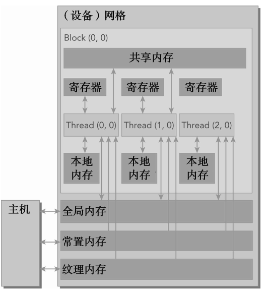

# CUDA编程

## CMakeLists配置

```cmake
find_package(CUDA REQUIRED)
if(CUDA_FOUND)
  set(CUDA_NVCC_FLAGS 
#-gencode arch=compute_20,code=sm_20;
#-gencode arch=compute_20,code=sm_21;
#-gencode arch=compute_30,code=sm_30;
-gencode arch=compute_35,code=sm_35;
-gencode arch=compute_50,code=sm_50;
-gencode arch=compute_52,code=sm_52; 
-gencode arch=compute_60,code=sm_60;
-gencode arch=compute_61,code=sm_61;
)
set(CUDA_NVCC_FLAGS "-g -G")
set(CUDA_NVCC_FLAGS -std=c++11)
include_directories(${CUDA_INDCLUDE_DIRS})
message("FOUND CUDA ${CUDA_VERSION}.\n")
endif(CUDA_FOUND)
cuda_add_executable(${PROJECT_NAME}_node src/lidar_camera_calib_node.cpp ${HEADER_FILES} ${SOURCE_FILES})
target_link_libraries(${PROJECT_NAME}_node ${OpenCV_LIBRARIES} ${PCL_LIBRARIES} ${CUDA_LIBRARIES} ${catkin_LIBRARIES})
```

`cuh`是`cu`的头文件，在`cpp`中引用`cuh`文件就可以调用CUDA的kernel .


## Tips

https://blog.csdn.net/canhui_wang/article/category/8100604/2?

[伊利诺伊大学课程](https://www.nvidia.cn/object/cuda_education_cn_old.html)

### [代码调度](https://blog.csdn.net/breaksoftware/article/details/79302590)


### [gridId, blockId, threadId三者之间的关系](https://blog.csdn.net/canhui_wang/article/details/51730264)

已经验证过的：

+ 一维grid和一维block

  ```cpp
  dim3 block_size(64, 1);
  dim3 grid_size((cols + block_size.x - 1)/block_size.x, 1);
  int idx = blockIdx.x * blockDim.x + threadIdx.x;
  ```

+ 二维grid一维block

  ```cpp
  dim3 block_size(64);
  dim3 grid_size((cols + block_size.x - 1)/block_size.x, rows);
  int col = blockIdx.x * blockDim.x + threadIdx.x;
  int row = blockIdx.y;
  int idx = row * cols + col;
  ```

  一个线程块只能在一个SM上被调度。 一旦线程块在一个SM上被调度， 就会保存在该SM上直到执行完成。 在同一时间， 一个SM可以容纳多个线程块。

  从逻辑角度来看， 线程块是线程的集合， 它们可以被组织为一维、 二维或三维布局。从硬件角度来看， 线程块是一维线程束的集合。 在线程块中线程被组织成一维布局，每32个连续线程组成一个线程束。

  在同一线程束中的线程执行不同的指令， 被称为线程束分化。在一个线程束中所有线程在每个周期中必须执行相同的指令,如果一个线程束中的线程产生分化， 线程束将连续执行每一个分支路径， 而禁用不执
  行这一路径的线程。 线程束分化会导致性能明显地下降。

  ```sh
  nvprof --metrics branch_efficiency  ./lidar_camera_online_calib_node
  ```

  CUDA编译器优化， 它将短的、 有条件的代码段的断定指令取代了分支指令，只有在条件语句的指令数小于某个阈值时， 编译器才用断定指令替换分支指令。 因此， 一段很长的代码路径肯定会导致线程束分化。尝试调整分支粒度以适应线程束大小的倍数， 避免线程束分化。将`if else`分离成多个`if`语句会使得分化分支数量翻倍。

  **注意**：位于同一个Block中的线程才能实现通信，不同Block中的线程不能通过共享内存、同步进行通信，而应采用原子操作或主机介入。

网格设计策略：

+ 保持每个块中线程数量是线程束大小（ 32） 的倍数

+ 避免块太小： 每个块至少要有128或256个线程

+ 根据内核资源的需求调整块大小

+ 块的数量要远远多于SM的数量， 从而在设备中可以显示有足够的并行

+ 通过实验得到最佳执行配置和资源使用情况

+ 线程块最内层维度的大小对性能起着的关键的作用。

### CUDA性能分析工具

3种常见的限制内核性能的因素:

+ 存储带宽
+ 计算资源
+ 指令和内存延迟

#### nvvp

#### [nvprof](https://docs.nvidia.com/cuda/profiler-users-guide/index.html#nvprof-overview)

nvprof –[options] ./application [application-arguments]

#### 性能指标

+ 可实现占用率

   一个内核的可实现占用率被定义为： 每周期内活跃线程束的平均数量与一个SM支持的线程束最大数量的比值。 

  nvprof –metrics achieved_occupancy ./test

+ 内存读取效率

  nvprof –metrics gld_efficiency ./test

+ 加载吞吐量

  nvprof –metrics gld_throughput ./test

  1.减少主机内存和显存之间的拷贝量 

  2.减少全局内存的访问次数：使用共享内存

   3.加快全局内存的访问速度.使用纹理；注意合并访问的必要条件：线程块内相邻的线程访问相邻的数据。因为半束(16)线程的访问16字节的数据可以合为一个访问指令 

  4.重复利用分配的全局内存，减少全局内存分配次数。全局内存分配特别费时。分配512*512*4字节的全局内存需要30ms时间。 

  5.通过使用流并行技术，将内存拷贝和计算并行，基于的原理是：同一时刻cuda程序可以同时进行一个计算和数据传输。通过这种方法可以把部分数据拷贝消耗的时间隐藏。流并行的一大特点是通过多个流将数据拷贝和计算并行。 

  6.将待传输的主机内存，改为分页固定，提高主机内存和显存的拷贝速度。把cpu中已经分配的内存在，拷贝之前使用cudaHostRegister()把普通内存改为分页锁定内存提高内存和显存的拷贝速度。

### 延迟隐藏

带宽通常是指理论峰值， 而吞吐量是指已达到的值。带宽通常是用来描述单位时间内最大可能的数据传输量， 而吞吐量是用来描述单位时间内任何形式的信息或操作的执行速度。

所需线程束数量＝延迟×吞吐量，假设在内核里一条指令的平均延迟是5个周期。 为了保持在每个周期内执行6个线程束的吞吐量， 则至少需要30个未完成的线程束。

有两种方法可以提高并行：

+ 指令级并行（ ILP） ： 一个线程中有很多独立的指令
+ 线程级并行（ TLP） ： 很多并发地符合条件的线程

### CUDA变量


设备内存的分配和释放操作成本较高， 所以应用程序应重利用设备内存， 以减少对整体性能的影响。


在CPU内存层次结构中， 一级缓存和二级缓存都是不可编程的存储器。 另一方面，CUDA内存模型提出了多种可编程内存的类型：寄存器，共享内存，本地内存，常量内存，纹理内存，全局内存。一个核函数中的线程都有自己私有的本地内存。 一个线程块有自己的共享内存， 对同一线程块中所有线程都可见， 其内容持续线程块的整个生命周期。 所有线程都可以访问全局内存。 所有线程都能访问的只读内存空间有： 常量内存空间和纹理内存空间。 对于一个应用程序来说， 全局内存、 常量内存和纹理内存中的内容具有相同的生命周期。



#### 寄存器

寄存器变量对于每个线程来说都是私有的， 一个核函数通常使用寄存器来保存需要频繁访问的线程私有变量。 寄存器变量与核函数的生命周期相同。 在核函数中使用较少的寄存器将使在SM上有更多的常驻线程块。 每个SM上并发线程块越多，使用率和性能就越高。

nvcc编译器选项，输出寄存器的数量、 共享内存的字节数以及每个线程所使用的常量内存的字节数：

`-Xptxas -v, -abi=no`

#### 本地内存

核函数中符合存储在寄存器中但不能进入被该核函数分配的寄存器空间中的变量将溢出到本地内存中。 编译器可能存放到本地内存中的变量有：

+ 在编译时使用未知索引引用的本地数组
+ 可能会占用大量寄存器空间的较大本地结构体或数组
+ 任何不满足核函数寄存器限定条件的变量

“本地内存”这一名词是有歧义的： 溢出到本地内存中的变量本质上与全局内存在同一块存储区域， 因此本地内存访问的特点是高延迟和低带宽。对于计算能力2.0及以上的GPU来说， 本地内存数据也是存储在每个SM的一级缓存和每个设备的二级缓存中。

#### 共享内存

在**核函数中**使用如下修饰符修饰的变量存放在共享内存中：`__shared__`，其生命周期伴随着整个线程块。如果在核函数中进行声明，那么这个变量的作用域就局限在该内核中。 如果在文件的任何核函数外进行声明， 那么这个变量的作用域对所有核函数来说都是全局的。

```cpp
__shared__ float tile[size_y][size_x];
extern __shared__ float tile []; // 共享内存大小在编译时未知，只能动态声明一维数组
kernel <<<grid, block, isize*sizeof(float)>>>(...) // 第三个量为数组bytes
```


因为共享内存是片上内存， 所以与本地内存或全局内存相比， 它具有更高的带宽和更低的延迟。 它的使用类似于CPU一级缓存， 但它是可编程的。

一个块内的线程通过使用共享内存中的数据可以相互合作。 访问共享内存必须同步使用如下调用：

`void __syncthreads()`

该函数设立了一个执行障碍点， 即同一个线程块中的所有线程必须在其他线程被允许执行前达到该处。 SM中的一级缓存和共享内存都使用64KB的片上内存， 它通过静态划分， 但在运行时可以通过如下指令进行动态配置：

cudaError_t cudaFuncSetCacheConfig(const void* func, enum cudaFuncCache cacheConfig);

这个函数在每个核函数的基础上配置了片上内存划分， 为func指定的核函数设置了配置。 支持的缓存配置如下：


#### 常量内存

常量内存驻留在设备内存中， 并在每个SM专用的常量缓存中缓存。 常量变量用如下修饰符来修饰：`__constant__`

常量变量必须在全局空间内和所有核函数之外进行声明。 对于所有计算能力的设备，都只可以声明64KB的常量内存。 常量内存是静态声明的， 并对同一编译单元中的所有核函数可见。核函数直接从常量内存中读取数据，在主机端初始化：

```cpp
cudaError_t cudaMemcpyToSymbol(const void* symbol, const void* src, size_t count);
```

线程束中的所有线程从相同的内存地址中读取数据时， 常量内存表现最好,如果线程束里每个线程都从不同的地址
空间读取数据， 并且只读一次， 那么常量内存中就不是最佳选择， 因为每从一个常量内存中读取一次数据， 都会广播给线程束里的所有线程。

cudaMemcpyToSymbol(主要用于将数据从host拷贝到device的constant memory，但也可以用于将数据从host拷贝到device的global区)

#### 纹理内存

纹理内存驻留在设备内存中， 并在每个SM的只读缓存中缓存。 纹理内存是一种通过指定的只读缓存访问的全局内存。纹理内存是对二维空间局部性的优化， 所以线程束里使用纹理内存访问二维数据的线程可以达到最优性能。

#### 全局内存

全局内存是GPU中最大、 延迟最高并且最常使用的内存。 一个全局内存变量可以被静态声明或动态声明。 你可以使用如下修饰符在设备代码中静态地声明一个变量:`__device__`,在主机端使用cuda-Malloc函数分配全局内存， 使用cudaFree函数释放全局内存。

静态全局内存：使用`__device__`在文件作用域声明，使用`cudaMemcpyToSymbol(const void* symbol, const void* src, size_t count)`初始化，`cudaMemcpyFromSymbol(const void* src, const void* symbol, size_t count)`读取到host。即使在同一文件内可见， 主机代码也不能直接访问设备变量。 类似地， 设备代码也不能直接访问主机变量。

注意: 变量`symbol`只是一个标识符，并不是设备全局内存的变量地址；在核函数中，`symbol`被当做全局内存中的一个变量。

+ 内存分配

  ```cpp
  cudaError_t cudaMalloc(void **devPtr, size_t count);
  float* output_device;
  cudaErrot_t status = cudaMalloc((void**)&output_device, pixel_size * sizeof(float));
  ```

+ 内存释放

  ```cpp
    cudaFree(output_device);
  ```

  设备内存的分配和释放操作成本较高， 所以应用程序应重利用设备内存， 以减少对整体性能的影响。

+ 内存传输

  ```cpp
  cudaError_t cudaMemcpy(void *dst, const void*src, size_t count, enum cudaMemcpyKind kind);
  ```

  

  CUDA编程的一个基本原则应是尽可能地减少主机与设备之间的传输。

#### GPU缓存

跟CPU缓存一样， GPU缓存是不可编程的内存。 在GPU上有4种缓存：

+ 一级缓存
+ 二级缓存
+ 只读常量缓存
+ 只读纹理缓存

每个SM都有一个一级缓存， 所有的SM共享一个二级缓存。 一级和二级缓存都被用来在存储本地内存和全局内存中的数据， 也包括寄存器溢出的部分。 

在CPU上， 内存的加载和存储都可以被缓存。 但是， 在GPU上只有内存加载操作可以被缓存， 内存存储操作不能被缓存。每个SM也有一个只读常量缓存和只读纹理缓存， 它们用于在设备内存中提高来自于各自内存空间内的读取性能。

使用CUDA只读缓存有两个办法：

+ 使用内部函数__ldg来通过只读缓存直接对数组进行读取访问

  ```cpp
  
  __global__ void copyKernel(int *out,int *in)
  {
      int idx = blockIdx.x*blockDim.x+threadIdx.x;
      out[idx] = __ldg(&in[idx]);
  }
  ```

+ 使用`__restrict__` 和const

  ```cpp
  __global__ void copyKernel_2(int *__restrict__ out,const int *__restrict__ in)
  {
      int idx = blockIdx.x*blockDim.x+threadIdx.x;
      out[idx] = in[idx];
  }
  ```


#### 固定内存

分配的主机内存默认是pageable（ 可分页） ， 它的意思也就是因页面错误导致的操作， 该操作按照操作系统的要求将主机虚拟内存上的数据移动到不同的物理位置。GPU只能跟主机固定内存进行数据传输，当从可分页主机内存传输数据到设备内存时， CUDA驱动程序首先分配临时页面锁定的或固定的主机内存， 将主机源数据复制到固定内存中， 然后从固定内存传输数据给设备内存。


+ 分配

  ```cpp
  cudaError_t cudaMallocHost(void **devPtr, size_t count);
  cudaError_t status = cudaMallocHost((void**)&output_host,  pixel_size* sizeof(float));
  
  ```

+ 释放

  ```cpp
  cudaError_t cudaFreeHost(void *devPtr);
  cudaFreeHost(output_host);
  ```

#### 零拷贝内存

主机不能直接访问设备变量， 同时设备也不能直接访问主机变量。 但有一个例外： 零拷贝内存。 主机和设备都可以访问零拷贝内存。在CUDA核函数中使用零拷贝内存有以下几个优势：(需同步host和device)

+ 当设备内存不足时可利用主机内存
+ 避免主机和设备间的显式数据传输
+ 提高PCIe传输率

零拷贝内存是固定（ 不可分页） 内存， 该内存映射到设备地址空间中：

```cpp
cudaError_t cudaHostAlloc(void **pHost, size_t count, unsigned int flags);
cudaFreeHost(pHost);
```

分配count字节的主机内存，该内存是页面锁定，且设备可访问，flags:

+ cudaHostAllocDefalt

  使cudaHostAlloc函数的行为与cudaMallocHost函数一致

+ cudaHostAllocPortable

  设置cudaHostAllocPortable函数可以返回能被所有CUDA上下文使用的固定内存， 而不仅是执行内存分配的那一个。 

+ cudaHostAllocWriteCombined

  标志cudaHostAllocWriteCombined返回写结合内存， 该内存可以在某些系统配置上通过PCIe总线上更快地传输， 但是它在大多数主机上不能被有效地读取。

+ cudaHostAllocMapped

  零拷贝内存的最明显的标志是cudaHostAllocMapped， 该标志返回， 可以实现主机写入和设备读取被映射到设备地址空间中的主机内存。获取映射到固定内存的设备指针：

  ```cpp
  cudaError_t cudaHostGetDevicePointer(void **pDevice, void *pHost, unsigned int flags);
  ```

  该函数返回了一个在pDevice中的设备指针， 该指针可以在设备上被引用以访问映射得到的固定主机内存。 如果设备不支持映射得到的固定内存， 该函数将失效。 flag将留作以后使用。 现在， 它必须被置为0。

**注意**：在进行频繁的读写操作时， 使用零拷贝内存作为设备内存的补充将显著降低性能。 因为每一次映射到内存的传输必须经过PCIe总线。 与全局内存相比， 延迟也显著增加。不要过度使用零拷贝内存。

如果你想共享主机和设备端的少量数据， 零拷贝内存可能会是一个不错的选择， 因为它简化了编程并且有较好的性能。 对于由PCIe总线连接的离散GPU上的更大数据集来说， 零拷贝内存不是一个好的选择， 它会导致性能的显著下降。对于集成架构(集显)，CPU和GPU集成在一个芯片上， 并且在物理地址上共享主存，在这种架构中， 由于无须在PCIe总线上备份， 所以零拷贝内存在性能和可编程性方面可能更佳。

#### 统一虚拟寻址(Uniform Visual Address)

UVA， 在CUDA 4.0中被引入， 支持64位Linux系统。计算能力在2.0及以上设备支持。在UVA之前， 你需要管理哪些指针指向主机内存和哪些指针指向设备内存。 有了UVA， 由指针指向的内存空间对应用程序代码来说是透明的。


通过UVA， 由cudaHostAlloc分配的固定主机内存具有相同的主机和设备指针。 因此，可以将返回的指针直接传递给核函数。 

#### 统一内存寻址(managed内存)

在CUDA 6.0中，统一内存中创建了一个托管内存池， 内存池中已分配的空间可以用相同的内存地址（ 即指针） 在CPU和GPU上进行访问。 底层系统在统一内存空间中自动在主机和设备之间进行数据传输。 这种数据传输对应用程序是透明的， 这大大简化了程序代码。

统一内存寻址提供了一个“单指针到数据”模型， 在概念上它类似于零拷贝内存。 但是零拷贝内存在主机内存中进行分配， 因此， 由于受到在PCIe总线上访问零拷贝内存的影响， 核函数的性能将具有较高的延迟。 另一方面， 统一内存寻址将内存和执行空间分离，因此可以根据需要将数据透明地传输到主机或设备上， 以提升局部性和性能。

申请静态托管内存：

```cpp
__device__ __managed__ int y;
```

动态分配托管内存：

```cpp
cudaError_t cudaMallocManaged(void **devPtr, size_t size, unsigned int flag=0);
cudaFree(devPtr);
```

这个函数分配size字节的托管内存， 并用devPtr返回一个指针。 该指针在所有设备和主机上都是有效的。 能够被cpu和gpu同时访问，不需要显式的在cpu和gpu之间使用cudaMemcpy()在cpu和gpu之间进行内存传输。 


#### [统一内存、零复制内存、锁页内存](https://blog.csdn.net/LIYUAN123ZHOUHUI/article/details/53672656)

+ managed内存和其zero-copy memory之间的区别

  - zero-copy分配的是CPU中的固定页内存(pinned memory in cpu system )，这种方式下，根据从哪里索引这个内存，其速度将更快或者更慢，零复制内存 实际上是一种特殊形式的内存映射，它允许你将主机内存直接映射到GPU内存空间上。
  - 统一内存，将内存与执行空间分开，这样所有的数据访问都很快

+ 锁页内存和零复制内存

  锁页内存允许GPU上的DMA控制器请求主机传输，而不需要CPU主机处理器的参与；CPU仍然可以访问上述锁页内存，但是此内存是不能移动或换页到磁盘上的 ，在GPU上分配的内存默认都是锁页内存，这只是因为GPU不支持将内存交换到磁盘上 。在主机上分配锁页内存有以下两种方式：

  - 使用特殊的cudaHostAlloc函数，对用的释放内存使用cudaFreeHost函数进行内存释放 
  - 使用常规的malloc函数，然后将其注册为(cudaHostRegister)锁页内存,注册为锁页内存只是设置一些内部标志位以确保内存不被换出，并告诉CUDA驱动程序，该内存为锁页内存，可以直接使用而不需要使用临时缓冲区

  使用锁页内存注意：

  - 不能分配太多，太多的话会降低系统整体性能
  - 锁页内存和显存之间的拷贝速度是6G/s，普通的内存和显存之间的拷贝速度是3G/s（显存之间的拷贝速度是30G/s,CPU之间的速度是10G/s） 
  - 使用cudaHostAlloc函数分配内存，其内的内容需要从普通内存拷贝到锁页内存中，因此会存在：这种拷贝会带来额外的CPU内存拷贝时间开销，CPU需要把数据从可分页内存拷贝到锁页，但是采用cudaHostRegister把普通内存改为锁页内存，则不会带来额外的cpu内存拷贝时间开销，因为cudaHostAlloc的做法是先分配锁页内存，这时里面是没有数据的，那么需要将一般的内存拷贝过来，而对于cudaHostRegister内存，他是之间就使用malloc分配好的，cudaHostRegister只是设置一些内部标志位以确保其不被换出，相当于只是更改了一些标志位，就不存在前面说的数据拷贝 
  -  在某些设备上，设备存储器和主机锁页存储器之间的数据拷贝和内核函数可以并发执行
  - 在某些设备上，可以将主机的锁页内存映射到设备地址空间，减少主机和设备之间的数据拷贝，要访问数据的时候不是像上面那那样将数据拷贝过来，而是直接通过主机总线到主机上访问 ，使用cudaHostAlloc分配时传入cudaHostAllocMapped，或者使用cudaHostRegister时传入cudaHostRegisterMapped标签 
  - 默认情况下，锁页内存是可以缓存的。在使用cudaHostAlloc分配时传入cudaHostAllocWriteCombined标签，将其标定为写结合，这意味着该内存没有一级二级缓存，这样有利用主机写该内存，而如果主机读取的话，速度将会极其慢，所以这种情况下的内存应当只用于那些主机只写的存储器

#### 与内存相关的函数

+ cudaMemcpyToSymbol(主要用于将数据从host拷贝到device的constant memory，但也可以用于将数据从host拷贝到device的global区)

+ cudamalloc分配，对应使用cudaFree释放，使用cudaMemcpy在设备和主机之间进行数据传输

+ cudaHostAlloc(核心是，在主机上分配锁页内存，对应的释放函数cudaFreeHost，opencv中的数据结构CudaMem是使用的该函数进行内存分配，其优势有：

  - 在某些设备上，设备存储器和主机锁页存储器之间的数据拷贝和内核函数可以并发执行
  - 在某些设备上，可以将主机的锁页内存映射到设备地址空间，减少主机和设备之间的数据拷贝，要访问数据的时候不是像上面那那样将数据拷贝过来，而是直接通过主机总线到主机上访问 ，使用cudaHostAlloc分配时传入cudaHostAllocMapped，或者使用cudaHostRegister时传入cudaHostRegisterMapped标签
  - 默认情况下，锁页内存是可以缓存的。在使用cudaHostAlloc分配时传入cudaHostAllocWriteCombined标签，将其标定为写结合，这意味着该内存没有一级二级缓存，这样有利用主机写该内存，而如果主机读取的话，速度将会极其慢，所以这种情况下的内存应当只用于那些主机只写的存储器

  cudaHostAlloc主机和设备之间进行数据交互的时候使用效率会比cudaMalloc高。

+ cudaHostRegister：是得到锁页内存的另一种方式，和cudaHostAlloc的区别是，cudaHostRegister是将现有的内存标记成锁页内存 cudaMallocPitch(opencv中的GpuMat使用的该函数对图像进行内存分配)


## [优化技巧](https://blog.csdn.net/zhangpinghao/article/details/16813057)

### 使用共享内存减少全局内存读取次数

减少全局内存的重复数据的重复访问，此处大有学问，需要设计我们的线程组织模式，最大可能利用共享内存，可参考矩阵乘法优化问题

### 把全局内存绑定为纹理

### 减少bank conflict, 让不同线程读取连续内存

### 尺寸和对齐的要求内存对齐

GPU 上的内存控制器，从某个固定的倍数地址开始读取，才会有最高的效率（例如 16 bytes 的倍数）。分配内存时使用cudaMallocPitch替代cudaMalloc，相应 cudaMemcpy2D替代 cudaMemcpy。（这其实和(2)中原理类似）

### 使用并行流技术将数据拷贝和计算并行化

使用`cudaMemcpyAsync()`进行异步数据拷贝