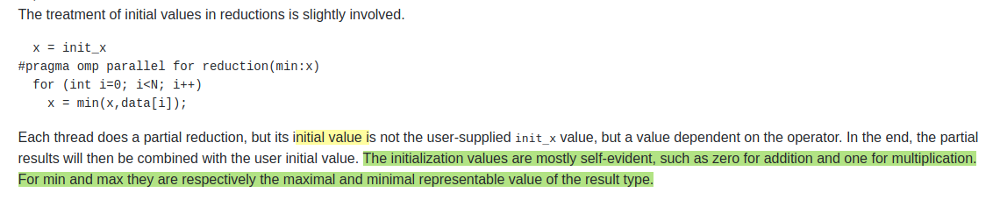
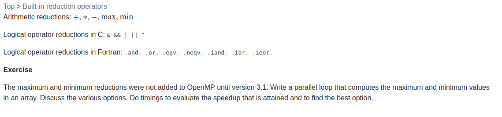
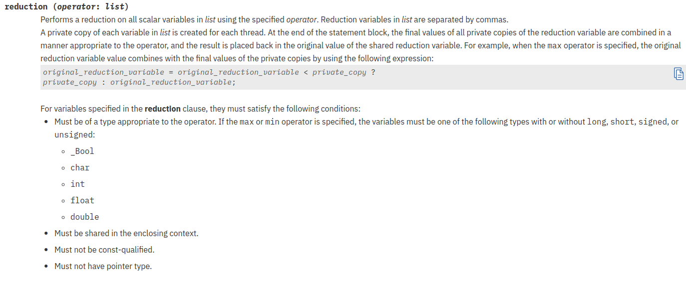
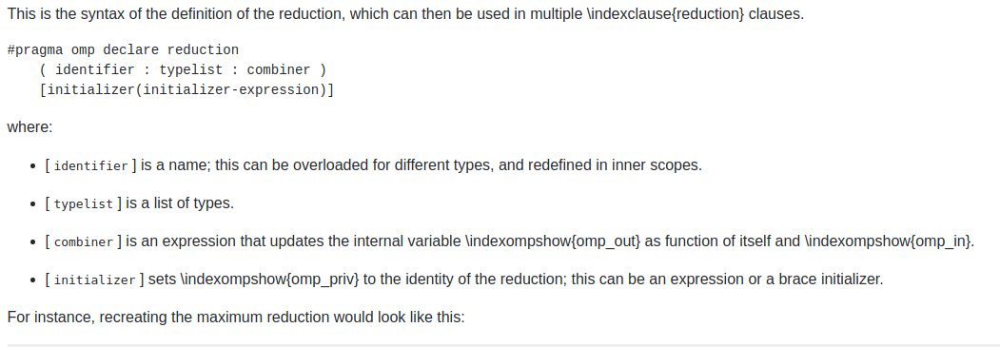
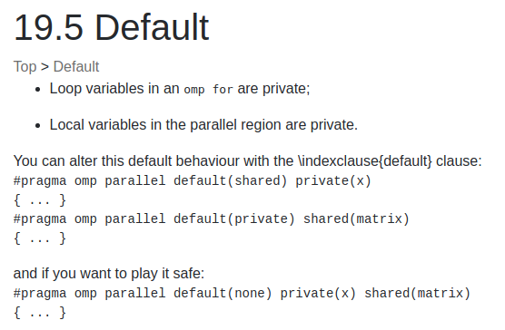
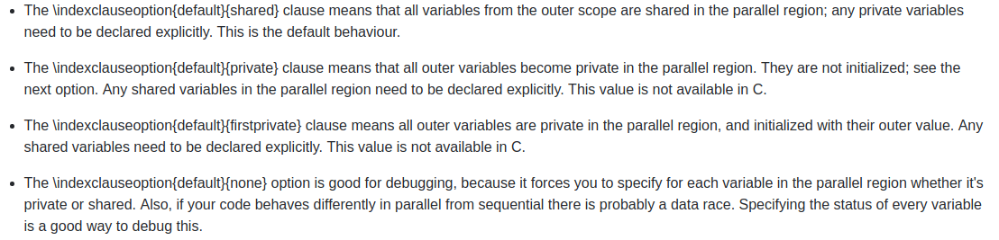

[TOC]

### [Configure CMakeLists](https://github.com/torbjoernk/openMP-Examples/blob/master/CMakeLists.txt)

[openmp/CMakeLists.txt at master · llvm-mirror/openmp · GitHub](https://github.com/llvm-mirror/openmp/blob/master/CMakeLists.txt)
```cmake
FIND_PACKAGE( OpenMP REQUIRED)
if(OPENMP_FOUND)
message("OPENMP FOUND")
set(CMAKE_C_FLAGS "${CMAKE_C_FLAGS} ${OpenMP_C_FLAGS}")  
set(CMAKE_CXX_FLAGS "${CMAKE_CXX_FLAGS} ${OpenMP_CXX_FLAGS}")  
set(CMAKE_EXE_LINKER_FLAGS "${CMAKE_EXE_LINKER_FLAGS} ${OpenMP_EXE_LINKER_FLAGS}") 
set(CMAKE_SHARE_LINKER_FLAGS "${CMAKE_SHARE_LINKER_FLAGS} ${OpenMP_SHARE_LINKER_FLAGS}")
endif()
```

### Example

```cpp
#ifdef _OPENMP
#include <omp.h>
#include <boost/thread.hpp>
#endif
int nthreads = omp_get_num_procs();
omp_set_dynamic(0);
#pragma omp parallel for num_threads(nthreads)
  for (std::size_t i = 0; i < CAMERA_NUM; ++i)
  {
    // use image_v replace undistort_image_v
    cv::undistort(image_v[i]->image, undistort_image_v[i], K_mat_v_[i](cv::Rect(0, 0, 3, 3)), D_mat_v_[i]);
    pc2img_v[i] = K_mat_v_[i] * T_mat_v_[i] * pc_m; // 3*N
  }
```

+ [获取计算机核的数目用于多线程](https://stackoverflow.com/questions/150355/programmatically-find-the-number-of-cores-on-a-machine)
  - C++11
  ```cpp
    #include <thread>
    unsigned concurentThreadsSupported = std::thread::hardware_concurrency();
  ```
  - boost
  ```cpp
    #include <boost/thread.hpp>
    unsigned int nthreads = boost::thread::hardware_concurrency();
  ```
  - OpenMP
  ```cpp
  int omp_get_num_procs();
  ```


### [reduction初值](http://pages.tacc.utexas.edu/~eijkhout/pcse/html/omp-reduction.html#Initialvalueforreductions)



+ 内置reduction操作




OpenMp将对reduction声明的变量在每个thread中新建一个副本，使用上面的规则对其进行初始化；每个thread使用该副本作为局部变量进行运算；最后将各个局部副本通过reduction声明的运算进行处理，再与global变量进行处理，恢复到global.

+ 自定义reduction

  With *user-defined reductions* , the programmer specifies the function that does the elementwise comparison. This takes two steps.

  - You need a function of two arguments that returns the result of the comparison. You can do this yourself, but, especially with the C++ standard library, you can use functions such as `std::vector::insert` .
  - Specifying how this function operates on two variables \indexompshow{omp_out} and \indexompshow{omp_in}, corresponding to the partially reduced result and the new operand respectively. The new partial result should be left in `omp_out` .
  - Optionally, you can specify the value to which the reduction should be initialized.

  

  ```cpp
  // ireduct.c
  int mymax(int r,int n) {
    // r is the already reduced value
    // n is the new value
    int m;
    if (n>r) {
      m = n;
    } else {
      m = r;
    }
    return m;
  }
  #pragma omp declare reduction \
    (rwz:int:omp_out=mymax(omp_out,omp_in)) \
    initializer(omp_priv=INT_MIN)
    m = INT_MIN;
  #pragma omp parallel for reduction(rwz:m)
    for (int idata=0; idata
  ```

### [controlling thread data](http://pages.tacc.utexas.edu/~eijkhout/pcse/html/omp-data.html)

+ shared data
  In a parallel region, any data declared outside it will be shared: any thread using a variable  x will access the same memory location associated with that variable.
  在parallel以外声明的变量都是shared,所有线程将访问同一位置。

+ private data
  在thread内部声明的变量只隶属于该线程。

  

  

```cpp
int n = 10;                 // shared
int a = 7;                  // shared
// int i = 0;
// for (i = 0; i < n; i++)　//循环迭代变量默认为private,即使i在上面定义
#pragma omp parallel for 
for (int i = 0; i < n; i++) // i private
{
    int b = a + i;          // b private
    ...
}
```

OpenMP does not put any restriction to prevent data races between shared variables. This is a responsibility of a programmer.

Shared variables introduce an overhead, because one instance of a variable is shared between multiple threads. Therefore, it is often best to minimize the number of shared variables when a good performance is desired.

```cpp
#pragma omp parallel for shared(n, a) private(b)
for (int i = 0; i < n; i++)
{
    b = a + i;
    ...
}
```

`b` is a private variable. When a variable is declared private, OpenMP replicates this variable and assigns its local copy to each thread. private变量不是那么直观，假设在并行区域之前变量`int p = 0`,在并行区域开始时，p是未定义的，在并行区域之后也是未定义的。

```cpp
int p = 0; 
// the value of p is 0

#pragma omp parallel private(p)
{
    // the value of p is undefined
    p = omp_get_thread_num();
    // the value of p is defined
    ...
}
// the value of p is undefined
```

可以将p的定义放在并行区域内，这样就不用使用private(p)来声明了。强烈推荐在并行区域内声明private变量。

+ Default

  两个版本的default(shared), default(none)

  - default(shared)

    ```cpp
    int a, b, c, n;
    ...
    #pragma omp parallel for default(shared)
    for (int i = 0; i < n; i++)
    {
        // using a, b, c
    }
    ```

    其中，a, b, c, n是shared.可使用该命令将大多数变量声明为shared,然后使用private进行声明私用变量。

    ```cpp
    int a, b, c, n;
    
    #pragma omp parallel for default(shared) private(a, b)
    for (int i = 0; i < n; i++)
    {
        // a and b are private variables
        // c and n are shared variables 
    }
    ```

  - default(none)

    该命令后，必须显式地声明变量的shared属性：

    ```cpp
    int n = 10;
    std::vector<int> vector(n);
    int a = 10;
    
    #pragma omp parallel for default(none) shared(n, vector)
    for (int i = 0; i < n; i++)
    {
        vector[i] = i * a;
    }
    ```

    编译器会报错，未定义的`a`，应该改为: `shared(n, vector, a)`.

**注意：**
 (1) 对于parallel区域始终声明`default(none)`，这样可以使编程人员仔细思考变量的shared属性。
 (2) 在parallel区域内定义private变量。

+ first and last private

   you saw that private variables are completely separate from any variables by the same name in the surrounding scope. However, there are two cases where you may want some *storage association* between a private variable and a global counterpart.

  ```c++
    int t=2;
  #pragma omp parallel firstprivate(t)
    {
      t += f( omp_get_thread_num() );
      g(t);
    }
  ```

  The variable `t` behaves like a private variable, except that it is initialized to the outside value.

  ```c++
  #pragma omp parallel for \
          lastprivate(tmp)
  for (i=0; i<N; i+) {
    tmp = ......
    x[i] = .... tmp ....
  }
  ..... tmp ....
  ```

  `tmp`紧跟`for`循环。

+ array data

  - Statically allocated data, that is with a syntax like

    ```c++
    int array[100];
    integer,dimension(:) :: array(100}
    ```

    can be shared or private, depending on the clause you use.

    ```c++
    int array[nthreads];
    {
      int t = 2;
      array += t;
      array[0] = t;
    }
    ```

    each thread gets a private copy of the array, properly initialized.

  - Dynamically allocated data, that is, created with `malloc` or `allocate` , can only be shared.

    ```c++
    int *array = (int*) malloc(nthreads*sizeof(int));
    #pragma omp parallel firstprivate(array)
    {
      int t = omp_get_thread_num();
      array += t;
      array[0] = t;
    }
    ```


### [for](http://jakascorner.com/blog/2016/05/omp-for.html)

```cpp
#pragma omp parallel [clauses]
{
    #pragma omp for [clauses]
    for (...)
    {
        // body 
    }
}
```

如果`#pragma omp parallel`中只有一个`#pragma omp for`可以简写为：

```cpp
#pragma omp parallel for [clauses]
for (...)
{

}
```

由于用parallel标识的并行块中每一行代码都会被多个线程处理，所以如果想让两个for循环之间的代码由一个线程执行的话就需要在代码前用single或master制导语句标识，master由是主线程执行，single是选一个线程执行，这个到底选哪个线程不确定。

```cpp

#pragma omp parallel
	{
#pragma omp for
		for (int i = 0; i < 6; i++)
			printf("i = %d, I am Thread %d\n", i, omp_get_thread_num());
#pragma omp master
		{
			//这里的代码由主线程执行
			printf("I am Thread %d\n", omp_get_thread_num());
		}
#pragma omp for
		for (int i = 0; i < 6; i++)
			printf("i = %d, I am Thread %d\n", i, omp_get_thread_num());
	}
```

