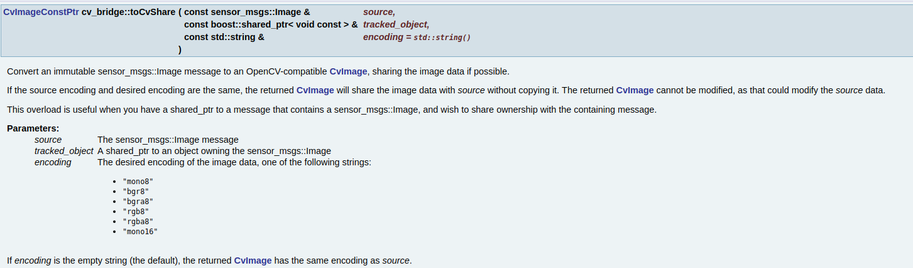
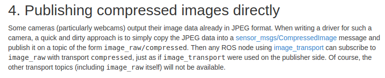

# Functions

1. 点云数据转化

     (1)`senser::msgs::PointCloud2`与`pcl::PointCloud2`
       [pcl/Overview - ROS Wiki](http://wiki.ros.org/pcl/Overview)
       `senser::msgs::PointCloud2`是ros的新定义的数据类型，取代`senser_msgs::PointCloud`(类型只能是float) 

     ROS的函数：
  ```cpp
  #include <pcl_conversions/pcl_conversions.h>
  pcl_conversions::toPCL(const sensor_msgs::PointCloud2 &pc2, pcl::PCLPointCloud2 &pcl_pc2)
  pcl_conversions::fromPCL(const pcl::PCLPointCloud2 &pcl_pc2, sensor_msgs::PointCloud2 &pc2)
  ```

​     (2)`pcl::PointCloud<T>`与`senser::msgs::PointCloud2`

  ```cpp
  pcl::toROSMsg(const pcl::PointCloud<T> &pcl_cloud, sensor_msgs::PointCloud2 &cloud)
  pcl::fromROSMsg(const sensor_msgs::PointCloud2 &cloud, pcl::PointCloud<T> &pcl_cloud)
template<typename T >
void moveFromROSMsg (sensor_msgs::PointCloud2 &cloud, pcl::PointCloud< T > &pcl_cloud) // 推荐使用
  ```

  ```cpp
  #include <pcl/conversions.h>
template<typename PointT> void
 fromPCLPointCloud2 (const pcl::PCLPointCloud2& msg, pcl::PointCloud<PointT>& cloud)
template<typename PointT> void
 toPCLPointCloud2 (const pcl::PointCloud<PointT>& cloud, pcl::PCLPointCloud2& msg)
  ```
其中`pcl::fromROSMsg() pcl::toROSMsg`已弃用,它们底层仍然是调用上面２个函数.
```cpp
template<typename PointT> void 
   85   fromROSMsg (const pcl::PCLPointCloud2& msg, pcl::PointCloud<PointT>& cloud)
   86   {
   87     fromPCLPointCloud2 (msg, cloud);
   88   }
template<typename PointT> void 
   98   toROSMsg (const pcl::PointCloud<PointT>& cloud, pcl::PCLPointCloud2& msg)
   99   {
  100     toPCLPointCloud2 (cloud, msg);
  101   }
```
pcl_ros extends the ROS C++ client library to support message passing with PCL native data types. Simply add the following include to your ROS node source code:
#include <pcl_ros/point_cloud.h>
This header allows you to publish and subscribe `pcl::PointCloud<T>` objects as ROS messages. These appear to ROS as sensor_msgs/PointCloud2 messages, offering seamless interoperability with non-PCL-using ROS nodes. For example, you may publish a `pcl::PointCloud<T> `in one of your nodes and visualize it in rviz using a Point Cloud2 display. It works by hooking into the roscpp serialization infrastructure.
The old format sensor_msgs/PointCloud is not supported in PCL.

2. ros header && pcl header
```cpp
#include<pcl_conversions/pcl_conversions.h>
00079   inline void fromPCL(const pcl::PCLHeader &pcl_header, std_msgs::Header &header)
00081   {
00082     header.stamp.fromNSec(pcl_header.stamp * 1000ull);  // Convert from us to ns 00083     header.seq = pcl_header.seq;
00084     header.frame_id = pcl_header.frame_id;
00085   }
00086 
00087   inline void toPCL(const std_msgs::Header &header, pcl::PCLHeader &pcl_header)
00089   {
00090     pcl_header.stamp = header.stamp.toNSec() / 1000ull;  // Convert from ns to us 00091     pcl_header.seq = header.seq;
00092     pcl_header.frame_id = header.frame_id;
00093   }
00094 
00095   inline std_msgs::Header fromPCL(const pcl::PCLHeader &pcl_header)
00097   {
00098     std_msgs::Header header;
00099     fromPCL(pcl_header, header);
00100     return header;
00101   }
00102 
00103   inline pcl::PCLHeader toPCL(const std_msgs::Header &header)
00105   {
00106     pcl::PCLHeader pcl_header;
00107     toPCL(header, pcl_header);
00108     return pcl_header;
00109   }

```

3. sensor_msgs::CompressedImageConstPtr img_msg到cv::Mat
```cpp
#include <cv_bridge/cv_bridge.h> 
#include <sensor_msgs/image_encodings.h>
sensor_msgs::CompressedImageConstPtr img_msg;
cv::Mat image = cv_bridge::toCvCopy(img_msg, sensor_msgs::image_encodings::BGR8)->image; //sensor_msgs::image_encodings::BGR8
```

4. sensor_msgs::ImageConstPtr img_msg与cv_bridge::CvImage共享data区
```cpp
const sensor_msgs::ImageConstPtr img0_ptr; // message
boost::shared_ptr<cv_bridge::CvImage const> image_v = cv_bridge::toCvShare(img0_ptr, sensor_msgs::image_encodings::BGR8);
```


5. cv::Mat转换为sensor_msgs::ImageConstPtr img_msg
```cpp
#include <cv_bridge/cv_bridge.h> 
#include <sensor_msgs/image_encodings.h>
#include <image_transport/image_transport.h>
image_transport::Publisher g_image_with_point_pub;
image_transport::ImageTransport it(nh);
g_image_with_point_pub = it.advertise("/image_with_point", 10);

cv_bridge::CvImage out_msg; out_msg.header   = in_msg->header; // Same timestamp and tf frame as input image out_msg.encoding = sensor_msgs::image_encodings::TYPE_8UC1; // Or whatever sensor_msgs::image_encodings::TYPE_8UC3　(rgb) out_msg.image    = sal_float_image; // Your cv::Mat g_image_with_point_pub.publish(out_msg.toImageMsg());

// cv::Mat 与　sensor_msgs::ImageConstPtr转换
const sensor_msgs::ImageConstPtr& image_msg
cv::Mat image;
  try
  {
    image = cv_bridge::toCvShare(image_msg)->image;
  }
catch (cv_bridge::Exception& e)
 {
    ROS_ERROR("cv_bridge exception: %s", e.what());
    return;
  }

pub.publish(cv_bridge::CvImage(image_msg->header, image_msg->encoding, image).toImageMsg());
```

6. 将sensor_msgs::CompressedImagePtr pc_ptr转换为cv::Mat
```cpp
#include <opencv2/imgproc/imgproc.hpp>
cv::Mat raw_image = cv::imdecode(cv::Mat(img_ptr->data), CV_LOAD_IMAGE_UNCHANGED);
```
[compressed_image_transport - ROS Wiki](http://wiki.ros.org/compressed_image_transport)
[ros-message-transport/compressed_publisher.cpp at master · ethz-asl/ros-message-transport · GitHub](https://github.com/ethz-asl/ros-message-transport/blob/master/compressed_imagem_transport/src/compressed_publisher.cpp)
