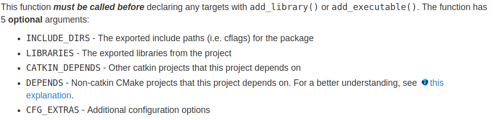
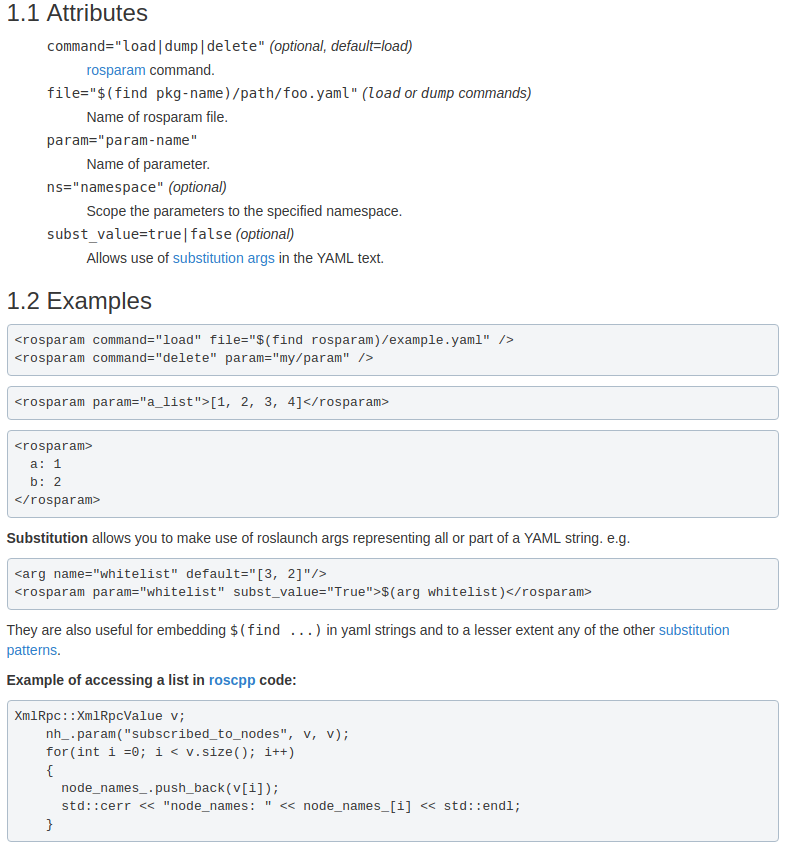

## Problems

### Publish Cloud
pcl_ros/point_cloud.h
[const class pcl::PointCloud<pcl::PointXYZRGB> has no member named ‘serializationLength’](https://answers.ros.org/question/35368/pointcloud-library-publishing/)
包含ros头文件`#include <pcl_ros/point_cloud.h>`,该头文件中有
```cpp
#include <ros/ros.h>
#include <pcl/point_cloud.h>
#include <pcl/point_traits.h>
#include <pcl/for_each_type.h>
#include <pcl/conversions.h>
#include <pcl_conversions/pcl_conversions.h>
#include <sensor_msgs/PointCloud2.h>
#include <boost/mpl/size.hpp>
#include <boost/ref.hpp>
```
这里面有pcl到ros点云的转换.

### rosbag record -O mybag /rslidar_points 将pcap保存为bag
以node的形式保存对应的topic为bag:(不推荐，node开启没有顺序保证)
```xml
<node pkg="rosbag" name="record" type="record" output="screen" args="-o /home/robosense/output_point_cloud /rslidar_points" />
```

### catkin_make编一个包
`catkin_make -DCATKIN_WHITELIST_PACKAGES= "包名"`

### 参看bag包的信息，topic为/rslidar32/rslidar_points
`rostopic echo /rslidar32/rslidar_points --noarr`

### rostopic echo /rslidar32/rslidar_points --noarr
`sudo apt-get install pcl_tools`

### 查看ros bag中的图片
`rqt_image_view`

### [xml使用format 2](http://wiki.ros.org/catkin/package.xml)
```xml
<package format="2">
  <name>sync_pointcloud_images</name>
  <version>0.1.0</version>
  <description>The sync_pointcloud_images package</description>

  <maintainer email="xshen@robosense.ai">Andysen</maintainer>

  <license>Apache 2.0</license>

  <buildtool_depend>catkin</buildtool_depend>

  <depend>nodelet</depend>
  <depend>roscpp</depend>
  <depend>message_filters</depend>
  <depend>sensor_msgs</depend>
  <export>
    <nodelet plugin="${prefix}/sync_pointcloud_images.xml"/>
  </export>
</package>
```

### rosbag filter
`filter <in-bag> <out-bag> <expression>`
截取某个片段，或者提取一个topic, expression使用Python语法: topic ,m(message), t(time of message)
To filter based on time, convert the time to a floating point number (use UNIX time, to get this value, use rosbag info):
`rosbag filter input.bag output.bag "t.secs <= 1284703931.86"`

### launch file "if , unless"
```xml
<launch>
  <arg name="using_namespace_flag" default="1" doc="Flag for p3 or single 32 beams lidar must be 0 or 1." />
  <arg name="lidar_param_file_path" default="$(find rslidar_pointcloud)/data/B16" doc="PCompressedImageConstPtrath of lidar parameter files (curves.csv, angle.csv, ChannelNum.csv)." />

  <group ns="middle" if="$(arg using_namespace_flag)">
    <node  name="cloud_node" pkg="rslidar_pointcloud" type="cloud_node" output="screen" >
      <param name="model" value="RS32"/>
      <param name="curves_path" value="$(arg lidar_param_file_path)/curves.csv" />
      <param name="angle_path" value="$(arg lidar_param_file_path)/angle.csv" />
      <param name="channel_path" value="$(arg lidar_param_file_path)/ChannelNum.csv" />
    </node>
  </group>

  <node  name="cloud_node" pkg="rslidar_pointcloud" type="cloud_node" output="screen" unless="$(arg using_namespace_flag)">
      <param name="model" value="RS32"/>
      <param name="curves_path" value="$(arg lidar_param_file_path)/curves.csv" />
      <param name="angle_path" value="$(arg lidar_param_file_path)/angle.csv" />
      <param name="channel_path" value="$(arg lidar_param_file_path)/ChannelNum.csv" />
  </node>

  <node pkg="drivable_area_test" name="drivable_area_test_node" type="drivable_area_test_node" output="screen" >
    <param name="topic" type="str" value="/middle/rslidar_points" if="$(arg using_namespace_flag)" />
    <param name="topic" type="str" value="/rslidar_points" unless="$(arg using_namespace_flag)" />
    <param name="height_diff_thres" type="double" value="0.08" />
    <param name="z_threshold" type="double" value="0.5" />
    <rosparam param="car_size">[-2, 2.5, -1, 1]</rosparam>  <!-- [xmin, xmax, ymin, ymax] -->
  </node>

  <node pkg="rviz" name="rviz" type="rviz"  args="-d $(find drivable_area_test)/rviz/drivable_area.rviz"/>

</launch>
```

### [catkin_package](http://wiki.ros.org/catkin/CMakeLists.txt)
**catkin_package()** is a catkin-provided CMake macro. This is required to specify catkin-specific information to the build system which in turn is used to generate pkg-config and CMake files.

Full macro documentation can be found [here](http://docs.ros.org/groovy/api/catkin/html/dev_guide/generated_cmake_api.html#catkin-package).
**find_package()** finds dependencies for this package.


### [一次编译一个包](http://mcs.une.edu.au/doc/python-catkin_tools-doc/html/verbs/catkin_build.html)
+ 一次编译一个，按照字母书序，最终编译完整个工作空间下的包
  `catkin build -p 1`
  `-p: --parallel-packages`
+ 编译指定的一个包
  `catkin build "package_name"`
+ 首先编译指定的一个包，然后编译其他包
  `catkin build --start-with "package_name"`


### [封装依赖与ros的deb包](https://gist.github.com/awesomebytes/196eab972a94dd8fcdd69adfe3bd1152)
+ indigo
```sh
bloom-generate rosdebian --os-name ubuntu --os-version trusty --ros-distro indigo
bloom-generate rosdebian --ros-distro indigo
fakeroot debian/rules binary
```
+ kinetic
```sh
bloom-generate rosdebian --os-name ubuntu --os-version xenial --ros-distro kinetic
fakeroot debian/rules binary
```

### [cmake获取ros版本](https://answers.ros.org/question/222608/best-way-to-get-distro-version-in-cmakeliststxt/)
```cmake
if("$ENV{ROS_DISTRO}" STRGREATER "hydro")
...
endif()
```

###  [Install](http://wiki.ros.org/rosdep) dependency of all packages in the workspace
Go to the top directory of your catkin workspace where the source code of the ROS packages you'd like to use are. Then run:
`rosdep install --from-paths src --ignore-src -r -y`

### rosbag更改topicROS中remap一个topic
+ rosbag remap
  `rosbag play test.bag /rslidar_points:=/test_topic`
+ roslaunch remap
  `<remap from="/image_raw" to="/camera/image_raw"/>`

### /camera/image_color/compressed -> /camera/image_color 
[compressed image to image - ROS Answers: Open Source Q&A Forum](https://answers.ros.org/question/35183/compressed-image-to-image/)
```xml
<arg name="image_base_topic" default="/image_color" />
<node name="decompress" type="republish" pkg="image_transport" output="screen" args="compressed in:=$(arg image_base_topic) raw out:=$(arg image_base_topic)" />
```
输入compressed topic中不要含有最后一个topic "compressed"，只订阅基本topic '/camera/image_color'

### /camera/image_color -> /camera/image_color/compressed

```xml
<arg name="image_base_topic" default="/camera/image_color" />
<arg name="raw_stream" default="true" />
<node if="$(arg raw_stream)" name="compress" type="republish" pkg="image_transport" output="screen" args="raw in:=$(arg image_base_topic) compressed out:=$(arg image_base_topic)" />
```

### 将其他工作空间设为当前工作空间可见 Extending

+ catkin config
  Utilize `catkin config --extend path_of_worksapce_devel` to configure. Then current workspace can access to it.
  `catkin config --extend /home/robosense/Project/rs_driver_ws/devel`
+ oad setup.*sh to system
  `echo "source /home/robosense/Project/rs_driver_ws/devel/setup.bash" >> ~/.bashrc`


### 指针类型参数作为返回值时，并且由调用函数内部的局部变量给该指针赋值，函数返回时，该指针所指的局部变量被析构，返回的指针中没有数据．
应该使用变量的引用，如下函数最后２个参数为返回值
```cpp
void cloud2ImageMsg(const CloudOS1& cloud, ns timestamp, const std::string& frame,
                    sensor_msgs::Image& intensity_img_msg, sensor_msgs::Image& distance_img_msg)
{
  std::size_t point_num = cloud.size();
  int cols = static_cast<int>(point_num) / pixels_per_column;
  std::size_t k = 0;
  cv::Mat intensity_mat(pixels_per_column, cols, CV_16UC1, cv::Scalar::all(0));
  cv::Mat distance_mat(pixels_per_column, cols, CV_32FC1, cv::Scalar::all(0));

  for (int i = 0; i < cols; ++i)
  {
    for (int j = 0; j < pixels_per_column; ++j, ++k)
    {
      if (std::isfinite(cloud.points[k].x) && std::isfinite(cloud.points[k].y) && std::isfinite(cloud.points[k].z))
      {
        intensity_mat.at<ushort>(j, i) = cloud.points[k].intensity;
        distance_mat.at<float>(j, i) = std::sqrt(cloud.points[k].x*cloud.points[k].x + cloud.points[k].y*cloud.points[k].y + cloud.points[k].z*cloud.points[k].z);
      }
    }
  }
//  cv::equalizeHist(intensity_mat, intensity_mat); //Source 8-bit single channel image.;
  std_msgs::Header header;
  header.stamp.fromNSec(timestamp.count());
  header.frame_id = frame;
  cv_bridge::CvImage(header, sensor_msgs::image_encodings::TYPE_16UC1, intensity_mat).toImageMsg(intensity_img_msg);
  cv_bridge::CvImage(header, sensor_msgs::image_encodings::TYPE_32FC1, distance_mat).toImageMsg(distance_img_msg);
  std::cout << intensity_img_msg.width << ", " << intensity_img_msg.height << ", " << intensity_img_msg.header.frame_id << std::endl;
}
```


### [ros publish消息时总是修改其seq值](https://answers.ros.org/question/55126/why-does-ros-overwrite-my-sequence-number/)

What happens is that I set the header.seq field in e.g. the sensor_msgs/Image message to something, but during publishing, ROS overwrites this number with a counter which is apparently kept in the ros::Publisher class itself. So, when I subscribe to the message, sequence numbers of sensor_msgs/Image always start with 0 and count up by one from here, no matter what I set in the header before my call to ros::Publisher::publish().
I dug a little deeper and found that I can prevent this by using `ros::AdvertiseOptions`.
```cpp
ros::NodeHandle n;
ros::AdvertizeOptions op = ros::AdvertiseOptions::create<sensor_msgs::Image>("/foo", 1, &connected, &disconnected, ros::VoidPtr(), NULL);
op.has_header = false;
ros::Publisher pub = n.advertise(op);
```
这种解决方式只是告诉ros没有header来存储sequence number的值，这样它就不会去更改其值了。最好的解决方式是自己定义一个新的消息，里面包含sequence值。
The sequence number is the sequence number of published messages. You are not supposed to change that or set that yourself as then you could only do it exactly as is or wrong (according to what it is supposed to be). This is why you can't change it nicely.

### [rosparam](http://wiki.ros.org/roslaunch/XML/rosparam)
