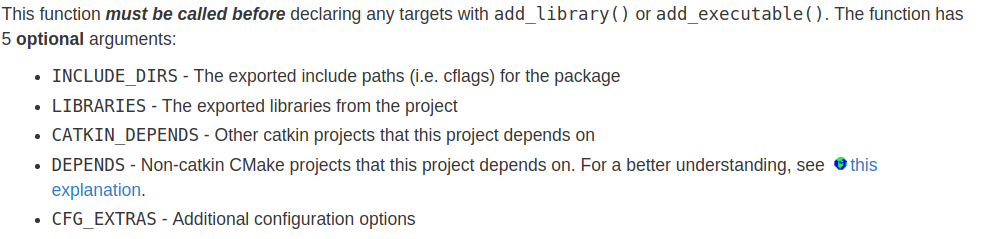
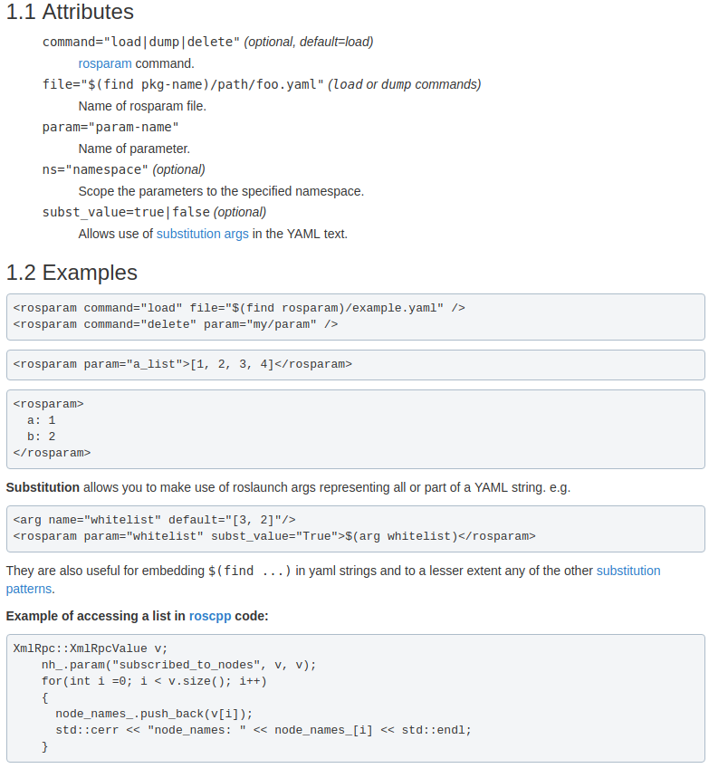
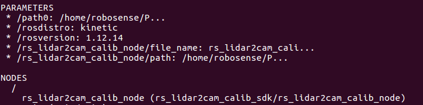
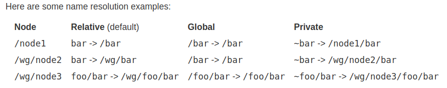

[TOC]

## Problems

### Publish Cloud

pcl_ros/point_cloud.h
[const class pcl::PointCloud<pcl::PointXYZRGB> has no member named ‘serializationLength’](https://answers.ros.org/question/35368/pointcloud-library-publishing/)
包含ros头文件`#include <pcl_ros/point_cloud.h>`,该头文件中有

```cpp
#include <ros/ros.h>
#include <pcl/point_cloud.h>
#include <pcl/point_traits.h>
#include <pcl/for_each_type.h>
#include <pcl/conversions.h>
#include <pcl_conversions/pcl_conversions.h>
#include <sensor_msgs/PointCloud2.h>
#include <boost/mpl/size.hpp>
#include <boost/ref.hpp>
```
这里面有pcl到ros点云的转换.

### rosbag record -O mybag /rslidar_points 将pcap保存为bag
以node的形式保存对应的topic为bag:(不推荐，node开启没有顺序保证)
```xml
<node pkg="rosbag" name="record" type="record" output="screen" args="-o /home/robosense/output_point_cloud /rslidar_points" />
```

### catkin_make编一个包
`catkin_make -DCATKIN_WHITELIST_PACKAGES= "包名"`

### 参看bag包的信息，topic为/rslidar32/rslidar_points
`rostopic echo /rslidar32/rslidar_points --noarr`

### rostopic echo /rslidar32/rslidar_points --noarr

`sudo apt-get install pcl_tools`

### 查看ros bag中的图片
`rqt_image_view`

### [xml使用format 2](http://wiki.ros.org/catkin/package.xml)
```xml
<package format="2">
  <name>sync_pointcloud_images</name>
  <version>0.1.0</version>
  <description>The sync_pointcloud_images package</description>

  <maintainer email="xshen@robosense.ai">Andysen</maintainer>

  <license>Apache 2.0</license>

  <buildtool_depend>catkin</buildtool_depend>

  <depend>nodelet</depend>
  <depend>roscpp</depend>
  <depend>message_filters</depend>
  <depend>sensor_msgs</depend>
  <export>
    <nodelet plugin="${prefix}/sync_pointcloud_images.xml"/>
  </export>
</package>
```

### rosbag filter
`filter <in-bag> <out-bag> <expression>`
截取某个片段，或者提取一个topic, expression使用Python语法: topic ,m(message), t(time of message)
To filter based on time, convert the time to a floating point number (use UNIX time, to get this value, use rosbag info):
`rosbag filter input.bag output.bag "t.secs <= 1284703931.86"`

`rosbag filter industry_5_cameras.bag five_cameras.bag "(topic == '/camera_front/image_color/compressed' or topic == '/camera_left1/image_color/compressed' or topic == '/camera_left2/image_color/compressed' or topic == '/camera_right1/image_color/compressed' or topic == '/camera_right2/image_color/compressed') and t.secs >= 1535192233 and t.secs <= 1535192243"`

### launch file "if , unless"

```xml
<launch>
  <arg name="using_namespace_flag" default="1" doc="Flag for p3 or single 32 beams lidar must be 0 or 1." />
  <arg name="lidar_param_file_path" default="$(find rslidar_pointcloud)/data/B16" doc="PCompressedImageConstPtrath of lidar parameter files (curves.csv, angle.csv, ChannelNum.csv)." />

  <group ns="middle" if="$(arg using_namespace_flag)">
    <node  name="cloud_node" pkg="rslidar_pointcloud" type="cloud_node" output="screen" >
      <param name="model" value="RS32"/>
      <param name="curves_path" value="$(arg lidar_param_file_path)/curves.csv" />
      <param name="angle_path" value="$(arg lidar_param_file_path)/angle.csv" />
      <param name="channel_path" value="$(arg lidar_param_file_path)/ChannelNum.csv" />
    </node>
  </group>

  <node  name="cloud_node" pkg="rslidar_pointcloud" type="cloud_node" output="screen" unless="$(arg using_namespace_flag)">
      <param name="model" value="RS32"/>
      <param name="curves_path" value="$(arg lidar_param_file_path)/curves.csv" />
      <param name="angle_path" value="$(arg lidar_param_file_path)/angle.csv" />
      <param name="channel_path" value="$(arg lidar_param_file_path)/ChannelNum.csv" />
  </node>

  <node pkg="drivable_area_test" name="drivable_area_test_node" type="drivable_area_test_node" output="screen" >
    <param name="topic" type="str" value="/middle/rslidar_points" if="$(arg using_namespace_flag)" />
    <param name="topic" type="str" value="/rslidar_points" unless="$(arg using_namespace_flag)" />
    <param name="height_diff_thres" type="double" value="0.08" />
    <param name="z_threshold" type="double" value="0.5" />
    <rosparam param="car_size">[-2, 2.5, -1, 1]</rosparam>  <!-- [xmin, xmax, ymin, ymax] -->
  </node>

  <node pkg="rviz" name="rviz" type="rviz"  args="-d $(find drivable_area_test)/rviz/drivable_area.rviz"/>

</launch>
```

### [catkin_package](http://wiki.ros.org/catkin/CMakeLists.txt)
**catkin_package()** is a catkin-provided CMake macro. This is required to specify catkin-specific information to the build system which in turn is used to generate pkg-config and CMake files.

Full macro documentation can be found [here](http://docs.ros.org/groovy/api/catkin/html/dev_guide/generated_cmake_api.html#catkin-package).
**find_package()** finds dependencies for this package.


### [一次编译一个包](http://mcs.une.edu.au/doc/python-catkin_tools-doc/html/verbs/catkin_build.html)
+ 一次编译一个，按照字母书序，最终编译完整个工作空间下的包
  `catkin build -p 1`
  `-p: --parallel-packages`
+ 编译指定的一个包
  `catkin build "package_name"`
+ 首先编译指定的一个包，然后编译其他包
  `catkin build --start-with "package_name"`


### [封装依赖与ros的deb包](https://gist.github.com/awesomebytes/196eab972a94dd8fcdd69adfe3bd1152)
+ indigo
```sh
bloom-generate rosdebian --os-name ubuntu --os-version trusty --ros-distro indigo
bloom-generate rosdebian --ros-distro indigo
fakeroot debian/rules binary
```
+ kinetic
```sh
bloom-generate rosdebian --os-name ubuntu --os-version xenial --ros-distro kinetic
fakeroot debian/rules binary
```

### [cmake获取ros版本](https://answers.ros.org/question/222608/best-way-to-get-distro-version-in-cmakeliststxt/)
```cmake
if("$ENV{ROS_DISTRO}" STRGREATER "hydro")
...
endif()
```

###  [Install](http://wiki.ros.org/rosdep) dependency of all packages in the workspace

Go to the top directory of your catkin workspace where the source code of the ROS packages you'd like to use are. Then run:
`rosdep install --from-paths src --ignore-src -r -y`

### rosbag更改topicROS中remap一个topic
+ rosbag remap
  `rosbag play test.bag /rslidar_points:=/test_topic`
+ roslaunch remap
  `<remap from="/image_raw" to="/camera/image_raw"/>`

### /camera/image_color/compressed -> /camera/image_color 
[compressed image to image - ROS Answers: Open Source Q&A Forum](https://answers.ros.org/question/35183/compressed-image-to-image/)

```xml
<arg name="image_base_topic" default="/image_color" />
<node name="decompress" type="republish" pkg="image_transport" output="screen" args="compressed in:=$(arg image_base_topic) raw out:=$(arg image_base_topic)" />
```
```sh
rosrun image_transport republish compressed in:=/camera_front/image_color raw out:=/camera_front/image_color
```


输入compressed topic中不要含有最后一个topic "compressed"，只订阅基本topic '/camera/image_color'

### /camera/image_color -> /camera/image_color/compressed

```xml
<arg name="image_base_topic" default="/camera/image_color" />
<arg name="raw_stream" default="true" />
<node if="$(arg raw_stream)" name="compress" type="republish" pkg="image_transport" output="screen" args="raw in:=$(arg image_base_topic) compressed out:=$(arg image_base_topic)" />
```

### 将其他工作空间设为当前工作空间可见 Extending

+ catkin config
  Utilize `catkin config --extend path_of_worksapce_devel` to configure. Then current workspace can access to it.
  `catkin config --extend /home/robosense/Project/rs_driver_ws/devel`
+ oad setup.*sh to system
  `echo "source /home/robosense/Project/rs_driver_ws/devel/setup.bash" >> ~/.bashrc`


### 指针类型参数作为返回值时，并且由调用函数内部的局部变量给该指针赋值，函数返回时，该指针所指的局部变量被析构，返回的指针中没有数据．
应该使用变量的引用，如下函数最后２个参数为返回值
```cpp
void cloud2ImageMsg(const CloudOS1& cloud, ns timestamp, const std::string& frame,
                    sensor_msgs::Image& intensity_img_msg, sensor_msgs::Image& distance_img_msg)
{
  std::size_t point_num = cloud.size();
  int cols = static_cast<int>(point_num) / pixels_per_column;
  std::size_t k = 0;
  cv::Mat intensity_mat(pixels_per_column, cols, CV_16UC1, cv::Scalar::all(0));
  cv::Mat distance_mat(pixels_per_column, cols, CV_32FC1, cv::Scalar::all(0));

  for (int i = 0; i < cols; ++i)
  {
    for (int j = 0; j < pixels_per_column; ++j, ++k)
    {
      if (std::isfinite(cloud.points[k].x) && std::isfinite(cloud.points[k].y) && std::isfinite(cloud.points[k].z))
      {
        intensity_mat.at<ushort>(j, i) = cloud.points[k].intensity;
        distance_mat.at<float>(j, i) = std::sqrt(cloud.points[k].x*cloud.points[k].x + cloud.points[k].y*cloud.points[k].y + cloud.points[k].z*cloud.points[k].z);
      }
    }
  }
//  cv::equalizeHist(intensity_mat, intensity_mat); //Source 8-bit single channel image.;
  std_msgs::Header header;
  header.stamp.fromNSec(timestamp.count());
  header.frame_id = frame;
  cv_bridge::CvImage(header, sensor_msgs::image_encodings::TYPE_16UC1, intensity_mat).toImageMsg(intensity_img_msg);
  cv_bridge::CvImage(header, sensor_msgs::image_encodings::TYPE_32FC1, distance_mat).toImageMsg(distance_img_msg);
  std::cout << intensity_img_msg.width << ", " << intensity_img_msg.height << ", " << intensity_img_msg.header.frame_id << std::endl;
}
```


### [ros publish消息时总是修改其seq值](https://answers.ros.org/question/55126/why-does-ros-overwrite-my-sequence-number/)

What happens is that I set the header.seq field in e.g. the sensor_msgs/Image message to something, but during publishing, ROS overwrites this number with a counter which is apparently kept in the ros::Publisher class itself. So, when I subscribe to the message, sequence numbers of sensor_msgs/Image always start with 0 and count up by one from here, no matter what I set in the header before my call to ros::Publisher::publish().
I dug a little deeper and found that I can prevent this by using `ros::AdvertiseOptions`.
```cpp
ros::NodeHandle n;
ros::AdvertizeOptions op = ros::AdvertiseOptions::create<sensor_msgs::Image>("/foo", 1, &connected, &disconnected, ros::VoidPtr(), NULL);
// 可将&connected, &disconnected设置为NULL
op.has_header = false;
ros::Publisher pub = n.advertise(op);
```
这种解决方式只是告诉ros没有header来存储sequence number的值，这样它就不会去更改其值了。最好的解决方式是自己定义一个新的消息，里面包含sequence值。
The sequence number is the sequence number of published messages. You are not supposed to change that or set that yourself as then you could only do it exactly as is or wrong (according to what it is supposed to be). This is why you can't change it nicely.

### [rosparam](http://wiki.ros.org/roslaunch/XML/rosparam)



#### [names](http://wiki.ros.org/Names)

节点可以访问自己以及之上的命名空间的变量

有4种类型的名字：*base, relative, global, private*

+ base

  没有命名空间限定符，不包含`~`, `/`，比如rs_lidar2cam_calib_node，通常用来初始化节点名称

  ```cpp
    ros::init(argc, argv, "rs_lidar2cam_calib_node");
  ```

+ relative

  不以`~`, `/`开头的变量都是relative类型，默认情况下，名称解析是相对于节点的命名空间，例如/wg/node1的命名空间是/wg

  ```xml
  <param name="path0" type="str" value="$(find rs_lidar2cam_calib_sdk)/config" />
  <node pkg="rs_lidar2cam_calib_sdk" type="rs_lidar2cam_calib_node" name="rs_lidar2cam_calib_node" output="screen" required="true">
      <param name="path" type="str" value="$(find rs_lidar2cam_calib_sdk)/config" />
      <param name="file_name" type="str" value="rs_lidar2cam_calib.yaml" />
  </node>
  ```

  ```cpp
  ros::NodeHandle nh;
  ros::NodeHandle priv_nh("~");
  
  // path file_name只能通过riv_nh获取，或者使用ros::param::get("~path", path),它们包含在node里面，为私有类型
  std::string config_path, file_name, path;
  priv_nh.getParam("path", config_path);
  priv_nh.getParam("file_name", file_name);
  // 只能通过nh访问，非private类型
  nh.getParam("path0", path);
  
  // launch 文件中 ns=="node_namespace"
  ros::init(argc, argv, "node_name"); // node name
  ros::NodeHandle n; //n 命名空间为/node_namespace
  ros::NodeHandle n1("sub"); // n1命名空间为/node_namespace/sub
  ros::NodeHandle n2(n1,"sub2");// n2命名空间为/node_namespace/sub/sub2
  ros::NodeHandle pn1("~"); //pn1 命名空间为/node_namespace/node_name
  ros::NodeHandle pn2("~sub"); //pn2 命名空间为/node_namespace/node_name/sub
  ros::NodeHandle pn3("~/sub"); //pn3 命名空为/node_namespace/node_name/sub
  ros::NodeHandle gn("/global"); // gn 命名空间为/global
  ————————————————
  版权声明：本文为CSDN博主「jack_20」的原创文章，遵循 CC 4.0 BY-SA 版权协议，转载请附上原文出处链接及本声明。
  原文链接：https://blog.csdn.net/jack_20/article/details/70746736
  ```


  

  ```cpp
  ros::NodeHandle nh("my_namespace");
  ```

  This makes any *relative* [name](http://wiki.ros.org/Names) used with that `NodeHandle` relative to `<node_namespace>/my_namespace` instead of just  `<node_namespace>`. You can also specify a parent `NodeHandle` and a namespace to append:

  ```cpp
  ros::NodeHandle nh1("ns1");
  ros::NodeHandle nh2(nh1, "ns2");
  ```

  [This puts `nh2` into the `<node_namespace>/ns1/ns2` namespace.](http://wiki.ros.org/roscpp/Overview/NodeHandles)，与相对名称使用默认命名空间来解析计算图源名称不同的是，私有名称使用它们的节点名称作为命名空间来解析。 

+ global

  以`/`开头的变量

+ private

  `~`开头的变量

  


### [参数服务器](https://www.ncnynl.com/archives/201702/1295.html)

https://www.cnblogs.com/lvchaoshun/p/6873142.html

+ ROS参数服务器能保存数据类型包括：strings, integers, floats, booleans, lists, dictionaries, iso8601 dates, and base64-encoded data。Dictionaries则必需有字符串key值。
+ roscpp参数API能支持全部类型，多数情况容易使用的类型有：strings, integers, floats and booleans，使用其他类型参考[XmlRpc::XmlRpcValue class](http://docs.ros.org/api/xmlrpcpp/html/classXmlRpc_1_1XmlRpcValue.html)
+ roscpp有两个版本的API接口：bare版和handle版
  - bare版：在 ros::param 命令空间下，Parameters retrieved through the "bare" version are resolved relative to the node's namespace.
  - handle版：通过ros::NodeHandle接口使用，Parameters retrieved through the `NodeHandle` version are resolved relative to that `NodeHandle`'s namespace.

#### 设置参数

+ NodeHandle版本

  + ros::NodeHandle::setParam()

  + NodeHandle版本：参数相对于NodeHandle的命名空间进行解析。[查阅NodeHandle详细信息](http://www.ncnynl.com/archives/201701/1297.html)

  + 代码示例：

    ```cpp
    ros::NodeHandle nh;
    nh.setParam("/global_param", 5);
    nh.setParam("relative_param", "my_string");
    nh.setParam("bool_param", false);
    ```


+ bare版本

  + ros::param::set()

  + bare版本：参数相对于节点的命名空间进行解析

  + 代码示例：

    ```cpp
    ros::param::set("/global_param", 5);
    ros::param::set("relative_param", "my_string");
    ros::param::set("bool_param", false);
    ```

#### 检测参数是否存在

+ NodeHandle版：ros::NodeHandle::hasParam()

  ```cpp
  ros::NodeHandle nh;
  if (nh.hasParam("my_param"))
  {
    ...
  }
  ```

+ bare版：ros::param::has()

  ```cpp
  if (ros::param::has("my_param"))
  {
    ...
  }
  ```

#### 删除参数

+ handle版：ros::NodeHandle::deleteParam()

  ```cpp
  ros::NodeHandle nh;
  nh.deleteParam("my_param");
  ```

+ bare版：ros::param::del()

  ```cpp
  ros::param::del("my_param");
  ```

#### 访问私有参数

+ handle版：创建的ros::NodeHandle实例，并提供私有的命名空间作为其命名空间

  ```cpp
  ros::NodeHandle nh("~");
  std::string param;
  nh.getParam("private_name", param);
  
  ros::init(argc, argv, "my_node_name");
  ros::NodeHandle nh1("~");  // must be in main()
  ros::NodeHandle nh2("~foo");
  // nh1's namespace is /my_node_name, and nh2's namespace is /my_node_name/foo.
  ```

+ bare版：您可以访问用于描述它们的相同符号的私有参数

  ```cpp
  std::string param;
  ros::param::get("~private_name", param);
  ```

#### 参数列表

+ 在groovy版新增

+ 你可以获取或设置lists、dictionaries和strings作为std::vector 和std::map 容器的模板值

+ 这些模板值类型包括：bool, int, float, double, string

+ 获取或设置方法：

  - handle版： ros::NodeHandle::getParam / ros::NodeHandle::setParam
  - bare版：ros::param::get / ros::param::set

  ```cpp
  // Create a ROS node handle
  ros::NodeHandle nh;
  
  // Construct a map of strings
  std::map<std::string,std::string> map_s, map_s2;
  map_s["a"] = "foo";
  map_s["b"] = "bar";
  map_s["c"] = "baz";
  
  // Set and get a map of strings
  nh.setParam("my_string_map", map_s);
  nh.getParam("my_string_map", map_s2);
  
  // Sum a list of doubles from the parameter server
  std::vector<double> my_double_list;
  double sum = 0;
  nh.getParam("my_double_list", my_double_list);
  for(unsigned i=0; i < my_double_list.size(); i++) {
    sum += my_double_list[i];
  }
  ```


### [ros use opencv with cuda](https://answers.ros.org/question/242376/having-trouble-using-cuda-enabled-opencv-with-kinetic/?answer=242935?answer=242935#post-id-242935)

改变ros查找opencv的路径，并且重新编译ros中依赖opencv的包

```cmake
find_package(OpenCV REQUIRED
NO_MODULE # should be optional, tells CMake to use config mode
PATHS /usr/local # look here
NO_DEFAULT_PATH) # and don't look anywhere else
```

重新编译`vision_opencv`package, Packages for interfacing ROS with OpenCV, a library of programming functions for real time computer vision.


### [uninstall ros](https://answers.ros.org/question/57213/how-i-completely-remove-all-ros-from-my-system/)

```sh
sudo apt-get purge ros-\*
sudo apt-get autoremove
```

 

### [sensor_msg::ImageCompressed to cv::Mat](https://answers.ros.org/question/51490/sensor_msgscompressedimage-decompression/)

```cpp
   cv::Mat input_image = cv::imdecode(cv::Mat(input_image_msg->data), 1);
```


### [launch文件详解](https://zhuanlan.zhihu.com/p/86780027)

+ node

  启动文件的核心是启动ROS节点，采用`<node>`标签定义，语法如下：

  ```json
  <node name="node-name" pkg="package-name" type="executable-name"/>
  ```

  从上边的定义规则可以看出，在启动文件中启动一个节点需要三个属性：name、pkg和type。其中`name`属性用来定义节点运行的名称，**将覆盖节点中`ros::init()`定义的节点名称**；`pkg`属性定义节点所在的功能包名称，`type`属性定义节点的可执行文件名称，这两个属性等同于在终端中使用rosrun命令执行节点时的输入参数。这是三个最常用的属性，在某些情况下，我们还有可能用到以下属性：

  属性作用`output="screen"`终端输出转储在当前的控制台上，而不是在日志文件中`respawn="true"`当roslaunch启动完所有该启动的节点之后，会监测每一个节点，保证它们正常的运行状态。对于任意节点，当它终止时，roslaunch 会将该节点重启`required="true"`当被此属性标记的节点终止时，roslaunch会将其他的节点一并终止。注意此属性不可以与`respawn="true"`一起描述同一个节点

  `ns = "NAME_SPACE"`这个属性可以让你在自定义的命名空间里运行节点`args = "arguments"`节点需要的输入参数

  当使用`rosrun pkg node`时，启动的node名字是`ros::init()`中定义的名字；使用launch文件时，node name会替换掉`ros::init()`中的名字。

  ```cpp
  int main(int argc, char** argv)
  {
    ros::init(argc, argv, "node_name_init");
    ros::NodeHandle nh;
    ros::NodeHandle priv_nh("~");
      
    std::string config_path, file_name;
    priv_nh.getParam("path", config_path);
    nh.getParam("file_name", file_name);
    std::cout << "path: " << config_path << std::endl;
    std::cout << "file_name: " << file_name << std::endl;
      
    g_marker_image_pub = priv_nh.advertise<sensor_msgs::Image>("marker_image", 10);
    g_board_cloud_pub = nh.advertise<sensor_msgs::PointCloud2>("board_cloud", 10);
    
    ros::spin();
    return 0;
  }
  ```

  launch file为：

  ```xml
  <launch>
    <!-- file_name 为global变量-->
    <param name="file_name" type="str" value="rs_lidar2cam_calib.yaml" />
    <node pkg="rs_lidar2cam_calib_sdk" type="rs_lidar2cam_calib_node" name="node_name_launch" output="screen" required="true">
      <!-- path 为private变量-->
      <param name="path" type="str" value="$(find rs_lidar2cam_calib_sdk)/config" />
    </node>
  </launch>
  ```

  - 使用rosrun

    ```sh
    roscore
    rosrun rs_lidar2cam_calib_sdk rs_lidar2cam_calib_node _path:=hahah
    ```

    输出信息：

    ```sh
    path: hahah
    file_name:
    
    # rosnode list
    /node_name_init # 使用的init名字
    /rosout
    
    # rosnode info /node_name_init
    ---------------------------------------------------------------------
    Node [/node_name_init]
    Publications: 
     * /board_cloud [sensor_msgs/PointCloud2] # nh
     * /node_name_init/marker_image [sensor_msgs/Image] # priv_nh
     * /rosout [rosgraph_msgs/Log]
    
    Subscriptions: None
    
    Services: 
     * /node_name_init/get_loggers
     * /node_name_init/set_logger_level
    
    
    contacting node http://robosense:34589/ ...
    Pid: 10367
    Connections:
     * topic: /rosout
        * to: /rosout
        * direction: outbound
        * transport: TCPROS
    
    
    ```

  - 使用roslaunch

    ```sh
    roslaunch rs_lidar2cam_calib_sdk rs_lidar2cam_calib_node.launch
    ```

    输出：

    ```sh
    path: /home/robosense/Project/calibration_ws/lidar_camera/lidar_camera_3d_point/src/aruco_map_calib/rs_lidar2cam_calib_sdk/config
    file_name: rs_lidar2cam_calib.yaml
    
    # rosnode list
    /node_name_launch # launch文件中的node name替换init中的node_name
    /rosout
    
    # rosnode info /node_name_launch
    --------------------------------------------------------------------------------
    Node [/node_name_launch]
    Publications: 
     * /board_cloud [sensor_msgs/PointCloud2] # nh
     * /node_name_launch/marker_image [sensor_msgs/Image] # priv_nh
     * /rosout [rosgraph_msgs/Log]
    
    Subscriptions: None
    
    Services: 
     * /node_name_launch/get_loggers
     * /node_name_launch/set_logger_level
    
    contacting node http://robosense:38733/ ...
    Pid: 10832
    Connections:
     * topic: /rosout
        * to: /rosout
        * direction: outbound
        * transport: TCPROS
    
    ```

  - 参考

    https://www.cnblogs.com/klcf0220/p/11049857.html

    https://zhuanlan.zhihu.com/p/86780027

    https://www.jianshu.com/p/02ee8f513295

### [rosbag record buffer exceeded](https://blog.csdn.net/qq_34570910/article/details/88990373)

+ 提高rosbag的缓存空间

  ```sh
  rosbag record -o /home/inin/data/ -b 4096 /occam/stitched_image0 /occam/image_tiles0
  ```

  rosbag 中加入-b num ,即为将缓存空间设置成num大小，默认为256M，如果设置为0则没有限制

+ 保存  compressed类型数据

  存储图像的压缩格式/compressed,可有效减小数据写入大小(1min=1G)，然而压缩后的图像是一种有损压缩对图像质量要求极高的情况慎用，当然一般做视觉计算是无所谓的，相当于把raw格式的图片转换为jpeg格式。

  ```sh
  rosrun image_view image_view image:=/occam/image_tiles0 compressed
  ```
