[TOC]

# Git

## Tips

### Creat a new repository

+ Git global setup

  ```sh
  git config --global user.name "ShenXiao"
  git config --global user.email "shenxiao@gmai.com"
  ```

+ Create a new repository

  ```sh
  git clone git@192.168.1.20:deep_learning_slam/l3/l3_net.git
  cd l3_net
  touch README.md
  git add README.md
  git commit -m "add README"
  git push -u origin master
  ```

+ Existing folder

  ```sh
  cd existing_folder
  git init
  git remote add origin git@192.168.1.20:deep_learning_slam/l3/l3_net.git
  git add .
  git commit -m "Initial commit"
  git push -u origin master
  ```

+ Existing Git repository

  ```sh
  cd existing_repo
  git remote rename origin old-origin
  git remote add origin git@192.168.1.20:deep_learning_slam/l3/l3_net.git
  git push -u origin --all
  git push -u origin --tags
  ```

### [Commit messages guide](https://github.com/RomuloOliveira/commit-messages-guide/blob/master/README_zh-CN.md)


## Problems

### [一个本地git repository关联多个remote repository](https://www.zhihu.com/question/46543115)  
格式为：
`git push [远程库名] [本地分支名] : [远程分支名]`  
如果本地和远程的分支名一样，那么直接push:

```
git push github branch1
git push coding branch1
```
如果本地分支名和远程不同，则需要写全：
```
git push coding localbranch:branch1
git push github localbranch:branch1
```
如果有多个远程仓库，可以写一个push的脚本文件。

### git撤销  

- 撤销git add的内容, 取消暂存的文件  
```
git reset HEAD file
git rm --cached <file>
```
- 提交完了才发现漏掉了几个文件没有添加，或者提交信息写错了  
```
git commit -m 'initial commit'
git add forgotten_file
git commit --amend --no-edit
```
- 改乱了工作区某个文件的内容，想直接丢弃工作区的修改，用命令`git checkout -- file`  

- 不但修改了工作区的内容，还添加到了暂存区，想丢弃修改，分两步：

  ```sh
  git reset HEAD file
  git checkout -- file
  ```

- git commit 版本回退  
  HEAD指向的版本就是当前版本，因此，Git允许我们在版本的历史之间穿梭，使用命令`git reset --hard commit_id`，穿梭前，用git log可以查看提交历史，以便确定要回退到哪个版本，要重返未来，用git reflog查看命令历史，以便确定要回到未来的哪个版本。

- [删除本地的commit](https://stackoverflow.com/questions/5097456/throw-away-local-commits-in-git)

  删除超过远程的几个commit:

  ```sh
  If your excess commits are only visible to you, you can just do  git reset --hard origin/<branch_name> to move back to where the origin is. This will reset the state of the repository to the previous commit, and it will discard all local changes.
  
  Doing a git revert makes new commits to remove old commits in a way that keeps everyone's history sane.
  ```

  当`git pull git reset --hard commit_id`后，修改，然后再提交，此时本地和远程冲突，拒绝push，此时可以用`git push -f orgin master`,如果`master`被保护，还需要在gitlab中设置取消保护，才能`force push`.

  `setting --> Repository --> Protected Branches`

- 本地误删文件恢复
```
git checkout -- test.txt
```


### 暂存

git stash 可用来暂存当前正在进行的工作，比如想 pull 最新代码又不想 commit ， 或者另为了修改一个紧急的 bug ，先 stash，使返回到自己上一个 commit,，改完 bug 之后再 stash pop , 继续原来的工作；

添加缓存栈： git stash ;
查看缓存栈： git stash list ;
推出缓存栈： git stash pop ;
取出特定缓存内容： git stash apply stash@{1} ;

### git发布  
生成tag:

```
git checkout -b release develop // 新建并切换到release分支
git checkout master
git merge --no-ff release
git tag -a v1.2.0
git branch -d release
git push origin --tags
```

### 分支合并  
切换分支：git checkout <name> --no-ff  
合并某分支到当前分支：git merge <name>  
删除分支：git branch -d <name>  
合并分支时，加上--no-ff参数就可以用普通模式合并，合并后的历史有分支，能看出来曾经做过合并，而fast forward合并就看不出来曾经做过合并。

[合并冲突解决](https://www.vogella.com/tutorials/Git/article.html#using-the-git-cherry-pick-command)：

- keep a version of a file

  ```sh
  git checkout --ours test.cpp # keep the version of the file that you mergedin
  git checkout --theirs test.cpp # 保持为被合并分支的内容
  ```

- 手动删除冲突

  ```sh
  <<<<<<< HEAD
  Change in the first repository
  =======
  Change in the second repository
  >>>>>>> b29196692f5ebfd10d8a9ca1911c8b08127c85f8
  ```

  `<<<<<<< HEAD`与`=======`直接的为当前分支的内容，`=======`与`>>>>>>>`为被合并分支的内容，保留其中一个即可，并删除这3个标记

- 提交

  修改所有冲突后，先编译测试是否通过，然后再提交

  ```sh
  git add .
  git commit
  ```

  如果要丢弃这次合并，在`git add` 之前都可以`git merge --abort`放弃此次合并

+ 查看合并图  
  用带参数的git log也可以看到分支的合并情况：
  `git log --graph --pretty=oneline --abbrev-commit`


  ### [git clone仓库的一部分是另外一个仓库](https://stackoverflow.com/questions/3796927/how-to-git-clone-including-submodules)  
  git clone --recurse-submodules -j8 git://github.com/foo/bar.git
  With version 1.9 of Git up until version 2.12 (-j flag only available in version 2.8+):
  `git clone --recursive -j8 git://github.com/foo/bar.git`  
  也可以先克隆仓库，然后获取子模块的仓库
```
git submodule init
git submodule update
```

### [config git hook](https://githooks.com/)

下载[git.tar](git.tar)

```
git config --global init.templatedir ~/.git/gittemple
```
`git init`时会自动创建包含`commit-msg `,  `pre-commit`的hooks, 在commit时,会自动**非覆盖**添加` CHANGELOG,  .clang-format ,  .gitignore , LICENSE  README.md`文件


+ Init the commit template
  cp gitmessage.txt ~/.gitmessage.txt
  git config --global commit.template ~/.gitmessage.txt
  不建议使用hook
```sh
sudo apt-get install clang-format
cp clang-format your_git_project/.clang-format
cp commit-msg your_git_project/.git/hooks/
cp pre-commit your_git_project/.git/hooks/
```

+ 取消某项设置
  `git config --global --unset user.name`


  ### [git tag](https://www.liaoxuefeng.com/wiki/0013739516305929606dd18361248578c67b8067c8c017b000/001376951885068a0ac7d81c3a64912b35a59b58a1d926b000)
  命令git tag <tagname>用于新建一个标签，默认为HEAD，也可以指定一个commit id；
  命令git tag -a <tagname> -m "blablabla..."可以指定标签信息；
  命令git tag可以查看所有标签。
  命令git push origin <tagname>可以推送一个本地标签；
  命令git push origin --tags可以推送全部未推送过的本地标签；
  命令git tag -d <tagname>可以删除一个本地标签；
  命令git push origin :refs/tags/<tagname>可以[删除一个远程标签](https://devconnected.com/how-to-delete-local-and-remote-tags-on-git/)。git push --delete origin tagname


### [git patch](https://juejin.im/post/5b5851976fb9a04f844ad0f4)


  ### [git apply、git am打补丁.diff 和 .patch - 简书](https://www.jianshu.com/p/e5d801b936b6)

  [定位和解决git am冲突的方法 - 一程山水一程歌 - CSDN博客](https://blog.csdn.net/Qidi_Huang/article/details/61920472)
```sh
  # -1是指从当前id开始，向下提交次数，包含此次且计数从1开始。
  git format-patch [commit-id] -n
  git am *.patch
  # 如果出现冲突，那么先合并没有冲突的部分，然后收到更改冲突的部分
  git apply --rejected *.patch #生成*.rej文件
  git add 手动修改的文件
  git am --resolved
```

### [git cherry-pick](https://blog.csdn.net/w958796636/article/details/78492017)

branch1开发，进行多个提交，这是切换到branch2，想把之前branch1分支提交的commit都【复制】过来:
  单个commit只需要git cherry-pick commitid
  多个commit 只需要git cherry-pick -n commitid1..commitid100 #中间２个点
  **注意**，不包含最后一个commitid ， 即  git cherry-pick [commitid1..commitid100)
  git cherry-pick <start-commit-id>..<end-commit-id>
  其中，<start-commit-id>到<end-commit-id>只需要commit-id的前6位即可，并且<start-commit-id>在时间上必须早于<end-commit-id>
 commitid1在时间上最早，即在提交的时间轴上依次为commitid1, commitid2 ... commitid100
 当合并发生冲突时，手动删除后，[git cherry-pick 使用指南 - 简书](https://www.jianshu.com/p/08c3f1804b36)

  ```sh
  git add .
  git commit -C <commitid> #使用以前的commit信息
  git cherry-pick --continue
  ```

+ 当使用`git commit --amend`造成本地和远程相同的commitid，不同的时间，使得不能合并
  [Git refusing to merge unrelated histories on rebase - Stack Overflow](https://stackoverflow.com/questions/37937984/git-refusing-to-merge-unrelated-histories-on-rebase)
  `git pull origin master --allow-unrelated-histories` 

+ [添加submodule](https://git-scm.com/book/zh/v2/Git-%E5%B7%A5%E5%85%B7-%E5%AD%90%E6%A8%A1%E5%9D%97)
  我们首先将一个已存在的 Git 仓库添加为正在工作的仓库的子模块。 你可以通过在 git submodule add 命令后面加上想要跟踪的项目 URL 来添加新的子模块。 在本例中，我们将会添加一个名为 “DbConnector” 的库。

  ```
  git submodule add https://github.com/chaconinc/DbConnector
  ```

### [--fixup & --autosquash](https://fle.github.io/git-tip-keep-your-branch-clean-with-fixup-and-autosquash.html)

使用它来压缩提交（squash commits）、 编写信息、 重写/删除/重新编排 commit 等.

```sh
git commit --fixup <commit> automatically marks your commit as a fix of a previous commit
git rebase -i --autosquash automatically organize merging of these fixup commits and associated normal commits
```

`git rebase i <after-this-commit>` must be launched with as argument the last commit you want to retain as-is, not the first one you want to change.

避免在多人共同开发的公共 commit 或共享分支上使用 rebase 和 squash。rebase 和 squash 会改写历史记录并覆盖当前 commit，在共享分支的 commit（即推送到远程仓库或来自其他分支的 commit）上执行这些操作可能会引起混乱，由于分支产生分歧及冲突，合作者可能会因此失去他们（本地和远程）的更改。


### [丢弃git本地所有更改](https://blog.csdn.net/ustccw/article/details/79068547)

<https://stackoverflow.com/questions/22620393/various-ways-to-remove-local-git-changes>

对于相应情况使用如下指令：

```sh
git reset HEAD . # git reset HEAD filename 本地修改/新增了一堆文件，已经git add到暂存区
git checkout . # git checkout -- filename 本地修改了一堆文件(并没有使用git add到暂存区)
git clean -xdf # rm filename / rm dir -rf rm filename / rm dir -rf 没有跟踪的文件
```

也可先保存更改到stash

https://www.jianshu.com/p/565306500575

```sh
git checkout . #本地所有修改的。没有的提交的，都返回到原来的状态
git stash #把所有没有提交的修改暂存到stash里面。可用git stash pop回复。
git reset --hard HASH #返回到某个节点，不保留修改。
git reset --soft HASH #返回到某个节点。保留修改

git clean -df #返回到某个节点
git clean 参数
    -n 显示 将要 删除的 文件 和  目录
    -f 删除 文件
    -df 删除 文件 和 目录
--------------------- 
原文：https://blog.csdn.net/leedaning/article/details/51304690 
```

### [删除分支](https://stackoverflow.com/questions/2003505/how-do-i-delete-a-git-branch-locally-and-remotely)

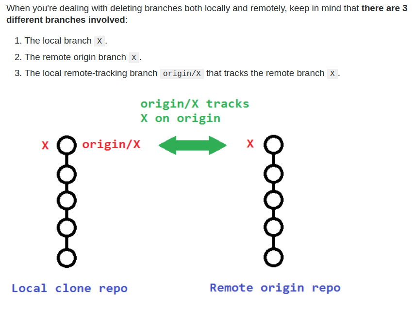

+ 本地分支

  ```sh
  git branch -d branch_name
  git branch -D branch_name
  ```

  **Note:** The `-d` option is an alias for `--delete`, which only deletes the branch if it has already been fully merged in its upstream branch. You could also use `-D`, which is an alias for `--delete --force`, which deletes the branch "irrespective of its merged status."

+ 远程分支

  [远程的`master`分支和默认分支被保护起来](https://stackoverflow.com/questions/28318599/git-push-error-pre-receive-hook-declined)，不能删除

  ```sh
  git push -d origin master
  # git push --delete <remote_name> <branch_name>
  git push origin --delete <branch>  # Git version 1.7.0 or newer
  git push origin :<branch>          # Git versions older than 1.7.0
  
  git remote remove origin
  ```

+ 远程分支和tag同名

  ```sh
  # delete remote branch
  git push origin :refs/heads/Branchname # git push origin :refs/heads/v2.6.6
  # delete remote tag
  git push origin :refs/tags/Tagname
  ```
  
  
  
+ Deleting a local remote-tracking branch

  ```sh
  git branch --delete --remotes <remote>/<branch>
  git branch -dr <remote>/<branch> # Shorter, git branch -dr origin/feedback
  
  git fetch <remote> --prune # Delete multiple obsolete tracking branches
  git fetch <remote> -p      # Shorter
  ```

  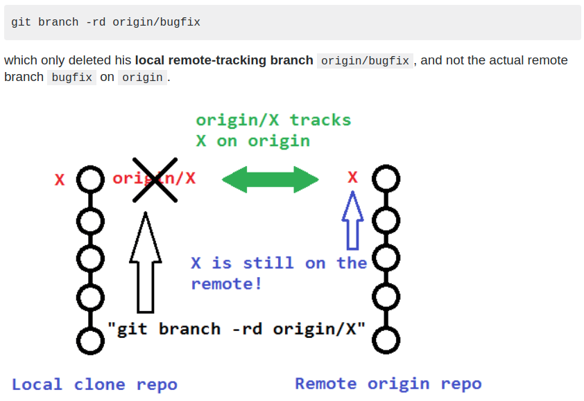

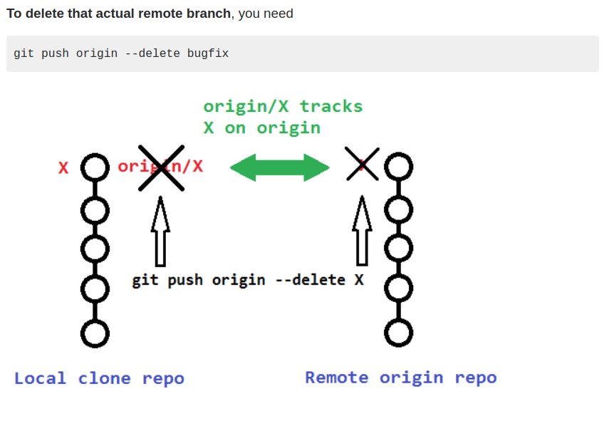

### [分支的种类及区别](https://ask.helplib.com/c/12349112)

在本地机器上有以下3种分支：

+ local non-tracking branches
+ local tracking branches
+ remote-tracking branches

在远程机器上，只有一种分支: remote-tracking branches

+ Local branches

  使用`git branch`查看所有的本地分支，每个个本地分支在`.git/refs/heads/`下有一个对应文件

  ```sh
  ls -F .git/refs/heads/
  ```

  - Non-tracking local branches

    Non-tracking local branches are not associated with any other branch.you create one by running `git branch <branchname>`

  - Tracking local branches

    Tracking local branches are associated with another branch, usually a remote-tracking branch.you create one by running`git branch --track <branchname> `[<start-point>]

    可使用`git branch -vv`查看本地分支跟踪的分支

    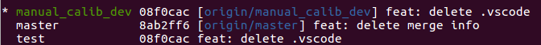

    可以看出，本地`test`为`non-tracking local branch`, 本地`master`跟踪remote-tracking branch `origin/master`

    另外一种查看分支跟踪情况的文件：`.git/config`

+ Remote-tracking branches (still on your machine)

  查看本机上所有的remote-tracking branches: `git branch -r`

  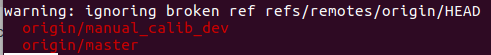

  每个远程跟踪分支都有一个文件与之对应：`tree -F .git/refs/remotes/`

  Even though all the data for a remote-tracking branch is stored locally on your machine (like a cache), it's still never called a local branch.(At least, i wouldn't call it that!) it's just called a remote-tracking branch.

  Branches on a remote machine :

  You can view all the remote branches (that is, the branches on the remote machine), by running`git remote show <remote>`:

  ```sh
  git remote show origin
  ```

  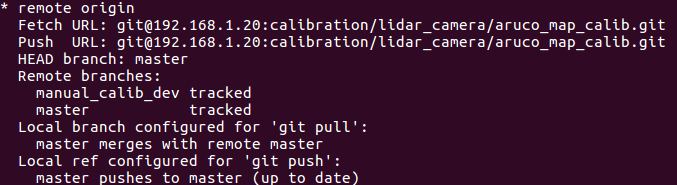

  This `git remote` command queries the remote machine over the network about its branches.it does not update the remote-tracking branches on your local machine, use `git fetch` or `git pull` for that.

分支操作：

+ To delete a local branch, whether tracking or non-tracking, safely :

  ```sh
  git branch -d <branchname>
  ```

+ To delete a local branch, whether tracking or non-tracking, forcefully :

  ```sh
  git branch -D <branchname>
  ```

+ To delete a remote-tracking branch :

  ```sh
  git branch -rd <remote>/<branchname>
  ```

+ To create a new local non-tracking branch :

  ```sh
  git branch <branchname> [<start-point>]
  ```

+ To create a new local tracking branch :(Note that if `<start-point>` is specified and is a remote-tracking branch like `origin/foobar`, then the `--track` flag is automatically included, 可省略 )

  ```sh
  git branch --track <branchname> [<start-point]
  git branch --track hello-kitty origin/hello-kitty
  ```

+ To delete a branch on a remote machine :

  ```sh
  git push --delete <remote> <branchname>
  ```

+ To delete all remote-tracking branches that are stale, that is, where the corresponding branches on the remote machine no longer exist :

  ```sh
  git remote prune <remote>
  ```

You may have noticed that in some commands, you use `<remote>/<branch>`, and other commands, `<remote> <branch>`.Examples : `git branch origin/hello-kitty` and`git push --delete origin hello-kitty`

It may seem arbitrary, but there is a simple way to remember when to use a slash and when to use a space.when you're using a slash, you're referring to a remote-tracking branch on your own machine, whereas when you're using a space, you're actually dealing with a branch on a remote machine over the network.

### [remove submodule](<https://stackoverflow.com/questions/1260748/how-do-i-remove-a-submodule>)

1. Delete the relevant section from the `.gitmodules` file.
2. Stage the `.gitmodules` changes:
   `git add .gitmodules`
3. Delete the relevant section from `.git/config`.
4. Remove the submodule files from the working tree and index:
   `git rm --cached path_to_submodule` (no trailing slash).
5. Remove the submodule's `.git` directory:
   `rm -rf .git/modules/path_to_submodule`
6. Commit the changes:
   `git commit -m "Removed submodule <name>"`
7. Delete the now untracked submodule files:
   `rm -rf path_to_submodule`

简单方法：

```sh
# Remove the submodule entry from .git/config
git submodule deinit -f path/to/submodule

# Remove the submodule directory from the superproject's .git/modules directory
rm -rf .git/modules/path/to/submodule

# Remove the entry in .gitmodules and remove the submodule directory located at path/to/submodule
git rm -f path/to/submodule
```


### [submodule指定分支](https://www.jianshu.com/p/c1834eb4626f)

```sh
git submodule add -b master [URL to Git repo]
git config -f .gitmodules submodule.DbConnector.branch stable
```


### [Git 少用 Pull 多用 Fetch 和 Merge](https://www.oschina.net/translate/git-fetch-and-merge)

不要用git pull，用git fetch和git merge代替它。

git pull的问题是它把过程的细节都隐藏了起来，以至于你不用去了解git中各种类型分支的区别和使用方法。将下载（fetch）和合并（merge）放到一个命令里的另外一个弊端是，你的本地工作目录在未经确认的情况下就会被远程分支更新。当然，除非你关闭所有的安全选项，否则git pull在你本地工作目录还不至于造成不可挽回的损失，但很多时候我们宁愿做的慢一些，也不愿意返工重来。

分支这个术语不太容易理解,而且在git的开发过程中发生了很多变化。但简单来说git的分支只有两种：

+ “本地分支(local branches)” ，当你输入“git branch”时显示的

  ```sh
         $ git branch
           debian
           server
         * master
  ```

+ “远程跟踪分支(Remote-tracking branches)” ，当你输入“git branch -r”是显示的

  ```sh
         $ git branch -r
         cognac/master
         fruitfly/server
         origin/albert
         origin/ant
         origin/contrib
         origin/cross-compile
  ```

  从上面的输出可以看到，跟踪分支的名称前有一个“远程的”标记名称（如 :origin, cognac, fruitfly）后面跟一个“／”，然后远程仓库里分支的真正名称。（“远程名称”是一个代码仓库别名，和本地目录或URL是一个含义，你可以通过"git remote"命令自由定义额外的“远程名称”。但“git clone”命令默认使用的是“origin”这个名称。）

如果你对分支在本地是如何存储感兴趣的话，看看下面文件： 

+   .git/refs/head/[本地分支]
+   .git/refs/remotes/[正在跟踪的分支]

不管如何相似，它们还是有一个特别重大的区别： 

+   更改远端跟踪分支的安全方法是使用git fetch或者是作为git-push副产品，你不能直接对远端跟踪分支这么操作。相反，你总得切换到本地分支，然后创建可移动到分支顶端的新提交 。

因此，你对远端跟踪分支最多能做的是下面事情中的一件： 

+  使用git fetch 更新远端跟踪分支
+  合并远端跟踪分支到当前分支
+  根据远端跟踪分支创建本地分支


### [merge or rebase](https://blog.csdn.net/liuxiaoheng1992/article/details/79108233)

develop分支也是在 (3.added merge.txt file)处从master分支拉取develop分支。不一样的是两个分支各个commit的时间不同，之前develop分支的4和5commit在master分支3之后6之前，现在是develop分支的4提交早于master分支的5提交，develop分支的6提交晚于master的5提交早于master的7提交。 

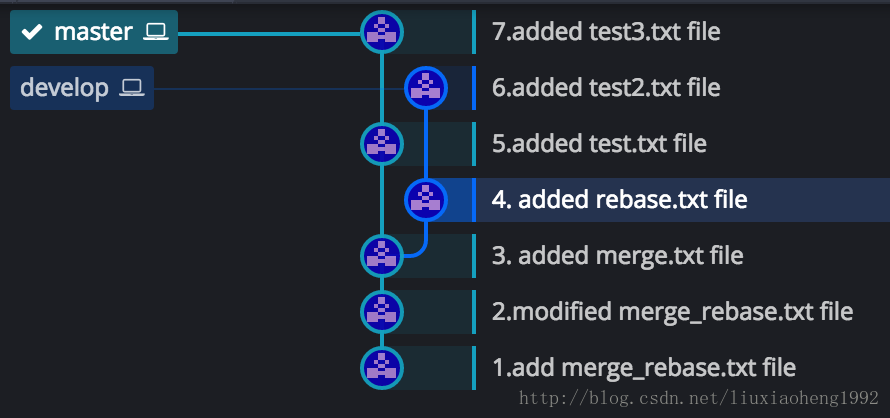

在上图情况下，在master分支的7commit处，执行git merge develop，结果如下图所示： 

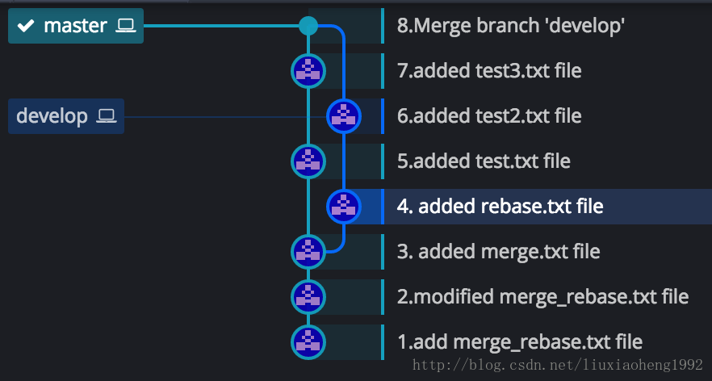

执行git rebase develop，结果如下图所示：

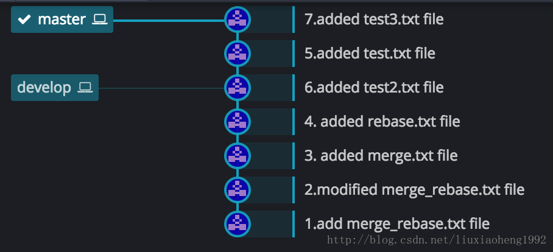

1. 可以看出merge结果能够体现出时间线，但是rebase会打乱时间线。 

2. 而rebase看起来简洁，但是merge看起来不太简洁。 

3. 最终结果是都把代码合起来了，所以具体怎么使用这两个命令看项目需要。

4. git pull = git fetch + git merge

5. git pull –rebase = git fetch + git rebase 使得提交线路平坦化

   git merge —no-ff 刻意制造分叉


### [submodule](https://stackoverflow.com/questions/1777854/how-can-i-specify-a-branch-tag-when-adding-a-git-submodule/18797720#18797720)

设置submodule的某个分支跟主仓库的某个分支相对应，只需将主仓库切换到某个分支，然后将submodule切换到某个分支，然后提交主仓库

```sh
git add submodule_directory
git commit -m "moved submodule to v1.0"
git push
```

Then, another developer who wants to have submodule_directory changed to that tag, does this

```sh
git pull
git submodule update --init
```

track branches:

```sh
# add submodule and define the master branch as the one you want to track
git submodule add -b master [URL to Git repo] 
git submodule init 

# update your submodule, pull all changes for the submodules
git submodule update --remote 
```

[submodule操作](https://www.vogella.com/tutorials/GitSubmodules/article.html)

+ 将某个仓库添加为submodule，并且跟踪其一个分支

  ```sh
  git submodule add -b master [URL to Git repo] 
  # git submodule add -b v3.0 git@192.168.1.20:rs_ws_test/rs_tools/rs_lidar2cam_calib.git
  git submodule init 
  ```

  submodules跟踪对应的branches，更新它们：

  ```sh
  # update your submodule --remote fetches new commits in the submodules
  # and updates the working tree to the commit described by the branch
  git submodule update --remote
  ```

+  [Adding a submodule and tracking commits](https://www.vogella.com/tutorials/GitSubmodules/article.html#submodules_adding)

  Alternatively to the tracking of a branch, you can also control which commit of the submodule should be used.

  ```sh
  git submodule add [URL to Git repo] 
  git submodule init 
  ```

+ clone包含submodule的仓库

  ```sh
  git clone --recursive [URL to Git repo]
  ```

  如果已经下载了仓库，需要下载其submodule，那么使用`submodule update`

  ```sh
  git submodule update --init
  # if there are nested submodules:
  git submodule update --init --recursive
  ```

  同时下载多个submodule:

  ```sh
  # download up to 8 submodules at once
  git submodule update --init --recursive --jobs 8
  git clone --recursive --jobs 8 [URL to Git repo]
  # short version
  git submodule update --init --recursive -j 8
  ```

+ pull with submodules

  ```sh
  # pull all changes in the repo including changes in the submodules
  git pull --recurse-submodules
  
  # pull all changes for the submodules
  git submodule update --remote
  ```

+ executing a command on every submodule

  ```sh
  git submodule foreach 'git reset --hard'
  # including nested submodules
  git submodule foreach --recursive 'git reset --hard'
  ```

+ 删除submodule

  Currently Git provides no standard interface to delete a submodule. To remove a submodule called `mymodule` you need to:

  ```sh
  git submodule deinit -f — mymodule
  rm -rf .git/modules/mymodule
  git rm -f mymodule
  ```

### [remove remote origin删除远程仓库](https://stackoverflow.com/questions/16330404/how-to-remove-remote-origin-from-git-repo/16330711)

+ ```sh
  git remote set-url origin git://new.url.here
  ```

+ ```sh
  To remove a remote:
  git remote remove origin
  
  To add a remote:
  git remote add origin yourRemoteUrl
  and finally
  
  git push -u origin master
  ```


### [更新当前文件夹下所有仓库](https://stackoverflow.com/questions/3497123/run-git-pull-over-all-subdirectories)

```sh
find . -type d -depth 1 -exec git --git-dir={}/.git --work-tree=$PWD/{} pull origin master \;

find . -type d -mindepth 1 -maxdepth 1 -exec git --git-dir={}/.git --work-tree=$PWD/{} pull \;
```

+ `find .` searches the current directory
+ `-type d` to find directories, not files
+ `-depth 1` for a maximum depth of one sub-directory
+ `-exec {} \;` runs a custom command for every find
+ `git --git-dir={}/.git --work-tree=$PWD/{} pull` git pulls the individual directories

To play around with find, I recommend using `echo` after `-exec` to preview, e.g.:

```sh
find . -depth 1 -type d -print -exec git -C {} pull \;
```

Note: if the `-depth 1` option is not available, try `-mindepth 1 -maxdepth 1`.

### [删除远程同名branch, tag](https://stackoverflow.com/questions/32927154/delete-a-remote-branch-with-the-same-name-as-tag)

```sh
git push origin :tags/v3.0.0 # rm tag
git push origin :heads/v3.0.0 # rm branch
```


### [给仓库瘦身](https://www.atlassian.com/git/tutorials/big-repositories)

```sh
# 列出前5个大文件
git rev-list --objects --all | grep "$(git verify-pack -v .git/objects/pack/*.idx | sort -k 3 -n | tail -5 | awk '{print$1}')" >> large-files.txt
# 提取大文件的路径
cat large-files.txt| awk '{print $2}' | tr '\n' ' ' >> large-files-inline.txt
# 从git历史中删除大文件
git filter-branch -f --prune-empty --index-filter "git rm -rf --cached --ignore-unmatch `cat large-files-inline.txt`" --tag-name-filter cat -- --all
rm large-files.txt
rm large-files-inline.txt
# 本地默认会保留这些大文件ref和git记录缓存，可以切断他们的联系
git for-each-ref --format='delete %(refname)' refs/original | git update-ref --stdin && git reflog expire --expire=now --all
# 然后再进行垃圾回收，本地就很小了
git gc --prune=now
# 推送到远端服务器，重新clone下来就很小了（这个似乎要推到新的远程分支，否则服务器上面的也还是很大）
git push origin --force --all
git push origin --force --tags
```


### [git reset revert rebase](https://geekflare.com/git-reset-vs-revert-vs-rebase/)

+ git reset --soft/mixed/hard

  Hard mode is used to go to the pointed commit, the working directory gets populated with files of that commit, and the staging area gets reset. In soft reset, only the pointer is changed to the specified commit. The files of all the commits remain in the working directory and staging area before the reset. In mixed mode (default), the pointer and the staging area both get reset.

  | 是否重置          | soft | mixed | hard |
  | ----------------- | ---- | ----- | ---- |
  | working directory | ×    | ×     | √    |
  | staging index     | ×    | √     | √    |
  | HEAD              | √    | √     | √    |

+ git revert

  t is similar to the reset command, but the only difference here is that you perform a new commit to go back to a particular commit. In short, it is fair to say that the git revert command is a commit.多个连续commit撤销时，处理方式和`cherry-pick`类似：

  ```sh
  git revert -n first_commit_id..last_commit_id # [first_commit_id, last_commit_id)
  ```

  

+ git rebase

  当我们在一个过时的分支上面开发的时候，执行 `rebase` 以此同步 `master` 分支最新变动；

  1. [合并多个commits](http://jartto.wang/2018/12/11/git-rebase/)

     对于未提交到远程的多个提交，可以在本地完成合并后再推到远程

     ```sh
     git rebase -i 
     git rebase --edit-todo # 重新vim打开交互文件
     ```

     

  2. 合并分支

     git rebase的黄金法则就是永远不要在公共分支上用这个指令。不要对在你的仓库外有副本的分支执行变基。除非你可以肯定该 `feature` 分支只有你自己使用，否则请谨慎操作。

     结论：只要你的分支上需要 `rebase` 的所有 `commits` 历史还没有被 `push` 过，就可以安全地使用 `git-rebase`来操作。

     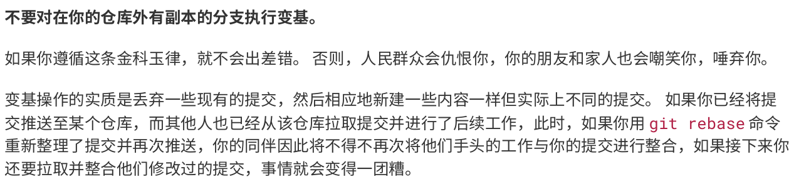

     向某个其他人维护的项目贡献代码时。 在这种情况下,你首先在自己的分支里进行开发,当开发完成时你需要先将你的代码变基到origin/master 上,然后再向主项目提交修改。

      变基是将一系列提交按照原有次序依次应用到另一分支上,而合并是把最终结果合在一起。

     ```sh
     git checkout feature
     git rebase master
     git checkout master
     git merge feature # fast-forward
     ```

     + git找到`master, feature`的共同祖先
     + 将`feature`祖先之后的commit，取消掉
     + 将取消掉的commit临时保存成`patch`文件，存在`.git/rebase`目录下
     + 把`feature`分支更新到最新的`master`分支
     + 把上面保存的`patch`文件中的各个commit应用到`feature`分支上，内容相同，但是commit信息不同。

  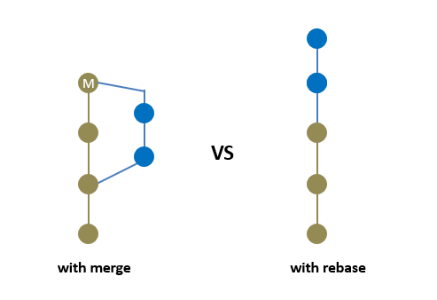

## stools

### [ungit]()

```sh
sudo apt-get install nodejs-legacy nodejs npm
npm config set prefix ~/npm
sudo ln -s /usr/bin/nodejs /usr/bin/mode
sudo -H npm install -g ungit
```

