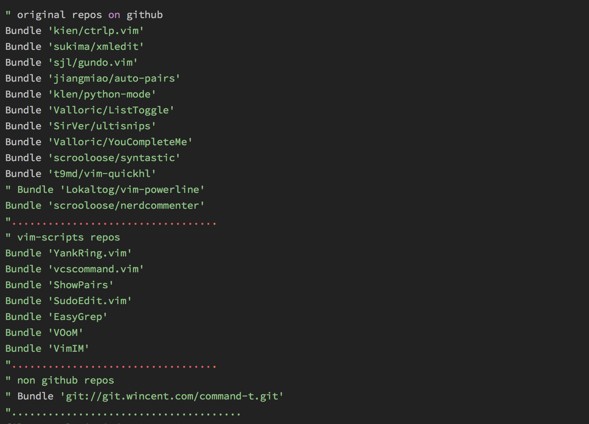
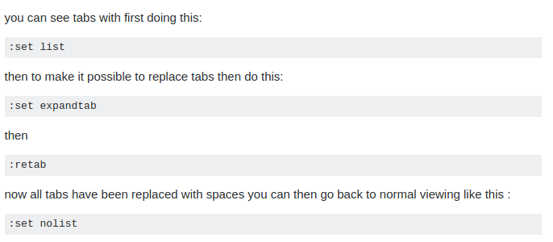

# Vim

## [spf13-vim3](http://vim.spf13.com/)
+ install
  ```sh
  curl http://j.mp/spf13-vim3 -L -o - | sh
  ```

+ update
  ```sh
  cd ~/.spf13-vim-3
  git pull
  vim +BundleInstall! +BundleClean +q
  ```

+ config
  在home目录下,用`.vimrc.local`文件覆盖以前的配置.[.vimrc.local](vimrc.local)
  安装`.vimrc.local`中自定义的插件,`:PluginInstll`

## Plugin

### 插件安装

bundle分为三类，比较常用就是第二种：
1. 在Github vim-scripts 用户下的repos,只需要写出repos名称
2. 在Github其他用户下的repos, 需要写出”用户名/repos名”
3. 不在Github上的插件，需要写出git全路径
  
  打开vim，运行:BundleInstall

### YCM
+ download
  ```sh
  cd ~/.vim/bundle/
  git clone --recursive https://github.com/Valloric/YouCompleteMe.git
  ```
+ 检查完整性
  ```sh
  cd YouCompleteMe
  git submodule update --init --recursive
  ```
+ 安装依赖
  ```sh
  sudo apt-get install clang-6.0
  sudo apt-get install llvm-6.0
  ```
+ 编译
  ```sh
  ./install.sh --clang-completer --system-libclang
  ```
+ 配置
  python 解释器的路径要和编译ycm_core的时候使用的python解释器是相同的版本(2 或 3)
  ```sh
  ～/.vimrc
  let g:ycm_server_python_interpreter='/usr/bin/python'
  let g:ycm_global_ycm_extra_conf='~/.vim/.ycm_extra_conf.py'
  ```
+ ERROR
  `The ycmd server SHUT DOWN (restart with :YcmRestartServer)`,这是由于clang版本太低,必须使用3.9版本及以上,安装新版本clang
```sh
sudo apt-get install clang-6.0
sudo apt-get install llvm-6.0-dev
```
查看`~/.vim/bundle/YouCompleteMe/third_party/ycmd`目录下`libclang-*`的版本是否比3.9大.本人在ubuntu 16.04下,安装了`clang-6.0 llvm-6.0-dev`后,编译生成的`libclang`仍然是`libclang-3.6.so.1`,在终端下卸载时,并找不到3.6版本的clang,无奈之下,只好到`/usr/lib/x86_64-linux-gnu/`下将 `libclang-3.6.so.1`直接删除,或者备份;然后下载掉clang-5.0,就可以了.

+ [字体安装](https://askubuntu.com/questions/371213/how-to-delete-fonts-in-ubuntu)
  [YaHei.Consolas.1.12.ttf](8163ec94.ttf)
  只需要安装雅黑字体即可(直接双击),安装多了会使得wps内的字体乱码,安装的路径在`/home/robosense/.local/share/fonts`不需要的可手动删除


## Command

### Common Command
+ 替换
  `:%s/to_be_replaced_str1/str2/gc`  用str2替换str1，g为全局，c为是否询问

+ ctrl+z
  n vim you can just `ctrl-z` to back to terminal do what you want, and `fg` back to vim. 

+ [shift + *](https://blog.csdn.net/u013408061/article/details/77893203)
  查找当前鼠标所在处的单词

+ [命令模式下粘贴寄存器内容](https://blog.csdn.net/changyujan/article/details/8312895)
  Ctrl + r 然后按"

+ [终端与vim的切换](https://www.jianshu.com/p/0d20363c858a)
  只是想单纯的回到终端运行一些命令，则按下 ctrl+z就可以stop掉vim，回到终端，当想回到vim时，只需按下fg并回车

+ 跳转
  `，+ gg`

+ 预览markdown
  `F8`

+ 使用clang-format格式化
  `, + cf`

+ 跳回上一个位置
  `ctrl + o`

+ 刷新目录
  `r or R`

+ [刷新当前文件](http://blog.webinno.cn/article/view/17)
  `:e`
  如果已经修改文件，但是你想放弃本次修改，直接加载硬盘上的内容：
  `:e!`


+ 将当前文件另存为
  `:w new_filename`

+ 将已经存在的tab变换为4个空格
```
:retab
```


+ vim中执行单个shell命令
  `:!{command}` `:!ls`
  也可以直接使用`:{shell}` `:cd`

+ 注释和取消注释
  注释：`，ci`
  取消注释：`，cu`

+ [代码折叠](https://www.cnblogs.com/abeen/archive/2010/08/06/1794197.html)
  VIM代码折叠方式可以用"foldmethod"选项来设置，如: set foldmethod=indent
  有6种方式来折叠代码
```
1. manual //手工定义折叠
2. indent //用缩进表示折叠
3. expr　 //用表达式来定义折叠
4. syntax //用语法高亮来定义折叠
5. diff   //对没有更改的文本进行折叠
6. marker //用标志折叠

zf　创建折叠，比如在marker方式下：
        zf56G，创建从当前行起到56行的代码折叠；
        10zf或10zf+或zf10↓，创建从当前行起到后10行的代码折叠。
        10zf-或zf10↑，创建从当前行起到之前10行的代码折叠。
        在括号处zf%，创建从当前行起到对应的匹配的括号上去（（），{}，[]，<>等）。
zd  删除 (delete) 在光标下的折叠。仅当 'foldmethod' 设为 "manual" 或 "marker" 时有效。
zD  循环删除 (Delete) 光标下的折叠，即嵌套删除折叠。仅当 'foldmethod' 设为 "manual" 或 "marker" 时有效。
zE  除去 (Eliminate) 窗口里“所有”的折叠。仅当 'foldmethod' 设为 "manual" 或 "marker" 时有效。
```

+ [大小写区分](https://blog.csdn.net/ly890700/article/details/52349961)
  :set ic (ignore case) 忽略大小写
  :set noic 不忽略大小写
  /\CWord ： 区分大小写的查找
  /\cword ： 不区分大小写的查找

+ [you complete me](https://unix.stackexchange.com/questions/162528/select-an-item-in-vim-autocomplete-list-without-inserting-line-break)选择提示的变量
```sh
inoremap <expr> j ((pumvisible())?("\<C-n>"):("j"))
inoremap <expr> k ((pumvisible())?("\<C-p>"):("k"))
```
也可以直接使用`ctl + p`, `ctl + n`

+ YCM提示修改策略
  `:YcmCompleter FixIt`自动修改

## Problem
+ [git_:47](https://github.com/robbyrussell/oh-my-zsh/issues/518)
  git checkout mas<TAB>.....            
  _git:47: __git_aliases_and_commands: function definition file not found
  _git:47: __git_aliases_and_commands: function definition file not found
  `rm ~/.zcompdump`