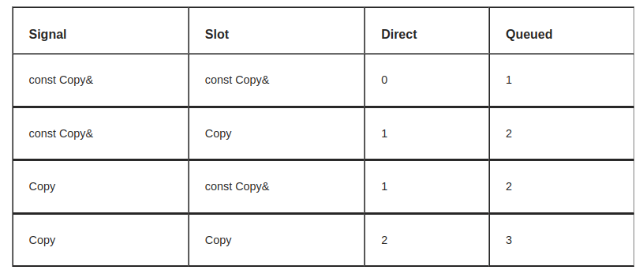

[toc]

# 产线软件开发tricks

## 1 Qt Signal and Slot

### 1.1 Signal

信号可以连接槽函数，也可以连接信号，并且Q_SIGNALS是public的。

```cpp
# define Q_SIGNALS public QT_ANNOTATE_ACCESS_SPECIFIER(qt_signal)
```

可用信号触发信号:

```cpp
QObject::connect(ui_->spin_box_relay_offset, SIGNAL(valueChanged(int)), this, SIGNAL(signalRelayOffset(int)));
```

### 1.2 Slot

使用c++11来连接Qt信号与槽。

1. 普通函数作为槽函数

   ```cpp
   void printMessage(const int _value)
   {
      std::cout << _value << std::endl;
   }
   connect(sender, &Sender::valueChanged, printMessage);
   ```

2. 成员函数作为槽函数

   ```cpp
   connect(sender, &Sender::valueChanged, receiver, &Receiver::updateValue);
   QObject::connect(mirror_module_ptr_v_.get(), &MirrorModuleCalib::signalRestartMEMS, this,
                      &MainWindow::restartMEMS);
   ```

3. std::bind附带默认参数

   ```cpp
   for (int i = 0; i < Parameter::getInstance()->structure_number_; ++i)
   {
     QString str = "cam" + QString::number(i + 1);
     auto action = new QAction(str, this);
     action_update_chessboard_.push_back(action);
     QObject::connect(action_update_chessboard_.back(), &QAction::triggered,
                      std::bind(&MainWindow::updateChessboard, this, i)); 
   }
   // 如果Signal有参数，可以使用占位符：std::placeholders::_1
   ```

4. lambda表达式

   ```cpp
   QObject::connect(
           widget_state_bar_v_[i], &WidgetStateBar::signalSetCameraExposureTime,
           [this, i](const int _time_ms) { this->camera_ptr_v_[i]->setCameraExposureTime(_time_ms * 1000); });
   QObject::connect(check_box_phase_calib_, &QCheckBox::stateChanged,
                      [](const int _state) { Parameter::getInstance()->is_do_mirror_phase_ = _state == Qt::Checked; });
   ```

1.3 [signal slot的参数拷贝](https://embeddeduse.com/2013/06/29/copied-or-not-copied-arguments-signals-slots/)

尽量使用`const reference`参数，减少参数拷贝，特别是大的数据结构，比如`cv::Mat, QImage`.



比如相机驱动中的信号:

```cpp
Q_SIGNALS:
  void signalCaptureOneFrame(const QImage& _img);
```


## 2 [QThread](https://het.as.utexas.edu/HET/Software/html/thread-basics.html)

QThread继承于`QObject`，并且没有复制和移动构造函数(Not copiable/moveable)。

### 2.1 继承QThread

继承QThread，重载`run`函数进行子线程相关操作。

+ 无事件循环

  ```cpp
  class MyThread: public QThread
  {
    void run() override
    {
       loadFilesFromDisk();
       doCalculations();
       saveResults();
    }
  };
  
  MyThread* thread = new MyThread;
  thread->start(); // starts a new thread which calls run()
  thread->wait();
  ```

  

+ 有事件循环

  当子线程中存在timers, networking, queued connections时需要时间循环，才能相应相应的槽函数。只需要在`run`函数中增加：

  ```cpp
  class MyThread: public QThread
  {
    void run() override
    {
      auto socket = new QtcpSocket;  // don't set parent
      socket->connectToHost(...);
      exec(); // run the event loop
    }
  };
  ```

  调用`QThread::quit()`或者`QThread::exit()`来退出事件循环。

### 2.2 QObject moveToThread

`QThread::run()`函数的默认实现中，调用了`QThread::exec()`，无需继承`QThread`就可以进入子线程执行任务：

```cpp
auto thread = new QThread;
auto worker = new Worker; // don't set parent, no QWidget Object in Worker
QObject::connect(thread, &QThread::started, worker, &Worker::doWork);
connect(worker, &Worker::workDone, thread, &QThread::quit);
connect(thread, &QThread::finished, worker, &Worker::deleteLater);

worker->moveToThread(thread);
thread->start(); // run Worker::worker() with loop envent
```

### 2.3 [注意事项](https://www.kdab.com/the-eight-rules-of-multithreaded-qt/)

